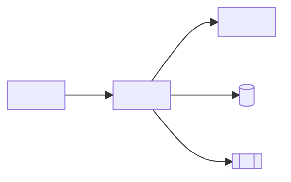

<!-- markdownlint-disable MD013 MD025 MD026 MD028 MD029 MD034 MD040 MD051 MD060 -->

# /codemap

## Objetivo

Você é o software architect gerando um **mapa de código em nível de serviço** que complementa `plan.md`. Enquanto `plan.md` responde "por quê", o code map responde "onde" e "o que toca o quê". Ele é lido na IDE, deve caber em dez minutos e é atualizado junto com qualquer mudança estrutural.

## Entradas

Peça ao usuário o que estiver faltando.

- O serviço a mapear.
- A raiz do path criada pelo time.
- A pasta de spec vinculada (`specs/<NNN>-<feature>/spec.md`).
- Se deve incluir ou excluir paths `test/`.
- Um code map anterior para este serviço, se existir.

## Processo

1. **Liste pacotes e tipos principais.** Para Java, agrupe por `controller`, `service`, `domain`, `repository`, `infrastructure`, `config`. Para TypeScript, agrupe por `app/`, `components/`, `lib/`, `server/`.
2. **Capture o papel de cada componente em uma linha.** Use a responsabilidade
   confirmada no código, sem inferir comportamento de negócio.
3. **Mapeie dependências inbound e outbound.** Inbound: quem chama isto? Outbound: o que isto chama? Fique em dependências diretas; análise transitiva fica em `plan.md`.
4. **Encontre tipos compartilhados e ports.** Interfaces em `domain/`, ports em `application/`, gateways em `infrastructure/`. Liste quais são contratos estáveis e quais são internos.
5. **Cruze referências de REQ-IDs.** Para cada método público ou componente, encontre anotações `@implements REQ-NNN`. Liste componentes sem requisito ("no REQ-ID found") para revisão.
6. **Encontre linhagem legada.** Observe quais programas Natural em `01-arqueologia/legado-sifap/natural-programs/` mapeiam para qual componente Java. Isso é essencial para a modernização do SIFAP.
7. **Exponha architecture smells.**
 - Classes de service chamando controllers (direção errada).
 - Domain dependendo de infrastructure (direção errada).
 - Componentes com > 5 deps outbound (god class).
 - Componentes sem deps inbound (dead code).
8. **Renderize como Mermaid + tabela.** Mermaid para leitura visual, tabela para facilidade de grep.

## Saída

Um documento Markdown `docs/codemap-<service>.md` com esta estrutura:

```markdown
# Mapa de código — <service>

> Última revisão: <YYYY-MM-DD> — owner: <pessoa> — mapa em nível de serviço.

## 1. Diagrama de componentes (Mermaid)



## 2. Componentes

| Tipo | FQN | Papel | REQ-IDs | Entrada | Saída |
|------|-----|------|---------|---------|----------|
| <!-- preencher --> | <!-- preencher --> | <!-- preencher --> | <!-- preencher --> | <!-- preencher --> | <!-- preencher --> |

## 3. API pública

| Método | Path | Testado por |
|--------|------|-----------|
| <!-- preencher --> | <!-- preencher --> | <!-- preencher --> |

## 4. Estado persistente
- <!-- preencher a partir do código e das migrações criados pelo time -->

## 5. Linhagem legada
| Componente Java | Substitui |
|----------------|----------|
| <!-- preencher --> | <!-- preencher: programa.NSN e evidência --> |

## 6. Smells observados
- <!-- preencher somente com achados observados no código -->

## 7. Como atualizar
Rode `/codemap` após qualquer adição, renomeação ou exclusão no serviço. Vincule este arquivo a partir de `docs/CODEMAP.md`.
```

## Antipadrões

- Autogerar a partir de imports. O mapa é curado; imports mentem sobre intenção.
- Listar toda classe. Mapeie componentes, não classes; agrupe os pequenos.
- Pular o diagrama Mermaid. Visuais capturam camadas quebradas instantaneamente.
- Sem coluna REQ-ID. Codemap sem rastreabilidade é listagem de diretório.
- Listar deps transitivas. Apenas diretas — mantenha escaneável.
- Pular linhagem legada para módulos SIFAP. O projeto inteiro depende disso.
- Deixar drift > 30 dias. Codemaps obsoletos confundem pessoas novas.

## Critérios de sucesso

- [ ] Diagrama Mermaid renderiza corretamente.
- [ ] Tabela cobre todos os componentes na pasta do serviço.
- [ ] Coluna REQ-ID preenchida; entradas ausentes explicitamente anotadas.
- [ ] Deps inbound/outbound são apenas diretas.
- [ ] Estado persistente lista tabelas e filas com vínculo a REQ-ID.
- [ ] Linhagem legada nomeia os programas Natural.
- [ ] Smells anotados incluem classes quase god class e anotações REQ-ID ausentes.
- [ ] Documento vinculado a partir de `docs/CODEMAP.md`.
