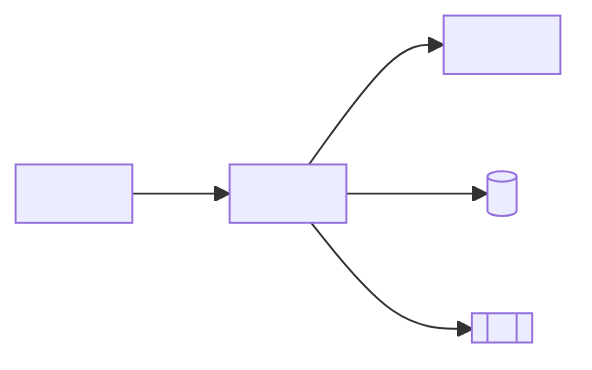

<!-- markdownlint-disable MD013 MD025 MD026 MD028 MD029 MD034 MD040 MD051 MD060 -->

# /codemap

## Objective

You are the software architect generating a **service-level code map** that complements `plan.md`. While `plan.md` answers "why," the code map answers "where" and "what touches what." It is read in the IDE, should take no more than ten minutes to review, and is updated with every structural change.

## Inputs

Ask the user for any missing information.

- The service to map.
- The root path created by the team.
- The linked specification folder (`specs/<NNN>-<feature>/spec.md`).
- Whether to include or exclude `test/` paths.
- A previous code map for this service, if one exists.

## Process

1. **List the main packages and types.** For Java, group by `controller`, `service`, `domain`, `repository`, `infrastructure`, and `config`. For TypeScript, group by `app/`, `components/`, `lib/`, and `server/`.
2. **Capture each component's role in one line.** Use the responsibility confirmed in the code without inferring business behavior.
3. **Map inbound and outbound dependencies.** Inbound: who calls this? Outbound: what does this call? Limit the map to direct dependencies; transitive analysis belongs in `plan.md`.
4. **Find shared types and ports.** Interfaces in `domain/`, ports in `application/`, and gateways in `infrastructure/`. Identify which are stable contracts and which are internal.
5. **Cross-reference REQ-IDs.** For each public method or component, find `@implements REQ-NNN` annotations. List components without a requirement ("no REQ-ID found") for review.
6. **Find legacy lineage.** Note which Natural programs in `01-arqueologia/legado-sifap/natural-programs/` map to each Java component. This is essential to SIFAP modernization.
7. **Expose architecture smells.**

- Service classes calling controllers (wrong direction).
- Domain depending on infrastructure (wrong direction).
- Components with > 5 outbound dependencies (god class).
- Components with no inbound dependencies (dead code).

8. **Render as Mermaid + table.** Use Mermaid for visual reading and a table for easy grep searches.

## Output

A Markdown document at `docs/codemap-<service>.md` with this structure:

```markdown
# Code map — <service>

> Last reviewed: <YYYY-MM-DD> — owner: <person> — service-level map.

## 1. Component diagram (Mermaid)



## 2. Components

| Type | FQN | Role | REQ-IDs | Input | Output |
|------|-----|------|---------|---------|----------|
| <!-- fill in --> | <!-- fill in --> | <!-- fill in --> | <!-- fill in --> | <!-- fill in --> | <!-- fill in --> |

## 3. Public API

| Method | Path | Tested by |
|--------|------|-----------|
| <!-- fill in --> | <!-- fill in --> | <!-- fill in --> |

## 4. Persistent state

- <!-- fill in from the code and migrations created by the team -->

## 5. Legacy lineage

| Java component | Replaces |
|----------------|----------|
| <!-- fill in --> | <!-- fill in: program.NSN and evidence --> |

## 6. Observed smells

- <!-- fill in only with findings observed in the code -->

## 7. How to update

Run `/codemap` after any addition, rename, or deletion in the service. Link to this file from `docs/CODEMAP.md`.

```

## Anti-patterns

- Auto-generating from imports. The map is curated; imports misrepresent intent.
- Listing every class. Map components, not classes; group small ones.
- Skipping the Mermaid diagram. Visuals reveal broken layering immediately.
- Omitting the REQ-ID column. A code map without traceability is a directory listing.
- Listing transitive dependencies. Include direct dependencies only—keep it scannable.
- Skipping legacy lineage for SIFAP modules. The entire project depends on it.
- Allowing drift for > 30 days. Outdated code maps confuse new team members.

## Success criteria

- [ ] The Mermaid diagram renders correctly.
- [ ] The table covers every component in the service folder.
- [ ] The REQ-ID column is populated; missing entries are explicitly noted.
- [ ] Inbound and outbound dependencies are direct only.
- [ ] Persistent state lists tables and queues linked to REQ-IDs.
- [ ] Legacy lineage names the Natural programs.
- [ ] Documented smells include near-god classes and missing REQ-ID annotations.
- [ ] The document is linked from `docs/CODEMAP.md`.
