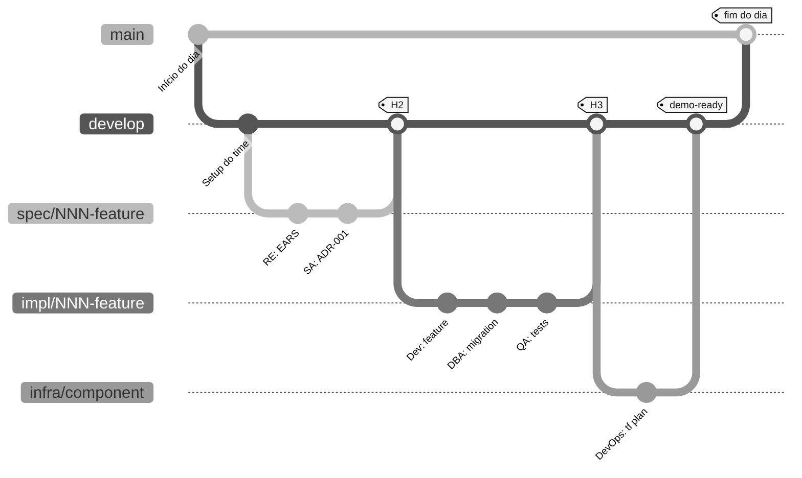

<!-- markdownlint-disable MD013 MD033 MD041 -->

# Git Workflow do Time — cada persona em sua branch

> **Trilha:** [Kit do Time](README.md) › **Git Workflow**

**Guia completo de Git para o workshop: branches, commits, Pull Requests e passagem entre pares.**

  

| Campo | Valor |
|---|---|
| **Público-alvo** | Todo o time, especialmente quem nunca usou branch por feature |
| **Pré-requisitos** | Git instalado, repositório clonado, `develop` criada |
| **Tempo estimado** | 10 minutos de leitura |
| **Resultado esperado** | Você sabe criar branch, commitar, abrir PR e fazer passagem |

---

## O que é cada conceito (referência rápida)

| Conceito Git | Significado prático |
|---|---|
| `main` | Versão estável, demoável; protegida contra push direto |
| `develop` | Versão integrada do dia; ponto de partida para novas branches |
| `spec/<NNN>-<feature>` | Branch onde você trabalha no Estágio 2 |
| `git commit` | Salva uma versão local (só você vê) |
| `git push` | Sobe para o GitHub (colegas podem ver) |
| **Pull Request (PR)** | Pede revisão antes de mergear sua branch em `develop` |
| `git merge` | Integra sua branch na `develop` depois do review aprovado |
| **CI verde** | Pipeline de integração contínua passou; requisito para mergear |
| **CI vermelho** | Algo quebrou — corrija antes de mergear |
| **Conflito de merge** | Duas branches alteraram o mesmo trecho; você precisa resolver manualmente |

---

## A árvore do dia (visual)



---

## Como nomear sua branch (convenção por persona)

| Quem | Estágio | Prefixo de branch | Origem | Exemplo |
|---|---|---|---|---|
| RE + SA | 2 — Spec | `spec/<NNN>-<feature>` | `develop` | `spec/001-calculo-beneficio` |
| Dev + DBA | 3 — Impl | `impl/<NNN>-<feature>` | `develop` | `impl/001-calculo-beneficio` |
| QA | 3 — Testes | `impl/<NNN>-<feature>` | `develop` | `impl/001-calculo-beneficio` |
| DevOps | 4 — Infra | `infra/<componente>` | `develop` | `infra/azure-postgres` |
| Tech Writer | Transversal | `docs/<topico>` | `develop` | `docs/glossario-sifap` |
| Agent Mode | 4 — Delegação | `agent/<issue-NN>` | `develop` | `agent/issue-42` |

> [!IMPORTANT]
> O fluxo é `spec/<NNN>-<feature>` → `develop` → `main`; não existe branch `stage`.
> Toda branch `impl/<NNN>-<feature>` nasce de `develop`, nunca da branch `spec/*`.

> [!TIP]
> Padrão de commit message: sempre cite o REQ-ID ou Issue. Exemplo: `feat: Implements REQ-XXX: descreve o comportamento`.

---

## A sequência de merge — passo a passo

### Passo 1 — Criar sua branch a partir de `develop`

- [ ] **Atualizar `develop` e criar a branch.**

```bash
git checkout develop && git pull        # atualiza o ponto de partida
git checkout -b spec/001-feature-name  # cria sua branch
```

### Passo 2 — Trabalhar (commit a cada avanço)

- [ ] **Commitar com frequência — 1 ideia por commit.**

```bash
git add .
git commit -m "Implements REQ-XXX: comportamento"
git push -u origin spec/001-feature-name   # sobe para o GitHub
```

> [!NOTE]
> Faça commits pequenos e frequentes. Cada commit = 1 ideia. Não acumule 5 horas de trabalho em um único commit.

### Passo 3 — Abrir PR para `develop`

- [ ] **Abrir o Pull Request.**

```bash
gh pr create \
  --base develop \
  --head spec/001-feature-name \
  --title "spec/001: feature name" \
  --body "Implementa REQ-XXX.

  ## O que muda
  - Spec EARS
  - Decisões registradas pelo time

  ## Source legacy
  - <arquivo legado:linhas>

  ## Como testar
  - Veja seção 'acceptance' de cada REQ-ID"
```

### Passo 4 — CI roda

- [ ] **Verificar o status do CI no PR.**
- CI verde → segue para o Passo 5
- CI vermelho → leia o erro, corrija, faça novo commit, aguarde o CI rodar de novo

### Passo 5 — Par receptor downstream revisa

| Você está no par… | Quem revisa seu PR |
|---|---|
| 1 (Visão) | Par 2 (Arquitetura) |
| 2 (Arquitetura) | Par 3 (Implementação) |
| 3 (Implementação) | Par 4 (Qualidade) |
| 4 (Qualidade) | Par 5 (Operações) |
| 5 (Operações) | Par 1 (Visão) |

### Passo 6 — Merge para `develop`

- [ ] **Mergear após aprovação.** Clique em **"Merge pull request"** no GitHub (ou `gh pr merge`). Use **squash merge** para manter o histórico limpo.

### Passo 7 — Ao fim do estágio, líder abre PR `develop → main`

- [ ] **Líder abre PR de integração.** Só o líder do time faz este merge. É o ponto de controle de cada estágio.

---

## As 5 regras de ouro

> [!IMPORTANT]
> **Sem exceção.**
>
> 1. Nunca faça commit direto em `main`. Sempre via PR.
> 2. Nunca use `git push --force` em branch compartilhada. Use `--force-with-lease` se absolutamente necessário.
> 3. Commit message sempre cita REQ-ID: `feat: Implements REQ-XXX: ...`.
> 4. CI vermelho não merga. Corrija primeiro.
> 5. PR sem descrição não merga. Descreva *o que* e *por quê*.

---

## Templates de commit message

Copie e cole, adaptando o REQ-ID e a descrição.

```bash
# Nova feature implementando REQ-ID
git commit -m "feat: Implements REQ-XXX (comportamento)"

# Correção de bug
git commit -m "fix: corrige comportamento de REQ-XXX"

# Documentação
git commit -m "docs: registra ADR-XXXX"

# Testes
git commit -m "test: cobre critérios de REQ-XXX"

# Migração de banco
git commit -m "db: V2__feature_change (REQ-XXX)"

# Refactor sem mudança de comportamento
git commit -m "refactor: extrai componente (mantém REQ-XXX)"

# Configuração / build / CI
git commit -m "chore: adiciona spec-quality.yml workflow"

# Agent Mode (Estágio 4)
git commit -m "agent: PR #42 — implementa REQ-XXX"
```

**Regras para mensagens:**

- Primeira linha com no máximo 72 caracteres
- Começa com tipo: `feat:` `fix:` `docs:` `test:` `db:` `refactor:` `chore:` `agent:`
- Cita o REQ-ID quando aplicável
- Não use `wip` ou `temp` — só commits com significado claro

---

## Mini-tutorial para quem nunca usou Git

Se hoje é seu primeiro contato com Git, faça este aquecimento de 5 minutos:

- [ ] **Verificar o status do repositório.**

```bash
# 1. Ver onde você está
git status

# 2. Ver em que branch você está
git branch --show-current

# 3. Atualizar develop
git checkout develop
git pull

# 4. Criar sua primeira branch
git checkout -b docs/meu-primeiro-commit

# 5. Editar um arquivo
echo "# Olá mundo" >> docs/playground.md

# 6. Ver o que mudou
git diff
git status

# 7. Salvar (commit)
git add docs/playground.md
git commit -m "docs: primeiro commit"

# 8. Subir para o GitHub
git push -u origin docs/meu-primeiro-commit

# 9. Abrir PR
gh pr create --base develop --title "docs: primeiro commit" --body "Aquecimento"
```

Se você completou os 9 passos, **você sabe Git o suficiente para o workshop**. O resto é variação dos mesmos comandos.

---

## Comandos de emergência

| Situação | Comando |
|---|---|
| Commitei na `develop` sem criar branch | `git reset --soft HEAD~1 && git stash && git checkout -b nova-branch && git stash pop` |
| Rebase travado | `git rebase --abort` (sem problema, recomeça limpo) |
| Conflito de merge | Abra o arquivo, localize `<<<<<<<`, escolha as linhas corretas, `git add <arquivo> && git rebase --continue` |
| Apaguei branch sem querer | `git reflog` → localize o SHA → `git checkout -b nome SHA` |
| Quero descartar mudanças não commitadas | `git restore .` |
| Tudo deu errado, quero voltar 30 minutos atrás | **Pare. Chame a Technical Lead. Não tente sozinho(a).** |

---

## Definição de pronto — você está confortável com Git quando…

- [ ] Sabe criar uma branch a partir de `develop`
- [ ] Faz commits pequenos (1 ideia por commit) com REQ-ID na mensagem
- [ ] Sabe fazer `git push` da sua branch
- [ ] Sabe abrir um PR via `gh pr create` ou pelo site do GitHub
- [ ] Sabe ler o status do CI no PR (verde/vermelho)
- [ ] Sabe quem revisa seu PR (par downstream)
- [ ] Sabe pedir ajuda antes de tentar `--force`

---

## Para se aprofundar

- [`00-SETUP.md`](00-SETUP.md) — passos 3 e 4 sobre branch protection
- [`00-TEAM-FLOW.md`](00-TEAM-FLOW.md) — as 3 passagens (H1, H2, H3) entre pares
- [`docs/persona-agent-matrix.md`](docs/persona-agent-matrix.md) — quem depende de quem
- [GitHub: gh CLI docs](https://cli.github.com/manual/)

---

### Continuar a leitura

| Anterior | Próximo |
|---|---|
| [TEAM-FLOW](00-TEAM-FLOW.md)<br/><sub>Cronograma do dia, passagens, regra dos 20 min, DoD.</sub> | [Estágio 1 — Arqueologia](01-arqueologia/GUIDE.md)<br/><sub>Ler o legado e catalogar regras de negócio.</sub> |

<sub>[Voltar ao índice do kit](README.md)</sub>
