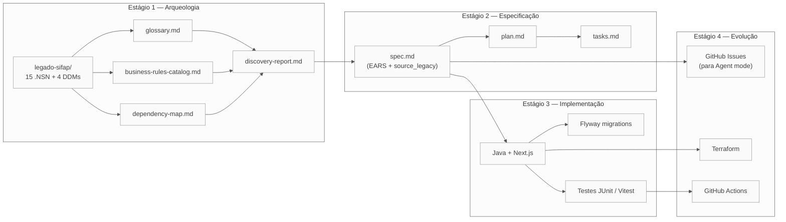

<!-- markdownlint-disable MD013 MD033 MD041 -->

# Sitemap — Mapa Visual do Kit

> **Trilha:** [Kit do Time](README.md) › **Sitemap**

**Mapa de navegação completo do kit:** onde cada arquivo mora, como os artefatos fluem entre estágios e qual caminho seguir por persona.

 

---

## Visão geral — fluxo dos 4 estágios

```mermaid
%%{init: {'theme':'neutral','themeVariables':{'fontFamily':'ui-sans-serif, system-ui, sans-serif','primaryColor':'#F5F5F5','primaryTextColor':'#171717','primaryBorderColor':'#171717','lineColor':'#525252','secondaryColor':'#FFFFFF','tertiaryColor':'#FAFAFA','background':'#FFFFFF'}}}%%
flowchart LR
    classDef step fill:#F5F5F5,stroke:#171717,color:#171717
    classDef handoff fill:#FFFFFF,stroke:#525252,color:#171717
    classDef result fill:#FFFFFF,stroke:#171717,color:#171717,stroke-width:2px

    E1["Estágio 1<br/>Arqueologia<br/>@archaeologist"]:::step
    H1["Passagem H1<br/>5 min"]:::handoff
    E2["Estágio 2<br/>Especificação<br/>@architect"]:::step
    H2["Passagem H2<br/>5 min"]:::handoff
    E3["Estágio 3<br/>Implementação<br/>@builder"]:::step
    H3["Passagem H3<br/>5 min"]:::handoff
    E4["Estágio 4<br/>Evolução<br/>@evolution"]:::step
    R["SIFAP 2.0<br/>em execução"]:::result

    E1 --> H1 --> E2 --> H2 --> E3 --> H3 --> E4 --> R
```

---

## Estrutura ordenada do repositório

| Prefixo | Pasta / Arquivo | Quando consultar |
|---|---|---|
| **00** | [`README.md`](README.md) | Primeira chegada — visão geral do workshop |
| **00** | [`00-COMECE-AQUI.md`](00-COMECE-AQUI.md) | Roteiro de 15 minutos para qualquer pessoa |
| **00** | [`00-SETUP.md`](00-SETUP.md) | Preparar laptop e Copilot |
| **00** | [`00-TEAM-FLOW.md`](00-TEAM-FLOW.md) | Cronograma canônico do dia |
| **00** | [`00-SITEMAP.md`](00-SITEMAP.md) | Este arquivo |
| **00** | [`00-GIT-WORKFLOW.md`](00-GIT-WORKFLOW.md) | Branches, PRs, merges |
| **01** | [`01-arqueologia/`](01-arqueologia/) | Estágio 1 — ler o legado SIFAP |
| **01** | [`01-arqueologia/legado-sifap/`](01-arqueologia/legado-sifap/) | 15 programas `.NSN` + 4 DDMs + docs históricos |
| **02** | [`02-spec-moderna/`](02-spec-moderna/) | Estágio 2 — EARS, ADRs, C4 |
| **03** | [`03-implementacao/`](03-implementacao/) | Estágio 3 — Java + Next.js + testes |
| **04** | [`04-evolucao/`](04-evolucao/) | Estágio 4 — Agent mode + Terraform |
| **05** | [`05-personas/`](05-personas/) | 10 personas (escolha 2 — seu par) |
| **06** | [`06-agentes-de-estagio/`](06-agentes-de-estagio/) | 4 agentes Copilot (um por estágio) |
| **07** | [`07-conceitos/`](07-conceitos/) | Conceitos fundamentais: EARS, ADR, SDD, agentes |
| **09** | [`09-cheat-sheets/`](09-cheat-sheets/) | Cartões de referência rápida (1 página cada) |
| `docs/` | [`docs/`](docs/) | FAQ, troubleshooting, runbook, STATUS |
| `assets/` | [`assets/`](assets/) | SVGs e diagramas |
| `specs/` | [`specs/`](specs/) | Artefatos Spec-Kit criados pelo time durante o workshop |

---

## Conteúdo de `07-conceitos/`

| Arquivo | Conteúdo |
|---|---|
| [`00-README.md`](07-conceitos/00-README.md) | Índice e visão geral da pasta |
| [`01-spec-driven-development.md`](07-conceitos/01-spec-driven-development.md) | O que é Spec-Driven Development e por que usamos no workshop |
| [`02-agentes-e-personas.md`](07-conceitos/02-agentes-e-personas.md) | Diferença entre agentes de estágio e personas individuais |
| [`03-glossario-visual.md`](07-conceitos/03-glossario-visual.md) | Glossário com 30+ termos do domínio |
| [`04-3-modos-do-copilot.md`](07-conceitos/04-3-modos-do-copilot.md) | Ask, Plan e Agent — quando usar cada modo |
| [`05-notacao-ears.md`](07-conceitos/05-notacao-ears.md) | Notação EARS para requisitos sem ambiguidade |
| [`06-architecture-decision-records.md`](07-conceitos/06-architecture-decision-records.md) | ADRs — o que são, como escrever, gabarito |

---

## Fluxo de artefatos entre estágios

> Como ler: seta = dependência. O artefato de destino depende do artefato de origem para ser criado com qualidade.

---

## Caminho recomendado por persona

| Você é… | Comece por… | Depois… | Depois… |
|---|---|---|---|
| **Qualquer pessoa, primeira vez** | [00-COMECE-AQUI.md](00-COMECE-AQUI.md) | [00-TEAM-FLOW.md](00-TEAM-FLOW.md) | seu `PERSONA.md` |
| **Líder do time** | [00-SETUP.md](00-SETUP.md) | [00-TEAM-FLOW.md](00-TEAM-FLOW.md) | [docs/CHECKLIST-LIDER.md](docs/CHECKLIST-LIDER.md) |
| **PO ou RE (Par 1)** | [05-personas/01-product-owner/PERSONA.md](05-personas/01-product-owner/PERSONA.md) | [01-arqueologia/GUIDE.md](01-arqueologia/GUIDE.md) | [02-spec-moderna/GUIDE.md](02-spec-moderna/GUIDE.md) |
| **EA ou SA (Par 2)** | [05-personas/03-enterprise-architect/PERSONA.md](05-personas/03-enterprise-architect/PERSONA.md) | [02-spec-moderna/ADR-TEMPLATE.md](02-spec-moderna/ADR-TEMPLATE.md) | [02-spec-moderna/GUIDE.md](02-spec-moderna/GUIDE.md) |
| **TL ou Dev (Par 3)** | [05-personas/06-developer/PERSONA.md](05-personas/06-developer/PERSONA.md) | [03-implementação/GUIDE.md](03-implementacao/GUIDE.md) | — |
| **DBA ou QA (Par 4)** | [05-personas/07-dba/PERSONA.md](05-personas/07-dba/PERSONA.md) | [03-implementação/GUIDE.md](03-implementacao/GUIDE.md) | — |
| **DevOps ou TW (Par 5)** | [05-personas/09-devops-engineer/PERSONA.md](05-personas/09-devops-engineer/PERSONA.md) | [04-evolucao/GUIDE.md](04-evolucao/GUIDE.md) | — |
| **Não programa em Natural** | [01-arqueologia/legado-sifap/COMO-LER-NATURAL.md](01-arqueologia/legado-sifap/COMO-LER-NATURAL.md) | [01-arqueologia/GUIDE.md](01-arqueologia/GUIDE.md) | (sua persona) |
| **Encontrou termo estranho** | [07-conceitos/03-glossario-visual.md](07-conceitos/03-glossario-visual.md) | (volte de onde veio) | — |

---

## Se você se perdeu

1. **Não sabe em qual estágio está?** Consulte [`00-TEAM-FLOW.md`](00-TEAM-FLOW.md) — seção de cronograma.
2. **Não sabe o que sua persona faz?** Abra seu [`05-personas/0X-.../PERSONA.md`](05-personas/OVERVIEW.md).
3. **Não sabe o que entregar?** Consulte o `GUIDE.md` do estágio atual e localize a seção "Como saber que terminou (DoD)".
4. **Encontrou um termo estranho?** Consulte [`07-conceitos/03-glossario-visual.md`](07-conceitos/03-glossario-visual.md).
5. **Algo deu errado tecnicamente?** Consulte [`docs/troubleshooting.md`](docs/troubleshooting.md).
6. **Travou há mais de 20 minutos?** Sinalize para o facilitador. Regra descrita em [`00-TEAM-FLOW.md`](00-TEAM-FLOW.md).

---

### Continuar a leitura

| Anterior | Próximo |
|---|---|
| [Kit do Time](README.md) Visão geral e ponto de entrada do workshop. | [00 — Comece aqui](00-COMECE-AQUI.md) Roteiro inicial de 15 minutos para qualquer pessoa. |

[Voltar ao índice do kit](README.md)
