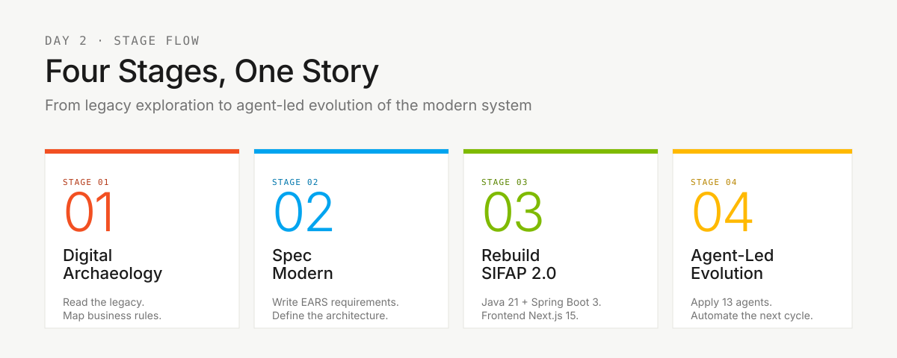
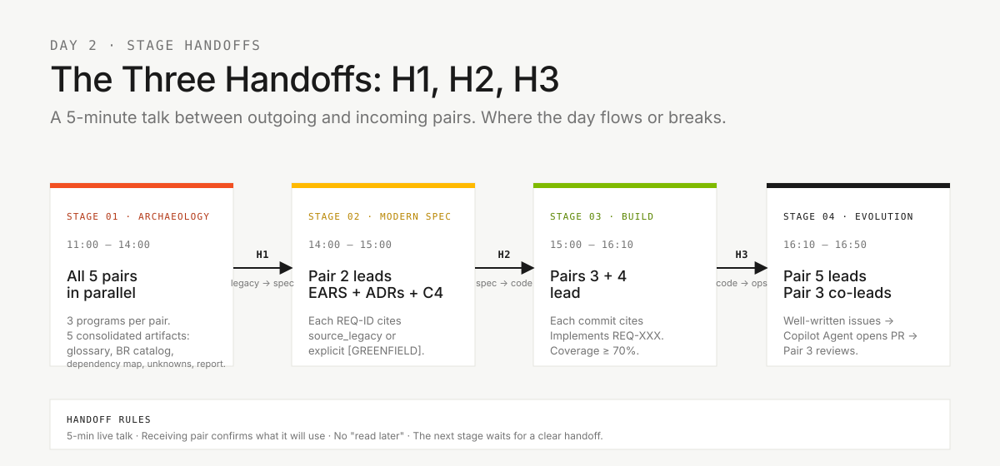

<!-- markdownlint-disable MD012 MD013 MD022 MD025 MD026 MD028 MD029 MD031 MD033 MD034 MD038 MD040 MD051 MD060 -->

# Fluxo do Time — Como 5 Pessoas Cobrem 10 Personas

  

> 🗺 **Você está aqui:** [Kit PT-BR](README.md) → **Team Flow**


> **Para quem é isto?** Para todo participante do workshop. Fixe na tela durante o dia.
>
> **O que você terá ao final desta leitura:**
>
> 1. Saberá qual fase do SDLC cada uma das suas 2 personas lidera
> 2. Saberá quem alimenta o trabalho do seu par (par anterior)
> 3. Saberá para quem você faz a passagem (par seguinte)
> 4. Saberá quando pedir ajuda — a regra dos 20 minutos

> **Leia este documento antes de ler os cards de persona.** Suas duas personas só fazem sentido dentro do fluxo do time.

**Edição: 20 times · 5 pessoas por time · 2 personas por pessoa · 5 pares cobrindo todo o SDLC.**

Um time de 5 pessoas com 10 personas só funciona se cada pessoa souber:

1. **Qual fase do SDLC** cada uma de suas duas personas lidera.
2. **Quem alimenta o trabalho dela** (o par anterior).
3. **Para quem ela faz a passagem de bastão** (o par seguinte).
4. **Quando pedir ajuda** (regra dos 20 minutos).

Este documento responde às quatro. Fixe na sua tela.

---

## Onde isso encaixa no SDLC



Os 5 pares trabalham **em paralelo dentro de cada fase**, alternando liderança conforme o SDLC avança. As três passagens entre estágios (**H1** legado→spec, **H2** spec→código, **H3** código→ops) são pontos onde o dia flui ou quebra. Ninguém fica ocioso, ninguém repete trabalho.

---

## 1. Os 5 Pares e Suas Fases no SDLC

Cada pessoa escolhe **um par** (duas personas). As duas personas de um par são corresponsáveis — não há passagem interna entre elas, elas colaboram continuamente.

| #   | Par                                | Personas                                  | Fase do SDLC liderada           | Cor      |
| --- | ---------------------------------- | ----------------------------------------- | ------------------------------- | -------- |
| 1   | **Visão**                          | Product Owner + Requirements Engineer     | Descoberta + Especificação      | Vermelho |
| 2   | **Arquitetura**                    | Enterprise Architect + Software Architect | Especificação + Design          | Amarelo  |
| 3   | **Implementação**                  | Technical Lead + Developer                | Implementação + Evolução        | Verde    |
| 4   | **Qualidade**                      | DBA + QA Engineer                         | Implementação (dados + testes)  | Azul     |
| 5   | **Operações**                      | DevOps Engineer + Tech Writer             | Transversal + Evolução          | Preto    |

> Personas e kits Copilot ficam juntos em [`05-personas/`](05-personas/) como referência de papel. Os artefatos ativos já ficam consolidados em `.github/`: leia o `PERSONA.md` do seu papel e valide os agents/prompts/skills na raiz.


### Divisão interna do par (sugerida, não obrigatória)

| Par               | Foco da persona A                                      | Foco da persona B                                             |
| ----------------- | ------------------------------------------------------ | ------------------------------------------------------------- |
| 1 · Visão         | **PO**: escopo, valor, prioridades, roteiro do demo    | **RE**: requisitos EARS, critérios de aceitação, REQ-IDs      |
| 2 · Arquitetura   | **EA**: dependências externas e decisões de escopo | **SA**: limites e plano técnico do recorte |
| 3 · Implementação | **TL**: padrões, revisão de PR, orquestração do agente | **Dev**: código Java + TypeScript, testes unitários           |
| 4 · Qualidade     | **DBA**: schema PostgreSQL, migrações Flyway           | **QA**: cenários BDD, gates de cobertura, contract tests      |
| 5 · Operações     | **DevOps**: Terraform, GitHub Actions, secrets         | **TW**: glossário, revisão de clareza de ADR, runbook, README |

Faça rotação dentro do par a cada ~45 min para nenhuma pessoa monopolizar conhecimento.

---

## 2. Linha do Tempo (8 horas, Dia 2 · 10h–18h)

> [!IMPORTANT]
> **O setup do Copilot, Docker e clone do repositório deve estar feito ANTES de 10:00.** Na manhã do dia 2, às 10h, o time apenas valida que tudo abre — não instala do zero. Senão não cabe no cronograma.


| Horário         | Bloco                                      | Pares líderes                          | Pares de suporte                                                       |
| --------------- | ------------------------------------------ | -------------------------------------- | ---------------------------------------------------------------------- |
| **10:00–10:15** | Abertura + confirmação de pares            | Facilitador                            | Cada pessoa confirma suas 2 personas; abre seu PERSONA.md              |
| **10:15–10:45** | Validação do setup + persona-kits          | Par 3 + Par 5                          | Git, Java/Node, Docker disponível, Spec-Kit `specify version`, Copilot Chat funciona |
| **10:45–11:00** | Orientação rápida do legado                | Par 1 + Par 4                          | Apresentação dos 15 programas Natural + 4 DDMs                         |
| **11:00–12:00** | **Estágio 1** — Arqueologia (parte 1)      | Todos os 5 pares em paralelo           | Cada par com 3 programas — Reconhecimento + Extração                   |
| **12:00–13:30** | 🍴 **ALMOÇO**                               | —                                      | —                                                                      |
| **13:30–14:00** | **Estágio 1** — Síntese + **Passagem #1**  | **Par 1** consolida evidências + escopo | Par 5 esclarece termos; Par 2 identifica dependências do recorte |
| **14:00–15:00** | **Estágio 2** — Spec Moderna               | **Par 2** (EA+SA)                      | Par 1 valida escopo · Par 5 revisa clareza · **Passagem #2** ao fim |
| **15:00–16:10** | **Estágio 3** — Implementação              | **Par 3** (TL+Dev), **Par 4** (DBA+QA) | Par 5 esqueleta CI · **Passagem #3** ao fim                            |
| **16:10–16:50** | **Estágio 4** — Evolução com Agentes       | **Par 5** (DevOps+TW)                  | **Par 3** escreve Issues e revisa PRs do Agent                         |
| **16:50–17:00** | Buffer + preparação das demos              | Todos                                  | Cada time ensaia 30s por persona                                       |
| **17:00–17:30** | **Demos dos times** (~3 min cada)          | Time todo                              | PO conduz · facilitador cronometra                                     |
| **17:30–17:50** | Retrospectiva                              | Todos                                  | Manter / Mudar / Tentar — por persona                                  |
| **17:50–18:00** | Encerramento + feedback final              | Facilitador                            | —                                                                      |

> Ninguém fica parado. Pares que não estão "liderando" um estágio têm trabalho concreto de suporte — veja §4.

---

## 3. Mapa de Passagens (raias por par)



Cada par tem trabalho concreto em todos os estágios — o quem-faz-o-quê fica detalhado nas tabelas §4 e §5 abaixo. Os pontos críticos são as três passagens (H1, H2, H3) e a regra é sempre a mesma: **conversa síncrona de 5 minutos** entre par que sai e par que entra.

### Como ler o mapa

- **Setas são dependências bloqueantes.** Sem `spec.md`, `plan.md` e `tasks.md`
  do recorte, os Pares 3 e 4 não conseguem começar o trabalho certo.
- **Posição vertical = tempo.** Mais alto = mais cedo no dia.
- **Cada passagem é uma conversa de 5 minutos** entre o par que sai e o par que entra. Não vale "só leia o documento". Fale ao vivo.

---

## 4. O Que Cada Par Faz em Cada Estágio

Nenhum par fica parado. Mesmo quando não está "liderando", cada par tem trabalho explícito de suporte.

| Par                   | Estágio 1 (Arqueologia)                                          | Estágio 2 (Spec)                                                    | Estágio 3 (Implementação)                                               | Estágio 4 (Evolução)                                         |
| --------------------- | ---------------------------------------------------------------- | ------------------------------------------------------------------- | ----------------------------------------------------------------------- | ------------------------------------------------------------ |
| **1 · Visão**         | **Lidera.** Extrai regras; PO prioriza escopo.                   | Valida EARS; assina escopo no H2.                                   | De prontidão para esclarecer requisitos. Constrói narrativa da demonstração. | Ensaio da demonstração.                                  |
| **2 · Arquitetura**   | Mapeia evidências e dependências relevantes ao recorte.          | **Lidera.** `spec.md`, `plan.md` e `tasks.md`; registra decisões bloqueantes. | De prontidão para perguntas de fronteira; revisa PRs que tocam contratos. | Valida IaC contra decisões existentes.                    |
| **3 · Implementação** | Define convenções (branches, template de PR, DoD) e esqueleto alvo do protótipo. | Comenta sobre viabilidade; estima complexidade.                     | **Lidera.** Código, testes, integração.                                 | **Co-lidera.** Delegação em modo Agent, revisão de PR.       |
| **4 · Qualidade**     | Lê DDMs, planeja mapeamento de schema.                           | Comenta sobre implicações de dados; escreve primeiros cenários BDD. | **Lidera.** Schema, migrações, cobertura de testes.                     | Gate final de cobertura; contract tests no CI.               |
| **5 · Operações**     | Glossário e termos que apoiem o recorte.                         | Revisão de clareza e das decisões de escopo.                         | Rascunho da estrutura do pipeline CI.                                   | **Lidera.** Uma delegação pequena; CI/IaC apenas se pertinentes. |

---

## 5. Primeiros 45 Minutos — Checklist por Par

Entre **10:00 e 10:45**, **todo par** faz as mesmas 4 coisas. Depois começa a especialização.

| Passo | Ação                                                                                                       | Tempo  |
| ----- | ---------------------------------------------------------------------------------------------------------- | ------ |
| 1     | Leia [`00-TEAM-FLOW.md`](00-TEAM-FLOW.md) (este arquivo)                                                         | 10 min |
| 2     | Leia o `PERSONA.md` dos seus dois kits em [`05-personas/`](05-personas/)                                 | 15 min |
| 3     | Valide a `.github/` consolidada: agents, prompts, instructions e skills já vêm prontos para todas as personas        |  5 min |
| 4     | Abra o Copilot Chat, rode o prompt de teste de fumaça de um dos seus cards e valide ferramentas locais     | 15 min |

### Primeira ação de cada par na arqueologia, às 11:00

| Par                   | Ação às 11:00                                                                                                                                                                                       |
| --------------------- | --------------------------------------------------------------------------------------------------------------------------------------------------------------------------------------------------- |
| **1 · Visão**         | PO abre [`00-TEAM-FLOW.md`](00-TEAM-FLOW.md) e o cronograma do dia; RE abre [`01-arqueologia/legado-sifap/natural-programs/`](01-arqueologia/legado-sifap/natural-programs/) e começa o catálogo de regras.       |
| **2 · Arquitetura**   | EA abre [`01-arqueologia/legado-sifap/legacy-docs/`](01-arqueologia/legado-sifap/legacy-docs/) e registra dependências que afetem o recorte; SA prepara perguntas sobre fronteiras. |
| **3 · Implementação** | TL define estratégia de branches, template de PR, definição de pronto e paths padrão (`backend/`, `frontend/`, `infra/` quando necessário).                                                        |
| **4 · Qualidade**     | DBA abre [`01-arqueologia/legado-sifap/adabas-ddms/`](01-arqueologia/legado-sifap/adabas-ddms/) e começa o mapeamento de campos; QA prepara a estratégia de testes para o protótipo que será criado. |
| **5 · Operações**     | DevOps planeja CI/IaC que o time criará no próprio repositório; TW abre o template em [`01-arqueologia/glossary.md`](01-arqueologia/glossary.md).                                                   |

---

## 6. A Regra dos 20 Minutos

> **Se você (ou seu par) está travado no mesmo problema por 20 minutos, pare e peça ajuda.**

A regra vale para todo mundo. Pedir não é fraqueza; sofrer calado é.

### Escala de escalação

| Travado há | Fale com                                                               |
| ---------- | ---------------------------------------------------------------------- |
| 5 min      | Tente Copilot Chat com framing diferente, ou com o parceiro do seu par |
| 10 min     | Fale com o **par** imediatamente anterior ou posterior (veja §3)       |
| 20 min     | Fale com o **Par 3** (TL coordena o time)                              |
| 30 min     | Levante a mão para um facilitador (cordão azul)                        |

### Como escalar (formato de 3 linhas)

```
1. Objetivo: O que estou tentando alcançar
2. Tentei: O que já tentei (com o resultado)
3. Bloqueio: O que está me impedindo agora
```

Ruim: _"Isso não está funcionando."_
Bom: _"Objetivo: validar `<dado>` em `<serviço>`. Tentei: `<abordagem>` e `<abordagem alternativa>`. Bloqueio: preciso de validação humana para confirmar `<regra em aberto>`."_

---

## 7. Definição de Pronto — Por Passagem

### Passagem #1 — Legado → Spec (fim do Estágio 1, ~14:00)

**Dono:** Par 1 (Visão)
**Receptores:** Par 2 (Arquitetura), Par 5 (Operações)

| Artefato | Caminho | Pronto significa |
| --- | --- | --- |
| Catálogo de regras | `01-arqueologia/business-rules-catalog.md` | As regras candidatas ao recorte têm fonte `.NSN`/`.ddm` registrada. |
| Relatório de descoberta | `01-arqueologia/discovery-report.md` | Recorte fino, evidências e dúvidas abertas para a feature escolhida. |
| Apoios consultados | `01-arqueologia/` | Glossário, dependências e mistérios apenas quando ajudarem a explicar o recorte. |

### Passagem #2 — Spec → Código (fim do Estágio 2, ~15:00)

**Dono:** Par 2 (Arquitetura)
**Receptores:** Par 3 (Implementação), Par 4 (Qualidade)

| Artefato | Caminho | Pronto significa |
| --- | --- | --- |
| Especificação formal | `specs/<NNN>-<feature>/spec.md` | Feature fina com REQ-IDs, EARS e `source_legacy:` em cada requisito. |
| Plano formal | `specs/<NNN>-<feature>/plan.md` | Decisões, riscos e abordagem suficientes para começar a implementar. |
| Tarefas formais | `specs/<NNN>-<feature>/tasks.md` | Ordem de implementação e testes para a feature. |
| Decisão de escopo | `02-spec-moderna/scope-decisions.md` | O PO confirmou o que entra e o que fica adiado. |

### Passagem #3 — Código → Ops (fim do Estágio 3, ~16:10)

**Dono:** Par 3 (Implementação)
**Receptores:** Par 5 (Operações)

| Artefato               | Caminho                                    | Pronto significa                                         |
| ---------------------- | ------------------------------------------ | -------------------------------------------------------- |
| Backend funcionando    | `backend/`                                 | `mvn test` verde; OpenAPI documentada                    |
| Frontend funcionando   | `frontend/`                                | `npm test` verde; fluxos principais usáveis              |
| Migrações              | `backend/src/main/resources/db/migration/` | Scripts Flyway numerados; idempotentes (Par 4 cuida)     |
| Relatório de cobertura | Artefato do CI                             | Backend ≥ 70%, frontend ≥ 60% de linhas (Par 4 verifica) |

---

## 8. Padrões de Comunicação

| Padrão                | Quando                             | Exemplo                                                                                 |
| --------------------- | ---------------------------------- | --------------------------------------------------------------------------------------- |
| **Stand-up**          | A cada transição de estágio (4×)   | Rodada de 2 min, uma frase por par: "Terminamos X, estamos fazendo Y, bloqueados por Z" |
| **Check-in do par**   | A cada 30 min dentro de um estágio | "Nós dois ainda estamos alinhados?"                                                     |
| **Sync par-a-par**    | Nos passagens                       | Conversa guiada de 5 minutos, sem slide                                                     |
| **Comentários em PR** | Assíncrono entre pares             | Marque o par receptor explicitamente (`@par-3`)                                         |
| **Hora silenciosa**   | Últimos 30 min do Estágio 3        | Sem reuniões; todo mundo codifica/testa                                                 |

---

## 9. Anti-padrões (Não faça isso)

| ❌ Anti-padrão                                           | ✅ Faça assim                                                              |
| -------------------------------------------------------- | -------------------------------------------------------------------------- |
| Uma persona do par faz tudo                              | Rotacione a cada ~45 min; a outra fica aquecida                            |
| Pular um passagem — "eu descubro a parte deles também"    | Conversa guiada par-a-par de 5 min em toda transição                       |
| Par 4 (Qualidade) espera o fim do Estágio 3 para começar | Par 4 escreve cenários BDD assim que existirem REQ-IDs (meio do Estágio 2) |
| Par 5 (Operações) ocioso até o Estágio 4                 | Par 5 conduz glossário no S1, clareza de ADR no S2, scaffold de CI no S3   |
| Par 1 (Visão) some depois do Estágio 1                   | PO valida escopo no H2 e ensaia demo no S4                                 |
| Par 3 dá merge sem review                                | Todo PR tem pelo menos um review entre pares                               |

---

## 10. Referência rápida

```
Que par eu sou? → §1 (tabela dos 5 pares)
O que meu par faz no estágio N? → §4 (matriz por par e por estágio)
Travado? → regra dos 20 minutos (§6)
Preciso fazer passagem? → critérios de pronto (§7)
Qual modo do Copilot? → 09-cheat-sheets/copilot-3-modes.md
Qual modelo? → 09-cheat-sheets/model-routing.md
Qual comando do Spec-Kit? → 09-cheat-sheets/spec-kit-workflow.md
```

---

---

### Continuar a leitura

<table width="100%">
<tr>
<td width="50%" valign="top" align="left">
<sub><strong>← ANTERIOR</strong></sub><br/>
<a href="00-COMECE-AQUI.md"><strong>Primeiros 15 Minutos</strong></a><br/>
<sub>Roteiro inicial — 5 passos numerados para qualquer pessoa começar.</sub>
</td>
<td width="50%" valign="top" align="right">
<sub><strong>PRÓXIMO →</strong></sub><br/>
<a href="00-SETUP.md"><strong>SETUP</strong></a><br/>
<sub>Setup do laptop: Git, VS Code, Copilot, Spec-Kit, branch protection.</sub>
</td>
</tr>
</table>

<sub>↑ <a href="README.md">Voltar ao Kit PT-BR</a></sub>

— Paula
