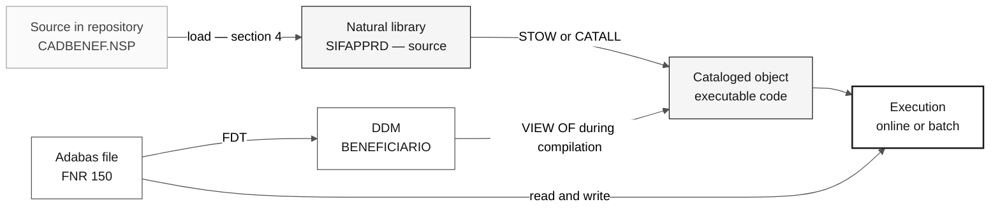

# How to Compile and Run Legacy SIFAP

> **Track:** [Team Kit](../README.md) › [Stage 1](README.md) › **How to compile and run**

**A realistic path from this repository's `.NSP`/`.NSN` files to a Natural program running against an Adabas database.** This is an optional advanced track; the workshop does not depend on it.

| Field | Value |
|---|---|
| **Target audience** | DevOps, DBA, Tech Lead, or anyone who wants to validate a legacy rule empirically |
| **Prerequisites** | A provisioned and accessible [`infra/adabas-natural-lab/`](../infra/adabas-natural-lab/README.md) lab; read [`HOW-TO-READ-NATURAL.md`](legacy-sifap/HOW-TO-READ-NATURAL.md) |
| **Estimated time** | 2 to 4 hours, outside the day's schedule |
| **Stage** | Stage 1 — Archaeology (optional track) |
| **Expected outcome** | At least one corpus member compiled without errors and one program run in the lab |

  

> [!IMPORTANT]
> **No workshop gate requires compiled legacy code.** [`LEGACY-EXPLORATION-CHECKLIST.md`](LEGACY-EXPLORATION-CHECKLIST.md) requires reading and `file#L<start>-L<end>` evidence, never execution. Read section 1 before investing time here.

## Table of contents

- [1. When not to do this](#1-when-not-to-do-this)
- [2. How Natural works](#2-how-natural-works)
- [3. The runtime environment](#3-the-runtime-environment)
- [4. Loading the corpus into the Natural library](#4-loading-the-corpus-into-the-natural-library)
- [5. Creating the Adabas structures](#5-creating-the-adabas-structures)
- [6. Compiling](#6-compiling)
- [7. Running](#7-running)
- [8. Expected errors](#8-expected-errors)
- [9. Completion criteria](#9-completion-criteria)
- [10. What is verified and what needs confirmation](#10-what-is-verified-and-what-needs-confirmation)

---

## 1. When not to do this

The workshop's main path is to **read** legacy code and extract traceable business rules. Running the legacy system is an optional parallel track, and nothing in Stages 1 through 4 depends on it.

| If your objective is… | Then… |
|---|---|
| Write EARS requirements with `source_legacy:` | Keep reading. Use [`GUIDE.md`](GUIDE.md) and [`HOW-TO-READ-NATURAL.md`](legacy-sifap/HOW-TO-READ-NATURAL.md). This guide will not help. |
| Understand what a calculation produces for a specific input | Reading plus a spreadsheet solves this in minutes. Reproducing the calculation in Java in Stage 3 is the real test. |
| Confirm whether a question in [`mysteries-found.md`](mysteries-found.md) has an answer in runtime behavior | This track may help—but the result remains a **hypothesis**, because the lab is not SIFAP's production environment. |
| Learn how a Natural/Adabas stack is operated in practice | This is the legitimate use case for this guide. |

> [!WARNING]
> **Do not block the workshop on this.** Provisioning the lab, creating Adabas files, and resolving the first compilation errors takes hours. If your pair is following the day's schedule, leave this track for before or after the event.

There is also a financial cost: the lab is an Azure VM with a Premium disk, static IP, and configured automatic shutdown. See the estimate in the Terraform module's `estimated_cost_note` output.

---

## 2. How Natural works

### 2.1. Source and cataloged object are different things

A `.NSP` file on disk is **text**. Natural does not run text; it runs a **cataloged object** (also called a generated object, or GP—*generated program*), which is the result of compiling that text.

This has two direct consequences:

- Copying `CADBENEF.NSP` into the environment **does not** make the program executable. It must be compiled.
- The cataloged object lives **inside the Natural library**, not in your laptop's file system.

### 2.2. The library is the namespace

A Natural library is **flat**: there are no subdirectories, and every member is resolved **by name** (maximum 8 characters). `CALLNAT 'SUBVALCP'`, `INCLUDE CCAUDIT`, and `LOCAL USING PDACALC` look for those names in the current library. See [`HOW-TO-READ-NATURAL.md`, section 2](legacy-sifap/HOW-TO-READ-NATURAL.md#2-os-membros-de-uma-biblioteca-natural).

The corpus JCLs identify the library SIFAP used in production:

```text
CMSYNIN  DD *
LOGON SIFAPPRD
BATCHPGT
202601
FIN
```

Source: [`SIFAPJ01.jcl`](legacy-sifap/natural-programs/SIFAPJ01.jcl). Use `SIFAPPRD` as the library name in the lab so the JCLs remain readable as documentation.

### 2.3. Compilation commands

Enter these commands on the Natural command line (the `NEXT` prompt) or in the source editor.

| Command | What it does | When to use it |
|---|---|---|
| `LOGON <library>` | Enters the library. Everything after this is resolved there. | First command in any session |
| `EDIT <member>` | Opens the source in the editor | Before compiling an already saved member |
| `SAVE <name>` | Saves **source only** | Preserve text that does not compile yet |
| `CATALOG <name>` | Compiles and saves **the object only** | Environments that do not distribute source |
| `STOW <name>` | Compiles and saves **source + object** | Default for this exercise |
| `RUN` | Compiles in memory and runs without saving an object | Quick test of source in the editor |
| `<program name>` | Runs the cataloged object | Run an already compiled program |
| `FIN` | Ends the Natural session | End a batch or exit |

`CATALL` is the utility that compiles **all** sources in a library at once instead of running `STOW` for each member. It is Natural's equivalent of a full build.

> [!NOTE]
> `SYSMAIN` (copying and moving objects between libraries) and `SYSOBJH`, the Object Handler (unloading and loading objects in a transport format), are movement utilities. They work with objects **already inside** Natural or in their own transfer format—not with loose `.NSP` files from a Git repository. Importing external source is covered in section 4.

### 2.4. Compilation order

A member compiles only if everything it references already exists in the library. Therefore, use this order:

| Order | What | Why |
|---|---|---|
| 1 | DDMs (`VIEW OF`) | The compiler needs fields, formats, and lengths to validate each view |
| 2 | `.NSA` and `.NSL` data areas | `PARAMETER USING` and `LOCAL USING` expand these areas during compilation |
| 3 | `.NSC` copycodes (source present in the library) | `INCLUDE` inserts the text at compile time |
| 4 | `.NSN` subprograms | They need the corresponding PDA to be available |
| 5 | `.NSP` programs | They depend on everything above |



### 2.5. What the corpus includes and omits

Verified inventory of [`legacy-sifap/`](legacy-sifap/):

| Type | Quantity | Note |
|---|---|---|
| `.NSP` programs | 12 | Entry points—online and batch |
| `.NSN` subprograms | 5 | `CALCBENF`, `SUBVALCP`, `SUBVALNI`, `VALBENEF`, `VALELEG` |
| PDAs `.NSA` | 2 | `PDAVALID`, `PDACALC` |
| LDA `.NSL` | 1 | `LDASIFAP` |
| `.NSC` copycodes | 2 | `CCVALCPF`, `CCAUDIT` |
| `.jcl` JCLs | 2 | `SIFAPJ01`, `SIFAPJ02`—production batch drivers |
| `.ddm` DDMs | 4 | **`LISTDDM` listings**, not importable source |
| `.txt` FDT | 1 | File 150 only |
| `.NSM` maps | **0** | No map exists in the corpus |
| Test data | **0** | No records to load into Adabas |

> [!IMPORTANT]
> Three gaps define everything that follows: **there are no maps**, **there is no data**, and **the `.ddm` files are listings, not source**. None is a defect in the material: the corpus was written to be read. Anyone who wants to run it must produce the missing parts.

---

## 3. The runtime environment

This guide starts where the Terraform module ends: **the lab is already running**. Deployment, connection, and destruction are covered by [`infra/adabas-natural-lab/README.md`](../infra/adabas-natural-lab/README.md). Do not repeat those steps here.

The lab provides the following, according to that module's `main.tf`, `variables.tf`, and `cloud-init.yaml`:

| Item | Default value | Purpose |
|---|---|---|
| VM | Ubuntu 22.04, `Standard_D2s_v3`, user `sifapadmin` | Hosts both containers |
| Adabas container | `softwareag/adabas-ce`, named `adabas-db` | Database |
| Natural container | `softwareag/natural-ce`, named `natural-ce` | Natural runtime and compiler |
| Adabas DBID | `12` | Database identifier visible to Natural |
| Port 22 | SSH | VM access |
| Port 2700 | Natural Development Server (NDV) | NaturalONE connection endpoint |
| Port 60001 | ADATCP | Adabas client outside the VM |
| Port 8190 | Adabas REST administration | Database administration interface |
| `/opt/sifap/corpus` on the VM | Mounted as read-only `/corpus` in the Natural container | Location for the corpus |
| `/mnt/natural-fuser` on the VM | Mounted as Natural's FUSER area | Where libraries persist |

> [!CAUTION]
> Both images are **Community Edition**: licensed for non-production use, unsupported, and subject to their own size and functionality limits. Confirm those limits in the image documentation before assuming the real SIFAP workload would fit. The corpus describes 4.2 million beneficiaries and 612 million payments—none of that will be reproduced in the lab.

> [!NOTE]
> The lab DBID is `12`. The four corpus DDMs declare `DBID: 057`. This is not a real conflict: DBID is environment configuration, and the corpus documents the original production environment. Section 5 addresses the choice.

Before following any step on this page, confirm that VM bootstrap has finished—the images take several minutes to download after `terraform apply` returns. The module's `bootstrap_log_command` output prints the log-following command.

---

## 4. Loading the corpus into the Natural library

### 4.1. Copying the files to the VM

The corpus remains read-only in the repository. The following steps copy it; they never edit it.

- [ ] **Copy the legacy folder to the VM.** On your laptop, from the repository root:

```bash
LAB_IP="<public lab ip>"
scp -r 01-archaeology/legacy-sifap sifapadmin@"$LAB_IP":/tmp/
```

- [ ] **Move it to the directory mounted in the Natural container.** On the VM over SSH:

```bash
sudo mkdir -p /opt/sifap/corpus
sudo cp -r /tmp/legacy-sifap/* /opt/sifap/corpus/
ls /opt/sifap/corpus/natural-programs
```

- [ ] **Confirm that the container can see the files.**

```bash
sudo docker exec natural-ce ls /corpus/natural-programs
```

The `/opt/sifap/corpus:/corpus:ro` mount is defined in the `docker-compose.yml` generated by the lab's `cloud-init.yaml`. The container sees the content as read-only, which is exactly what reference material requires.

### 4.2. From the file system into the library

Having the files in `/corpus` **does not** put them in the Natural library. They still need to be imported. There are two paths with different confidence levels.

**Path A—NaturalONE connected to Natural Development Server (recommended).**

NaturalONE is Software AG's Eclipse-based development environment. It connects to the NDV exposed on port 2700 and handles members as project resources with remote upload and cataloging. This is the path the lab was designed to support—port 2700 is open for it, and Terraform's `natural_development_server` output provides the ready endpoint.

The corpus extensions (`.NSP`, `.NSN`, `.NSA`, `.NSL`, `.NSC`) are already the ones NaturalONE uses for the corresponding types. DDMs are the exception: they use `.ddm`, and their content is a listing rather than source (section 5).

- [ ] **Install NaturalONE** on your workstation by following the Software AG documentation.
- [ ] **Register the development server** at `<ip>:2700`.
- [ ] **Create a Natural project** with the `SIFAPPRD` library.
- [ ] **Import the members** from `01-archaeology/legacy-sifap/natural-programs/` into the project.
- [ ] **Upload to the server** and continue to section 5.

**Path B—work inside the container.**

Open a Natural session in the container and create each member in the editor by pasting its content. This works, is tedious, and is suitable for a single test member—which is exactly what section 6 proposes as the first step.

> [!WARNING]
> **Copying `.NSP` files directly into the FUSER directory is not a procedure verified by this guide.** The internal structure of the FUSER area depends on the Natural version and configuration, and a manual copy can create members Natural does not recognize—or corrupt the library. Before trying it, confirm the expected layout in the documentation for your Natural for Linux version. Path A does not have this uncertainty.

> [!NOTE]
> **Command for opening a Natural session in the container: to be confirmed.** The exact entry point of the `softwareag/natural-ce` image (executable name, terminal wrapper, required environment variables) is not documented in this repository. Check by using `sudo docker exec -it natural-ce /bin/bash` and inspecting the installation directory, or consult the image documentation. Do not assume a command name.

---

## 5. Creating the Adabas structures

### 5.1. The correct order

A DDM creates nothing. It describes to Natural a file that **already exists** in Adabas. The sequence is always:

1. **Define the Adabas file from an FDT.** The FDT declares physical fields: 2-byte short name, format, length, and options (`DE`, `UQ`, `NU`, `FI`, `MU`, `PE`).
2. **Load data**, if available. Without data, the empty file already exists, which is sufficient to compile and run "nothing found" paths.
3. **Create the DDM in Natural**, pointing to that file's DBID and FNR and using the long names referenced by the programs.

Reversing this order produces a DDM that compiles and a program that fails on its first database access.

### 5.2. What the corpus provides as input

| File | What it is | How to use it |
|---|---|---|
| [`FDT-150-BENEFICIARIO.txt`](legacy-sifap/adabas-ddms/FDT-150-BENEFICIARIO.txt) | `ADAREP` output for the physical FDT of file 150 | Ready specification for defining file 150 |
| [`BENEFICIARIO.ddm`](legacy-sifap/adabas-ddms/BENEFICIARIO.ddm) | `LISTDDM` listing—DBID 057, FNR 150 | Source for the long names in DDM 150 |
| [`PROGRAMA-SOCIAL.ddm`](legacy-sifap/adabas-ddms/PROGRAMA-SOCIAL.ddm) | `LISTDDM` listing—DBID 057, FNR 151 | Specification for file **and** DDM 151 |
| [`PAGAMENTO.ddm`](legacy-sifap/adabas-ddms/PAGAMENTO.ddm) | `LISTDDM` listing—DBID 057, FNR 152 | Specification for file **and** DDM 152 |
| [`AUDITORIA.ddm`](legacy-sifap/adabas-ddms/AUDITORIA.ddm) | `LISTDDM` listing—DBID 057, FNR 153 | Specification for file **and** DDM 153 |

Only file 150 has a published FDT. For 151, 152, and 153, the FDT must be **derived from the DDM listing**, which provides all necessary columns.

### 5.3. How to derive an FDT from a DDM listing

The mapping between columns is documented in [`adabas-ddms/README.md`](legacy-sifap/adabas-ddms/README.md) and can be checked against the real FDT for file 150:

| DDM column | Becomes in the FDT | Example in file 150 |
|---|---|---|
| `DB`—short name | Field name | `AB` |
| `F` = `A` | Format `A` | `AB NUM-CPF A 11` → FDT `AB 11 A` |
| `F` = `N` | Format `U` (unpacked) | `AF DT-NASCIMENTO N 8` → FDT `AF 8 U` |
| `F` = `P` | Format `P` (packed) | `CH VLR-RENDA-FAMILIAR P 9,2` → FDT `CH 5 P` |
| `S` = `N` | `NU` option | Null suppression |
| `S` = `F` | `FI` option | Fixed storage |
| `D` = `D` / `U` | `DE` / `DE,UQ` option | Descriptor, unique descriptor |
| `T` = `M` / `P` | `MU` / `PE` option | Multivalue field, periodic group |
| `S` row with `/*` | Sub-, super-, or hyperdescriptor | `S2 = BG(1-2), CE(1-1)` |

> [!WARNING]
> **Converting packed-field length is a trap.** In the DDM, `VLR-RENDA-FAMILIAR` appears as `P 9,2`; in the FDT for the same field, `CH` occupies **5 bytes**. Logical and physical lengths are not the same number. Confirm the conversion rule in the Adabas documentation before defining files 151 through 153—an incorrect FDT length causes a `VIEW OF` compilation error or silent truncation at runtime.

### 5.4. Defining files in Adabas

> [!NOTE]
> **Exact utility names and syntax: to be confirmed in the environment.** Adabas for Linux provides command-line utilities for file definition, compression, and data loading, and Community Edition also exposes REST administration on port 8190. This guide **does not** prescribe the exact command line because it varies by version and Community Edition may expose only a subset. Consult the official Software AG documentation and utility help inside the container (`sudo docker exec -it adabas-db <utility> --help`) before loading anything.

Decide the following before running anything:

- [ ] **DBID.** The lab uses `12`, and `cloud-init.yaml` maps `12=adatcp://adabas-db:60001` for Natural. Keeping `12` is the path of least resistance; using `57` requires changing the Natural container mapping.
- [ ] **FNRs.** Keep `150`, `151`, `152`, and `153`. The numbers appear in comments throughout the programs (`ARQ 150`, `ARQ 153`) and in both JCLs; changing them breaks cross-reading with the corpus.
- [ ] **Descriptors.** Mark as a descriptor **every** field the corpus uses in `FIND ... WITH` or `READ ... BY`. Verifiable examples: `NUM-CPF` and `NUM-NIS` in file 150; `NUM-PAGAMENTO` and superdescriptor `SUPER-CPF-COMPET` (`S1 = AB(1-11), AE(1-6)`) in file 152; `NUM-AUDITORIA` in 153.
- [ ] **Volume.** Start empty. Do not try to reproduce the volumes described in the DDMs.

### 5.5. Creating the DDMs in Natural

The repository's `.ddm` files are **output from the `LISTDDM` utility**: printed reports with a header, legend, and volume footer. They are not DDM source and cannot be imported as such.

The DDM must be created inside Natural—using the `SYSDDM` utility in a Natural session or NaturalONE's DDM editor. The most economical route is to **generate the DDM from the already defined Adabas file**: the utility reads the FDT and creates entries with short names, and you complete the long names using the corpus listing as a dictionary. The exact name of this generation function varies by version—confirm it in the documentation before looking for it in the menu.

- [ ] **Generate the DDM** from the corresponding FNR.
- [ ] **Complete the long names** exactly as shown in the listing: `AB` → `NUM-CPF`, `CH` → `VLR-RENDA-FAMILIAR`, and so on. A different long name breaks every corpus `VIEW OF`.
- [ ] **Check format and length** field by field against the listing.
- [ ] **Repeat for all four DDMs**: `BENEFICIARIO`, `PROGRAMA-SOCIAL`, `PAGAMENTO`, `AUDITORIA`.

---

## 6. Compiling

### 6.1. Start with the member that does not depend on the database

`SUBVALCP.NSN` is the best first target in the entire corpus: it validates CPF using modulus 11, **has no `VIEW OF`**, and therefore needs no Adabas file or DDM. Its only dependencies are `PDAVALID.NSA` (through `PARAMETER USING`) and `CCVALCPF.NSC` (through `INCLUDE`).

The minimum sequence has three members in this order:

| Order | Member | Type | Save command |
|---|---|---|---|
| 1 | `PDAVALID` | Parameter Data Area | `STOW PDAVALID` |
| 2 | `CCVALCPF` | Copycode | `SAVE CCVALCPF` |
| 3 | `SUBVALCP` | Subprogram | `STOW SUBVALCP` |

On the Natural command line, the skeleton is:

```text
LOGON SIFAPPRD
   (open the correct editor type and paste the source)
STOW PDAVALID
   (open the correct editor type and paste the source)
SAVE CCVALCPF
   (open the correct editor type and paste the source)
STOW SUBVALCP
```

Three notes about this block:

- The copycode is saved with `SAVE`, not `STOW`: `INCLUDE CCVALCPF` inserts its text into the including member at compile time. The **source** is what must exist in the library.
- Each object type has its own Natural editor—programs, subprograms, data areas, and copycodes are not edited the same way. With Path A in section 4.2, NaturalONE makes this choice and you never type `EDIT`.
- If `STOW SUBVALCP` finishes without an error message, three things have been proven at once: the library is accessible, the PDA expanded correctly, and the copycode was found and inserted.

> [!NOTE]
> **Object-type parameter for the `EDIT` command: to be confirmed.** `EDIT` accepts a parameter indicating the object type to create, and the exact notation varies by Natural version. Confirm it in the documentation before creating members through the terminal. `SAVE`, `CATALOG`, and `STOW` followed by the member name do not have this ambiguity.

### 6.2. Complete example: `CADBENEF`

`CADBENEF.NSP` handles beneficiary registration and exercises almost all corpus infrastructure. Its dependencies, all verifiable in the source, are:

| Dependency | How it appears in `CADBENEF.NSP` | Type |
|---|---|---|
| `BENEFICIARIO` | `1 BENEFICIARIO-V VIEW OF BENEFICIARIO` | DDM / FNR 150 |
| `AUDITORIA` | `1 AUDITORIA-V VIEW OF AUDITORIA` | DDM / FNR 153 |
| `PDAVALID` | `LOCAL USING PDAVALID` | PDA |
| `SUBVALCP` | `CALLNAT 'SUBVALCP' ...` | Subprogram |
| `SUBVALNI` | `CALLNAT 'SUBVALNI' ...` | Subprogram |
| `VALBENEF` | `CALLNAT 'VALBENEF' ...` | Subprogram |
| `CCAUDIT` | `INCLUDE CCAUDIT` + `PERFORM GRAVA-AUDITORIA` | Copycode |

The compilation order follows from the table: both DDMs, then `PDAVALID`, then the `CCVALCPF` and `CCAUDIT` sources, then `SUBVALCP`, `SUBVALNI`, and `VALBENEF`, and only then `STOW CADBENEF`.

### 6.3. Compiling the entire library

With all members loaded, `CATALL` compiles the library at once instead of running `STOW` for each member. It is invoked from the current library and presents a selection screen where you choose the function (catalog or stow), name filter, and object types.

> [!NOTE]
> **Direct `CATALL` parameters: to be confirmed.** The utility also accepts a direct-command form with positional parameters. Their exact order varies by version and is not verified in this guide. Use the selection screen or consult the Natural utilities documentation before assembling a command line.

Even with `CATALL`, follow the order in section 2.4 by running it per object type: data areas first, subprograms next, programs last. A single run over the entire library tends to fail for members whose dependencies have not yet been compiled—and require a second pass.

### 6.4. Reading compilation errors

A Natural compilation error provides three pieces of information: a message number formatted as `NAT` followed by four digits, the message text, and the source position. The compiler stops at the first error.

Practical triage rules, in order:

- [ ] **Does the referenced member exist in the library?** Most initial errors are missing dependencies, not syntax errors. Check against section 2.4.
- [ ] **Are you in the correct library?** Run `LOGON SIFAPPRD` before anything else.
- [ ] **Does the error cite a view field?** Then the problem is the DDM, not the program: mismatched long name, format, or length. Return to section 5.5.
- [ ] **Does the error cite a field prefixed with `#`?** It is a work variable; check whether it comes from an unloaded PDA or LDA. `#PV-` comes from `PDAVALID`, `#PC-` from `PDACALC`, and `#L-` from `LDASIFAP`.

> [!IMPORTANT]
> **No program in this corpus has been compiled.** The material was written for reading, with period comments and deliberate inconsistencies. Expect real compilation errors and treat them as part of the exercise—including recording in [`mysteries-found.md`](mysteries-found.md) what the error reveals about the system.

---

## 7. Running

### 7.1. Online program

Online programs interact with the terminal through `INPUT`, `WRITE`, and `REINPUT`. After compilation, run them by name:

```text
LOGON SIFAPPRD
CADBENEF
```

`CADBENEF` renders the registration screen with text `INPUT`, without a map. `CONSBENF.NSP`, however, starts with `INPUT USING MAP 'CONSBENF-M01'`—and **that map does not exist in the corpus**. The program itself provides an alternate path immediately below:

```natural
SET CONTROL 'MB'
INPUT USING MAP 'CONSBENF-M01'
*
* TELA ALTERNATIVA SEM MAP
IF *ERROR-NR NE 0
  INPUT 'SIFAP - CONSULTA BENEFICIARIO' /
```

Whether the missing map appears during compilation or only at runtime depends on how your Natural version resolves map references. This guide does not claim either behavior—verify it in the environment and record the result.

### 7.2. Batch program

A batch program has no terminal. It receives commands and data through Natural's standard input (`CMSYNIN` on the mainframe), prints to `CMPRINT`, writes to numbered work files, and returns a code through `TERMINATE`.

`SIFAPJ01.jcl` documents everything `BATCHPGT` expects:

| JCL resource | What it is | Lab equivalent to configure |
|---|---|---|
| `EXEC PGM=NATBATCH` | Natural in batch mode | Batch Natural session inside the container |
| `CMSYNIN DD *` | Command and data stack: `LOGON SIFAPPRD`, `BATCHPGT`, `202601`, `FIN` | Input file fed to the session |
| `CMPRINT DD SYSOUT=*` | Natural print output | File or standard output |
| `CMWKF01` (LRECL 240) | Bank remittance generated by `WRITE WORK FILE 1` | Work file 1 assigned to a path |
| `CMWKF02` (LRECL 120) | Rejected-record log, `WRITE WORK FILE 2` | Work file 2 assigned to a path |
| `PARM='...DBID=57,FNR=150'` | Session parameters | Lab DBID and equivalent parameters |
| `CMPRT01` / `CMPRT02` in `SIFAPJ02` | Logical printers from `DEFINE PRINTER` | Assigned print destinations |

The third `CMSYNIN` line (`202601`) is the accounting period read by the program's `INPUT #COMPETENCIA`. This is how input is supplied to a Natural batch: each line in the stack answers an `INPUT`, in order.

> [!NOTE]
> **Batch invocation on Linux: to be confirmed.** The logical names `CMSYNIN`, `CMPRINT`, and `CMOBJIN` also exist in Natural for open systems, but how they are assigned (environment variables, profile parameters, or input redirection) depends on the version and image configuration. Confirm this in the Natural for Linux documentation before assembling the command.

### 7.3. Work files without changing the legacy system

`BATCHPGT` runs `WRITE WORK FILE 1` and `WRITE WORK FILE 2`. If the work files are not assigned, execution fails there.

The corpus is read-only, so editing `BATCHPGT` is not the solution. Create a **driver program in your own library** that assigns the work files and calls the legacy program:

```natural
* TEST DRIVER - NEW MEMBER, NOT PART OF THE CORPUS
DEFINE DATA LOCAL
END-DEFINE
*
DEFINE WORK FILE 1 '/tmp/sifap-remessa.txt'
DEFINE WORK FILE 2 '/tmp/sifap-rejeitados.txt'
*
FETCH 'BATCHPGT'
END
```

> [!NOTE]
> **`DEFINE WORK FILE` syntax: confirm the attributes.** The statement accepts additional type and attribute clauses that vary by platform. The example above shows the minimum form; validate it against your version's documentation before relying on it.

The same pattern applies to `SIFAPJ02` reports: `BATCHREL` and `RELPGT` use `DEFINE PRINTER (1) OUTPUT 'CMPRT01'`, and the JCL itself records the consequence of not assigning the destination—"IMPRESSORA LOGICA SEM DD CORRESPONDENTE PROVOCA NAT1500 EM TEMPO DE EXECUCAO" (a logical printer without a corresponding DD causes NAT1500 at runtime).

### 7.4. The first expected result: an empty database

With all four Adabas files created and empty, `BATCHPGT` follows this path:

1. `READ (1) PAGAMENTO-V BY NUM-PAGAMENTO DESCENDING` returns nothing—the sequence seed remains zero.
2. `READ BENEFICIARIO-V BY NUM-CPF` does not enter the loop—no beneficiary exists.
3. The summary prints with all counters at zero.
4. `PERFORM GRAVA-AUDITORIA` writes **one** record to file 153.
5. `IF #QTD-GERADOS = 0` is true, and the program runs `TERMINATE 8`.

Return code 8 is documented in `SIFAPJ01.jcl`: `RC=8 - COMPETENCIA JA PROCESSADA - NADA A FAZER` (period already processed—nothing to do). **Reaching RC 8 with an empty database is a successful result**: it proves the program compiled, the session reached Adabas, reads worked, and the audit trail write worked.

This path still goes through `CLOSE WORK FILE 1` and `CLOSE WORK FILE 2` before `TERMINATE`, even if no `WRITE WORK FILE` ran. If execution stops there, the problem is work-file assignment—return to section 7.3.

Only then is it worth loading data. Start with a handful of records in file 151 (social programs) and 150 (beneficiaries)—without an active social program, `BATCHPGT` discards every beneficiary read.

---

## 8. Expected errors

The corpus was written for a workshop. It references files, work files, maps, and modules that do not exist in a fresh installation. The following table is candid about what you will encounter.

| Symptom | Likely cause | What it means |
|---|---|---|
| `NAT3nnn` error on any data access | `NAT3nnn` messages carry Adabas response code `nnn` | Look up the response code in the Adabas documentation. The most common initial case is the database being inaccessible from the Natural container |
| Program not found when its name is entered | Object is not cataloged, or the wrong library is active | Run `LOGON SIFAPPRD` and confirm `STOW` occurred, not only `SAVE` |
| Failure in `INPUT USING MAP 'CONSBENF-M01'` | **The corpus contains no `.NSM` file** | Known material gap. `CONSBENF` itself provides an alternate screen without a map |
| Error compiling a `VIEW OF` | Missing DDM, or mismatched long name, format, or length | Return to section 5.5. Packed-field length mismatch is the most frequent cause |
| `FIND ... WITH <field>` or `READ ... BY <field>` fails | The field was not marked as a descriptor in the FDT you created | Adabas searches only indexed fields. Review the descriptor checklist in section 5.4 |
| `WRITE WORK FILE n` fails | Work file is not assigned in the environment | Use the driver in section 7.3. Do not edit the legacy program |
| Logical printer has no destination | `DEFINE PRINTER (n) OUTPUT 'CMPRTnn'` without an assignment | `SIFAPJ02.jcl` documents `NAT1500` as the production consequence |
| Counters are zero and `TERMINATE 8` occurs | Empty database | **Expected** result on the first run. See section 7.4 |
| Beneficiaries are read and all ignored | No active social program in file 151 | `BATCHPGT` requires `SIT-PROGRAMA = 'A'` to generate a payment |
| Strange screen behavior with `SET CONTROL` and `REINPUT ... MARK` | Constructs designed for a 3270 terminal | A Linux terminal does not faithfully reproduce mainframe behavior |
| Error cites `#L-`, `#PV-`, or `#PC-` | Corresponding LDA or PDA was not loaded | `#L-` comes from `LDASIFAP`, `#PV-` from `PDAVALID`, and `#PC-` from `PDACALC` |

> [!IMPORTANT]
> **An error found here counts as archaeology evidence.** If compilation reveals a real mismatch between a program and its DDM, record it in [`mysteries-found.md`](mysteries-found.md): open question, `path:line` evidence, impact, unconfirmed hypothesis, owner, and status. The stage agent does not close the question—human validation remains mandatory.

---

## 9. Completion criteria

This track is complete when you can check the items below. It is not a workshop target; it is this page's definition of done.

- [ ] **Lab accessible.** SSH access to the VM and both containers running.
- [ ] **Corpus on the VM.** Files visible in `/corpus` from inside the Natural container.
- [ ] **Library created.** `LOGON SIFAPPRD` works.
- [ ] **First successful `STOW`.** `PDAVALID`, `CCVALCPF`, and `SUBVALCP` compiled without database dependencies.
- [ ] **Adabas files defined.** FNRs 150, 151, 152, and 153 exist, even if empty.
- [ ] **DDMs created.** All four DDMs are available to Natural with long names identical to the listings.
- [ ] **Database-backed program compiled.** `STOW CADBENEF` succeeds.
- [ ] **Empty-database execution.** `BATCHPGT` reaches `TERMINATE 8`.
- [ ] **Findings recorded.** Every mismatch is recorded as an open question, not a conclusion.

---

## 10. What is verified and what needs confirmation

This guide separates what has been checked from what remains open. A confidently presented wrong command can cost an entire work session.

| Statement | Status |
|---|---|
| Corpus inventory: 12 `.NSP`, 5 `.NSN`, 2 `.NSA`, 1 `.NSL`, 2 `.NSC`, 2 `.jcl`, 4 `.ddm`, 1 FDT, 0 `.NSM`, 0 data records | **Verified** in this repository |
| DBID 057 and FNRs 150 through 153 in the DDMs; `SIFAPPRD` library in the JCLs; `CONSBENF` references map `CONSBENF-M01`; `BATCHPGT` uses work files 1 and 2 and ends with `TERMINATE 8` without data | **Verified** in the cited sources |
| Lab: DBID 12, ports 22, 2700, 60001, and 8190, `/opt/sifap/corpus` → `/corpus` mount, `adabas-db` and `natural-ce` containers | **Verified** in `main.tf`, `variables.tf`, and `cloud-init.yaml` |
| Semantics of `LOGON`, `SAVE`, `CATALOG`, `STOW`, `RUN`, `FIN`; distinction between source and cataloged object; dependency compilation order; correspondence between `NAT3nnn` and Adabas response codes | **Standard language knowledge.** Confirm against your version's documentation if anything differs |
| Positional parameters for direct-command `CATALL` | **To be confirmed** in the Natural utilities documentation |
| Object-type parameter for `EDIT` when creating a member through the terminal | **To be confirmed** in the Natural documentation |
| Names and syntax of Adabas file-definition, compression, and loading utilities in Community Edition | **To be confirmed** in Software AG documentation and the container utility help |
| Entry point for opening a Natural session inside the `softwareag/natural-ce` image | **To be confirmed** in the image documentation |
| Assignment of `CMSYNIN`, `CMPRINT`, and work files in Natural for Linux | **To be confirmed** in the Natural for Linux documentation |
| Complete `DEFINE WORK FILE` clauses | **To be confirmed**—the example shows the minimum form |
| Whether the missing map fails during compilation or execution | **To be confirmed** in the environment |
| Direct copying of `.NSP` files into the FUSER area | **Not recommended**—unverified and risky for the library |
| Length conversion rule between `P 9,2` in the DDM and 5 bytes in the FDT | **To be confirmed** in the Adabas documentation |

---

## References

- [`legacy-sifap/HOW-TO-READ-NATURAL.md`](legacy-sifap/HOW-TO-READ-NATURAL.md)—reading Natural programs without knowing the language.
- [`legacy-sifap/natural-programs/README.md`](legacy-sifap/natural-programs/README.md)—inventory of the 15 assigned programs and 9 supporting members.
- [`legacy-sifap/adabas-ddms/README.md`](legacy-sifap/adabas-ddms/README.md)—how to read a DDM listing and the difference between DDM and FDT.
- [`infra/adabas-natural-lab/README.md`](../infra/adabas-natural-lab/README.md)—provisioning the Adabas + Natural Community Edition lab on Azure.
- [`LEGACY-EXPLORATION-CHECKLIST.md`](LEGACY-EXPLORATION-CHECKLIST.md)—the actual Stage 1 gate, which does not require execution.
- Official Software AG documentation for Natural, Natural Development Server, NaturalONE, and Adabas—the required source for every syntax item marked "to be confirmed" in section 10.

---

### Continue reading

| Previous | Next |
|---|---|
| [Legacy Exploration Checklist](LEGACY-EXPLORATION-CHECKLIST.md)<br/><sub>The mandatory gate before Stage 2.</sub> | [How to Read a Natural Program](legacy-sifap/HOW-TO-READ-NATURAL.md)<br/><sub>Business-rule-oriented reading tutorial.</sub> |

<sub>[Back to the kit index](../README.md)</sub>
