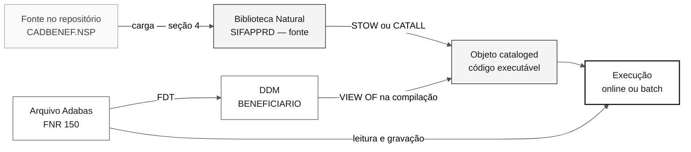

<!-- markdownlint-disable MD013 MD033 MD041 -->

# Como Compilar e Executar o Legado SIFAP

> **Trilha:** [Kit do Time](../README.md) › [Estágio 1](README.md) › **Como compilar e executar**

**Caminho realista dos arquivos `.NSP`/`.NSN` deste repositório até um programa Natural rodando contra um banco Adabas.** Este é um percurso opcional e avançado: o workshop não depende dele.

| Campo | Valor |
|---|---|
| **Público-alvo** | DevOps, DBA, Tech Lead ou quem quiser validar empiricamente uma regra do legado |
| **Pré-requisitos** | Lab de [`infra/adabas-natural-lab/`](../infra/adabas-natural-lab/README.md) provisionado e acessível; leitura de [`COMO-LER-NATURAL.md`](legado-sifap/COMO-LER-NATURAL.md) |
| **Tempo estimado** | 2 a 4 horas, fora do cronograma do dia |
| **Estágio** | Estágio 1 — Arqueologia (trilha opcional) |
| **Resultado esperado** | Pelo menos um membro do corpus compilado sem erro e um programa executado no lab |

  

> [!IMPORTANT]
> **Nenhum portão do workshop exige código legado compilado.** O [`LEGACY-EXPLORATION-CHECKLIST.md`](LEGACY-EXPLORATION-CHECKLIST.md) pede leitura e evidência `arquivo#L<início>-L<fim>`, nunca execução. Leia a seção 1 antes de investir tempo aqui.

## Sumário

- [1. Quando não fazer isto](#1-quando-não-fazer-isto)
- [2. Como o Natural funciona](#2-como-o-natural-funciona)
- [3. O ambiente de execução](#3-o-ambiente-de-execução)
- [4. Carregar o corpus na biblioteca Natural](#4-carregar-o-corpus-na-biblioteca-natural)
- [5. Criar as estruturas Adabas](#5-criar-as-estruturas-adabas)
- [6. Compilar](#6-compilar)
- [7. Executar](#7-executar)
- [8. Erros esperados](#8-erros-esperados)
- [9. Critérios de conclusão](#9-critérios-de-conclusão)
- [10. O que está verificado e o que precisa de confirmação](#10-o-que-está-verificado-e-o-que-precisa-de-confirmação)

---

## 1. Quando não fazer isto

O caminho principal do workshop é **ler** o código legado para extrair regras de negócio rastreáveis. Executar o legado é uma trilha paralela, opcional, e nada nos Estágios 1 a 4 depende dela.

| Se o seu objetivo é… | Então… |
|---|---|
| Escrever requisitos EARS com `source_legacy:` | Fique na leitura. Use [`GUIDE.md`](GUIDE.md) e [`COMO-LER-NATURAL.md`](legado-sifap/COMO-LER-NATURAL.md). Este guia não ajuda. |
| Entender o que um cálculo produz para uma entrada específica | Leitura + planilha resolve em minutos. Reproduzir o cálculo em Java no Estágio 3 é o teste real. |
| Confirmar se uma dúvida do [`mysteries-found.md`](mysteries-found.md) tem resposta no comportamento em execução | Aqui a trilha pode ajudar — mas o resultado continua sendo **hipótese**, porque o ambiente do lab não é o ambiente de produção do SIFAP. |
| Aprender como uma stack Natural/Adabas é operada na prática | Este é o caso de uso legítimo deste guia. |

> [!WARNING]
> **Não bloqueie o workshop nisto.** Provisionar o lab, criar arquivos Adabas e resolver os primeiros erros de compilação consome horas. Se o seu par está no cronograma do dia, deixe esta trilha para antes ou depois do evento.

Há também um custo financeiro: o lab é uma VM Azure com disco Premium e IP estático, com desligamento automático configurado. Consulte a estimativa no output `estimated_cost_note` do módulo Terraform.

---

## 2. Como o Natural funciona

### 2.1. Fonte e objeto cataloged são coisas diferentes

Um arquivo `.NSP` no disco é **texto**. O Natural não executa texto: ele executa um **objeto cataloged** (também chamado de objeto gerado, ou GP — *generated program*), que é o resultado da compilação daquele texto.

Isso tem duas consequências diretas:

- Copiar `CADBENEF.NSP` para dentro do ambiente **não** torna o programa executável. É preciso compilar.
- O objeto cataloged mora **dentro da biblioteca Natural**, não no sistema de arquivos do seu laptop.

### 2.2. Biblioteca é o espaço de nomes

Uma biblioteca Natural é **plana**: não existem subdiretórios, e todo membro é resolvido **pelo nome** (máximo de 8 caracteres). `CALLNAT 'SUBVALCP'`, `INCLUDE CCAUDIT` e `LOCAL USING PDACALC` procuram esses nomes na biblioteca corrente. Detalhes em [`COMO-LER-NATURAL.md`, seção 2](legado-sifap/COMO-LER-NATURAL.md#2-os-membros-de-uma-biblioteca-natural).

Os JCLs do corpus dizem qual biblioteca o SIFAP usava em produção:

```text
CMSYNIN  DD *
LOGON SIFAPPRD
BATCHPGT
202601
FIN
```

Fonte: [`SIFAPJ01.jcl`](legado-sifap/natural-programs/SIFAPJ01.jcl). Use `SIFAPPRD` como nome da biblioteca no lab para que os JCLs continuem legíveis como documentação.

### 2.3. Os comandos que compilam

Estes comandos são digitados na linha de comando do Natural (o prompt `NEXT`) ou dentro do editor de fontes.

| Comando | O que faz | Quando usar |
|---|---|---|
| `LOGON <biblioteca>` | Entra na biblioteca. Tudo depois disso é resolvido nela. | Primeiro comando de qualquer sessão |
| `EDIT <membro>` | Abre o fonte no editor | Antes de compilar um membro já salvo |
| `SAVE <nome>` | Grava **somente o fonte** | Guardar texto que ainda não compila |
| `CATALOG <nome>` | Compila e grava **somente o objeto** | Ambientes que não distribuem fonte |
| `STOW <nome>` | Compila e grava **fonte + objeto** | Padrão para este exercício |
| `RUN` | Compila em memória e executa, sem gravar objeto | Teste rápido de um fonte no editor |
| `<nome do programa>` | Executa o objeto cataloged | Rodar um programa já compilado |
| `FIN` | Encerra a sessão Natural | Fim do batch, ou sair |

`CATALL` é o utilitário que compila **todos** os fontes de uma biblioteca de uma vez, em vez de um `STOW` por membro. É o equivalente Natural de um build completo.

> [!NOTE]
> `SYSMAIN` (cópia e movimentação de objetos entre bibliotecas) e `SYSOBJH`, o Object Handler (descarga e carga de objetos em formato de transporte), são os utilitários de movimentação. Eles trabalham com objetos **já dentro** do Natural ou em formato de transferência próprio — não com arquivos `.NSP` soltos vindos de um repositório Git. A entrada de fonte externo é assunto da seção 4.

### 2.4. Ordem de compilação

Um membro só compila se tudo que ele referencia já existir na biblioteca. Daí a ordem:

| Ordem | O que | Por quê |
|---|---|---|
| 1 | DDMs (`VIEW OF`) | O compilador precisa dos campos, formatos e comprimentos para validar cada view |
| 2 | Data areas `.NSA` e `.NSL` | `PARAMETER USING` e `LOCAL USING` expandem essas áreas na compilação |
| 3 | Copycodes `.NSC` (fonte presente na biblioteca) | `INCLUDE` cola o texto em tempo de compilação |
| 4 | Subprogramas `.NSN` | Precisam da PDA correspondente já disponível |
| 5 | Programas `.NSP` | Dependem de tudo acima |



### 2.5. O que o corpus traz e o que ele não traz

Inventário verificado de [`legado-sifap/`](legado-sifap/):

| Tipo | Quantidade | Observação |
|---|---|---|
| Programas `.NSP` | 12 | Pontos de entrada — online e batch |
| Subprogramas `.NSN` | 5 | `CALCBENF`, `SUBVALCP`, `SUBVALNI`, `VALBENEF`, `VALELEG` |
| PDAs `.NSA` | 2 | `PDAVALID`, `PDACALC` |
| LDA `.NSL` | 1 | `LDASIFAP` |
| Copycodes `.NSC` | 2 | `CCVALCPF`, `CCAUDIT` |
| JCLs `.jcl` | 2 | `SIFAPJ01`, `SIFAPJ02` — drivers batch de produção |
| DDMs `.ddm` | 4 | **Listagens `LISTDDM`**, não fontes importáveis |
| FDT `.txt` | 1 | Somente o arquivo 150 |
| Maps `.NSM` | **0** | Nenhum map existe no corpus |
| Dados de teste | **0** | Nenhum registro para carregar no Adabas |

> [!IMPORTANT]
> Três lacunas definem tudo que vem a seguir: **não há maps**, **não há dados** e **os `.ddm` são listagem, não fonte**. Nenhuma delas é defeito do material: o corpus foi escrito para ser lido. Quem quiser executá-lo precisa produzir as partes que faltam.

---

## 3. O ambiente de execução

Este guia começa de onde o módulo Terraform termina: **o lab já está no ar**. Deploy, conexão e destruição são responsabilidade de [`infra/adabas-natural-lab/README.md`](../infra/adabas-natural-lab/README.md). Não repita aqueles passos aqui.

O que o lab entrega, conforme `main.tf`, `variables.tf` e `cloud-init.yaml` daquele módulo:

| Item | Valor padrão | Para que serve |
|---|---|---|
| VM | Ubuntu 22.04, `Standard_D2s_v3`, usuário `sifapadmin` | Host dos dois contêineres |
| Contêiner Adabas | `softwareag/adabas-ce`, nome `adabas-db` | Banco de dados |
| Contêiner Natural | `softwareag/natural-ce`, nome `natural-ce` | Runtime e compilador Natural |
| DBID Adabas | `12` | Identificador do banco que o Natural enxerga |
| Porta 22 | SSH | Acesso à VM |
| Porta 2700 | Natural Development Server (NDV) | Ponto de conexão do NaturalONE |
| Porta 60001 | ADATCP | Cliente Adabas fora da VM |
| Porta 8190 | Administração REST do Adabas | Interface de administração do banco |
| `/opt/sifap/corpus` na VM | Montado como `/corpus` (somente leitura) no contêiner Natural | Onde colocar o corpus |
| `/mnt/natural-fuser` na VM | Montado como área FUSER do Natural | Onde as bibliotecas persistem |

> [!CAUTION]
> As duas imagens são **Community Edition**: licença de uso não produtivo, sem suporte e com limites próprios de tamanho e funcionalidade. Confirme os limites na documentação das imagens antes de assumir que algo do SIFAP real caberia ali. O corpus descreve 4,2 milhões de beneficiários e 612 milhões de pagamentos — nada disso será reproduzido no lab.

> [!NOTE]
> O DBID do lab é `12`. Os quatro DDMs do corpus declaram `DBID: 057`. Isso não é um conflito real: DBID é configuração de ambiente, e o corpus documenta o ambiente de produção de origem. A seção 5 trata da escolha.

Antes de qualquer passo desta página, confirme que o bootstrap da VM terminou — o download das imagens leva vários minutos após o `terraform apply` retornar. O output `bootstrap_log_command` do módulo imprime o comando de acompanhamento do log.

---

## 4. Carregar o corpus na biblioteca Natural

### 4.1. Levar os arquivos até a VM

O corpus permanece somente leitura no repositório. O que segue é cópia, nunca edição.

- [ ] **Copiar a pasta do legado para a VM.** No seu laptop, a partir da raiz do repositório:

```bash
LAB_IP="<ip público do lab>"
scp -r 01-arqueologia/legado-sifap sifapadmin@"$LAB_IP":/tmp/
```

- [ ] **Mover para o diretório montado no contêiner Natural.** Já na VM, por SSH:

```bash
sudo mkdir -p /opt/sifap/corpus
sudo cp -r /tmp/legado-sifap/* /opt/sifap/corpus/
ls /opt/sifap/corpus/natural-programs
```

- [ ] **Confirmar que o contêiner enxerga os arquivos.**

```bash
sudo docker exec natural-ce ls /corpus/natural-programs
```

O ponto de montagem `/opt/sifap/corpus:/corpus:ro` é definido no `docker-compose.yml` gerado pelo `cloud-init.yaml` do lab. O contêiner vê o conteúdo em modo somente leitura — o que é exatamente o desejado para material de referência.

### 4.2. Do sistema de arquivos para dentro da biblioteca

Ter os arquivos em `/corpus` **não** os coloca na biblioteca Natural. Falta a importação. Há dois caminhos, com graus de confiança diferentes.

**Caminho A — NaturalONE conectado ao Natural Development Server (recomendado).**

O NaturalONE é o ambiente de desenvolvimento baseado em Eclipse da Software AG. Ele se conecta ao NDV exposto na porta 2700 e trata os membros como recursos de projeto, com upload e catalogação remota. É o caminho que o lab foi desenhado para atender — a porta 2700 está aberta por causa dele, e o output `natural_development_server` do Terraform devolve o endpoint pronto.

As extensões do corpus (`.NSP`, `.NSN`, `.NSA`, `.NSL`, `.NSC`) já são as mesmas que o NaturalONE usa para os tipos correspondentes. Os DDMs são a exceção: estão como `.ddm` e o conteúdo é listagem, não fonte (seção 5).

- [ ] **Instalar o NaturalONE** na sua estação, seguindo a documentação da Software AG.
- [ ] **Registrar o servidor de desenvolvimento** com o endereço `<ip>:2700`.
- [ ] **Criar um projeto Natural** com a biblioteca `SIFAPPRD`.
- [ ] **Importar os membros** de `01-arqueologia/legado-sifap/natural-programs/` para o projeto.
- [ ] **Fazer upload para o servidor** e prosseguir para a seção 5.

**Caminho B — trabalhar dentro do contêiner.**

Abrir uma sessão Natural no contêiner e criar cada membro pelo editor, colando o conteúdo. Funciona, é tedioso e serve bem para um único membro de teste — que é justamente o que a seção 6 propõe como primeiro passo.

> [!WARNING]
> **Copiar os arquivos `.NSP` diretamente para dentro do diretório FUSER não é um procedimento verificado neste guia.** A estrutura interna da área FUSER depende da versão e da configuração do Natural, e uma cópia manual pode gerar membros que o Natural não reconhece — ou corromper a biblioteca. Antes de tentar, confirme o layout esperado na documentação da sua versão do Natural para Linux. O Caminho A não tem essa incerteza.

> [!NOTE]
> **Comando de abertura da sessão Natural no contêiner: a confirmar.** O ponto de entrada exato da imagem `softwareag/natural-ce` (nome do executável, wrapper de terminal, variáveis de ambiente exigidas) não está documentado neste repositório. Verifique com `sudo docker exec -it natural-ce /bin/bash` seguido de inspeção do diretório de instalação, ou na documentação da imagem. Não presuma um nome de comando.

---

## 5. Criar as estruturas Adabas

### 5.1. A ordem correta

Um DDM não cria nada. Ele descreve, para o Natural, um arquivo que **já existe** no Adabas. A sequência é sempre:

1. **Definir o arquivo Adabas a partir de um FDT.** O FDT declara os campos físicos: short name de 2 bytes, formato, comprimento e opções (`DE`, `UQ`, `NU`, `FI`, `MU`, `PE`).
2. **Carregar dados**, se houver. Sem dados o arquivo existe vazio, o que já é suficiente para compilar e para executar os caminhos de "nada encontrado".
3. **Criar o DDM no Natural**, apontando para o DBID e o FNR daquele arquivo, com os nomes longos que os programas usam.

Inverter essa ordem produz um DDM que compila e um programa que falha ao primeiro acesso ao banco.

### 5.2. O que o corpus oferece como insumo

| Arquivo | O que é | Como usar |
|---|---|---|
| [`FDT-150-BENEFICIARIO.txt`](legado-sifap/adabas-ddms/FDT-150-BENEFICIARIO.txt) | Saída `ADAREP` do FDT físico do arquivo 150 | Especificação pronta para definir o arquivo 150 |
| [`BENEFICIARIO.ddm`](legado-sifap/adabas-ddms/BENEFICIARIO.ddm) | Listagem `LISTDDM` — DBID 057, FNR 150 | Fonte dos nomes longos do DDM 150 |
| [`PROGRAMA-SOCIAL.ddm`](legado-sifap/adabas-ddms/PROGRAMA-SOCIAL.ddm) | Listagem `LISTDDM` — DBID 057, FNR 151 | Especificação do arquivo **e** do DDM 151 |
| [`PAGAMENTO.ddm`](legado-sifap/adabas-ddms/PAGAMENTO.ddm) | Listagem `LISTDDM` — DBID 057, FNR 152 | Especificação do arquivo **e** do DDM 152 |
| [`AUDITORIA.ddm`](legado-sifap/adabas-ddms/AUDITORIA.ddm) | Listagem `LISTDDM` — DBID 057, FNR 153 | Especificação do arquivo **e** do DDM 153 |

Só o arquivo 150 tem FDT publicado. Para 151, 152 e 153 o FDT precisa ser **derivado da listagem do DDM**, que traz todas as colunas necessárias.

### 5.3. Como derivar um FDT de uma listagem de DDM

A correspondência entre as colunas está documentada em [`adabas-ddms/README.md`](legado-sifap/adabas-ddms/README.md) e pode ser conferida contra o FDT real do arquivo 150:

| Coluna do DDM | Vira no FDT | Exemplo no arquivo 150 |
|---|---|---|
| `DB` — short name | Nome do campo | `AB` |
| `F` = `A` | Formato `A` | `AB NUM-CPF A 11` → FDT `AB 11 A` |
| `F` = `N` | Formato `U` (unpacked) | `AF DT-NASCIMENTO N 8` → FDT `AF 8 U` |
| `F` = `P` | Formato `P` (packed) | `CH VLR-RENDA-FAMILIAR P 9,2` → FDT `CH 5 P` |
| `S` = `N` | Opção `NU` | Null suppression |
| `S` = `F` | Opção `FI` | Fixed storage |
| `D` = `D` / `U` | Opção `DE` / `DE,UQ` | Descritor, descritor único |
| `T` = `M` / `P` | Opção `MU` / `PE` | Campo multivalorado, grupo periódico |
| Linha `S` com `/*` | Sub, super ou hyperdescriptor | `S2 = BG(1-2), CE(1-1)` |

> [!WARNING]
> **A conversão do comprimento de campos packed é uma armadilha.** No DDM, `VLR-RENDA-FAMILIAR` aparece como `P 9,2`; no FDT do mesmo campo, `CH` ocupa **5 bytes**. Comprimento lógico e comprimento físico não são o mesmo número. Confirme a regra de conversão na documentação do Adabas antes de definir os arquivos 151 a 153 — um comprimento errado no FDT vira erro de compilação na `VIEW OF` ou truncamento silencioso em execução.

### 5.4. Definir os arquivos no Adabas

> [!NOTE]
> **Nomes e sintaxe exatos dos utilitários: a confirmar no ambiente.** O Adabas para Linux distribui utilitários de linha de comando para definição de arquivo, compressão e carga de dados, e a edição comunitária também expõe uma administração REST na porta 8190. Este guia **não** dita a linha de comando exata porque ela varia por versão e porque a Community Edition pode expor um subconjunto. Consulte a documentação oficial da Software AG e a ajuda dos utilitários dentro do contêiner (`sudo docker exec -it adabas-db <utilitário> --help`) antes de executar qualquer carga.

O que você precisa decidir antes de rodar qualquer coisa:

- [ ] **DBID.** O lab usa `12` e o `cloud-init.yaml` mapeia `12=adatcp://adabas-db:60001` para o Natural. Manter `12` é o caminho de menor atrito; usar `57` exige alterar o mapeamento do contêiner Natural.
- [ ] **FNRs.** Mantenha `150`, `151`, `152` e `153`. Os números aparecem em comentários de todos os programas (`ARQ 150`, `ARQ 153`) e em ambos os JCLs; mudá-los quebra a leitura cruzada com o corpus.
- [ ] **Descritores.** Marque como descritor **todo** campo que o corpus usa em `FIND ... WITH` ou `READ ... BY`. Exemplos verificáveis: `NUM-CPF` e `NUM-NIS` no arquivo 150, `NUM-PAGAMENTO` e o superdescritor `SUPER-CPF-COMPET` (`S1 = AB(1-11), AE(1-6)`) no arquivo 152, `NUM-AUDITORIA` no 153.
- [ ] **Volume.** Comece vazio. Não tente reproduzir a volumetria descrita nos DDMs.

### 5.5. Criar os DDMs no Natural

Os arquivos `.ddm` deste repositório são **saída do utilitário `LISTDDM`**: um relatório impresso, com cabeçalho, legenda e rodapé de volumetria. Não são fonte de DDM e não podem ser importados como tal.

O DDM precisa ser criado dentro do Natural — pelo utilitário `SYSDDM` na sessão Natural, ou pelo editor de DDM do NaturalONE. A rota mais econômica é **gerar o DDM a partir do arquivo Adabas já definido**: o utilitário lê o FDT e cria as entradas com os short names, e você preenche os nomes longos usando a listagem do corpus como dicionário. O nome exato dessa função de geração varia por versão — confirme na documentação antes de procurá-la no menu.

- [ ] **Gerar o DDM** a partir do FNR correspondente.
- [ ] **Preencher os nomes longos** exatamente como na listagem: `AB` → `NUM-CPF`, `CH` → `VLR-RENDA-FAMILIAR`, e assim por diante. Um nome longo diferente quebra todas as `VIEW OF` do corpus.
- [ ] **Conferir formato e comprimento** campo a campo contra a listagem.
- [ ] **Repetir para os quatro DDMs**: `BENEFICIARIO`, `PROGRAMA-SOCIAL`, `PAGAMENTO`, `AUDITORIA`.

---

## 6. Compilar

### 6.1. Comece pelo membro que não depende do banco

`SUBVALCP.NSN` é o melhor primeiro alvo do corpus inteiro: ele valida CPF por módulo 11, **não tem nenhuma `VIEW OF`** e portanto não precisa de nenhum arquivo Adabas nem DDM. Suas únicas dependências são `PDAVALID.NSA` (via `PARAMETER USING`) e `CCVALCPF.NSC` (via `INCLUDE`).

A sequência mínima tem três membros, nesta ordem:

| Ordem | Membro | Tipo | Comando de gravação |
|---|---|---|---|
| 1 | `PDAVALID` | Parameter Data Area | `STOW PDAVALID` |
| 2 | `CCVALCPF` | Copycode | `SAVE CCVALCPF` |
| 3 | `SUBVALCP` | Subprograma | `STOW SUBVALCP` |

Na linha de comando do Natural, o esqueleto é:

```text
LOGON SIFAPPRD
   (abrir o editor do tipo correto, colar o fonte)
STOW PDAVALID
   (abrir o editor do tipo correto, colar o fonte)
SAVE CCVALCPF
   (abrir o editor do tipo correto, colar o fonte)
STOW SUBVALCP
```

Três observações sobre esse bloco:

- O copycode é gravado com `SAVE`, não com `STOW`: `INCLUDE CCVALCPF` cola o texto dele dentro de quem inclui, em tempo de compilação. O que precisa existir na biblioteca é o **fonte**.
- Cada tipo de objeto tem seu próprio editor no Natural — programa, subprograma, data area e copycode não são editados da mesma forma. Pelo Caminho A da seção 4.2 essa escolha é feita pelo NaturalONE e você não digita `EDIT` nenhuma vez.
- Se `STOW SUBVALCP` terminar sem mensagem de erro, três coisas foram provadas de uma vez: a biblioteca está acessível, a PDA foi expandida corretamente e o copycode foi encontrado e colado.

> [!NOTE]
> **Parâmetro de tipo de objeto do comando `EDIT`: a confirmar.** O `EDIT` aceita um parâmetro que indica o tipo do objeto a criar, e a notação exata varia por versão do Natural. Confirme na documentação antes de criar membros pelo terminal. `SAVE`, `CATALOG` e `STOW` seguidos do nome do membro não têm essa ambiguidade.

### 6.2. Exemplo completo: `CADBENEF`

`CADBENEF.NSP` é o cadastro de beneficiário e exercita quase toda a infraestrutura do corpus. As dependências, todas verificáveis no fonte:

| Dependência | Como aparece em `CADBENEF.NSP` | Tipo |
|---|---|---|
| `BENEFICIARIO` | `1 BENEFICIARIO-V VIEW OF BENEFICIARIO` | DDM / FNR 150 |
| `AUDITORIA` | `1 AUDITORIA-V VIEW OF AUDITORIA` | DDM / FNR 153 |
| `PDAVALID` | `LOCAL USING PDAVALID` | PDA |
| `SUBVALCP` | `CALLNAT 'SUBVALCP' ...` | Subprograma |
| `SUBVALNI` | `CALLNAT 'SUBVALNI' ...` | Subprograma |
| `VALBENEF` | `CALLNAT 'VALBENEF' ...` | Subprograma |
| `CCAUDIT` | `INCLUDE CCAUDIT` + `PERFORM GRAVA-AUDITORIA` | Copycode |

A ordem de compilação decorre da tabela: os dois DDMs, depois `PDAVALID`, depois os fontes de `CCVALCPF` e `CCAUDIT`, depois `SUBVALCP`, `SUBVALNI` e `VALBENEF`, e só então `STOW CADBENEF`.

### 6.3. Compilar a biblioteca inteira

Com todos os membros já carregados, `CATALL` compila a biblioteca de uma vez, em vez de um `STOW` por membro. Ele é chamado a partir da biblioteca corrente e apresenta uma tela de seleção onde se escolhem a função (catalogar ou stow), o filtro de nomes e os tipos de objeto.

> [!NOTE]
> **Parâmetros diretos do `CATALL`: a confirmar.** O utilitário também aceita a forma de comando direto com parâmetros posicionais. A ordem exata desses parâmetros varia por versão e não está verificada neste guia. Use a tela de seleção, ou consulte a documentação de utilitários do Natural antes de montar uma linha de comando.

Ainda com `CATALL`, respeite a ordem da seção 2.4 rodando-o por tipo de objeto: data areas primeiro, subprogramas depois, programas por último. Uma execução única sobre a biblioteca inteira tende a falhar nos membros cuja dependência ainda não foi compilada — e a exigir uma segunda passada.

### 6.4. Ler os erros de compilação

Um erro de compilação Natural chega com três informações: o número da mensagem no formato `NAT` seguido de quatro dígitos, o texto da mensagem e a posição no fonte. O compilador para no primeiro erro.

Regras práticas de triagem, na ordem:

- [ ] **O membro referenciado existe na biblioteca?** A maior parte dos erros iniciais é dependência ausente, não erro de sintaxe. Confira contra a seção 2.4.
- [ ] **Você está na biblioteca certa?** `LOGON SIFAPPRD` antes de qualquer coisa.
- [ ] **O erro cita um campo de view?** Então o problema é o DDM, não o programa: nome longo divergente, formato divergente ou comprimento divergente. Volte para a seção 5.5.
- [ ] **O erro cita um campo com prefixo `#`?** Variável de trabalho: verifique se ela vem de uma PDA ou LDA que não foi carregada. `#PV-` vem de `PDAVALID`, `#PC-` de `PDACALC`, `#L-` de `LDASIFAP`.

> [!IMPORTANT]
> **Nenhum programa deste corpus foi compilado.** O material foi escrito para leitura, com comentários de época e inconsistências deliberadas. Espere erros reais de compilação e trate-os como parte do exercício — inclusive registrando em [`mysteries-found.md`](mysteries-found.md) o que o erro revelar sobre o sistema.

---

## 7. Executar

### 7.1. Programa online

Programas online interagem com o terminal por `INPUT`, `WRITE` e `REINPUT`. Depois de compilados, executam pelo nome:

```text
LOGON SIFAPPRD
CADBENEF
```

`CADBENEF` desenha a tela de cadastro com um `INPUT` de texto, sem map. Já `CONSBENF.NSP` começa por `INPUT USING MAP 'CONSBENF-M01'` — e **esse map não existe no corpus**. O próprio programa traz um caminho alternativo logo abaixo:

```natural
SET CONTROL 'MB'
INPUT USING MAP 'CONSBENF-M01'
*
* TELA ALTERNATIVA SEM MAP
IF *ERROR-NR NE 0
  INPUT 'SIFAP - CONSULTA BENEFICIARIO' /
```

Se a ausência do map se manifesta na compilação ou só na execução depende de como o Natural resolve a referência ao map na sua versão. Este guia não afirma qual dos dois — verifique no ambiente e registre o resultado.

### 7.2. Programa batch

Um programa batch não tem terminal. Ele recebe comandos e dados pela entrada padrão do Natural (`CMSYNIN` no mainframe), imprime em `CMPRINT`, grava em work files numerados e devolve um código de retorno por `TERMINATE`.

O `SIFAPJ01.jcl` documenta tudo que `BATCHPGT` espera:

| Recurso no JCL | O que é | Equivalente a resolver no lab |
|---|---|---|
| `EXEC PGM=NATBATCH` | Natural em modo batch | Sessão Natural batch dentro do contêiner |
| `CMSYNIN DD *` | Pilha de comandos e dados: `LOGON SIFAPPRD`, `BATCHPGT`, `202601`, `FIN` | Arquivo de entrada alimentado na sessão |
| `CMPRINT DD SYSOUT=*` | Saída de impressão do Natural | Arquivo ou saída padrão |
| `CMWKF01` (LRECL 240) | Remessa bancária gerada por `WRITE WORK FILE 1` | Work file 1 atribuído a um caminho |
| `CMWKF02` (LRECL 120) | Log de rejeitados, `WRITE WORK FILE 2` | Work file 2 atribuído a um caminho |
| `PARM='...DBID=57,FNR=150'` | Parâmetros de sessão | DBID do lab e parâmetros equivalentes |
| `CMPRT01` / `CMPRT02` no `SIFAPJ02` | Impressoras lógicas de `DEFINE PRINTER` | Destinos de impressão atribuídos |

A terceira linha do `CMSYNIN` (`202601`) é a competência lida pelo `INPUT #COMPETENCIA` do programa. É assim que se alimenta a entrada de um batch Natural: cada linha da pilha responde a um `INPUT`, na ordem.

> [!NOTE]
> **Invocação do batch no Linux: a confirmar.** Os nomes lógicos `CMSYNIN`, `CMPRINT` e `CMOBJIN` existem também no Natural para sistemas abertos, mas a forma de atribuí-los (variáveis de ambiente, parâmetros de perfil ou redirecionamento de entrada) depende da versão e da configuração da imagem. Confirme na documentação do Natural para Linux antes de montar o comando.

### 7.3. Work files sem alterar o legado

`BATCHPGT` executa `WRITE WORK FILE 1` e `WRITE WORK FILE 2`. Se os work files não estiverem atribuídos, a execução falha nesse ponto.

O corpus é somente leitura, então a solução não é editar `BATCHPGT`. Crie um **programa driver na sua própria biblioteca**, que atribui os work files e chama o programa legado:

```natural
* DRIVER DE TESTE - MEMBRO NOVO, NAO FAZ PARTE DO CORPUS
DEFINE DATA LOCAL
END-DEFINE
*
DEFINE WORK FILE 1 '/tmp/sifap-remessa.txt'
DEFINE WORK FILE 2 '/tmp/sifap-rejeitados.txt'
*
FETCH 'BATCHPGT'
END
```

> [!NOTE]
> **Sintaxe de `DEFINE WORK FILE`: confirme os atributos.** A instrução aceita cláusulas adicionais de tipo e atributos que variam por plataforma. O exemplo acima mostra a forma mínima; valide contra a documentação da sua versão antes de depender dela.

O mesmo padrão vale para os relatórios do `SIFAPJ02`: `BATCHREL` e `RELPGT` usam `DEFINE PRINTER (1) OUTPUT 'CMPRT01'`, e o próprio JCL registra a consequência de não atribuir o destino — "IMPRESSORA LOGICA SEM DD CORRESPONDENTE PROVOCA NAT1500 EM TEMPO DE EXECUCAO".

### 7.4. O primeiro resultado esperado: banco vazio

Com os quatro arquivos Adabas criados e vazios, `BATCHPGT` percorre este caminho:

1. `READ (1) PAGAMENTO-V BY NUM-PAGAMENTO DESCENDING` não retorna nada — a semente do sequencial fica em zero.
2. `READ BENEFICIARIO-V BY NUM-CPF` não entra no laço — nenhum beneficiário existe.
3. O resumo é impresso com todos os contadores zerados.
4. `PERFORM GRAVA-AUDITORIA` grava **um** registro no arquivo 153.
5. `IF #QTD-GERADOS = 0` é verdadeiro e o programa executa `TERMINATE 8`.

O código de retorno 8 está documentado no próprio `SIFAPJ01.jcl`: `RC=8 - COMPETENCIA JA PROCESSADA - NADA A FAZER`. **Chegar ao RC 8 com o banco vazio é um resultado de sucesso**: prova que o programa compilou, que a sessão alcançou o Adabas, que a leitura funcionou e que a gravação da trilha de auditoria funcionou.

Esse caminho ainda passa por `CLOSE WORK FILE 1` e `CLOSE WORK FILE 2` antes do `TERMINATE`, mesmo sem nenhum `WRITE WORK FILE` ter sido executado. Se a execução parar ali, o problema é atribuição de work file — volte para a seção 7.3.

Só depois disso vale a pena carregar dados. Comece por um punhado de registros no arquivo 151 (programas sociais) e no 150 (beneficiários) — sem programa social ativo, `BATCHPGT` descarta todo beneficiário lido.

---

## 8. Erros esperados

O corpus foi escrito para um workshop. Ele referencia arquivos, work files, maps e módulos que não existem em uma instalação nova. A tabela a seguir é honesta sobre o que você vai encontrar.

| Sintoma | Causa provável | O que significa |
|---|---|---|
| Erro `NAT3nnn` em qualquer acesso a dado | Mensagens `NAT3nnn` transportam o response code `nnn` do Adabas | Consulte o response code na documentação do Adabas. O caso mais comum no início é o banco não estar acessível a partir do contêiner Natural |
| Programa não encontrado ao digitar o nome | Objeto não cataloged, ou biblioteca errada | `LOGON SIFAPPRD` e confirme que houve `STOW`, não apenas `SAVE` |
| Falha em `INPUT USING MAP 'CONSBENF-M01'` | **O corpus não contém nenhum `.NSM`** | Lacuna conhecida do material. O próprio `CONSBENF` traz uma tela alternativa sem map |
| Erro na compilação de uma `VIEW OF` | DDM inexistente, ou nome longo, formato e comprimento divergentes | Volte à seção 5.5. Divergência de comprimento em campo packed é a causa mais frequente |
| `FIND ... WITH <campo>` ou `READ ... BY <campo>` falha | O campo não foi marcado como descritor no FDT que você criou | Adabas só busca por campo indexado. Reveja o checklist de descritores da seção 5.4 |
| `WRITE WORK FILE n` falha | Work file não atribuído no ambiente | Use o driver da seção 7.3. Não edite o programa legado |
| Impressora lógica sem destino | `DEFINE PRINTER (n) OUTPUT 'CMPRTnn'` sem atribuição | O `SIFAPJ02.jcl` documenta `NAT1500` como consequência em produção |
| Contadores zerados e `TERMINATE 8` | Banco vazio | Resultado **esperado** na primeira execução. Ver seção 7.4 |
| Beneficiários lidos e todos ignorados | Nenhum programa social ativo no arquivo 151 | `BATCHPGT` exige `SIT-PROGRAMA = 'A'` para gerar pagamento |
| Comportamento estranho de tela em `SET CONTROL` e `REINPUT ... MARK` | Construções pensadas para terminal 3270 | Um terminal Linux não reproduz o comportamento do mainframe fielmente |
| Erro citando `#L-`, `#PV-` ou `#PC-` | LDA ou PDA correspondente não carregada | `#L-` vem de `LDASIFAP`, `#PV-` de `PDAVALID`, `#PC-` de `PDACALC` |

> [!IMPORTANT]
> **Um erro encontrado aqui vale como evidência de arqueologia.** Se a compilação revelar uma divergência real entre um programa e o DDM que ele usa, isso é material para [`mysteries-found.md`](mysteries-found.md): pergunta aberta, evidência `path:linha`, impacto, hipótese não confirmada, responsável e status. O agente do estágio não fecha a pergunta — validação humana continua sendo obrigatória.

---

## 9. Critérios de conclusão

Esta trilha está concluída quando você conseguir marcar os itens abaixo. Não é meta do workshop, é a definição de pronto desta página.

- [ ] **Lab acessível.** SSH na VM e os dois contêineres em execução.
- [ ] **Corpus na VM.** Arquivos visíveis em `/corpus` de dentro do contêiner Natural.
- [ ] **Biblioteca criada.** `LOGON SIFAPPRD` funciona.
- [ ] **Primeiro `STOW` verde.** `PDAVALID`, `CCVALCPF` e `SUBVALCP` compilados, sem nenhuma dependência de banco.
- [ ] **Arquivos Adabas definidos.** FNRs 150, 151, 152 e 153 existentes, mesmo vazios.
- [ ] **DDMs criados.** Os quatro DDMs disponíveis para o Natural, com nomes longos idênticos aos das listagens.
- [ ] **Programa com banco compilado.** `STOW CADBENEF` sem erro.
- [ ] **Execução com banco vazio.** `BATCHPGT` alcançando `TERMINATE 8`.
- [ ] **Achados registrados.** Toda divergência encontrada anotada como pergunta aberta, não como conclusão.

---

## 10. O que está verificado e o que precisa de confirmação

Este guia separa o que foi conferido do que continua em aberto. Um comando errado apresentado com confiança custa uma sessão inteira de trabalho.

| Afirmação | Situação |
|---|---|
| Inventário do corpus: 12 `.NSP`, 5 `.NSN`, 2 `.NSA`, 1 `.NSL`, 2 `.NSC`, 2 `.jcl`, 4 `.ddm`, 1 FDT, 0 `.NSM`, 0 registros de dados | **Verificado** neste repositório |
| DBID 057 e FNRs 150 a 153 nos DDMs; biblioteca `SIFAPPRD` nos JCLs; `CONSBENF` referencia o map `CONSBENF-M01`; `BATCHPGT` usa work files 1 e 2 e termina com `TERMINATE 8` sem dados | **Verificado** nos fontes citados |
| Lab: DBID 12, portas 22, 2700, 60001 e 8190, montagem `/opt/sifap/corpus` → `/corpus`, contêineres `adabas-db` e `natural-ce` | **Verificado** em `main.tf`, `variables.tf` e `cloud-init.yaml` |
| Semântica de `LOGON`, `SAVE`, `CATALOG`, `STOW`, `RUN`, `FIN`; distinção entre fonte e objeto cataloged; ordem de compilação por dependência; correspondência entre `NAT3nnn` e response codes do Adabas | **Conhecimento padrão da linguagem.** Confirme contra a documentação da sua versão se algo divergir |
| Parâmetros posicionais do `CATALL` em forma de comando direto | **A confirmar** na documentação de utilitários do Natural |
| Parâmetro de tipo de objeto do comando `EDIT` ao criar um membro novo pelo terminal | **A confirmar** na documentação do Natural |
| Nome e sintaxe dos utilitários Adabas de definição de arquivo, compressão e carga na Community Edition | **A confirmar** na documentação da Software AG e na ajuda dos utilitários do contêiner |
| Ponto de entrada para abrir uma sessão Natural dentro da imagem `softwareag/natural-ce` | **A confirmar** na documentação da imagem |
| Atribuição de `CMSYNIN`, `CMPRINT` e work files no Natural para Linux | **A confirmar** na documentação do Natural para Linux |
| Cláusulas completas de `DEFINE WORK FILE` | **A confirmar** — o exemplo mostra a forma mínima |
| Se o map ausente falha na compilação ou na execução | **A confirmar** no ambiente |
| Cópia direta de arquivos `.NSP` para dentro da área FUSER | **Não recomendado** — não verificado, com risco para a biblioteca |
| Regra de conversão de comprimento entre `P 9,2` no DDM e 5 bytes no FDT | **A confirmar** na documentação do Adabas |

---

## Referências

- [`legado-sifap/COMO-LER-NATURAL.md`](legado-sifap/COMO-LER-NATURAL.md) — leitura de programas Natural sem conhecer a linguagem.
- [`legado-sifap/natural-programs/README.md`](legado-sifap/natural-programs/README.md) — inventário dos 15 programas atribuídos e dos 9 membros de apoio.
- [`legado-sifap/adabas-ddms/README.md`](legado-sifap/adabas-ddms/README.md) — como ler uma listagem de DDM e a diferença entre DDM e FDT.
- [`infra/adabas-natural-lab/README.md`](../infra/adabas-natural-lab/README.md) — provisionamento do lab Adabas + Natural Community Edition no Azure.
- [`LEGACY-EXPLORATION-CHECKLIST.md`](LEGACY-EXPLORATION-CHECKLIST.md) — o portão real do Estágio 1, que não exige execução.
- Documentação oficial da Software AG para Natural, Natural Development Server, NaturalONE e Adabas — fonte obrigatória para toda sintaxe marcada como "a confirmar" na seção 10.

---

### Continuar a leitura

| Anterior | Próximo |
|---|---|
| [Checklist de Exploração do Legado](LEGACY-EXPLORATION-CHECKLIST.md)<br/><sub>O portão obrigatório antes do Estágio 2.</sub> | [Como Ler um Programa Natural](legado-sifap/COMO-LER-NATURAL.md)<br/><sub>Tutorial de leitura orientada a regras de negócio.</sub> |

<sub>[Voltar ao índice do kit](../README.md)</sub>
