# Mapa de Dependências — SIFAP Legacy (15 programas + 4 DDMs)

> **Estágio 1 · Passo 3 (`/map-dependencies`)** — gerado em 2026-05-27 por `@archaeologist-agent`.
> Escopo: todos os 15 programas em `legado-sifap/natural-programs/*.NSN` e os 4 DDMs em `legado-sifap/adabas-ddms/*.ddm`.
> Cada aresta abaixo é apoiada por um `arquivo:linha` real — nada foi fabricado.

---

## Diagrama Mermaid

```mermaid
flowchart TD
    %% ====== Programas (15) ======
    BATCHCON[BATCHCON]
    BATCHPGT[BATCHPGT]
    BATCHREL[BATCHREL]
    CADBENEF[CADBENEF]
    CADDEPEND[CADDEPEND]
    CADPROG[CADPROG]
    CALCBENF[CALCBENF]
    CALCCORR[CALCCORR]
    CALCDSCT[CALCDSCT]
    CONSBENF[CONSBENF]
    RELAUDIT[RELAUDIT]
    RELPGT[RELPGT]
    VALBENEF[VALBENEF]
    VALDOCS[VALDOCS]
    VALELEG[VALELEG]

    %% ====== DDMs (4) — cilindros ======
    BENEFICIARIO[(BENEFICIARIO)]
    PAGAMENTO[(PAGAMENTO)]
    PROGRAMA_SOCIAL[(PROGRAMA-SOCIAL)]
    AUDITORIA[(AUDITORIA)]

    %% ====== Arquivos de trabalho (não-DDM) ======
    WF1[/WORK FILE 1 - ARQ-RETORNO CNAB/]

    %% ====== BATCHCON — conciliação ======
    BATCHCON -- "READ" --> AUDITORIA
    BATCHCON -- "FIND" --> PAGAMENTO
    BATCHCON -- "UPDATE" --> PAGAMENTO
    BATCHCON -- "STORE" --> AUDITORIA
    BATCHCON -- "READ" --> WF1

    %% ====== BATCHPGT — pagamento batch ======
    BATCHPGT -- "READ" --> PAGAMENTO
    BATCHPGT -- "FIND" --> PAGAMENTO
    BATCHPGT -- "STORE" --> PAGAMENTO
    BATCHPGT -- "READ" --> BENEFICIARIO
    BATCHPGT -- "FIND" --> PROGRAMA_SOCIAL

    %% ====== BATCHREL — relatório batch ======
    BATCHREL -- "READ" --> PAGAMENTO
    BATCHREL -- "FIND" --> BENEFICIARIO

    %% ====== CADBENEF — cadastro de beneficiário ======
    CADBENEF -- "FIND" --> BENEFICIARIO
    CADBENEF -- "STORE" --> BENEFICIARIO
    CADBENEF -- "UPDATE" --> BENEFICIARIO

    %% ====== CADDEPEND — cadastro de dependente ======
    CADDEPEND -- "FIND" --> BENEFICIARIO
    CADDEPEND -- "UPDATE" --> BENEFICIARIO

    %% ====== CADPROG — cadastro de programa social ======
    CADPROG -- "FIND" --> PROGRAMA_SOCIAL
    CADPROG -- "STORE" --> PROGRAMA_SOCIAL

    %% ====== CALCBENF — cálculo de benefício ======
    CALCBENF -- "FIND" --> BENEFICIARIO
    CALCBENF -- "FIND" --> PROGRAMA_SOCIAL
    CALCBENF -- "STORE" --> PAGAMENTO

    %% ====== CALCCORR — cálculo de correção monetária ======
    CALCCORR -- "READ" --> PAGAMENTO
    CALCCORR -- "UPDATE" --> PAGAMENTO

    %% ====== CALCDSCT — cálculo de descontos ======
    CALCDSCT -- "FIND" --> PAGAMENTO
    CALCDSCT -- "UPDATE" --> PAGAMENTO
    CALCDSCT -- "FIND" --> BENEFICIARIO

    %% ====== CONSBENF — consulta de beneficiário ======
    CONSBENF -- "FIND" --> BENEFICIARIO
    CONSBENF -- "READ" --> PAGAMENTO

    %% ====== RELAUDIT — relatório de auditoria ======
    RELAUDIT -- "READ" --> AUDITORIA

    %% ====== RELPGT — relatório de pagamentos ======
    RELPGT -- "READ" --> PAGAMENTO
    RELPGT -- "FIND" --> BENEFICIARIO

    %% ====== VALELEG — validação de elegibilidade ======
    VALELEG -- "FIND" --> BENEFICIARIO
    VALELEG -- "FIND" --> PROGRAMA_SOCIAL

    %% ====== VALBENEF / VALDOCS — declaram VIEW mas não fazem ops ======
    VALBENEF -. "VIEW OF (sem ops)" .-> BENEFICIARIO
    VALDOCS  -. "VIEW OF (sem ops)" .-> BENEFICIARIO

    classDef prog fill:#0f172a,stroke:#334155,color:#e2e8f0
    classDef data fill:#0f172a,stroke:#334155,color:#e2e8f0
    classDef wf   fill:#0f172a,stroke:#334155,color:#e2e8f0,stroke-dasharray:3 3
    class BATCHCON,BATCHPGT,BATCHREL,CADBENEF,CADDEPEND,CADPROG,CALCBENF,CALCCORR,CALCDSCT,CONSBENF,RELAUDIT,RELPGT,VALBENEF,VALDOCS,VALELEG prog
    class BENEFICIARIO,PAGAMENTO,PROGRAMA_SOCIAL,AUDITORIA data
    class WF1 wf
```



> Fonte canônica para reuso: [`dependency-map.mmd`](dependency-map.mmd).

---

## Arestas Programa-para-Programa

| Origem | Alvo | Tipo | Arquivo | Linha |
| --- | --- | --- | --- | --- |
| _(nenhuma)_ | _(nenhuma)_ | _(nenhuma)_ | _(nenhuma)_ | _(nenhuma)_ |

> **Achado-chave:** após varredura completa por `CALLNAT` e `INCLUDE` em todos os 15 arquivos `.NSN`, **nenhuma ocorrência foi encontrada**. Os 15 programas são **monolíticos e isolados entre si** — não há subprogramas externos nem copycodes compartilhados. Toda a coesão do sistema é mediada pelos 4 DDMs Adabas. Veja Observações §1.

---

## Arestas Programa-para-Dados

Cada linha tem uma referência `arquivo:linha` direta. Operações repetidas dentro do mesmo programa são listadas como linhas separadas para preservar evidência.

| Programa | DDM | Operação | Arquivo | Linha | Descritor / Cláusula |
| --- | --- | --- | --- | --- | --- |
| BATCHCON  | AUDITORIA       | READ   | BATCHCON.NSN  | 88  | `BY SEQ-AUDIT DESCENDING` |
| BATCHCON  | PAGAMENTO       | FIND   | BATCHCON.NSN  | 139 | `WITH NUM-PAGTO = #NUM-PGTO` |
| BATCHCON  | PAGAMENTO       | FIND   | BATCHCON.NSN  | 173 | `WITH NUM-PAGTO = #NUM-PGTO` |
| BATCHCON  | PAGAMENTO       | UPDATE | BATCHCON.NSN  | 178 | _(dentro do FIND da linha 173)_ |
| BATCHCON  | PAGAMENTO       | FIND   | BATCHCON.NSN  | 182 | `WITH NUM-PAGTO = #NUM-PGTO` |
| BATCHCON  | PAGAMENTO       | UPDATE | BATCHCON.NSN  | 185 | _(dentro do FIND da linha 182)_ |
| BATCHCON  | PAGAMENTO       | FIND   | BATCHCON.NSN  | 189 | `WITH NUM-PAGTO = #NUM-PGTO` |
| BATCHCON  | PAGAMENTO       | UPDATE | BATCHCON.NSN  | 192 | _(dentro do FIND da linha 189)_ |
| BATCHCON  | AUDITORIA       | STORE  | BATCHCON.NSN  | 249 | _(sub-rotina `GRAVA-AUDITORIA-DIVERG`)_ |
| BATCHCON  | AUDITORIA       | STORE  | BATCHCON.NSN  | 268 | _(sub-rotina `GRAVA-AUDITORIA-CONC`)_ |
| BATCHPGT  | PAGAMENTO       | READ   | BATCHPGT.NSN  | 171 | `BY NUM-PAGTO DESCENDING` |
| BATCHPGT  | BENEFICIARIO    | READ   | BATCHPGT.NSN  | 182 | `BY CPF` |
| BATCHPGT  | PAGAMENTO       | FIND   | BATCHPGT.NSN  | 202 | `WITH CPF-BENEF = BENEFICIARIO-V.CPF` |
| BATCHPGT  | PROGRAMA-SOCIAL | FIND   | BATCHPGT.NSN  | 214 | `WITH COD-PROGRAMA = BENEFICIARIO-V.COD-PROGRAMA` |
| BATCHPGT  | PAGAMENTO       | STORE  | BATCHPGT.NSN  | 335 | _(geração do pagamento do mês)_ |
| BATCHREL  | PAGAMENTO       | READ   | BATCHREL.NSN  | 105 | `BY COMPETENCIA = #COMPETENCIA` |
| BATCHREL  | BENEFICIARIO    | FIND   | BATCHREL.NSN  | 112 | `WITH CPF = PAGAMENTO-V.CPF-BENEF` |
| CADBENEF  | BENEFICIARIO    | FIND   | CADBENEF.NSN  | 139 | `WITH CPF = #CPF` (existência) |
| CADBENEF  | BENEFICIARIO    | STORE  | CADBENEF.NSN  | 197 | _(novo cadastro)_ |
| CADBENEF  | BENEFICIARIO    | FIND   | CADBENEF.NSN  | 201 | `WITH CPF = #CPF` (recuperar p/ update) |
| CADBENEF  | BENEFICIARIO    | UPDATE | CADBENEF.NSN  | 213 | _(dentro do FIND da linha 201)_ |
| CADDEPEND | BENEFICIARIO    | FIND   | CADDEPEND.NSN | 46  | `WITH CPF = #CPF-TITULAR` (existência) |
| CADDEPEND | BENEFICIARIO    | FIND   | CADDEPEND.NSN | 95  | `WITH CPF = #CPF-TITULAR` (cabeçalho) |
| CADDEPEND | BENEFICIARIO    | FIND   | CADDEPEND.NSN | 110 | `WITH CPF = #CPF-TITULAR` (incluir dep.) |
| CADDEPEND | BENEFICIARIO    | UPDATE | CADDEPEND.NSN | 120 | _(dentro do FIND da linha 110)_ |
| CADPROG   | PROGRAMA-SOCIAL | FIND   | CADPROG.NSN   | 77  | `WITH COD-PROGRAMA = #COD-PROG` |
| CADPROG   | PROGRAMA-SOCIAL | STORE  | CADPROG.NSN   | 102 | _(novo programa social)_ |
| CADPROG   | PROGRAMA-SOCIAL | FIND   | CADPROG.NSN   | 109 | `WITH COD-PROGRAMA = #COD-PROG` (consulta) |
| CALCBENF  | BENEFICIARIO    | FIND   | CALCBENF.NSN  | 148 | `WITH CPF = #CPF` |
| CALCBENF  | PROGRAMA-SOCIAL | FIND   | CALCBENF.NSN  | 167 | `WITH COD-PROGRAMA = BENEFICIARIO-V.COD-PROGRAMA` |
| CALCBENF  | PAGAMENTO       | STORE  | CALCBENF.NSN  | 286 | _(grava pagamento calculado)_ |
| CALCCORR  | PAGAMENTO       | READ   | CALCCORR.NSN  | 128 | `BY CPF-BENEF = #CPF` |
| CALCCORR  | PAGAMENTO       | UPDATE | CALCCORR.NSN  | 162 | _(dentro do READ da linha 128)_ |
| CALCDSCT  | PAGAMENTO       | FIND   | CALCDSCT.NSN  | 74  | `WITH NUM-PAGTO = #NUM-PGTO` |
| CALCDSCT  | BENEFICIARIO    | FIND   | CALCDSCT.NSN  | 88  | `WITH CPF = #CPF` |
| CALCDSCT  | BENEFICIARIO    | FIND   | CALCDSCT.NSN  | 108 | `WITH CPF = #CPF` |
| CALCDSCT  | PAGAMENTO       | FIND   | CALCDSCT.NSN  | 179 | `WITH NUM-PAGTO = #NUM-PGTO` |
| CALCDSCT  | PAGAMENTO       | UPDATE | CALCDSCT.NSN  | 181 | _(dentro do FIND da linha 179)_ |
| CONSBENF  | BENEFICIARIO    | FIND   | CONSBENF.NSN  | 88  | `WITH CPF = #CPF-BUSCA` |
| CONSBENF  | BENEFICIARIO    | FIND   | CONSBENF.NSN  | 92  | `WITH NIS = #NIS-BUSCA` |
| CONSBENF  | PAGAMENTO       | READ   | CONSBENF.NSN  | 151 | `BY CPF-BENEF = BENEFICIARIO-V.CPF` |
| RELAUDIT  | AUDITORIA       | READ   | RELAUDIT.NSN  | 92  | `BY DT-EVENTO` |
| RELPGT    | PAGAMENTO       | READ   | RELPGT.NSN    | 82  | `BY COMPETENCIA = #COMP-INI` |
| RELPGT    | BENEFICIARIO    | FIND   | RELPGT.NSN    | 104 | `WITH CPF = PAGAMENTO-V.CPF-BENEF` |
| VALELEG   | BENEFICIARIO    | FIND   | VALELEG.NSN   | 70  | `WITH CPF = #CPF` |
| VALELEG   | PROGRAMA-SOCIAL | FIND   | VALELEG.NSN   | 88  | `WITH COD-PROGRAMA = #COD-PROG` |
| VALBENEF  | BENEFICIARIO    | _(VIEW só)_ | VALBENEF.NSN | 13 | `1 BENEFICIARIO-V VIEW OF BENEFICIARIO` — sem READ/FIND/STORE/UPDATE |
| VALDOCS   | BENEFICIARIO    | _(VIEW só)_ | VALDOCS.NSN  | 13 | `1 BENEFICIARIO-V VIEW OF BENEFICIARIO` — sem READ/FIND/STORE/UPDATE |

**Totais:** 47 operações reais sobre DDM + 1 leitura de WORK FILE em BATCHCON + 2 declarações de VIEW sem ops (VALBENEF, VALDOCS).

### Notas sobre arquivos auxiliares

| Programa | Recurso | Arquivo | Linha | Tipo |
| --- | --- | --- | --- | --- |
| BATCHCON | `WORK FILE 1 #ARQ-RETORNO TYPE 'ASCII'` | BATCHCON.NSN | 105 | `DEFINE WORK FILE` (arquivo CNAB de retorno bancário) |
| BATCHCON | `READ WORK FILE 1 #REG-CNAB` | BATCHCON.NSN | 106 | leitura sequencial |
| BATCHCON | `*  DEFINE WORK FILE 2 'RETORNO_REAL.DAT'` | BATCHCON.NSN | 212 | **comentado** — código morto |
| BATCHCON | `*  READ WORK FILE 2 #REG-CNAB` | BATCHCON.NSN | 213 | **comentado** — código morto |

---

## Sub-rotinas Internas (`PERFORM`)

`PERFORM` em Natural chama sub-rotinas **dentro do mesmo programa** (`DEFINE SUBROUTINE … END-SUBROUTINE`). Não cruza fronteiras de arquivo e por isso **não entra no grafo inter-programa**, mas mostra a anatomia interna de cada programa.

| Programa | Sub-rotina chamada | Arquivo | Linha |
| --- | --- | --- | --- |
| BATCHCON | `GRAVA-AUDITORIA-DIVERG` | BATCHCON.NSN | 167 |
| BATCHCON | `GRAVA-AUDITORIA-CONC`   | BATCHCON.NSN | 201 |
| BATCHCON | `CONCILIA-REAL` _(comentado)_ | BATCHCON.NSN | 222 |
| BATCHPGT | `DET-FAIXA-RENDA-BATCH`  | BATCHPGT.NSN | 262 |
| BATCHREL | `IMPRIME-CABECALHO`      | BATCHREL.NSN | 172 |
| CADBENEF | `VALIDA-CPF`             | CADBENEF.NSN | 112 |
| CADPROG  | `CONSULTA-PROG`          | CADPROG.NSN  | 57  |
| CALCBENF | `DET-FAIXA-RENDA`        | CALCBENF.NSN | 202 |
| CALCBENF | `CALC-DESCONTOS`         | CALCBENF.NSN | 263 |
| CALCCORR | `CALC-INDICE-ACUM`       | CALCCORR.NSN | 149 |
| CALCDSCT | `CALC-CONTRIB-SOCIAL`    | CALCDSCT.NSN | 99  |
| CONSBENF | `MASCARA-CPF`            | CONSBENF.NSN | 107 |
| RELAUDIT | `IMPRIME-CAB-AUDIT`      | RELAUDIT.NSN | 165 |
| RELPGT   | `IMPRIME-SUBTOTAL`       | RELPGT.NSN   | 94  |
| RELPGT   | `IMPRIME-CABECALHO`      | RELPGT.NSN   | 145 |
| RELPGT   | `IMPRIME-SUBTOTAL`       | RELPGT.NSN   | 174 |
| VALBENEF | `VALIDA-CPF-COMPLETO`    | VALBENEF.NSN | 115 |
| VALBENEF | `VALIDA-DATA`            | VALBENEF.NSN | 125 |
| VALBENEF | `VALIDA-NOME`            | VALBENEF.NSN | 135 |
| VALDOCS  | `VALIDA-CPF-DOC`         | VALDOCS.NSN  | 68  |
| VALDOCS  | `VALIDA-RG`              | VALDOCS.NSN  | 78  |
| VALDOCS  | `CHECK-DOC-ESPECIAL`     | VALDOCS.NSN  | 88  |
| VALELEG  | `VERIF-ELEG-ESPECIFICA`  | VALELEG.NSN  | 207 |

**Total:** 23 chamadas `PERFORM` (incluindo 1 comentada em BATCHCON). Distribuídas em 14 dos 15 programas — apenas **CADDEPEND** não usa `PERFORM` (toda a lógica está no fluxo principal).

> **Observação para o Estágio 2:** sub-rotinas como `VALIDA-CPF`, `VALIDA-CPF-COMPLETO`, `VALIDA-CPF-DOC` e `MASCARA-CPF` são candidatas óbvias a serem **consolidadas** em uma única utility class `CpfValidator` no monólito modular. Hoje a regra está replicada em ≥4 lugares.

---

## Referências Quebradas

| Tipo | Referência | Encontrado em | Resolve? |
| --- | --- | --- | --- |
| _(nenhuma)_ | _(nenhuma)_ | _(nenhuma)_ | _(nenhuma)_ |

- **CALLNAT quebrados:** 0 (não há nenhum `CALLNAT` na codebase).
- **INCLUDE quebrados:** 0 (não há nenhum `INCLUDE` na codebase).
- **DDMs referenciados mas ausentes:** 0 — os 4 DDMs declarados via `VIEW OF` (AUDITORIA, BENEFICIARIO, PAGAMENTO, PROGRAMA-SOCIAL) existem todos em `adabas-ddms/`.

---

## Observações

### 1. Zero acoplamento inter-programa via Natural

Os 15 programas **não se chamam entre si**. Não há `CALLNAT` nem `INCLUDE` em arquivo nenhum. Toda coordenação acontece via Adabas (um programa grava, outro lê depois). Isso tem implicações fortes:

- **Para o Estágio 2 (arquitetura):** cada `.NSN` é candidato natural a virar um service Java independente — não há "biblioteca compartilhada" a desemaranhar. O risco está nas **regras de domínio duplicadas** dentro das sub-rotinas `PERFORM` (validação de CPF aparece em 4 programas diferentes).
- **Para o Estágio 3 (implementação):** a ordem de migração é flexível — não há dependência de build entre programas. Podem ser portados em paralelo.
- **Para o legacy:** acoplamento é mediado **pelos dados** (formato do registro Adabas). Mudar uma regra que afeta `PAGAMENTO.VALOR-PAGTO` impacta 8 programas simultaneamente.

### 2. Métricas do grafo

| Métrica | Valor |
| --- | --- |
| Programas em escopo | 15 |
| DDMs em escopo | 4 |
| **Arestas programa→programa** | **0** |
| **Arestas programa→DDM (ops com evidência por linha)** | **47** |
| Arquivos de trabalho (WORK FILE) | 1 (BATCHCON → CNAB) |
| Chamadas `PERFORM` (sub-rotinas internas) | 23 |
| Referências quebradas | 0 |

### 3. Programa mais conectado

**`BATCHPGT.NSN`** — toca **3 DDMs distintos** (PAGAMENTO, BENEFICIARIO, PROGRAMA-SOCIAL) com **5 operações distintas** (READ × 2, FIND × 2, STORE × 1).

Em segundo lugar empatado:

- **`BATCHCON.NSN`** — 2 DDMs (PAGAMENTO, AUDITORIA) com **10 ops totais** (mais ops mas menos DDMs distintos); também é o único que lê arquivo CNAB de retorno bancário.
- **`CALCBENF.NSN`** — 3 DDMs (BENEFICIARIO, PROGRAMA-SOCIAL, PAGAMENTO) com 3 ops distintas.

> **Implicação:** BATCHPGT é o orquestrador principal e **deve ser lido por último** no Estágio 1, depois de todos os outros estarem mapeados. A hipótese inicial em `inventory.md` estava correta.

### 4. DDM mais acessado

**`BENEFICIARIO`** — acessado por **9 programas com operações reais** (BATCHPGT, BATCHREL, CADBENEF, CADDEPEND, CALCBENF, CALCDSCT, CONSBENF, RELPGT, VALELEG) + **2 declarações sem ops** (VALBENEF, VALDOCS).

| DDM | Programas com ops | Programas com `VIEW OF` apenas | Total declarações |
| --- | --- | --- | --- |
| **BENEFICIARIO**    | **9** | 2 | 11 |
| PAGAMENTO           | 8 | 0 | 8 |
| PROGRAMA-SOCIAL     | 4 | 0 | 4 |
| AUDITORIA           | 2 | 0 | 2 |

> **Implicação para o Estágio 2:** `BENEFICIARIO` é o **agregado central** do domínio. Qualquer bounded context que o "possua" vira o coração do sistema. Candidato natural a contexto `Beneficiary Management`.

### 5. Programas isolados

| Programa | Por que isolado | Risco |
| --- | --- | --- |
| **VALBENEF** | Declara `VIEW OF BENEFICIARIO` mas nunca faz READ/FIND/STORE/UPDATE — só executa `PERFORM VALIDA-CPF-COMPLETO`, `VALIDA-DATA`, `VALIDA-NOME` sobre parâmetros recebidos. | Sem CALLNAT na codebase, **ninguém chama VALBENEF**. Ou está morto, ou é invocado via JCL/Job fora do escopo do workshop. **MISTÉRIO** — registrar. |
| **VALDOCS**  | Idem: declara `VIEW OF BENEFICIARIO`, faz só `PERFORM VALIDA-CPF-DOC`, `VALIDA-RG`, `CHECK-DOC-ESPECIAL`. | Mesmo do VALBENEF. **MISTÉRIO**. |

> Ambos parecem ser **subprogramas órfãos** — projetados para serem chamados via `CALLNAT` por outros, mas como nenhum `CALLNAT` existe, ou (a) foram desabilitados sem remoção, ou (b) são invocados por código fora do escopo do kit. Adicionar a `mysteries-found.md`.

### 6. Operações coexistindo no mesmo bloco

Atenção do Estágio 3: várias atualizações ocorrem **dentro** de um `FIND`/`READ` ainda aberto — padrão clássico do Natural ("hold + update").

- `BATCHCON` linhas 173/178, 182/185, 189/192 — três pares `FIND … UPDATE` aninhados (conciliação).
- `CADBENEF` 201/213 — `FIND … UPDATE`.
- `CADDEPEND` 110/120 — `FIND … UPDATE`.
- `CALCCORR` 128/162 — `READ … UPDATE` (varredura + correção monetária).
- `CALCDSCT` 179/181 — `FIND … UPDATE`.

> Em Java/JPA isso vira `findById() → setX() → save()` dentro de `@Transactional`. Documentar no ADR de persistência.

---

## Ordem de Leitura Revisada

A hipótese original em [`inventory.md`](inventory.md) era `DDMs → VAL → CONS+CAD → CALC → REL → BATCH`. Após o mapeamento real, **a heurística está essencialmente correta**, mas o grafo de dependência de dados sugere uma ordem topológica por **profundidade de uso de DDMs** (folhas com 1 DDM primeiro, raízes com 3 DDMs por último).

### Camadas (de folha a raiz)

| Camada | Programas | Justificativa baseada em evidência |
| --- | --- | --- |
| **L0 · Dados** | AUDITORIA, BENEFICIARIO, PAGAMENTO, PROGRAMA-SOCIAL (DDMs) | Vocabulário-base do domínio. Ler antes de qualquer programa. |
| **L1 · Subprogramas órfãos** | VALBENEF, VALDOCS | Pequenos, sem ops de dados — bons para **ensinar sintaxe** ao time sem risco de confusão sobre fluxo de dados. Também são os mistérios da §5. |
| **L2 · Mono-DDM CRUD** | CADPROG _(PROGRAMA-SOCIAL)_, RELAUDIT _(AUDITORIA)_ | Cada um toca **exatamente 1 DDM**. Ensina o padrão `FIND/STORE/UPDATE` e `READ … END-READ` em isolamento. |
| **L3 · Mono-DDM com regra de negócio** | CALCCORR _(PAGAMENTO)_, CADBENEF _(BENEFICIARIO)_, CADDEPEND _(BENEFICIARIO)_ | Tocam 1 DDM cada mas com lógica densa (correção monetária, validação de titular, dependentes). |
| **L4 · Cross-DDM (2 entidades)** | VALELEG _(BENEFICIARIO+PROGRAMA-SOCIAL)_, CALCDSCT _(PAGAMENTO+BENEFICIARIO)_, CONSBENF _(BENEFICIARIO+PAGAMENTO)_, RELPGT _(PAGAMENTO+BENEFICIARIO)_, BATCHREL _(PAGAMENTO+BENEFICIARIO)_ | Introduzem o padrão de "encontrar A pelo campo de B". |
| **L5 · Cross-DDM (3 entidades)** | CALCBENF _(BENEFICIARIO+PROGRAMA-SOCIAL+PAGAMENTO)_ | Coração do cálculo de benefício. Densa em regras. |
| **L6 · Orquestradores batch** | BATCHCON _(PAGAMENTO+AUDITORIA+WORK FILE)_, **BATCHPGT** _(3 DDMs, 5 ops, geração de pagamentos do mês)_ | **Última leitura.** BATCHPGT é o topo do call graph de dados. |

### Divisão sugerida aos 5 pares (preserva a divisão de [`inventory.md`](inventory.md))

A divisão original por prefixo continua válida — o grafo confirmou que cada par recebe um conjunto coeso por DDMs:

| Par | Programas | DDMs tocados | Complexidade observada |
| --- | --- | --- | --- |
| 1 · Visão | CADBENEF, CADDEPEND, CADPROG | BENEFICIARIO, PROGRAMA-SOCIAL | Baixa (mono-DDM) — bom para PO + RE |
| 2 · Arquitetura | BATCHCON, BATCHPGT, BATCHREL | 4/4 DDMs + WORK FILE | **Alta** — EA + SA precisam do quadro completo |
| 3 · Implementação | CALCBENF, CALCCORR, CALCDSCT | BENEFICIARIO, PROGRAMA-SOCIAL, PAGAMENTO | Alta — TL + Dev verão a lógica de negócio mais densa |
| 4 · Qualidade | VALBENEF, VALDOCS, VALELEG | BENEFICIARIO, PROGRAMA-SOCIAL (1 com ops, 2 só VIEW) | Baixa — QA encontra a inconsistência dos órfãos |
| 5 · Operações | CONSBENF, RELAUDIT, RELPGT | BENEFICIARIO, PAGAMENTO, AUDITORIA | Média — relatórios + consulta para o runbook |

### Mistérios revelados pelo mapa (entrada para `/catalog-mysteries`)

1. **VALBENEF e VALDOCS são órfãos.** Sem `CALLNAT` em lugar nenhum, ninguém os invoca dentro desta codebase. (Ver §5.)
2. **WORK FILE 2 comentado em BATCHCON** (linhas 212-213, `RETORNO_REAL.DAT`). Por que comentado? Sistema de retorno bancário "real" vs. "ficcional"? Investigar com legacy-docs.
3. **`PERFORM CONCILIA-REAL` comentado** em BATCHCON linha 222. Mesma família de dúvida da #2.
4. **`VALIDA-CPF` aparece em 4 programas** com nomes ligeiramente diferentes (`VALIDA-CPF`, `VALIDA-CPF-COMPLETO`, `VALIDA-CPF-DOC`, `MASCARA-CPF`). É a mesma regra reimplementada? Confirmar lendo cada sub-rotina.
5. **CONSBENF aceita busca por NIS** (linha 92) — único programa que usa NIS. Por quê só ele? `CADBENEF` poderia receber NIS no cadastro? Cruzar com `legacy-docs/REGRAS-NEGOCIO-2012`.

---

## Próximo passo

```text
/catalog-mysteries
```

…para consolidar os mistérios desta análise + os de `/extract-business-rules` em um log priorizado antes da passagem H1 (Estágio 1 → Estágio 2).
