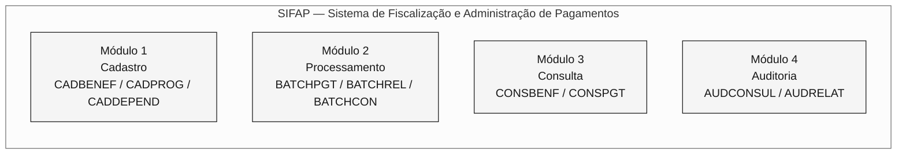
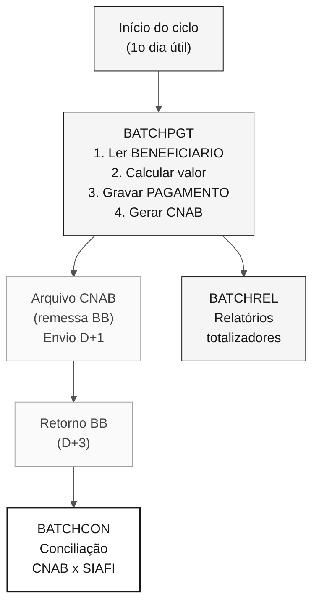
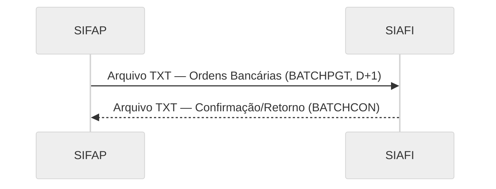
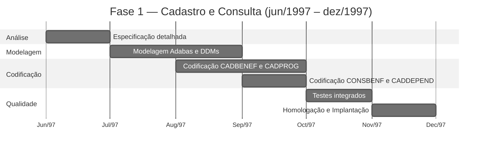
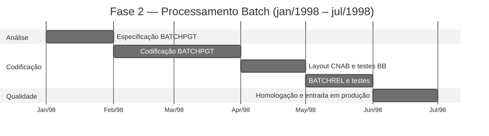

<!-- markdownlint-disable MD013 MD033 MD041 -->

---

title: "Projeto SIFAP - Documento de Arquitetura Técnica"
author: "Roberto Carlos Ferreira - Analista de Sistemas Sênior"
date: "1997-05-20"
version: "1.0.0"
classification: "CONFIDENCIAL"
project: "SIFAP - Sistema de Fiscalização e Administração de Pagamentos"
sponsor: "SUPDE/DESIF - a organização"
client: "SAS/MPAS - Secretaria de Assistência Social"
---

> [!NOTE]
> Este é um documento histórico reconstituído para fins do exercício de arqueologia do workshop SIFAP 2.0. O documento simula a documentação técnica original de 1997 tal como teria sido produzida pela equipe da SUPDE/DESIF. A linguagem de época, os nomes de pessoas e de unidades organizacionais foram preservados intencionalmente. **Este documento não deve ser usado como especificação atual do sistema.** As lacunas e inconsistências registradas nos comentários fazem parte do exercício — elas representam os desafios reais de arqueologia que a equipe deve investigar.

<!-- ====================================================================== -->
<!-- PROJETO SIFAP - DOCUMENTO DE ARQUITETURA TÉCNICA -->
<!-- Versão 1.0.0 - Maio de 1997 -->
<!-- a organização - a federal data processing organization -->
<!-- Superintendência de Desenvolvimento - SUPDE -->
<!-- Divisão de Desenvolvimento de Sistemas Fiscais - DESIF -->
<!-- ====================================================================== -->

# PROJETO SIFAP - DOCUMENTO DE ARQUITETURA TÉCNICA

**SISTEMA DE FISCALIZAÇÃO E ADMINISTRAÇÃO DE PAGAMENTOS**

---

|                      |                                       |
| -------------------- | ------------------------------------- |
| **Documento:**       | ARQ-SIFAP-1997-v1.0                   |
| **Classificação:**   | CONFIDENCIAL                          |
| **Data de emissão:** | 20/05/1997                            |
| **Projeto:**         | SIFAP - Desenvolvimento Inicial       |
| **Prazo previsto:**  | 14 meses (jun/1997 - jul/1998)        |
| **Equipe:**          | 8 analistas/programadores SUPDE/DESIF |
| **Coordenador:**     | Roberto Carlos Ferreira               |
| **Gerência:**        | Antônio Marcos Silva - Gerente SUPDE  |

---

> **Apresentação**
>
> O presente documento descreve a arquitetura técnica proposta para o SIFAP - Sistema de Fiscalização e Administração de Pagamentos, a ser desenvolvido pela equipe da SUPDE/DESIF do a organização, em atendimento à demanda da Secretaria de Assistência Social do Ministério da Previdência e Assistência Social (SAS/MPAS).
>
> O SIFAP substituirá o atual sistema SIPAG/DOS, desenvolvido em Clipper e operado em microcomputadores nas regionais. A migração para plataforma mainframe visa garantir a centralização dos dados, a integridade das informações e a capacidade de processamento adequada ao crescimento previsto dos programas sociais federais.
>
> Este documento foi elaborado durante a fase de projeto, anteriormente ao início da codificação, e representa a **visão arquitetural planejada** para o sistema.

---

## 1. Introdução

### 1.1. Contexto

O Governo Federal, por meio do Ministério da Previdência e Assistência Social, administra diversos programas de transferência de renda para famílias em situação de vulnerabilidade social. Atualmente, o controle desses pagamentos é realizado pelo sistema SIPAG/DOS, uma aplicação desenvolvida em Clipper 5.2 que opera de forma descentralizada nas regionais do a organização.

A descentralização do SIPAG/DOS acarreta os seguintes problemas:

- Impossibilidade de consolidação nacional em tempo hábil;
- Risco de duplicidade de cadastros entre regionais;
- Dificuldade de auditoria e fiscalização;
- Limitação de volume de processamento (máximo de 200.000 registros por regional);
- Ausência de integração com sistemas financeiros federais (SIAFI).

### 1.2. Objetivo do SIFAP

Desenvolver um sistema centralizado, em plataforma mainframe, capaz de:

- Gerenciar cadastro nacional unificado de beneficiários;
- Processar folha de pagamento mensal com volume projetado de até 5 milhões de beneficiários;
- Integrar-se ao SIAFI para conciliação financeira automatizada;
- Prover mecanismos de auditoria e fiscalização;
- Garantir disponibilidade e segurança compatíveis com a criticidade da operação.

### 1.3. Plataforma Tecnológica Escolhida

Após avaliação das alternativas disponíveis na infraestrutura a organização, optou-se pela seguinte plataforma:

| Componente | Produto    | Versão  | Justificativa                                                                                                                 |
| ---------- | ---------- | ------- | ----------------------------------------------------------------------------------------------------------------------------- |
| Linguagem  | Natural    | 4.2.6   | Padrão a organização para desenvolvimento mainframe. Produtividade superior ao COBOL para aplicações de cadastro/consulta. |
| SGBD       | Adabas     | 6.1.4   | SGBD invertido, alto desempenho para consultas por múltiplos descritores. Padrão a organização.                            |
| TP Monitor | Com\*plete | 6.1.2   | Monitor de teleprocessamento para telas 3270. Integrado ao Natural.                                                           |
| Scheduler  | JES2       | MVS/ESA | Subsistema padrão para processamento batch.                                                                                   |
| S.O.       | MVS/ESA    | 5.2.2   | Sistema operacional do mainframe a organização - Regional Brasília.                                                        |

> **Nota:** A escolha do Natural/Adabas segue diretriz técnica da SUPDE (NT-SUPDE-003/1996), que estabelece esta plataforma como padrão para novos sistemas de cadastro e processamento de médio/grande porte.

---

## 2. Arquitetura Modular

### 2.1. Módulos Previstos

O SIFAP será organizado em **4 módulos** funcionais:



#### Módulo 1 - CADASTRO

Responsável pela manutenção dos dados cadastrais de beneficiários, dependentes e programas sociais.

| Programa Previsto | Descrição                                                 | Prioridade |
| ----------------- | --------------------------------------------------------- | ---------- |
| CADBENEF          | Cadastro de beneficiários - inclusão, alteração, exclusão | Fase 1     |
| CADPROG           | Cadastro de programas sociais e parametrização            | Fase 1     |
| CADDEPEND         | Cadastro de dependentes do beneficiário titular           | Fase 1     |

#### Módulo 2 - PROCESSAMENTO

Responsável pelo processamento batch da folha de pagamento e geração de arquivos para integração.

| Programa Previsto | Descrição                                   | Prioridade |
| ----------------- | ------------------------------------------- | ---------- |
| BATCHPGT          | Processamento da folha de pagamento mensal  | Fase 2     |
| BATCHREL          | Geração de relatórios batch (totalizadores) | Fase 2     |
| BATCHCON          | Conciliação financeira com SIAFI            | Fase 3     |

#### Módulo 3 - CONSULTA

Responsável pelas consultas online ao cadastro e aos pagamentos.

| Programa Previsto | Descrição                                         | Prioridade |
| ----------------- | ------------------------------------------------- | ---------- |
| CONSBENF          | Consulta de beneficiários por múltiplos critérios | Fase 1     |
| CONSPGT           | Consulta de pagamentos por beneficiário/período   | Fase 2     |

#### Módulo 4 - AUDITORIA

Responsável pelo registro e consulta de trilhas de auditoria e ocorrências de fiscalização.

| Programa Previsto | Descrição                                           | Prioridade |
| ----------------- | --------------------------------------------------- | ---------- |
| AUDCONSUL         | Consulta de trilha de auditoria por período/usuário | Fase 3     |
| AUDRELAT          | Relatório de ocorrências de auditoria               | Fase 3     |

> **Total previsto:** 11 programas, distribuídos em 3 fases de desenvolvimento.

---

## 3. Modelo de Dados

### 3.1. DDMs Previstos

O SIFAP utilizará **3 DDMs** (Data Definition Modules) no Adabas:

```mermaid
%%{init: {'theme':'neutral','themeVariables':{'fontFamily':'ui-sans-serif, system-ui, sans-serif','primaryColor':'#F5F5F5','primaryTextColor':'#171717','primaryBorderColor':'#171717','lineColor':'#525252','secondaryColor':'#FFFFFF','tertiaryColor':'#FAFAFA','background':'#FFFFFF'}}}%%
erDiagram
    BENEFICIARIO {
        string BN-NR-CPF PK
        string BN-NM-BENEF DE
        date   BN-DT-NASC
        string BN-CD-SIT DE
        string BN-CD-PROG DE
        string BN-NR-NIS
        string BN-CD-REGIAO DE
        int    BN-QT-DEPEND
        decimal BN-VL-RENDA-PC
        date   BN-DT-ULT-ATUAL
        string BN-CD-BANCO
        string BN-CD-AGENCIA
        string BN-NR-CONTA
    }

    PROGRAMA-SOCIAL {
        string PS-CD-PROG PK
        string PS-NM-PROG
        decimal PS-VL-MIN
        decimal PS-VL-MAX
        string PS-IN-ATIVO
        date   PS-DT-INICIO
        date   PS-DT-FIM
        string PS-VL-FAIXAS PE
    }

    PAGAMENTO {
        int    PG-NR-SEQ PK
        string PG-NR-CPF DE
        string PG-CD-PROG DE
        string PG-AA-MM-REF DE
        decimal PG-VL-BRUTO
        decimal PG-VL-LIQ
        date   PG-DT-CRED
        string PG-CD-STATUS DE
        string PG-CD-BANCO
    }

    BENEFICIARIO ||--o{ PAGAMENTO : "gera"
    BENEFICIARIO }o--|| PROGRAMA-SOCIAL : "vinculado a"
```

Legenda: PK = chave primária (super descriptor) · DE = descritor (índice Adabas) · PE = grupo periódico · MU = campo multivalorado

<!-- O DDM AUDITORIA (FNR 153) não constava no projeto original.
 Foi adicionado em 2005, durante a migração para Natural 6.3/Adabas 7.4,
 por demanda do Departamento de Fiscalização (DEFIS).
 Os programas de auditoria (AUDCONSUL, AUDRELAT) previstos neste
 documento foram substituídos pelo programa RELAUDIT em 2005. -->

### 3.2. Convenção de Nomenclatura de Campos

Adotaremos a seguinte convenção para nomes de campos Adabas, em conformidade com o padrão de nomenclatura da SUPDE (NT-SUPDE-007/1995):

| Prefixo | Entidade        |
| ------- | --------------- |
| `BN-`   | Beneficiário    |
| `PS-`   | Programa Social |
| `PG-`   | Pagamento       |

Os sufixos indicam o tipo de dado:

| Sufixo | Significado            | Exemplo        |
| ------ | ---------------------- | -------------- |
| `NM-`  | Nome/descrição         | `BN-NM-BENEF`  |
| `NR-`  | Número/código numérico | `BN-NR-CPF`    |
| `CD-`  | Código/classificação   | `BN-CD-SIT`    |
| `DT-`  | Data                   | `PG-DT-CRED`   |
| `VL-`  | Valor monetário        | `PG-VL-BRUTO`  |
| `QT-`  | Quantidade             | `BN-QT-DEPEND` |
| `IN-`  | Indicador (S/N)        | `PS-IN-ATIVO`  |
| `SG-`  | Sigla                  | (reservado)    |

> **Restrição:** Nomes de campos limitados a 20 caracteres, conforme limitação do Natural 4.2.

### 3.3. Estimativa de Volumetria Inicial

| DDM             | Volume inicial             | Crescimento estimado/ano | Projeção 5 anos |
| --------------- | -------------------------- | ------------------------ | --------------- |
| BENEFICIARIO    | 1.200.000 (migração SIPAG) | 300.000                  | 2.700.000       |
| PROGRAMA-SOCIAL | 15                         | 5                        | 40              |
| PAGAMENTO       | 0 (novo)                   | 14.400.000 (1,2M x 12)   | 72.000.000      |

> **Nota sobre a projeção:** Consideramos crescimento linear de 25% ao ano no cadastro de beneficiários, compatível com a expansão prevista dos programas sociais do Governo Federal. A projeção pode variar em função de novas políticas públicas.

---

## 4. Fluxo de Processamento Batch

### 4.1. Diagrama de Fluxo Planejado



### 4.2. Agendamento Batch Previsto

| Job       | Frequência     | Horário | Janela | Dependência            |
| --------- | -------------- | ------- | ------ | ---------------------- |
| SIFAP-PGT | Mensal (1o DU) | 22:00   | 4h     | Nenhuma                |
| SIFAP-REL | Mensal (2o DU) | 06:00   | 1h     | SIFAP-PGT (RC=0)       |
| SIFAP-CON | Mensal (5o DU) | 22:00   | 2h     | Recebimento retorno BB |

<!-- Na prática, o agendamento divergiu do planejado. O BATCHREL passou a
 ser executado tanto antes (modo prévio, D-1) quanto depois (D+5) do
 BATCHPGT. O BATCHCON foi antecipado para D+4. Além disso, o programa
 VALELEG passou a ser executado em modo batch (D-2), o que não estava
 previsto neste projeto original. -->

### 4.3. Estimativa de Tempo de Processamento

Com base em benchmarks realizados no ambiente de homologação do a organização (mainframe IBM 9672-R36, 256 MB RAM):

| Job       | Volume base          | Tempo estimado | Observação                              |
| --------- | -------------------- | -------------- | --------------------------------------- |
| SIFAP-PGT | 1.200.000 registros  | 1h30min        | Processamento sequencial com I/O Adabas |
| SIFAP-REL | N/A                  | 20min          | Leitura de totalizadores                |
| SIFAP-CON | ~1.200.000 registros | 45min          | Match entre CNAB e PAGAMENTO            |

> **Premissa:** Estes tempos são estimativas baseadas no volume inicial. O crescimento da base de beneficiários implicará aumento proporcional no tempo de processamento. Recomenda-se revisão do dimensionamento quando o volume atingir 2.500.000 registros.

<!-- O volume atingiu 4.200.000 em 2018. O tempo de processamento do BATCHPGT
 chegou a 3h20min (referência fev/2018), com incidente de timeout em
 março/2016 quando processou 4,1M registros. A revisão de dimensionamento
 recomendada neste documento nunca foi realizada formalmente. -->

---

## 5. Integração com SIAFI

### 5.1. Modelo de Integração Previsto

A integração com o SIAFI - Sistema Integrado de Administração Financeira do Governo Federal será realizada conforme o seguinte modelo:



**Formato previsto:** Arquivo texto posicional, layout definido pela STN (Secretaria do Tesouro Nacional), conforme Instrução Normativa STN no 04/1996.

**Meio de transmissão:** Transferência via VTAM/SNA entre mainframes a organização e STN.

**Periodicidade:** Mensal, D+2 após processamento da folha.

### 5.2. Campos do Arquivo de Integração SIAFI

| Posição | Tamanho | Campo                                                | Formato |
| ------- | ------- | ---------------------------------------------------- | ------- |
| 001-002 | 02      | Tipo de registro (01=Header, 02=Detalhe, 99=Trailer) | N       |
| 003-016 | 14      | CPF do beneficiário                                  | N       |
| 017-056 | 40      | Nome do beneficiário                                 | A       |
| 057-069 | 13      | Valor da ordem bancária (11 inteiros + 2 decimais)   | N       |
| 070-077 | 08      | Data de crédito (AAAAMMDD)                           | N       |
| 078-080 | 03      | Código do banco pagador                              | N       |
| 081-084 | 04      | Código da agência                                    | N       |
| 085-094 | 10      | Número da conta                                      | N       |
| 095-100 | 06      | Ano/mês de referência (AAAAMM)                       | N       |
| 101-110 | 10      | Código da ordem bancária SIAFI                       | N       |
| 111-130 | 20      | Reserva para uso futuro                              | A       |

<!-- A integração com o SIAFI não foi implementada conforme este layout.
 Em 2002, quando a integração foi efetivamente realizada (versão 2.5),
 o layout foi redefinido em conjunto com a STN, com campos adicionais
 para hash totalizador e código de programa social. O programa
 BATCHCON implementou a conciliação com base no layout revisado.
 Este documento original não reflete a versão implementada. -->

---

## 6. Segurança e Controle de Acesso

### 6.1. Modelo de Acesso

O controle de acesso ao SIFAP será implementado em dois níveis:

1. **Nível Natural Security:** Controle de acesso à biblioteca SIFAP e seus objetos, gerenciado pelo Natural Security (NATSEC). Perfis definidos:

- OPERADOR: acesso a programas de cadastro e consulta;
- SUPERVISOR: acesso completo, incluindo exclusão e parametrização;
- AUDITOR: acesso somente leitura a todos os módulos + relatórios de auditoria.

1. **Nível Aplicação:** Verificação adicional via GDA (Global Data Area) de sessão, contendo código do usuário, perfil e regional de origem.

### 6.2. Trilha de Auditoria

Toda operação que altere dados no sistema (inclusão, alteração, exclusão) gerará um registro de auditoria contendo:

- Código do usuário;
- Data e hora da operação;
- Programa que originou a operação;
- Tipo de operação (I=Inclusão, A=Alteração, E=Exclusão);
- Identificação do registro afetado;
- Valores anterior e posterior (para alterações).

> **Nota de projeto:** Na fase inicial, os registros de auditoria serão gravados em campos do tipo MU (multiple value) no próprio DDM BENEFICIARIO, utilizando um grupo periódico (PE) para histórico. Esta abordagem simplifica a implementação e evita a criação de um DDM adicional.

<!-- Esta decisão foi revertida em 2005, quando o volume de registros de
 auditoria no PE do DDM BENEFICIARIO causou degradação severa de
 desempenho. Foi então criado o DDM AUDITORIA (FNR 153) como entidade
 separada, e o subprograma LOGAUDIT foi refatorado para gravar neste
 novo DDM. A DBA Cláudia Regina dos Santos conduziu a migração dos
 registros de auditoria existentes para o novo arquivo Adabas. -->

---

## 7. Evolução Prevista

### 7.1. Roadmap de Funcionalidades

A evolução do SIFAP está planejada nas seguintes fases, sujeitas à aprovação e priorização pelo comitê gestor do projeto:

| Fase       | Prazo Previsto | Funcionalidade                                                                                                                                                          | Prioridade  |
| ---------- | -------------- | ----------------------------------------------------------------------------------------------------------------------------------------------------------------------- | ----------- |
| **Fase 1** | Jun-Dez/1997   | Módulos de Cadastro e Consulta (CADBENEF, CADDEPEND, CADPROG, CONSBENF)                                                                                                 | Obrigatória |
| **Fase 2** | Jan-Jul/1998   | Módulo de Processamento Batch (BATCHPGT, BATCHREL)                                                                                                                      | Obrigatória |
| **Fase 3** | Ago-Dez/1998   | Módulo de Auditoria (AUDCONSUL, AUDRELAT) + Conciliação SIAFI (BATCHCON)                                                                                                | Desejável   |
| **Fase 4** | 1o sem/1999    | Módulo de Validação (VALBENEF, VALDOCS) - validação automatizada de cadastro                                                                                            | Desejável   |
| **Fase 5** | 2o sem/1999    | Geração de relatórios gerenciais avançados - gráficos e consolidações                                                                                                   | Opcional    |
| **Fase 6** | 1o sem/2000    | **Módulo Web** - interface de consulta via Intranet para os órgãos gestores (SENARC, SAS). Tecnologia prevista: Natural Web Interface + servidor HTTP a organização. | Opcional    |
| **Fase 7** | 2o sem/2000    | Integração online com Receita Federal para validação de CPF em tempo real                                                                                               | Opcional    |

<!-- Balanço da evolução real (anotação retrospectiva):

 Fase 1: CONCLUÍDA (dez/1997) - conforme planejado, com atraso de 2 meses.

 Fase 2: CONCLUÍDA (jul/1998) - conforme planejado. Entrada em produção
 da v1.0 com os módulos CADBENEF, CADDEPEND, CADPROG, CONSBENF, BATCHPGT,
 BATCHREL.

 Fase 3: PARCIALMENTE CONCLUÍDA (2002/2005) - O BATCHCON foi implementado
 em 2002 (versão 2.5), com layout SIAFI diferente do planejado. Os
 programas de auditoria AUDCONSUL e AUDRELAT NUNCA foram implementados
 conforme projetados. Em 2005, foram substituídos pelo programa RELAUDIT,
 com escopo reduzido.

 Fase 4: CONCLUÍDA COM ALTERAÇÕES (1999/2003) - VALBENEF foi implementado
 em 1999 (Fase 2 da v2.0). VALDOCS foi implementado em 2003 por Patrícia
 Helena Moura. Foi adicionado o programa VALELEG (validação de
 elegibilidade), que NÃO constava no projeto original.

 Fase 5: NUNCA IMPLEMENTADA - A geração de relatórios avançados nunca foi
 desenvolvida. Os relatórios do SIFAP continuam em formato texto 132
 colunas para impressora matricial.

 Fase 6: NUNCA IMPLEMENTADA - O "módulo web" planejado para 2000 nunca
 saiu do papel. A tecnologia Natural Web Interface não foi adotada pelo
 a organização. O acesso ao SIFAP permanece exclusivamente via emulação 3270.

 Fase 7: IMPLEMENTADA DIFERENTEMENTE (2002) - A consulta de CPF na
 Receita Federal foi implementada em 2002, mas via transação CICS e não
 via integração online direta como planejado.

 FUNCIONALIDADES NÃO PREVISTAS:
 - CALCCORR (cálculo de correções/reajustes) - implementado em 2005
 por Marcos Antônio Ferreira durante a migração para Natural 6.3.
 - CALCDSCT (cálculo de descontos) - implementado em 2015 por demanda
 da SENARC. Este módulo NÃO constava em nenhum planejamento anterior.
 - RELPGT (relatório de pagamentos) - implementado em 2003 por Patrícia
 Helena Moura. Substituiu funcionalidade parcial do BATCHREL.
 - DDM AUDITORIA (FNR 153) - criado em 2005. O projeto original previa
 auditoria como PE no DDM BENEFICIARIO.
 - Integração CadÚnico - implementada emergencialmente em 2006, sem
 programa catalogado no inventário oficial. -->

### 7.2. Premissas para Evolução

- Manutenção de equipe de pelo menos 4 analistas/programadores Natural dedicados ao SIFAP;
- Disponibilidade de ambiente de homologação no mainframe a organização;
- Apoio do comitê gestor SAS/MPAS para definição de requisitos;
- Estabilidade da plataforma Natural/Adabas no a organização (sem previsão de descontinuação);
- Orçamento para aquisição de licenças Natural Web Interface (Fase 6).

### 7.3. Considerações sobre o Módulo Web (Fase 6)

O módulo web previsto para o 1o semestre de 2000 utilizará a tecnologia **Natural Web Interface** (NWI), que permite a exposição de telas Natural como páginas HTML acessíveis via navegador web. Esta tecnologia está em fase de avaliação pelo a organização e deverá ser homologada até o final de 1998.

A interface web do SIFAP permitirá:

- Consulta de beneficiários por CPF, NIS ou nome (equivalente ao CONSBENF);
- Consulta de pagamentos por período;
- Emissão de extratos para os órgãos gestores;
- Acesso via Intranet a organização (rede INFOVIA do Governo Federal).

> **Observação:** A viabilidade técnica do NWI depende de homologação pelo Comitê de Arquitetura do a organização. Caso o NWI não seja aprovado, avaliar alternativa com **Entire X** (middleware Natural-HTTP) ou desenvolvimento de front-end separado em Java/Servlet com acesso ao Adabas via JDBC.

---

## 8. Cronograma de Desenvolvimento

### 8.1. Fase 1 - Cadastro e Consulta



### 8.2. Fase 2 - Processamento Batch



---

## 9. Equipe do Projeto

| Nome                          | Função no Projeto                      | Lotação     |
| ----------------------------- | -------------------------------------- | ----------- |
| Roberto Carlos Ferreira       | Coordenador Técnico / Arquiteto        | SUPDE/DESIF |
| Maria Helena Costa            | Coordenadora DESIF / Sponsor técnico   | SUPDE/DESIF |
| José Aparecido Lima           | Programador Natural - Módulo Batch     | SUPDE/DESIF |
| Fernanda Cristina de Oliveira | Analista de Negócios / Especificação   | SUPDE/DESIF |
| Cláudia Regina dos Santos     | DBA Adabas - Modelagem de dados        | SUPDE/DESIF |
| Antônio Carlos Ribeiro        | Analista de Suporte - Infraestrutura   | SUPDE/DESIF |
| Mário Sérgio Andrade          | Programador Natural - Módulo Cadastro  | SUPDE/DESIF |
| Sandra Lúcia Pereira          | Programadora Natural - Módulo Consulta | SUPDE/DESIF |

> **Observação:** Mário Sérgio Andrade e Sandra Lúcia Pereira foram desligados do projeto em dezembro de 1997 por remanejamento interno. Suas atividades foram absorvidas pelos demais membros da equipe, contribuindo para o atraso de 4 meses no prazo original do projeto (14 meses previstos → 18 meses realizados).

---

## 10. Riscos Identificados

| #   | Risco                                                            | Probabilidade | Impacto | Mitigação                                        |
| --- | ---------------------------------------------------------------- | ------------- | ------- | ------------------------------------------------ |
| R1  | Atraso na migração dos dados do SIPAG/DOS                        | Alta          | Alto    | Iniciar mapeamento de dados em paralelo à Fase 1 |
| R2  | Indisponibilidade do ambiente de homologação                     | Média         | Alto    | Solicitar ambiente dedicado à SUPDE              |
| R3  | Alteração de requisitos pela SAS/MPAS durante o desenvolvimento  | Alta          | Médio   | Congelar requisitos por fase                     |
| R4  | Saída de membros da equipe por remanejamento                     | Média         | Alto    | Documentar e compartilhar conhecimento           |
| R5  | Limitação de desempenho Adabas com volumes acima de 2M registros | Baixa         | Alto    | Monitorar e otimizar descritores                 |
| R6  | Descontinuação do Natural/Adabas pelo a organização           | Baixa         | Crítico | Acompanhar diretrizes técnicas da SUPDE          |

> **Nota sobre R4:** Este risco se materializou parcialmente com a saída de Mário Sérgio e Sandra Lúcia em dezembro/1997. A mitigação por documentação e compartilhamento de conhecimento foi parcialmente executada, porém a prática não foi mantida ao longo da vida do sistema.

---

## 11. Aprovações

Este documento foi revisado e aprovado para início do desenvolvimento conforme assinaturas abaixo:

---

**Roberto Carlos Ferreira**
Analista de Sistemas Sênior - SUPDE/DESIF
Coordenador Técnico do Projeto SIFAP
Brasília, 20 de maio de 1997

---

**Maria Helena Costa**
Coordenadora - DESIF/SUPDE
Brasília, 22 de maio de 1997

---

**Antônio Marcos Silva**
Gerente - SUPDE
Superintendência de Desenvolvimento
Brasília, 26 de maio de 1997

---

## Anexo A - Glossário do Projeto

| Termo      | Definição                                                                               |
| ---------- | --------------------------------------------------------------------------------------- |
| Adabas     | Adaptable Database System - SGBD da Software AG utilizado no mainframe a organização |
| CNAB       | Centro Nacional de Automação Bancária - padrão de arquivo para transações bancárias     |
| Com\*plete | Monitor de teleprocessamento da Software AG para telas 3270                             |
| DDM        | Data Definition Module - definição lógica de acesso a arquivo Adabas no Natural         |
| DE         | Descritor - campo indexado no Adabas, utilizado como critério de busca                  |
| FDT        | Field Definition Table - definição física dos campos de um arquivo Adabas               |
| FNR        | File Number - número que identifica um arquivo no Adabas                                |
| GDA        | Global Data Area - área de dados compartilhada entre programas Natural na sessão        |
| INFOVIA    | Rede de comunicação de dados do Governo Federal                                         |
| JES2       | Job Entry Subsystem - subsistema de gerenciamento de jobs batch no MVS                  |
| LDA        | Local Data Area - área de dados local de um programa Natural                            |
| MU         | Multiple Value - campo que pode conter múltiplos valores no Adabas                      |
| Natural    | Linguagem de programação 4GL da Software AG para ambiente mainframe                     |
| NWI        | Natural Web Interface - tecnologia para exposição de telas Natural como HTML            |
| PE         | Periodic Group - grupo de campos que se repete no Adabas (histórico)                    |
| SIAFI      | Sistema Integrado de Administração Financeira do Governo Federal                        |
| SIPAG/DOS  | Sistema de Pagamentos - aplicação Clipper anterior ao SIFAP                             |
| SNA        | Systems Network Arquitetura - protocolo de comunicação IBM                             |
| STN        | Secretaria do Tesouro Nacional                                                          |
| VTAM       | Virtual Telecommunications Access Method - software de comunicação IBM                  |

---

**a organização - a federal data processing organization**
**Documento Confidencial**
**Reprodução e distribuição restritas ao âmbito do projeto SIFAP**

---

[Voltar ao cenário legado](../README.md)
