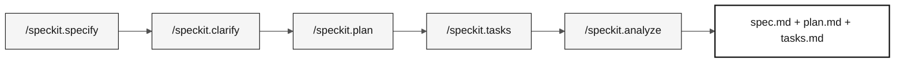

<!-- markdownlint-disable MD013 MD033 MD041 -->

# Estágio 2 — Especificação (60 min)

> **Trilha:** [Kit do Time](../README.md) › [Estágio 2](README.md) › **GUIDE**

**Este guia conduz o Par 2 passo a passo na criação dos artefatos do Spec-Kit: requisitos EARS rastreáveis, plano técnico e tarefas implementáveis, do início até a passagem de bastão H2.**

  

| Campo | Valor |
|---|---|
| **Público-alvo** | Par 2 (Enterprise Architect + Software Architect); Par 1 valida recorte; Par 5 revisa clareza |
| **Pré-requisitos** | Passagem de bastão H1 aceita; programas `.NSN` e DDMs do legado lidos |
| **Tempo estimado** | 60 min |
| **Estágio** | Estágio 2 — Especificação |
| **Resultado esperado** | `specs/<NNN>-<feature>/spec.md`, `plan.md` e `tasks.md` com rastreabilidade completa |

---

## Conceito: Spec-Driven Development

Spec-Driven Development (SDD) é a prática de escrever a especificação da funcionalidade — requisitos, plano técnico e tarefas — antes de escrever qualquer linha de código. O objetivo é garantir que todos no time entendam o que precisa ser construído, por que, e como verificar se foi feito corretamente.

No contexto do SIFAP, isso significa: antes de criar o endpoint de cálculo de benefício, o time documenta exatamente qual regra do programa `.NSN` original está sendo modernizada, quais são os critérios de aceite e quais testes vão validar o comportamento.

O GitHub Spec-Kit automatiza esse fluxo com slash commands dentro do Copilot Chat.

### Fluxo do Spec-Kit



---

## Regra de localização dos artefatos

Os entregáveis formais do GitHub Spec-Kit vivem exclusivamente em:

```text
specs/<NNN>-<feature>/
├── spec.md
├── plan.md
└── tasks.md
```

`spec.md` contém os requisitos EARS; `plan.md` registra o plano técnico; e `tasks.md` ordena o trabalho implementável. Não crie arquivos paralelos com nomes legados em `02-spec-moderna/`.

`02-spec-moderna/` é material de apoio ao estágio: seus templates e [`scope-decisions.md`](scope-decisions.md) registram decisões de escopo, trade-offs e referências para a conversa. Eles não substituem os três artefatos formais da feature.

> [!CAUTION]
> **HARD GATE de rastreabilidade.** Antes de redigir qualquer requisito EARS, leia o programa ou DDM que o fundamenta. Toda REQ-ID em `specs/<NNN>-<feature>/spec.md` precisa de uma linha `source_legacy:` apontando para `01-arqueologia/legado-sifap/.../*.NSN` ou `*.ddm`. Uma capacidade sem paralelo no legado usa `[GREENFIELD]` com justificativa. Sem isso, o CI rejeita o PR.

---

## Conceito: Notação EARS

EARS (Easy Approach to Requirements Syntax) é uma notação estruturada para escrever requisitos de software de forma inequívoca. Cada requisito começa com uma palavra-chave que classifica o tipo de comportamento.

**Por que importa:** requisitos em linguagem natural são ambíguos. "O sistema deve calcular o benefício" não diz quando, para quem, nem o que acontece se falhar. A notação EARS elimina essa ambiguidade.

**Os 5 padrões EARS:**

| Padrão | Palavra-chave | Estrutura | Exemplo SIFAP |
|---|---|---|---|
| **Ubíquo** | (nenhuma) | O `<sistema>` deve `<ação>`. | O sistema deve registrar data e hora em toda alteração de benefício. |
| **Orientado a evento** | When | Quando `<evento>`, o `<sistema>` deve `<ação>`. | Quando o pagamento for processado, o sistema deve emitir recibo. |
| **Orientado a estado** | While | Enquanto `<estado>`, o `<sistema>` deve `<ação>`. | Enquanto o beneficiário estiver com status suspenso, o sistema deve bloquear pagamentos. |
| **Comportamento indesejado** | If / Then | Se `<condição>`, então o `<sistema>` deve `<ação de tratamento>`. | Se o CPF informado não existir na base, então o sistema deve retornar HTTP 422 com mensagem de erro. |
| **Feature opcional** | Where | Onde `<feature estiver ativa>`, o `<sistema>` deve `<ação>`. | Onde a auditoria avançada estiver habilitada, o sistema deve registrar o IP de cada acesso. |

**REQ-ID:** cada requisito recebe um identificador único no formato `REQ-NNN` (ex.: `REQ-001`). Esse ID é usado em commits (`Implements REQ-001`), PRs e testes para rastrear o comportamento do código até a especificação.

---

## Conceito: ADR (Architecture Decision Record)

Um ADR é um documento curto que registra uma decisão arquitetural — a opção escolhida, as alternativas consideradas e a justificativa. O ADR não é burocracia: é memória institucional. Sem ele, daqui a seis meses ninguém vai lembrar por que PostgreSQL foi escolhido em vez de MongoDB.

**Quando criar um ADR no Estágio 2:** somente quando uma decisão bloquear o `plan.md`. Use o template em [`templates/ADR.template.md`](templates/ADR.template.md) ou execute `/generate-adr` no Copilot Chat.

**Erro comum:** criar ADRs para decisões óbvias ou já documentadas em outra fonte. Se a decisão cabe em um comentário de commit, não precisa de ADR.

---

## Conceito: Bounded Context

Bounded context é um limite explícito dentro do qual um modelo de domínio é válido e consistente. É o conceito central do Domain-Driven Design que permite dividir um sistema grande em partes menores e coesas.

**No SIFAP:** o módulo de pagamentos tem suas próprias regras, entidades e vocabulário. O módulo de fiscalização tem os seus. Quando os dois precisam se comunicar, fazem isso através de uma interface bem definida — não compartilhando tabelas ou objetos internos.

**Para o workshop:** use `/carve-bounded-contexts` no Copilot Chat e preencha o template em [`templates/bounded-contexts.template.md`](templates/bounded-contexts.template.md) como referência para o `plan.md`.

---

## Roteiro cronometrado

| Horário | Atividade | Saída |
|---|---|---|
| 14:00–14:05 | Confirme a evidência da passagem de bastão H1 e escolha uma feature fina. | Nome `NNN-<feature>` e recorte aprovado pelo PO. |
| 14:05–14:25 | Execute `/speckit.specify` e `/speckit.clarify`. | `specs/<NNN>-<feature>/spec.md` com requisitos rastreáveis. |
| 14:25–14:40 | Execute `/speckit.plan`. | `plan.md` com decisões e riscos necessários para implementar. |
| 14:40–14:50 | Execute `/speckit.tasks`. | `tasks.md` priorizado, incluindo testes de regra de negócio. |
| 14:50–14:55 | Execute `/speckit.analyze` e corrija lacunas bloqueantes. | Referências e artefatos consistentes. |
| 14:55–15:00 | Faça a passagem de bastão H2. | Escopo, arquivos formais e primeira tarefa para os Pares 3 e 4. |

> [!WARNING]
> Se uma etapa consumir o tempo disponível, reduza a feature. Não preencha requisitos, contratos, arquitetura ou critérios de aceite por suposição.

---

## Passo a passo

- [ ] **Confirmar evidências.** Releia as descobertas registradas no Estágio 1 antes de escolher a feature.
- [ ] **Nomear a pasta.** Crie `specs/<NNN>-<feature>/` com nome que reflita o comportamento, não a solução técnica.
- [ ] **Executar `/speckit.specify`.** Gere o `spec.md` com REQ-IDs, padrão EARS e `source_legacy:`.
- [ ] **Executar `/speckit.clarify`.** Resolva ambiguidades antes de planejar.
- [ ] **Executar `/speckit.plan`.** Documente arquitetura, dados, riscos e contratos em `plan.md`.
- [ ] **Executar `/speckit.tasks`.** Quebre o plano em tarefas pequenas com testes em `tasks.md`.
- [ ] **Executar `/speckit.analyze`.** Corrija lacunas entre spec, plan e tasks.
- [ ] **Registrar decisões de escopo.** Preencha [`scope-decisions.md`](scope-decisions.md) com o que foi selecionado, adiado ou marcado greenfield.
- [ ] **Conduzir passagem de bastão H2.** Apresente ao vivo para os Pares 3 e 4 (ver abaixo).

---

## Apoio e decisões de escopo

- Registre em [`scope-decisions.md`](scope-decisions.md) o que foi selecionado, adiado ou marcado greenfield, ligando a decisão à pasta em `specs/`.
- Use [`ADR-TEMPLATE.md`](ADR-TEMPLATE.md) apenas para uma decisão que bloqueie o plano. Não há meta de quantidade de ADRs no estágio.
- Um esboço de contexto ou diagrama pode apoiar a conversa, mas C4 L1/L2/L3 e uma arquitetura completa não são pré-requisitos da passagem H2. O racional técnico necessário fica no `plan.md`.

---

## Passagem de bastão H2

O Par 2 apresenta ao vivo para os Pares 3 e 4:

1. O caminho da pasta `specs/<NNN>-<feature>/`.
2. A feature escolhida, os requisitos e seus `source_legacy:`.
3. A primeira tarefa que pode ser implementada e os testes esperados.
4. Riscos, decisões de escopo e dúvidas que ainda precisam de resposta.

---

## Critérios de conclusão

- [ ] Uma feature pequena tem `spec.md`, `plan.md` e `tasks.md` em `specs/<NNN>-<feature>/`.
- [ ] Cada requisito tem `source_legacy:` válido ou `[GREENFIELD]` justificado.
- [ ] `tasks.md` inclui testes junto da implementação de regras de negócio.
- [ ] As decisões de escopo estão registradas em `02-spec-moderna/`.
- [ ] O PO confirmou o recorte e a passagem H2 ocorreu até 15:00.

---

## Erros comuns e como evitar

| Sintoma | Causa | Correção |
|---|---|---|
| `source_legacy:` ausente no `spec.md` | Requisito escrito sem consultar o legado | Releia o programa `.NSN` correspondente antes de escrever a EARS |
| `spec.md` com requisitos vagos ("o sistema deve funcionar corretamente") | Não usou a notação EARS | Reescreva com um dos 5 padrões EARS |
| `plan.md` vazio ou copiado de outro projeto | Plano feito por suposição | Execute `/speckit.plan` com o contexto real da feature |
| ADR criado para toda decisão | Confusão entre ADR e comentário de código | Reserve ADRs para decisões que bloqueariam o plano sem registro |
| CI rejeita o PR | `source_legacy:` ausente ou inválido | Corrija o caminho para o arquivo `.NSN` ou `.ddm` correspondente |

---

## Referências

- [Cartão de referência do Spec-Kit](../09-cheat-sheets/spec-kit-workflow.md)
- [Notação EARS](../07-conceitos/05-notacao-ears.md)
- [Architecture Decision Records](../07-conceitos/06-architecture-decision-records.md)
- [Spec-Kit oficial](https://github.com/github/spec-kit)
- [Legado SIFAP](../01-arqueologia/legado-sifap/)

---

### Continuar a leitura

| Anterior | Próximo |
|---|---|
| [Estágio 1 — Arqueologia](../01-arqueologia/README.md)<br/><sub>Resumo da arqueologia e links para o GUIDE detalhado.</sub> | [Estágio 3 — Implementação](../03-implementacao/GUIDE.md)<br/><sub>15:00–16:10 · Java 21 + Spring Boot + Next.js, com testes.</sub> |

<sub>[Voltar ao índice do kit](../README.md)</sub>
