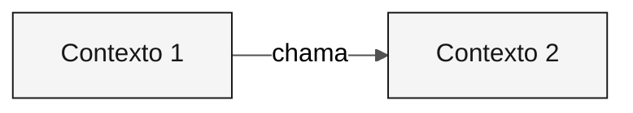

<!-- markdownlint-disable MD013 MD033 MD041 -->

---
title: "Modelo: Bounded Contexts"
description: "Esqueleto para definições de bounded contexts via /carve-bounded-contexts"
author: "Paula Silva, AI-Native Software Engineer, Americas Global Black Belt at Microsoft"
date: "2026-04-29"
version: "1.0.0"
status: "approved"
tags: ["template", "bounded-contexts", "architect", "stage-2"]
---

<!-- Como usar: execute /carve-bounded-contexts. Clone o bloco de contexto para cada um. -->

# Mapa de Bounded Contexts

 

> **Trilha:** [Kit do Time](../../README.md) › [Estágio 2](../README.md) › Templates › **bounded-contexts**

> [!NOTE]
> Este arquivo é um TEMPLATE. Copie para o repositório do seu time e preencha com os dados reais. Não edite o original.

---

## Conceito: Bounded Context

Um bounded context é um limite explícito dentro do qual um modelo de domínio é válido e consistente. O termo vem do Domain-Driven Design (DDD) e é a base para definir os módulos de um Modular Monolith.

**Por que importa:** no SIFAP, o módulo de pagamentos usa o termo "beneficiário" de uma forma; o módulo de fiscalização pode usar o mesmo termo com regras diferentes. Definir os bounded contexts evita que um único modelo seja distorcido para atender a todos os contextos ao mesmo tempo, o que leva a acoplamento indesejado e dificuldade de evolução.

**Modular Monolith:** arquitetura onde os bounded contexts são módulos Java independentes dentro de uma única JVM. Cada módulo tem suas próprias camadas (`domain/`, `application/`, `infrastructure/`) e se comunica com os demais apenas por interfaces públicas definidas.

**Strangler Fig:** padrão de migração incremental em que o sistema moderno cresce ao redor do legado, substituindo funcionalidades uma a uma. O SIFAP 2.0 não precisa substituir tudo de uma vez: cada bounded context pode ser modernizado de forma independente.

---

## Avaliações de hipóteses

### <!-- placeholder: Nome --> — <!-- placeholder: ACEITO / REJEITADO -->

| Critério | Avaliação | Evidência |
|---|---|---|
| Coesão | <!-- placeholder --> | <!-- placeholder --> |
| Acoplamento | <!-- placeholder --> | <!-- placeholder --> |
| Frequência de mudança | <!-- placeholder --> | <!-- placeholder --> |

---

## Bounded contexts finais

### <!-- placeholder: Nome do Contexto -->

| Campo | Valor |
|---|---|
| **Responsabilidade** | <!-- placeholder --> |
| **Dados sob ownership** | <!-- placeholder --> |
| **Interface pública** | <!-- placeholder --> |
| **Por que é seu próprio contexto** | <!-- placeholder --> |

---

## Comunicação entre contextos

| De | Para | Mecanismo | Dados |
|---|---|---|---|
| <!-- placeholder --> | <!-- placeholder --> | <!-- placeholder --> | <!-- placeholder --> |

---

> [!IMPORTANT]
> Definição de Pronto: hipóteses avaliadas, rejeições documentadas, 2 a 5 contextos nomeados, diagrama Mermaid renderiza sem erros.

---

### Continuar a leitura

| Anterior | Próximo |
|---|---|
| [GUIDE do Estágio 2](../GUIDE.md) Passo a passo. | [ADR Template](ADR.template.md) Template de ADR. |

[Voltar ao índice do kit](../../README.md)
