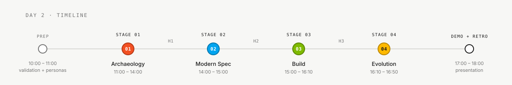
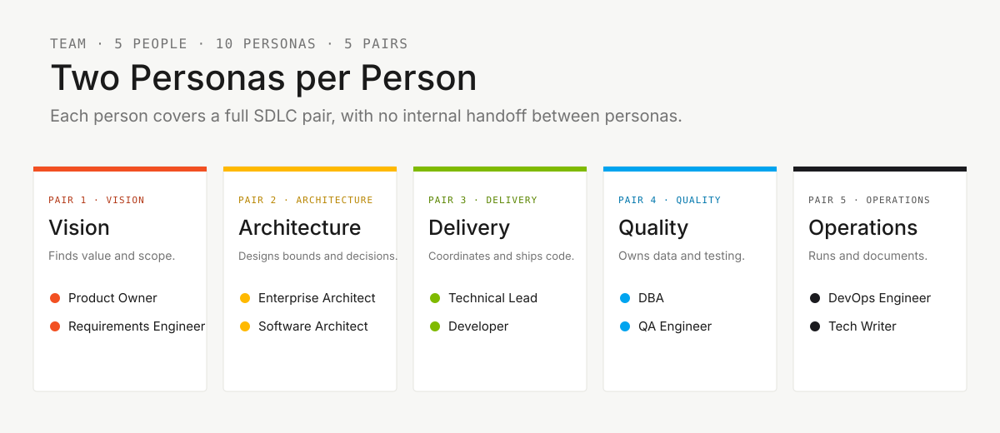

<!-- markdownlint-disable MD013 MD033 MD041 -->

# Estágio 3 — Implementação

> **Trilha:** [Kit do Time](../README.md) › **Estágio 3 — Implementação**

**Neste estágio, os Pares 3 e 4 constroem do zero o protótipo do SIFAP 2.0: backend Java 21 + Spring Boot 3.3, frontend Next.js 15, PostgreSQL 16 — guiados pelas REQ-IDs do Estágio 2.**

  

| Campo | Valor |
|---|---|
| **Público-alvo** | Pares 3 (TL+Dev) e 4 (DBA+QA); Par 5 esqueleta o CI |
| **Pré-requisitos** | Passagem de bastão H2 aceita; `spec.md`, `plan.md` e `tasks.md` prontos |
| **Tempo estimado** | 70 min (15:00–16:10) |
| **Estágio** | Estágio 3 — Implementação |
| **Resultado esperado** | Protótipo funcional com endpoint + testes + migração rastreados a REQ-IDs |

---

## Onde isso encaixa no fluxo do dia

## Quem trabalha aqui

## Conteúdo desta pasta

| Arquivo | Propósito |
|---|---|
| [`GUIDE.md`](GUIDE.md) | Guia passo a passo do estágio |

---

### Continuar a leitura

| Anterior | Próximo |
|---|---|
| [Estágio 2 — Especificação](../02-spec-moderna/README.md) Resumo da spec moderna e links para templates ADR. | [Estágio 3 — GUIDE](GUIDE.md) 15:00–16:10 · Java 21 + Spring Boot + Next.js, com testes. |

[Voltar ao índice do kit](../README.md)
