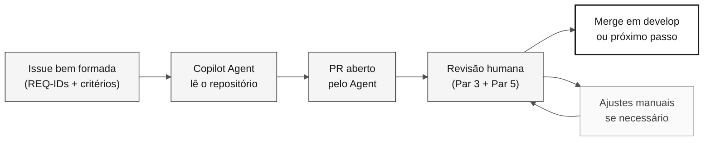

<!-- markdownlint-disable MD013 MD033 MD041 -->

# Estágio 4 — Evolução com Agentes (40 min)

> **Trilha:** [Kit do Time](../README.md) › [Estágio 4](README.md) › **GUIDE**

**Este guia conduz o Par 5 na experimentação do modo Agent do GitHub Copilot: escrever uma Issue bem formada, delegar ao Agent, revisar o PR resultante e registrar evidência honesta do que funcionou.**

  

| Campo | Valor |
|---|---|
| **Público-alvo** | Par 5 (DevOps + Tech Writer) lidera; Par 3 co-lidera a revisão técnica |
| **Pré-requisitos** | Passagem de bastão H3 recebida; protótipo funcional do Estágio 3; build conhecido |
| **Tempo estimado** | 40 min |
| **Estágio** | Estágio 4 — Evolução |
| **Resultado esperado** | Issue criada, delegação registrada, relatório de experiência preenchido |

> [!NOTE]
> Horário oficial: 16:10–16:50 em [`00-TEAM-FLOW.md`](../00-TEAM-FLOW.md). O Par 5 lidera e o Par 3 co-lidera a revisão técnica.

---

## Conceito: modo Agent do GitHub Copilot

O modo Agent do GitHub Copilot é uma forma de delegação autônoma: você fornece uma Issue com contexto suficiente e o Agent lê o repositório, escreve código, cria testes e abre um pull request.

**Por que importa:** o Agent não inventa requisitos — ele lê o que você escreveu na Issue e no `spec.md`. Se a Issue for vaga, o PR será vago. Se a Issue for precisa, o PR terá chance de ser aprovado sem grandes ajustes.

**Diferença entre os modos do Copilot:**

| Modo | Quando usar | Controle humano |
|---|---|---|
| **Ask** | Perguntas, explicações, consultas pontuais | Total |
| **Plan** | Planejar uma mudança antes de executar | Alto |
| **Agent** | Delegar uma tarefa bem definida com autonomia | Revisão pós-execução |

**Ciclo Issue → Agent → PR → Review:**

---

## Conceito: IaC com Terraform e CI/CD com GitHub Actions

**Terraform** é a ferramenta de infraestrutura como código (IaC) usada neste workshop. Com ele, você descreve os recursos Azure (App Service, PostgreSQL, Key Vault) em arquivos `.tf` e o Terraform os cria de forma repetível e auditável.

> [!CAUTION]
> Nunca execute `terraform apply` durante o workshop. Valide com `terraform plan` e documente o resultado. A aplicação real de infraestrutura ocorre fora do escopo do workshop.

**GitHub Actions** é o motor de CI/CD. Um pipeline bem configurado valida cada PR automaticamente: compila, testa, verifica rastreabilidade (`source_legacy:` presente) e opcionalmente faz deploy.

---

## Objetivo

Experimentar uma única delegação pequena e deixar evidência honesta do resultado. O estágio não promete que um Agent abrirá PR, que Terraform será criado, nem que haverá merge antes da demo.

---

## Roteiro cronometrado

| Horário | Atividade | Resultado |
|---|---|---|
| 16:10–16:15 | Receba a passagem de bastão H3, confirme o build e escolha uma pendência pequena. | Recorte seguro para delegar ou registrar no backlog. |
| 16:15–16:25 | Escreva uma Issue com contexto, REQ-IDs, caminho da feature, critérios verificáveis, fora de escopo e forma de teste. | Issue criada ou rascunho pronto para criação. |
| 16:25–16:35 | Delegue ao Copilot Agent, se disponível, e acompanhe o estado inicial. | Delegação registrada; sem aguardar implementação completa. |
| 16:35–16:45 | Se houver PR, faça revisão humana; caso contrário, registre o estado e prepare a revisão para depois do workshop. | Comentários de revisão ou próximo passo explícito. |
| 16:45–16:50 | Atualize o relatório de experiência e informe o time para a demo. | Relato factual do que funcionou, falhou ou ficou pendente. |

Use [`../.github/prompts/stage-evolution-write-github-issue.prompt.md`](../.github/prompts/stage-evolution-write-github-issue.prompt.md) como checklist de elaboração. Não peça que o Agent invente requisitos, arquitetura, fontes legadas ou critérios de aceite ausentes.

---

## Passo a passo

- [ ] **Receber a passagem de bastão H3.** Confirme o estado do build e identifique uma pendência pequena e bem delimitada.
- [ ] **Escrever a Issue.** Use o checklist do prompt em `.github/prompts/stage-evolution-write-github-issue.prompt.md`.
- [ ] **Verificar que a Issue tem:** REQ-IDs com `source_legacy:` existentes no `spec.md`, critérios de aceite verificáveis, escopo limitado e forma de teste.
- [ ] **Delegar ao Copilot Agent.** Registre o horário de início e acompanhe o estado inicial.
- [ ] **Revisar o PR** se disponível, seguindo os critérios abaixo.
- [ ] **Registrar o resultado** no relatório de experiência — independente do desfecho.
- [ ] **Informar o time** sobre o estado para a demo.

---

## Limites de escopo

> [!IMPORTANT]
> Estes limites existem para garantir que o workshop termine com evidência real, não com promessas.

- A Issue referencia `specs/<NNN>-<feature>/spec.md`, `plan.md` e `tasks.md` quando a pendência vier de uma feature especificada.
- Toda branch `impl/<NNN>-<feature>` parte de `develop` e abre PR para `develop`; não há branch `stage`.
- Revise qualquer PR de Agent como um PR humano. Não faça merge automático.
- CI/CD e Terraform são opcionais neste intervalo: valide ou documente o que já existe; não crie infraestrutura apenas para cumprir uma meta.

> [!CAUTION]
> Nunca execute `terraform apply` durante o workshop.

---

## Revisão rápida de PR

Antes de aprovar um PR gerado pelo Agent, confirme:

- [ ] O escopo continua limitado à Issue e aos REQ-IDs referenciados.
- [ ] Os requisitos e `source_legacy:` referenciados já existem no `spec.md`.
- [ ] Testes, validação de entrada e documentação foram tratados quando aplicáveis.
- [ ] Não há segredo, dependência sem decisão ou alteração fora de escopo.
- [ ] O PR aponta para `develop` e recebeu revisão de um par.

---

## Critérios de conclusão

- [ ] Uma Issue pequena foi criada ou deixou rascunho revisável.
- [ ] O resultado da delegação (PR, execução em andamento, falha ou indisponível) foi registrado sem promessas.
- [ ] Um PR disponível recebeu revisão humana; sem PR, há próximo passo registrado.
- [ ] O relatório de experiência foi preenchido.
- [ ] A situação de CI/IaC foi comunicada para a demo, sem `terraform apply`.

---

## Referências

- [Relatório de experiência do time](agent-experience-report.md)
- [Template do relatório](templates/agent-experience-report.template.md)
- [Agente de estágio @evolution](../06-agentes-de-estagio/04-evolution/README.md)
- [Cheat sheet: 3 modos do Copilot](../09-cheat-sheets/copilot-3-modes.md)

---

### Continuar a leitura

| Anterior | Próximo |
|---|---|
| [Estágio 3 — Implementação](../03-implementacao/GUIDE.md) 15:00–16:10 · Java 21 + Spring Boot + Next.js, com testes. | [Relatório de experiência](agent-experience-report.md) Preencha ao final do estágio. |

[Voltar ao índice do kit](../README.md)
