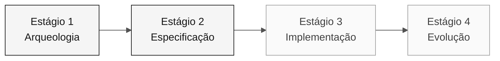

<!-- markdownlint-disable MD013 MD033 MD041 -->

# Persona — Product Owner

> **Trilha:** [Kit do Time](../../README.md) › [Personas](../OVERVIEW.md) › [Product Owner](README.md) › **PERSONA**

**Ficha completa da persona Product Owner.** Define missão, responsabilidades por estágio, ferramentas, passagem de bastão e rubricas de avaliação.

| Campo | Valor |
|---|---|
| **Papel** | Product Owner |
| **Par** | 1 · Visão (junto com Requirements Engineer) |
| **Estágios de atuação** | Lidera 1 (priorização) e 2 (sign-off de escopo); apoia 3 e 4 |
| **Artefatos que produz** | Glossário, lista priorizada, seção de Escopo/Não-Escopo, issues para o Agent |
| **Artefatos que consome** | Catálogo de regras (Arqueologia), mapa de integrações (EA) |
| **Handoff para** | Par 2 (Arquitetura) no Estágio 1; Par 3 (Implementação) via aprovação de escopo |

 

---

## Conceito

O Product Owner é o papel responsável por traduzir necessidades de negócio em escopo executável. Na indústria de software, o PO define o "por quê" — qual problema o produto resolve — e decide o que entra ou fica fora de cada ciclo de entrega.

Numa modernização de legado como o SIFAP, esse papel é ainda mais crítico. Sistemas com 29 anos acumulam regras implícitas que só fazem sentido quando alguém sabe o histórico. O PO é quem conecta cada decisão técnica à evidência e às prioridades confirmadas. Sem esse papel ativo, o time corre o risco de modernizar código que não importa para o negócio.

**Exemplo concreto no SIFAP:** o programa `SIFAP001.NSN` contém lógica de cálculo de benefícios rurais. O PO decide se a regra de arredondamento do cálculo entra no escopo da primeira versão ou vai para backlog — baseado em impacto real, não em preferência técnica.

---

## Onde você atua no SDLC

- **Recebe de:** ninguém — você abre o ciclo
- **Faz passagem de bastão para:** Par 2 (Arquitetura) no Estágio 1; Par 3 (Implementação) via aprovação de escopo

---

## Responsabilidades por estágio

| **Estágio** | Você faz isso | Entregável que depende de você |
|---|---|---|
| **1 · Arqueologia** | Lidera a construção do glossário e a captura dos "porquês" das regras. Mantém lista de perguntas de negócio em aberto. | Glossário + lista priorizada de pontos a esclarecer |
| **2 · Especificação** | Decide o que entra no v1 e o que vira backlog. Voto final no escopo. | Seção de "Escopo e Não-Escopo" da spec |
| **3 · Implementação** | Valida que as user stories ainda refletem o negócio enquanto o código emerge. Desbloqueia dúvidas funcionais. | Critérios de aceitação funcional por funcionalidade |
| **4 · Evolução** | Escreve as duas issues que o Agent vai consumir. Valida que o PR entregue resolve a necessidade de negócio. | Duas issues bem escritas em `.github/ISSUE_TEMPLATE/` |

---

## Kit da persona

| **Artefato** | Finalidade |
|---|---|
| `.github/agents/product-owner.agent.md` | Agente Copilot configurado para spec, backlog e aceite |
| `/spec` — `persona-product-owner-spec.prompt.md` | Escreve seção de `specs/<NNN>-<feature>/spec.md` a partir de user stories em EARS |
| `/update-spec` — `persona-product-owner-update-spec.prompt.md` | Atualiza a spec quando uma feature muda |
| `/acceptance-check` — `persona-product-owner-acceptance-check.prompt.md` | Verifica se o código atende aos critérios de aceite |

---

## Ferramentas e primitivas

- **Copilot Chat** para refinar user stories e critérios de aceitação.
- **GitHub Spec-Kit** no Estágio 2: use `/speckit.specify` e `/speckit.clarify` para transformar escopo em requisitos testáveis.
- **Prompts e skills do kit** — atalhos para escrever stories, cortes de escopo e comunicação de risco.

**Cheat-sheets relevantes:**

- [`../../09-cheat-sheets/copilot-3-modes.md`](../../09-cheat-sheets/copilot-3-modes.md) — quando usar Ask, Plan e Agent.
- [`../../09-cheat-sheets/spec-kit-workflow.md`](../../09-cheat-sheets/spec-kit-workflow.md) — `/speckit.specify` e `/speckit.clarify`.

---

## Checklist de onboarding

- [ ] **Ler esta ficha.** Missão, responsabilidades e passagem de bastão.
- [ ] **Abrir o `README.md` do kit.** Confirmar que agents e prompts aparecem no Copilot Chat.
- [ ] **Identificar seu par.** Consultar [00-TEAM-FLOW.md](../../00-TEAM-FLOW.md).
- [ ] **Anotar a passagem de bastão.** De quem você recebe e para quem entrega ao final de cada estágio.
- [ ] **Ter um exemplo de issue bem escrita.** Consulte o template em [`../../04-evolucao/GUIDE.md`](../../04-evolucao/GUIDE.md).

---

## Como se sair bem neste papel

- Dizer "isso fica fora do v1" três vezes ao dia sem vacilar.
- Conectar cada ADR a um impacto concreto na pessoa usuária ou na operação.
- Proteger o foco do time quando alguém sugere refatorar algo que já funciona.
- Escrever as duas issues do Estágio 4 com contexto suficiente para o Agent trabalhar sem dúvidas.

---

## Erros comuns e como evitar

| **Sintoma** | Causa | Correção |
|---|---|---|
| Time implementando funcionalidades de baixo valor | Escopo não foi cortado explicitamente | Liste o não-escopo tão claramente quanto o escopo |
| Agent do Estágio 4 produz resultado genérico | Issues foram escritas sem contexto de negócio | Inclua critérios de aceite concretos e referência ao REQ-ID |
| Estágio 3 termina incompleto | Não houve priorização de feature fina | Escolha uma feature completa de ponta a ponta, não metade de três |
| Discussões técnicas consomem tempo do PO | PO entra em detalhes de implementação | Redirecione para o SA ou TL e registre a decisão como premissa |

---

## 3 exemplos de prompt

1. **(Chat)** "Analise os programas atribuídos ao nosso par e liste as regras confirmadas. Para cada uma, proponha uma decisão de escopo com justificativa."
2. **(Chat)** "Revise estas 3 user stories e reescreva como GitHub issues no formato que o Copilot Agent consome. Inclua contexto, requisitos funcionais como checklist e critérios de aceitação."
3. **(Chat)** "O time quer implementar mais funcionalidades do que o tempo permite. Ajude-me a priorizar usando impacto, risco e evidência disponível."

---

## Se travar

| **Situação** | O que fazer |
|---|---|
| Travou na priorização | Compare impacto, risco, dependências e tempo disponível; registre a decisão |
| Não sabe escrever uma issue | Copie o template de [`../../04-evolucao/GUIDE.md`](../../04-evolucao/GUIDE.md) e adapte |
| Time quer tudo no escopo | Diga: "Temos 70 minutos de implementação; escolham uma feature fina" |
| Pergunta de negócio sem resposta | Documente como premissa e siga |

---

## Dependências

| **Persona** | Relação | Artefato |
|---|---|---|
| Requirements Engineer | Depende de você | Priorização das regras para virar EARS |
| Technical Lead | Depende de você | Escopo definido para calibrar Estágio 3 |
| Developer | Depende de você (Estágio 4) | Issues bem escritas para o Agent |
| Enterprise Architect | Você depende dele | Mapa de integrações para decisões de escopo |

---

## Como você é avaliado

- **Rubrica A2 (Coerência de Spec):** escopo claro, não-escopo documentado.
- **Rubrica A7 (Agent Experience):** issues com contexto suficiente para o Agent produzir PR útil.
- **Rubrica A6 (Colaboração):** PO que protege o foco do time.

---

### Continuar a leitura

| Anterior | Próximo |
|---|---|
| [OVERVIEW das 10 personas](../OVERVIEW.md) Tabela comparativa: par, líder de estágio, defaults de emergência. | [Requirements Engineer](../02-requirements-engineer/PERSONA.md) Par 1 · Visão · escreve EARS com source_legacy. |

[Voltar ao índice do kit](../../README.md)
