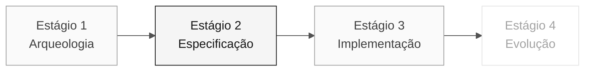

<!-- markdownlint-disable MD013 MD033 MD041 -->

# Persona — Requirements Engineer

> **Trilha:** [Kit do Time](../../README.md) › [Personas](../OVERVIEW.md) › [Requirements Engineer](README.md) › **PERSONA**

**Ficha completa da persona Requirements Engineer.** Define missão, responsabilidades por estágio, ferramentas, passagem de bastão e rubricas de avaliação.

| Campo | Valor |
|---|---|
| **Papel** | Requirements Engineer |
| **Par** | 1 · Visão (junto com Product Owner) |
| **Estágios de atuação** | Lidera 2 (EARS); apoia 1 e 3 |
| **Artefatos que produz** | Catálogo de regras, seção de "Functional Requirements" em EARS, spec viva |
| **Artefatos que consome** | Priorização do PO, programas `.NSN` do Estágio 1 |
| **Handoff para** | Par 2 (Arquitetura) no Estágio 2 |

 

---

## Conceito

O Requirements Engineer transforma regras descobertas no legado em requisitos formais e testáveis. Na indústria, esse profissional garante que o sistema a ser construído resolve o problema certo — e que existe uma forma objetiva de verificar se foi construído corretamente.

No SIFAP, as regras de negócio estão tacitamente codificadas em Natural — sem documentação atualizada, sem comentários, sem manual. O RE extrai essas regras dos programas `.NSN`, classifica-as (regra de negócio, validação, cálculo, integração) e as converte para notação EARS (Easy Approach to Requirements Syntax) com rastreabilidade explícita via `source_legacy:`.

**Exemplo concreto no SIFAP:** o programa `SIFAP003.NSN` contém uma rotina de validação de CPF de beneficiário. O RE lê o código Natural, identifica a regra, atribui um REQ-ID (ex.: `REQ-042`) e escreve o requisito em EARS: "O sistema SHALL validar o CPF do beneficiário antes de processar o pagamento." Com `source_legacy: 01-arqueologia/legado-sifap/natural-programs/SIFAP003.NSN`.

---

## Onde você atua no SDLC

- **Recebe de:** PO (priorização) e Estágio 1 (catálogo de regras)
- **Faz passagem de bastão para:** Par 2 (Arquitetura) no Estágio 2

---

## Responsabilidades por estágio

| **Estágio** | Você faz isso | Entregável que depende de você |
|---|---|---|
| **1 · Arqueologia** | Extrai regras candidatas dos programas Natural. Classifica: regra de negócio, validação, cálculo, integração. | Catálogo de regras (tabela) |
| **2 · Especificação** | Converte o catálogo em requisitos EARS. Mantém rastreabilidade legado → requisito. Estrutura a spec com o PO. | Seção de "Functional Requirements" em notação EARS |
| **3 · Implementação** | Responde dúvidas de requisito durante a codificação. Ajusta texto quando emerge ambiguidade real. | Spec viva, não congelada |
| **4 · Evolução** | Revisa se as duas issues cobrem novo requisito ou ajuste de existente. | Coerência entre issues e spec |

---

## Kit da persona

| **Artefato** | Finalidade |
|---|---|
| `.github/agents/requirements-engineer.agent.md` | Agente Copilot configurado para análise de requisitos |
| `/spec-sync` — `persona-requirements-engineer-spec-sync.prompt.md` | Sincroniza a spec com mudanças do código |
| `/contradiction-check` — `persona-requirements-engineer-contradiction-check.prompt.md` | Detecta conflitos entre requisitos |
| `/ears-convert` — `persona-requirements-engineer-ears-convert.prompt.md` | Converte texto livre em EARS |
| `.github/instructions/requirements.instructions.md` | Convenções de documentação de requisitos |

---

## Ferramentas e primitivas

- **GitHub Spec-Kit** — `/speckit.specify` é o terreno principal. O Specify CLI gera a base da spec para refinar em EARS.
- **Copilot Chat** para validar coerência entre requisitos.
- **MCP/filesystem** do repositório para navegar nos arquivos `.NSN` do legado e correlacionar com requisitos.
- Prompts e skills do kit — extração de regras e conversão para EARS.

**Cheat-sheets relevantes:**

- [`../../09-cheat-sheets/spec-kit-workflow.md`](../../09-cheat-sheets/spec-kit-workflow.md) — `/speckit.specify` e `/speckit.clarify` com exemplos EARS.
- [`../../09-cheat-sheets/model-routing.md`](../../09-cheat-sheets/model-routing.md) — quando usar Claude Sonnet 4.6 vs. Opus 4.6.

---

## Checklist de onboarding

- [ ] **Ler esta ficha.** Missão, responsabilidades e passagem de bastão.
- [ ] **Abrir o `README.md` do kit.** Confirmar que agents e prompts aparecem no Copilot Chat.
- [ ] **Revisar os 6 padrões EARS.** Abrir [`../../02-spec-moderna/GUIDE.md`](../../02-spec-moderna/GUIDE.md) seção "Notação EARS".
- [ ] **Identificar seu par.** Consultar [00-TEAM-FLOW.md](../../00-TEAM-FLOW.md).
- [ ] **Anotar a passagem de bastão.** De quem você recebe e para quem entrega ao final de cada estágio.

---

## Como se sair bem neste papel

- Seus requisitos usam verbos ativos e são testáveis.
- Toda regra do legado tem rastreabilidade explícita ao requisito moderno via `source_legacy:`.
- Você diz "isso está ambíguo, precisamos de uma decisão" antes do código ser escrito.
- Usa os seis padrões EARS sem confundir (ubiquitous, event-driven, state-driven, unwanted, optional, complex).

---

## Erros comuns e como evitar

| **Sintoma** | Causa | Correção |
|---|---|---|
| Requisito não tem critério de verificação | Escrito como parágrafo, não como EARS | Reescreva com verbo "SHALL" e condição explícita |
| Regra do legado sem contraparte | Arqueologia incompleta | Revise o catálogo de regras antes de fechar a spec |
| Requisito duplica conteúdo de ADR | Confusão entre requisito e decisão de design | Requisito descreve comportamento; ADR registra decisão arquitetural |
| "O sistema deve usar Redis" entra na spec | Confusão entre requisito e implementação | Requisito funcional não menciona tecnologia |

---

## 3 exemplos de prompt

1. **(Chat)** "Leia esta regra do SIFAP legado e converta para notação EARS: [cole a regra]. Identifique qual dos 6 padrões EARS se aplica e explique por quê."
2. **(Chat)** "Analise estes 5 requisitos EARS e encontre: (a) ambiguidades que precisam de decisão do PO, (b) dependências entre eles, (c) requisitos conflitantes."
3. **(Plan)** "No `spec.md`, planeje EARS para as regras confirmadas no catálogo. Escolha o padrão EARS a partir do comportamento observado."

---

## Se travar

| **Situação** | O que fazer |
|---|---|
| Não conhece EARS | Abra [`../../02-spec-moderna/GUIDE.md`](../../02-spec-moderna/GUIDE.md) seção "Notação EARS" — 6 padrões com exemplo |
| Requisito ambíguo | Escreva duas interpretações e pergunte ao PO qual é a correta |
| Muitas regras, pouco tempo | Priorize regras pelo risco e pelo impacto que o time registrou |
| Spec-Kit não funciona | Restaure a ferramenta antes de criar artefatos formais; eles pertencem a `specs/<NNN>-<feature>/spec.md` |

---

## Dependências

| **Persona** | Relação | Artefato |
|---|---|---|
| Product Owner | Você depende dele | Priorização das regras |
| Developer | Depende de você | Requisitos claros para implementar |
| QA Engineer | Depende de você | Requisitos testáveis com critérios de verificação |
| Software Architect | Depende de você | Requisitos para desenhar bounded contexts |

---

## Como você é avaliado

- **Rubrica A2 (Coerência de Spec):** requisitos em EARS, numerados, rastreáveis ao legado.
- **Rubrica A1 (Arqueologia):** catálogo de regras com classificação.
- Critério: "Todo requisito tem verbo ativo e é testável."

---

### Continuar a leitura

| Anterior | Próximo |
|---|---|
| [Product Owner](../01-product-owner/PERSONA.md) Par 1 · Visão · valida escopo e prioridades. | [Enterprise Architect](../03-enterprise-architect/PERSONA.md) Par 2 · Arquitetura · C4 + ADRs estruturais. |

[Voltar ao índice do kit](../../README.md)
