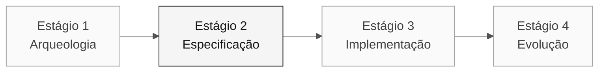

<!-- markdownlint-disable MD013 MD033 MD041 -->

# Persona — Enterprise Architect

> **Trilha:** [Kit do Time](../../README.md) › [Personas](../OVERVIEW.md) › [Enterprise Architect](README.md) › **PERSONA**

**Ficha completa da persona Enterprise Architect.** Define missão, responsabilidades por estágio, ferramentas, passagem de bastão e rubricas de avaliação.

| Campo | Valor |
|---|---|
| **Papel** | Enterprise Architect |
| **Par** | 2 · Arquitetura (junto com Software Architect) |
| **Estágios de atuação** | Lidera 2 (C4 + ADRs estruturais); apoia 1 e 4 |
| **Artefatos que produz** | Mapa de dependências externas, ADRs de topologia, validação de contratos |
| **Artefatos que consome** | Catálogo de regras (Par 1), requisitos de integração (RE) |
| **Handoff para** | Par 3 (Implementação) e Par 4 (Qualidade) no Estágio 2; Par 5 (Operações) para Terraform |

 

---

## Conceito

O Enterprise Architect enxerga o sistema dentro do seu ecossistema organizacional e técnico. Na indústria, esse papel é responsável por garantir que novas soluções se encaixem no contexto existente — contratos com sistemas externos, padrões de segurança corporativos e requisitos de governança.

No SIFAP, isso significa: SIAFI, Banco do Brasil, INCRA, MDA e outros sistemas internos do governo. O EA sabe onde estão os contratos, quais são frágeis e quais podem ser tocados sem disparar uma cadeia de efeitos imprevistos. Sem esse mapeamento, o time de implementação pode criar um serviço que funciona no ambiente local mas falha em produção porque quebra um contrato de integração.

**Exemplo concreto no SIFAP:** o programa `SIFAP007.NSN` chama o SIAFI de forma síncrona para confirmar pagamentos. O EA identifica esse contrato, avalia a fragilidade da integração e decide se a estratégia de coexistência deve ser síncrona ou assíncrona — antes do código ser escrito.

---

## Onde você atua no SDLC

- **Recebe de:** Par 1 (Visão) no Estágio 1 — catálogo de regras e escopo
- **Faz passagem de bastão para:** Par 3 (Implementação) e Par 4 (Qualidade) no Estágio 2; Par 5 (Operações) para Terraform

---

## Responsabilidades por estágio

| **Estágio** | Você faz isso | Entregável que depende de você |
|---|---|---|
| **1 · Arqueologia** | Identifica dependências e contratos externos que afetem o recorte. | Evidência de integração relevante |
| **2 · Especificação** | Registra somente decisões de topologia que bloqueiem o plano. | ADR de topologia ou decisão de escopo quando necessário |
| **3 · Implementação** | Valida que a implementação respeita os contratos desenhados. Apoia o DevOps com Terraform de alto nível. | Validação do layout implantado |
| **4 · Evolução** | Avalia se as issues do Estágio 4 têm implicações arquiteturais que precisam de revisão prévia. | Avaliação de impacto |

---

## Kit da persona

| **Artefato** | Finalidade |
|---|---|
| `.github/agents/enterprise-architect.agent.md` | Agente Copilot configurado para arquitetura e segurança |
| `/create-constitution` — `persona-enterprise-architect-create-constitution.prompt.md` | Cria ou atualiza `.specify/memory/constitution.md` |
| `/create-adr` — `persona-enterprise-architect-create-adr.prompt.md` | Cria um ADR a partir de uma decisão do time |
| `/architecture-review` — `persona-enterprise-architect-architecture-review.prompt.md` | Revisa um design proposto contra contratos e riscos |
| `.github/instructions/security.instructions.md` | Convenções de segurança |
| `.github/instructions/infrastructure.instructions.md` | Convenções de IaC |

---

## Ferramentas e primitivas

- **Mermaid** e **C4** para diagramas de contexto e containers.
- **Copilot Chat** para validar decisões de topologia com prompts de pressão.
- **GitHub Spec-Kit** com `/speckit.plan` — transforma a spec em plano técnico, decisões e contratos revisáveis.
- Skills do kit — prompts estruturados para análise de dependências.

**Cheat-sheets relevantes:**

- [`../../09-cheat-sheets/spec-kit-workflow.md`](../../09-cheat-sheets/spec-kit-workflow.md) — `/speckit.plan` e `/speckit.analyze`.
- [`../../09-cheat-sheets/model-routing.md`](../../09-cheat-sheets/model-routing.md) — use Claude Opus 4.6 para análise de impacto arquitetural.

---

## Checklist de onboarding

- [ ] **Ler esta ficha.** Missão, responsabilidades e passagem de bastão.
- [ ] **Abrir o `README.md` do kit.** Confirmar que agents e prompts aparecem no Copilot Chat.
- [ ] **Identificar seu par.** Consultar [00-TEAM-FLOW.md](../../00-TEAM-FLOW.md).
- [ ] **Mapear as integrações externas.** Listar SIAFI, BB, INCRA e outros sistemas presentes nos programas `.NSN` atribuídos.
- [ ] **Anotar a passagem de bastão.** Saber quem recebe o mapa de dependências e para qual artefato.

---

## Como se sair bem neste papel

- O C4 nível 1 é legível por qualquer pessoa não-técnica do time em 30 segundos.
- Seus ADRs nomeiam o "caminho não tomado" e explicam por quê.
- Você ancora a estratégia Strangler Fig — coexistência do SIFAP legado com o SIFAP 2.0 — no argumento técnico, não como moda.
- Você alinha com o Software Architect onde seu escopo termina e onde o dele começa.

---

## Erros comuns e como evitar

| **Sintoma** | Causa | Correção |
|---|---|---|
| Diagrama incompreensível para não-técnicos | C4 L3/L4 usado onde L1/L2 bastava | Use L1 primeiro; aprofunde só quando houver pergunta técnica específica |
| Integrações reais ignoradas | Foco excessivo na estrutura interna | Liste SIAFI, BB e outros na fase de Arqueologia |
| Trabalho duplicado com Software Architect | Fronteira de responsabilidade não definida | Acorde no início: EA cuida do que é externo; SA cuida do que é interno |
| ADR genérico sem valor | "Vamos usar Spring Boot" não é decisão de EA | ADR de EA responde "como nos conectamos a X?" não "qual framework usamos?" |

---

## 3 exemplos de prompt

1. **(Chat)** "Crie um diagrama C4 Nível 1 com os atores e sistemas externos confirmados pelo time."
2. **(Chat)** "Para esta dependência externa, quais riscos de indisponibilidade precisamos avaliar? Proponha alternativas e seus trade-offs."
3. **(Chat)** "Compare as opções de integração que o time levantou e estruture uma ADR sem antecipar a decisão."

---

## Se travar

| **Situação** | O que fazer |
|---|---|
| Não conhece C4 | Use um Mermaid flowchart simples: caixas = sistemas, setas = integrações. Rotule as setas |
| Queimou tempo em C4 Nível 3 | Pare. Nível 1 + Nível 2 são suficientes para este workshop |
| Não conhece Mermaid | Peça ao Copilot: "Crie um diagrama C4 nível 1 em Mermaid a partir destes atores e integrações confirmados" |
| Discordância com o Software Architect | Escreva um ADR com as duas opções e peça votação ao time |

---

## Dependências

| **Persona** | Relação | Artefato |
|---|---|---|
| Software Architect | Depende de você | Dependências e decisões que afetem o recorte |
| DevOps Engineer | Depende de você | Topologia para Terraform |
| Developer | Depende de você (indireto) | Contratos de integração |
| Requirements Engineer | Você depende dele | Requisitos de integração |

---

## Como você é avaliado

- **Rubrica A1 (Arqueologia):** mapa de dependências legível por não-técnicos.
- **Rubrica A2 (Coerência de Spec):** ADRs nomeiam o "caminho não tomado".
- Critério: "As decisões de escopo e dependências relevantes são rastreáveis."

---

### Continuar a leitura

| Anterior | Próximo |
|---|---|
| [Requirements Engineer](../02-requirements-engineer/PERSONA.md) Par 1 · Visão · escreve EARS com source_legacy. | [Software Architect](../04-software-architect/PERSONA.md) Par 2 · Arquitetura · bounded contexts e módulos. |

[Voltar ao índice do kit](../../README.md)
