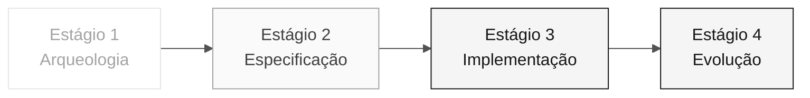

<!-- markdownlint-disable MD013 MD033 MD041 -->

# Persona — Technical Lead

> **Trilha:** [Kit do Time](../../README.md) › [Personas](../OVERVIEW.md) › [Technical Lead](README.md) › **PERSONA**

**Ficha completa da persona Technical Lead.** Define missão, responsabilidades por estágio, ferramentas, passagem de bastão e rubricas de avaliação.

| Campo | Valor |
|---|---|
| **Papel** | Technical Lead |
| **Par** | 3 · Implementação (junto com Developer) |
| **Estágios de atuação** | Lidera 3 (padrões, revisão) e co-lidera 4; apoia 2 |
| **Artefatos que produz** | Padrões de implementação, revisões de PR, aplicação rodando end-to-end |
| **Artefatos que consome** | REQ-IDs, ADRs, C4 (Par 2) |
| **Handoff para** | Par 5 (Operações) no Estágio 3 — código rodando |

  

---

## Conceito

O Technical Lead é o elo entre a arquitetura definida no papel e o código escrito no dia a dia. Na indústria, esse papel define padrões de implementação (convenções de código, estilo de teste, estrutura de módulo), desbloqueia o time quando alguém trava num detalhe técnico e responde pela qualidade técnica das entregas.

No SIFAP, o TL garante que ao final do Estágio 3 a aplicação criada pelo time realmente roda de ponta a ponta — não apenas compila. Isso inclui decisões como: qual camada recebe a anotação `@Transactional`, como erros são tratados, e como testes de integração são estruturados.

**Exemplo concreto no SIFAP:** quando o Developer implementa o endpoint de consulta de benefício, o TL revisa o PR verificando se a lógica de negócio está na camada correta, se o teste cobre caminho feliz e de erro, e se não há import cruzando fronteiras de bounded context.

---

## Onde você atua no SDLC

- **Recebe de:** Par 2 (Arquitetura) no Estágio 2 — REQ-IDs + ADRs + C4
- **Faz passagem de bastão para:** Par 5 (Operações) no Estágio 3 — código rodando

---

## Responsabilidades por estágio

| **Estágio** | Você faz isso | Entregável que depende de você |
|---|---|---|
| **1 · Arqueologia** | Participa da análise priorizando programas críticos. Estima complexidade. | Priorização baseada em esforço |
| **2 · Especificação** | Valida que a spec cabe nos 70 minutos do Estágio 3. Sinaliza "isso não cabe". | Calibração de escopo |
| **3 · Implementação** | Desbloqueia. Decide padrões (estilo de teste, transações, tratamento de erro). Revisa todo PR. | Aplicação rodando end-to-end |
| **4 · Evolução** | Revisa o PR do Agent linha por linha antes do merge. | PR em qualidade de produção |

---

## Kit da persona

| **Artefato** | Finalidade |
|---|---|
| `.github/agents/tech-lead.agent.md` | Agente Copilot configurado para governança técnica |
| `/setup-project` — `persona-technical-lead-setup-project.prompt.md` | Inicializa a estrutura do projeto |
| `/routing-table` — `persona-technical-lead-routing-table.prompt.md` | Gera tabela de roteamento de modelos por tarefa |
| `/audit-context` — `persona-technical-lead-audit-context.prompt.md` | Audita o contexto enviado ao Copilot |

---

## Ferramentas e primitivas

- **Copilot Plan** para refatoração em lote com sequência clara.
- **Copilot Chat** como pair para decisões locais de design.
- **GitHub Spec-Kit** — suporte em `/speckit.tasks`, `/speckit.analyze` e passagem para `/speckit.implement`.
- **Git MCP** para revisão de PR.

**Cheat-sheets relevantes:**

- [`../../09-cheat-sheets/copilot-3-modes.md`](../../09-cheat-sheets/copilot-3-modes.md) — você alterna entre os três modos o tempo todo.
- [`../../09-cheat-sheets/spec-kit-workflow.md`](../../09-cheat-sheets/spec-kit-workflow.md) — `/speckit.tasks` e `/speckit.implement`.
- [`../../09-cheat-sheets/model-routing.md`](../../09-cheat-sheets/model-routing.md) — roteamento de modelos por tipo de tarefa.

---

## Checklist de onboarding

- [ ] **Ler esta ficha.** Missão, responsabilidades e passagem de bastão.
- [ ] **Abrir o `README.md` do kit.** Confirmar que agents e prompts aparecem no Copilot Chat.
- [ ] **Identificar seu par.** Consultar [00-TEAM-FLOW.md](../../00-TEAM-FLOW.md).
- [ ] **Definir 2 padrões-chave.** Antes do Estágio 3 começar, escolher convenções de transação e de teste.
- [ ] **Anotar a passagem de bastão.** Saber o que o DevOps precisa receber ao final do Estágio 3.

---

## Como se sair bem neste papel

- Responde uma dúvida técnica em menos de 5 minutos. Não deixa ninguém parado.
- Revisões que movem o PR para frente, não revisões que bloqueiam.
- Escolhe dois padrões-chave no início do Estágio 3 e os mantém sem negociação (ex.: `@Transactional` somente na camada de service).
- Mantém `main` verde o tempo todo.

---

## Erros comuns e como evitar

| **Sintoma** | Causa | Correção |
|---|---|---|
| Developer travado por mais de 20 minutos | TL escrevendo código em vez de desbloquear | Pare o que está fazendo e responda a dúvida |
| PR bloqueado por detalhes estéticos | Revisão focada em estilo, não em correção | Revise critérios: comportamento correto, teste presente, sem violação de fronteira |
| Padrão muda no meio do Estágio 3 | Decisão não foi registrada no início | Defina padrões antes de começar e documente no `CODEMAP.md` |
| Aplicação não roda no final | Gargalo não foi identificado a tempo | Faça um teste de integração completo a cada 30 minutos |

---

## 3 exemplos de prompt

1. **(Chat)** "Revise este PR: verifique se segue as 3 camadas (domain/application/infrastructure), se o teste cobre caminho feliz + erro, e se há algum import cruzando bounded context."
2. **(Chat)** "Temos 70 minutos. Ajude a comparar estas features por evidência, dependências e esforço para escolher uma feature fina; não complete requisitos ausentes."
3. **(Chat)** "O ambiente local falha com este erro: [cole]. Diagnostique a causa-raiz e proponha uma correção."

---

## Se travar

| **Situação** | O que fazer |
|---|---|
| Ambiente local não sobe | Verifique: porta 5432 ocupada? Versão do Java/Node correta? Containers antigos interferindo? Logs do backend mostram qual erro? |
| Time lento | Pare, redistribua: "Dev A faz o endpoint, Dev B faz a migration, QA faz o teste. Merge em 45 min." |
| PR em conflito | `git pull --rebase` e resolva. Não deixe a branch divergir sem alinhar com o par |
| Não sabe decidir um padrão | Use a spec, os ADRs e as instructions do kit como fonte; documente a decisão no PR |

---

## Dependências

| **Persona** | Relação | Artefato |
|---|---|---|
| Software Architect | Você depende dele | Estrutura de pacotes definida |
| Product Owner | Você depende dele | Escopo calibrado |
| Developer | Depende de você | Padrões e revisões |
| QA Engineer | Depende de você | Pipeline verde para rodar testes |
| DevOps Engineer | Depende de você | Build estável para o pipeline |

---

## Como você é avaliado

- **Rubrica A3 (Integridade Técnica):** a aplicação criada pelo time roda localmente e no CI.
- **Rubrica A6 (Colaboração):** ninguém travado por mais de 20 minutos.
- Critério: "`main` verde o tempo todo, PRs revisados em menos de 15 minutos."

---

### Continuar a leitura

| Anterior | Próximo |
|---|---|
| [Software Architect](../04-software-architect/PERSONA.md) Par 2 · Arquitetura · bounded contexts e módulos. | [Developer](../06-developer/PERSONA.md) Par 3 · Implementação · Java + Next.js + testes. |

[Voltar ao índice do kit](../../README.md)
