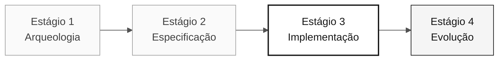

<!-- markdownlint-disable MD013 MD033 MD041 -->

# Persona — Developer

> **Trilha:** [Kit do Time](../../README.md) › [Personas](../OVERVIEW.md) › [Developer](README.md) › **PERSONA**

**Ficha de referência para quem ocupa a persona Developer no workshop de modernização do SIFAP.**

  

| Campo | Valor |
|---|---|
| **Papel** | Developer |
| **Par** | Par 3 — Implementação (junto com Technical Lead) |
| **Estágios de atuação** | Estágio 3 — Implementação (lidera); Estágio 4 — Evolução (apoia) |
| **Artefatos que produz** | Backend (Java 21 + Spring Boot 3.3), frontend (Next.js 15), testes (JUnit 5 + Testcontainers + Vitest), PRs revisáveis |
| **Artefatos que consome** | Requisitos EARS (Requirements Engineer), estrutura de pacotes e bounded contexts (Software Architect), migrações Flyway (DBA) |
| **Handoff para** | QA Engineer — código testável; DevOps Engineer — build estável |

---

## O que é esta persona

O Developer é quem escreve o código. Na modernização do SIFAP, essa persona traduz programas Natural e estruturas DDM/Adabas para Java 21 com Spring Boot 3.3, implementa o frontend em Next.js 15 com TypeScript estrito e garante que cada requisito EARS se torne um endpoint funcional com testes passando.

No contexto do framework Agentic Legacy Modernization, o Developer atua na camada de tradução (Translation Agent — Estágio 3) e acompanha o Review Agent no Estágio 4, intervindo quando o Copilot Agent se desvia do padrão arquitetural definido pelo time.

## Onde você atua no SDLC

| Estágio | Responsabilidade | Entregável |
|---|---|---|
| **1 — Arqueologia** | Lê programas Natural com Copilot Chat e produz resumo legível para o time | Resumos narrativos dos programas |
| **2 — Especificação** | Pareia com o Requirements Engineer para antecipar problemas de implementação | Sinais preventivos na spec |
| **3 — Implementação** | Implementa, testa, abre PR, revisa PR do par, itera | Backend + frontend da fatia priorizada |
| **4 — Evolução** | Acompanha o Copilot Agent, intervém quando necessário, finaliza o que o Agent não completou | PR do Agent em estado mergeável |

## Responsabilidade central

Transformar spec em código executável usando o Copilot de forma deliberada — modo Ask para entender, modo Plan para planejar mudanças multi-arquivo, modo Agent para delegar tarefas bem definidas. Fazer commit todo dia.

## Competências-chave

- Implementação Java 21: records, sealed interfaces, virtual threads, Optional, Bean Validation
- Implementação TypeScript: Next.js 15 App Router, Server Actions, `strict: true`
- TDD com JUnit 5, Testcontainers e Vitest
- Refatoração incremental com commits separados por intenção
- Troca deliberada entre os três modos do Copilot

## Kit da persona

| Artefato | Caminho | Uso |
|---|---|---|
| Agente de implementação | `.github/agents/implementer.agent.md` | Implementação, TDD e correção de bugs |
| Prompt `/implement` | `.github/prompts/persona-developer-implement.prompt.md` | Iniciar implementação a partir de uma spec |
| Prompt `/fix-bug` | `.github/prompts/persona-developer-fix-bug.prompt.md` | Ciclo entender → reproduzir → corrigir → verificar |
| Prompt `/tdd` | `.github/prompts/persona-developer-tdd.prompt.md` | Escrever teste antes de implementar |
| Prompt `/refactor` | `.github/prompts/persona-developer-refactor.prompt.md` | Refatoração sem mudança de comportamento |

## Ferramentas e modos do Copilot

| Ferramenta / Modo | Quando usar |
|---|---|
| **Copilot Ask** | Entender trechos de código legado Natural, discutir design antes de implementar |
| **Copilot Plan** | Principal modo no Estágio 3 — planejar mudanças que afetam múltiplos arquivos |
| **Copilot Agent** | Estágio 4 — delegar tarefas bem definidas a partir de Issues |
| **Spec-Kit** (`/speckit.tasks`, `/speckit.implement`) | Consumir artefatos do Software Architect e do Requirements Engineer |
| **GitHub MCP** | Trabalhar com Issues e PRs sem sair do VS Code |

## Cheat-sheets recomendadas

- [`09-cheat-sheets/copilot-3-modes.md`](../../09-cheat-sheets/copilot-3-modes.md) — mapa do dia, use constantemente
- [`09-cheat-sheets/spec-kit-workflow.md`](../../09-cheat-sheets/spec-kit-workflow.md) — `/speckit.tasks`, `/speckit.implement` e `/speckit.analyze`
- [`09-cheat-sheets/model-routing.md`](../../09-cheat-sheets/model-routing.md) — Haiku 4.5 para snippets simples, Sonnet 4.6 como padrão, Opus 4.6 para design

## Como ter bom desempenho

- [ ] **Usar os três modos do Copilot de forma deliberada.** Nem sempre o Chat é o modo certo.
- [ ] **Manter commits pequenos e PRs revisáveis.** Um assunto por PR.
- [ ] **Escrever testes ao mesmo tempo que o código.** Nunca depois.
- [ ] **Não investir em abstrações prematuras no meio do Estágio 3.** Prefira clareza a elegância.

## Erros comuns e como evitar

| Sintoma | Causa | Correção |
|---|---|---|
| Branch gigante acumulando por horas | PR sem foco | Abra um PR por funcionalidade ou por camada |
| Copilot Agent usado para tarefa simples | Seleção errada de modo | Reserve o Agent para tarefas com escopo claro e artefatos de entrada completos |
| Código sem teste descoberto às 16h | TDD postergado | Escreva o teste antes de passar para o próximo comportamento |
| Espera longa pelo Opus 4.6 | Modelo superdimensionado | Use Sonnet 4.6 como padrão; Opus apenas para decisões de design |

## Combinações com outras personas

| Combinação | Observação |
|---|---|
| **Developer + Technical Lead** | Muito comum; você implementa e o TL revisa e define padrões |
| **Developer + QA Engineer** | Você escreve a feature e os testes na mesma sessão |
| **Developer + DevOps Engineer** | Em times pequenos; você empacota e entrega |

## Prompts prontos para usar

1. **(Ask)** _"Explique o trecho legado selecionado e identifique somente os comportamentos confirmados. Depois proponha perguntas antes de implementá-los em Java."_
2. **(Plan)** _"Selecione os arquivos da funcionalidade priorizada. Planeje a mudança em domínio, aplicação, infraestrutura, dados e testes."_
3. **(Agent)** _"Implemente a feature descrita nesta Issue: [cole a issue]. Respeite a arquitetura de 3 camadas e inclua testes."_

## Defaults de emergência

| Situação | O que fazer |
|---|---|
| Código não compila | Execute `mvn test-compile` para ver o erro exato — geralmente é um import faltando |
| Estrutura de pacotes desconhecida | Consulte a estrutura definida pelo time: `domain/` → `application/` → `infrastructure/` |
| Copilot gerando código inadequado | Mude de Ask para Plan — selecione os arquivos relevantes e descreva a mudança |
| Teste falhando sem motivo óbvio | Leia a mensagem de erro: NPE geralmente indica mock ausente; assertion incorreta indica valor esperado errado |

## Dependências

| Persona | Relação | Artefato |
|---|---|---|
| Software Architect | Você depende | Estrutura de pacotes e bounded contexts |
| Requirements Engineer | Você depende | Requisitos EARS para implementar |
| Technical Lead | Depende de você | PRs para revisar |
| QA Engineer | Depende de você | Código testável |
| DBA | Você depende | Migrações e modelo de dados |

## Como você é avaliado

- **Rubrica A3 — Integridade Técnica:** endpoints funcionais, testes passando
- **Rubrica A4 — Uso Consciente do Copilot:** troca deliberada entre Ask, Plan e Agent
- **Critério:** commits pequenos, PRs revisáveis, testes escritos junto do código

---

### Continuar a leitura

| Anterior | Próximo |
|---|---|
| [Technical Lead — PERSONA](../05-technical-lead/PERSONA.md) Par 3 — Implementação — padrões e revisão de código. | [DBA — PERSONA](../07-dba/PERSONA.md) Par 4 — Qualidade — migrações Flyway e otimização de consultas. |

[Voltar ao índice do kit](../../README.md)
