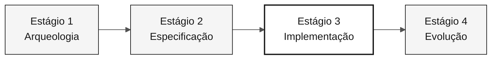

<!-- markdownlint-disable MD013 MD033 MD041 -->

# Persona — DBA

> **Trilha:** [Kit do Time](../../README.md) › [Personas](../OVERVIEW.md) › [DBA](README.md) › **PERSONA**

**Ficha de referência para quem ocupa a persona DBA no workshop de modernização do SIFAP.**

 -404040?style=flat-square) 

| Campo | Valor |
|---|---|
| **Papel** | DBA (Database Administrator) |
| **Par** | Par 4 — Qualidade (junto com QA Engineer) |
| **Estágios de atuação** | Estágio 1 (mapeamento DDM), Estágio 2 (modelo lógico + ADR), Estágio 3 (lidera schema), Estágio 4 (valida integridade) |
| **Artefatos que produz** | Mapa DDM → entidade relacional, ADR de banco de dados, migrações Flyway, índices, seed de dados de teste |
| **Artefatos que consome** | DDMs Adabas (Estágio 1), bounded contexts (Software Architect), requisitos EARS (Requirements Engineer) |
| **Handoff para** | Developer — migrações prontas para JPA; DevOps Engineer — schema estável para Terraform |

---

## O que é esta persona

O DBA (Database Administrator) é o responsável pela camada de dados do SIFAP 2.0. Na modernização do legado, isso significa ler os 4 DDMs Adabas — que descrevem campos MU (múltiplo valor), PE (periódico) e estruturas de FDT (File Definition Table) —, traduzi-los para um schema relacional normalizado no PostgreSQL 16 e garantir que as migrações Flyway sejam idempotentes, reversíveis e seguras para deploy contínuo.

Por que importa: o modelo de dados é a fundação sobre a qual o Developer escreve as entidades JPA e o DevOps provisiona a infraestrutura. Um schema frágil ou migrações não-reversíveis comprometem todo o Estágio 3 e criam riscos sérios em produção.

No framework Agentic Legacy Modernization, o DBA atua nas fases de Assessment (Estágio 1) e Translation da camada de dados (Estágio 3).

## Onde você atua no SDLC

| Estágio | Responsabilidade | Entregável |
|---|---|---|
| **1 — Arqueologia** | Ler os 4 DDMs, mapear campos MU/PE para entidades relacionais candidatas e identificar campos-chave | Mapa DDM → entidade relacional |
| **2 — Especificação** | Desenhar o modelo lógico de dados e escrever o ADR de PostgreSQL (ADR 002 da referência) | Modelo de dados + ADR 002 |
| **3 — Implementação** | Escrever migrações Flyway, definir índices, popular dados de teste (seed) e responder dúvidas de JPA/Hibernate | Schema PostgreSQL + seed |
| **4 — Evolução** | Verificar se o PR do Copilot Agent toca no schema com segurança (nova migração, nunca alteração retroativa) | Integridade do schema preservada |

## Responsabilidade central

Traduzir o modelo Adabas necessário ao recorte para um schema relacional PostgreSQL que preserva a integridade lógica do negócio sem herdar as estruturas legadas do Adabas. Garantir migrações idempotentes e rastreabilidade total das mudanças de schema.

## Competências-chave

- Leitura de DDMs Adabas: campos simples, MU (múltiplo valor) e PE (periódico)
- Design de schema relacional normalizado no PostgreSQL 16
- Migrações Flyway: nomenclatura, idempotência e estratégia expand-contract
- Indexação orientada a consultas reais (identificadas nos programas Natural)
- Auditoria de queries JPA/JPQL para evitar N+1 e SQL injection

## Kit da persona

| Artefato | Caminho | Uso |
|---|---|---|
| Agente DBA | `.github/agents/dba.agent.md` | Modelagem de dados, migrações e auditoria SQL |
| Prompt `/migration` | `.github/prompts/persona-dba-migration.prompt.md` | Planejar e escrever migração Flyway |
| Prompt `/query-audit` | `.github/prompts/persona-dba-query-audit.prompt.md` | Auditar queries para performance e segurança |
| Instructions de banco | `.github/instructions/database.instructions.md` | Convenções obrigatórias de banco de dados |

## Ferramentas e modos do Copilot

| Ferramenta / Modo | Quando usar |
|---|---|
| **Copilot Ask** | Traduzir DDM Adabas → SQL PostgreSQL; entender semântica de campos legados |
| **Copilot Plan** | Planejar migrações em lote; criar vários arquivos Flyway de uma vez |
| **PostgreSQL MCP** (se disponível) | Introspecção do schema em execução e queries exploratórias |
| **Spec-Kit** (`/speckit.plan`) | Declarar o modelo de dados para consumo pelo Software Architect e Developer |

## Cheat-sheets recomendadas

- [`09-cheat-sheets/spec-kit-workflow.md`](../../09-cheat-sheets/spec-kit-workflow.md) — como declarar modelo de dados para `/speckit.plan` e revisar com `/speckit.analyze`
- [`09-cheat-sheets/model-routing.md`](../../09-cheat-sheets/model-routing.md) — Sonnet 4.6 é suficiente para a maior parte do trabalho de SQL

## Como ter bom desempenho

- [ ] **Tornar todas as migrações reversíveis.** Nunca editar uma migração existente; criar nova: `V5__fix_xxx.sql`.
- [ ] **Documentar decisões de mapeamento MU/PE.** Registrar por que um campo MU virou tabela relacionada, não coluna `JSONB`.
- [ ] **Cobrir queries críticas do ciclo mensal com índices.** Regra prática: campo em `WHERE` ou `JOIN` em tabela com mais de 100 mil linhas precisa de índice.
- [ ] **Manter a audit store como append-only.** Nenhum `DELETE` no schema de auditoria.

## Erros comuns e como evitar

| Sintoma | Causa | Correção |
|---|---|---|
| Schema com colunas `JSONB` para dados estruturados | Hábito de flexibilidade do Adabas | Normalizar campos PE e MU em tabelas relacionadas com FK |
| Migração quebrando ambiente de colega | Migração não-idempotente | Nunca alterar arquivo de migração existente; criar novo com prefixo de versão maior |
| Índice ausente em tabela crítica | Índice não criado com base em evidência | Identificar queries dos programas Natural antes de definir índices |
| Desnormalização por hábito | Replicação do modelo Adabas | Partir do modelo relacional canônico e desnormalizar só com justificativa de performance medida |

## Combinações com outras personas

| Combinação | Observação |
|---|---|
| **DBA + Developer** | Você escreve suas migrações e algumas queries JPA |
| **DBA + DevOps Engineer** | Você cuida do PostgreSQL e do Terraform que o provisiona no Azure |

## Prompts prontos para usar

1. **(Ask)** _"Leia o DDM atribuído ao time e proponha alternativas de mapeamento relacional, com trade-offs que precisamos decidir."_
2. **(Plan)** _"Planeje uma migração Flyway para os campos, relações e índices que a EARS priorizada exige."_
3. **(Ask)** _"Revise este schema e identifique restrições e índices que precisam de evidência antes de serem criados."_

## Defaults de emergência

| Situação | O que fazer |
|---|---|
| Formato DDM desconhecido | Abrir `01-arqueologia/legado-sifap/adabas-ddms/` — os comentários ajudam a entender cada campo |
| Migração quebrada | Nunca editar migração existente. Criar nova: `V5__fix_xxx.sql` |
| Dúvida sobre qual índice criar | Campo em `WHERE` ou `JOIN` com tabela > 100 mil linhas — crie o índice |
| PostgreSQL indisponível | Verificar se o Docker está rodando: `docker ps \| grep postgres` |

## Dependências

| Persona | Relação | Artefato |
|---|---|---|
| Software Architect | Você depende | Fronteiras de contexto para o modelo |
| Developer | Depende de você | Migrações prontas para JPA |
| DevOps Engineer | Depende de você | Schema estável para Terraform |
| QA Engineer | Depende de você | Dados de teste (seed) |

## Como você é avaliado

- **Rubrica A3 — Integridade Técnica:** migrações idempotentes, schema consistente com entidades JPA
- **Rubrica A1 — Arqueologia:** mapa DDM → entidade relacional documentado
- **Critério:** audit store é append-only — nenhum `DELETE` no schema de auditoria

---

### Continuar a leitura

| Anterior | Próximo |
|---|---|
| [Developer — PERSONA](../06-developer/PERSONA.md) Par 3 — Implementação — Java 21 + Next.js 15 + testes. | [QA Engineer — PERSONA](../08-qa-engineer/PERSONA.md) Par 4 — Qualidade — testes de equivalência e cobertura. |

[Voltar ao índice do kit](../../README.md)
