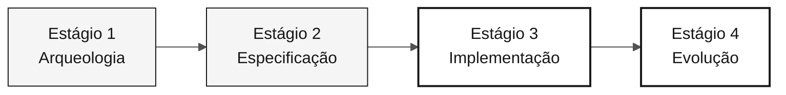

<!-- markdownlint-disable MD013 MD033 MD041 -->

# Persona — QA Engineer

> **Trilha:** [Kit do Time](../../README.md) › [Personas](../OVERVIEW.md) › [QA Engineer](README.md) › **PERSONA**

**Ficha de referência para quem ocupa a persona QA Engineer no workshop de modernização do SIFAP.**

  

| Campo | Valor |
|---|---|
| **Papel** | QA Engineer (Quality Assurance Engineer) |
| **Par** | Par 4 — Qualidade (junto com DBA) |
| **Estágios de atuação** | Estágio 1 (cenários críticos), Estágio 2 (critérios de aceitação), Estágio 3 (lidera testes), Estágio 4 (valida cobertura) |
| **Artefatos que produz** | Suíte de testes (JUnit 5 + Testcontainers + Vitest), estratégia de testes, critérios de aceitação por REQ-ID, pipeline de CI verde |
| **Artefatos que consome** | Requisitos EARS com REQ-IDs (Requirements Engineer), código testável (Developer), seed de dados (DBA) |
| **Handoff para** | DevOps Engineer — CI confiável; time todo — pipeline verde |

---

## O que é esta persona

O QA Engineer (Quality Assurance Engineer) transforma requisitos EARS em testes executáveis que provam a equivalência funcional entre o comportamento legado do Natural/Adabas e o código Java 21 moderno. Na modernização do SIFAP, essa persona define a estratégia de testes, escreve os testes que importam (não todos) e garante que o pipeline de CI permaneça verde durante todo o Estágio 3.

Por que importa: em uma modernização de legado, a equivalência funcional entre o sistema antigo e o novo só pode ser provada por testes rastreáveis a requisitos. Sem o QA Engineer, o time não tem como saber se a tradução Natural → Java preservou o comportamento correto do negócio.

No framework Agentic Legacy Modernization, o QA Engineer atua com o Test Gen Agent (Estágio 3) e o Security Agent (Estágio 3), além de validar a cobertura dos PRs gerados pelo Copilot Agent no Estágio 4.

## Onde você atua no SDLC

| Estágio | Responsabilidade | Entregável |
|---|---|---|
| **1 — Arqueologia** | Identificar cenários críticos nos programas Natural atribuídos | Lista de cenários críticos por programa |
| **2 — Especificação** | Validar que cada requisito EARS é testável; propor critérios de aceitação concretos | Critérios de teste por REQ-ID |
| **3 — Implementação** | Escrever testes unitários e de integração para os comportamentos priorizados; manter CI verde | Suíte de testes + pipeline verde |
| **4 — Evolução** | Exigir que o PR do Copilot Agent venha com seus próprios testes; validar cobertura dos cenários novos | Cobertura coerente com a feature |

## Responsabilidade central

Definir a estratégia de testes do projeto. Escrever os testes críticos — não buscar 100% de cobertura, mas cobrir os caminhos que importam. Validar rastreabilidade spec → teste. Proteger o time de um pipeline de CI verde falso (testes que sempre passam independentemente do comportamento).

## Competências-chave

- JUnit 5: `@Test`, `@DisplayName`, `@ParameterizedTest`, AssertJ
- Testcontainers para integração real com PostgreSQL 16
- Vitest + Testing Library para componentes Next.js 15
- Rastreabilidade de testes a REQ-IDs por comentários inline
- Análise de cobertura orientada a risco, não a percentual

## Kit da persona

| Artefato | Caminho | Uso |
|---|---|---|
| Agente QA Engineer | `.github/agents/qa-engineer.agent.md` | Geração de testes, análise de cobertura e gates de qualidade |
| Prompt `/create-tests` | `.github/prompts/persona-qa-engineer-create-tests.prompt.md` | Gerar testes a partir de uma EARS |
| Prompt `/coverage-gaps` | `.github/prompts/persona-qa-engineer-coverage-gaps.prompt.md` | Identificar lacunas de cobertura |
| Prompt `/test-strategy` | `.github/prompts/persona-qa-engineer-test-strategy.prompt.md` | Definir estratégia de testes do projeto |
| Instructions de testes | `.github/instructions/tests.instructions.md` | Convenções obrigatórias de teste |

## Ferramentas e modos do Copilot

| Ferramenta / Modo | Quando usar |
|---|---|
| **Copilot Ask** | Gerar cenários de teste a partir de requisitos EARS; discutir o que falta cobrir |
| **Copilot Plan** | Planejar esqueletos JUnit em lote para uma fatia inteira |
| **Testcontainers** | Integração com PostgreSQL real — prefira ao Mockito para camadas de repositório |
| **Spec-Kit** (`/speckit.analyze`) | Revisar tasks de teste derivadas de `tasks.md` |
| **GitHub Actions MCP** | Monitorar o CI sem sair do VS Code |

## Cheat-sheets recomendadas

- [`09-cheat-sheets/spec-kit-workflow.md`](../../09-cheat-sheets/spec-kit-workflow.md) — `/speckit.analyze` e tarefas de teste em `tasks.md`
- [`09-cheat-sheets/copilot-3-modes.md`](../../09-cheat-sheets/copilot-3-modes.md) — use Plan para o plano de cobertura e Ask para discutir o que falta

## Como ter bom desempenho

- [ ] **Cobrir os caminhos que importam.** Definidos pelos REQ-IDs e pela evidência do legado, não pelo percentual de cobertura.
- [ ] **Manter a suíte de testes rápida.** A suíte completa deve rodar em menos de dois minutos.
- [ ] **Escrever testes que quebram no primeiro bug.** Testes que sempre passam não validam comportamento.
- [ ] **Manter o padrão de rastreabilidade.** Comentário `// REQ-NNN` em todo método de teste.

## Erros comuns e como evitar

| Sintoma | Causa | Correção |
|---|---|---|
| Perseguição de 100% de cobertura com perda de prazo | Métrica como objetivo em si | Priorizar caminhos de risco identificados pelo time |
| Testes que testam o framework, não o domínio | Foco em infraestrutura em vez de comportamento | Verificar: a asserção falha se o comportamento de negócio mudar? |
| Mock onde Testcontainers era necessário | Conveniência | Usar Testcontainers para repositórios; Mockito para serviços de domínio |
| Pipeline de CI vermelho ignorado por 20 minutos | Falta de responsável | Quem mantém o CI verde é o QA Engineer — sem delegação |

## Combinações com outras personas

| Combinação | Observação |
|---|---|
| **QA + Developer** | Mais comum e produtivo; você escreve feature e testes na mesma sessão |
| **QA + Requirements Engineer** | Você escreve o requisito e o teste correspondente |
| **QA + DevOps Engineer** | Evitar se possível — sobrecarrega o Estágio 3 demais |

## Prompts prontos para usar

1. **(Ask)** _"Para esta EARS, gere cenários de teste que cubram comportamento principal, limites e falhas relevantes."_
2. **(Plan)** _"Para a classe da funcionalidade priorizada, planeje testes de integração com os dados e as verificações necessários."_
3. **(Ask)** _"Analise a cobertura atual e identifique os caminhos de maior risco sem teste. Priorize usando a evidência do time."_

## Defaults de emergência

| Situação | O que fazer |
|---|---|
| JUnit 5 desconhecido | Usar o padrão existente: `@Test`, `@DisplayName`, asserts com AssertJ |
| Testcontainers não funciona | Verificar se o Docker está rodando; alternativa: unit test com Mockito |
| Muitos cenários, pouco tempo | Focar nos comportamentos de maior risco identificados pelo time |
| CI vermelho passando local | Problema de ambiente — Docker/Testcontainers no CI; verificar versão do Docker no runner |

## Dependências

| Persona | Relação | Artefato |
|---|---|---|
| Requirements Engineer | Você depende | Requisitos testáveis com critérios de aceitação |
| Developer | Você depende | Código testável |
| Technical Lead | Depende de você | Pipeline verde |
| DevOps Engineer | Depende de você | CI confiável |

## Como você é avaliado

- **Rubrica A3 — Integridade Técnica:** testes passando, CI verde
- **Rubrica A2 — Spec:** todo requisito tem critério de verificação
- **Critério:** testes que quebram no primeiro bug — não testes que sempre passam

---

### Continuar a leitura

| Anterior | Próximo |
|---|---|
| [DBA — PERSONA](../07-dba/PERSONA.md) Par 4 — Qualidade — migrações Flyway e otimização de consultas. | [DevOps Engineer — PERSONA](../09-devops-engineer/PERSONA.md) Par 5 — Operações — Terraform, GitHub Actions e runbook. |

[Voltar ao índice do kit](../../README.md)
