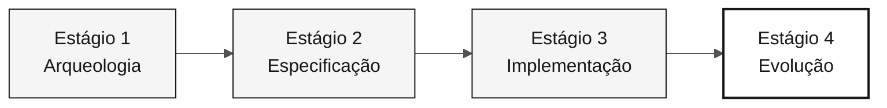

<!-- markdownlint-disable MD013 MD033 MD041 -->

# Persona — DevOps Engineer

> **Trilha:** [Kit do Time](../../README.md) › [Personas](../OVERVIEW.md) › [DevOps Engineer](README.md) › **PERSONA**

**Ficha de referência para quem ocupa a persona DevOps Engineer no workshop de modernização do SIFAP.**

  

| Campo | Valor |
|---|---|
| **Papel** | DevOps Engineer |
| **Par** | Par 5 — Operações (junto com Tech Writer) |
| **Estágios de atuação** | Estágio 1 (validação de ferramentas), Estágio 2 (ADR de deploy), Estágio 3 (pipeline e Terraform), Estágio 4 (lidera) |
| **Artefatos que produz** | Workflow GitHub Actions (`ci.yml`), Dockerfile, módulos Terraform, ADR de estratégia de deploy, modo de execução local documentado |
| **Artefatos que consome** | Build estável (Technical Lead / Developer), topologia de infraestrutura (Enterprise Architect / Software Architect), schema estável (DBA) |
| **Handoff para** | Demonstração — modo de execução local funcional; produção — `terraform plan` válido |

---

## O que é esta persona

O DevOps Engineer é o responsável pelo caminho do código desde o commit até algo que executa de forma confiável. Na modernização do SIFAP, essa persona garante que qualquer máquina do time consiga subir o ambiente local em menos de 60 segundos, que o GitHub Actions valide cada PR com lint, testes e build de imagem, e que o Terraform descreva a topologia-alvo no Azure mesmo quando não é aplicado no dia do workshop.

Por que importa: um pipeline frágil ou um ambiente local ambíguo cria atrito para todos os outros pares. O Developer perde tempo com erros de ambiente, o QA Engineer não tem base estável para os testes e a demonstração final arrisca falhar por problema operacional, não de funcionalidade.

No framework Agentic Legacy Modernization, o DevOps Engineer atua com o Deployment Agent (Estágio 4) e o Security Agent (Estágio 3), configurando a infraestrutura para deploy contínuo e coexistência entre o sistema legado e o novo.

## Onde você atua no SDLC

| Estágio | Responsabilidade | Entregável |
|---|---|---|
| **1 — Arqueologia** | Validar ferramentas locais; planejar o que será necessário para execução local do protótipo | Ambiente de trabalho validado |
| **2 — Especificação** | Escrever o ADR de estratégia de deploy (ADR 005) e participar do design de infraestrutura | ADR 005 + draft do Terraform |
| **3 — Implementação** | Manter GitHub Actions para build e testes; publicar imagem Docker; manter Terraform descrito | Pipeline verde + `terraform plan` válido |
| **4 — Evolução** | Validar PRs do Copilot Agent que toquem no pipeline ou na infraestrutura | Pipeline continua verde após o Agent |

## Responsabilidade central

Build reproduzível, pipeline verde e infraestrutura descrita como código. No workshop: modo de execução local documentado que sobe aplicação e banco em menos de 60 segundos quando o protótipo existir, CI que checa lint + testes + build de imagem, e `terraform plan` sem erro.

## Competências-chave

- GitHub Actions: workflows de CI/CD, cache de dependências, build de imagem Docker
- Terraform (Azure provider ~> 3.x): módulos por área de serviço (networking, compute, database, monitoring)
- Docker e Docker Compose: Dockerfile com cache de dependências Maven, imagem final enxuta e health check
- Observabilidade mínima: logs estruturados (JSON), endpoint `/actuator/health`, métricas básicas
- Gestão de secrets: Azure Key Vault, variáveis de ambiente no CI, nunca em código ou `.env` versionado

## Kit da persona

| Artefato | Caminho | Uso |
|---|---|---|
| Agente DevOps Engineer | `.github/agents/devops-engineer.agent.md` | CI/CD, infraestrutura como código, monitoramento e análise de incidentes |
| Prompt `/pipeline` | `.github/prompts/persona-devops-engineer-pipeline.prompt.md` | Criar ou melhorar workflow GitHub Actions |
| Prompt `/iac-module` | `.github/prompts/persona-devops-engineer-iac-module.prompt.md` | Criar módulo Terraform para serviço Azure |
| Prompt `/incident-rca` | `.github/prompts/persona-devops-engineer-incident-rca.prompt.md` | Análise de causa raiz de incidente |
| Instructions de CI/CD | `.github/instructions/cicd.instructions.md` | Convenções obrigatórias de pipelines |
| Instructions de infraestrutura | `.github/instructions/infrastructure.instructions.md` | Convenções obrigatórias de IaC |

## Ferramentas e modos do Copilot

| Ferramenta / Modo | Quando usar |
|---|---|
| **Copilot Ask** | Gerar workflows GitHub Actions; entender erros de CI |
| **Copilot Plan** | Criar módulos Terraform em lote; planejar mudanças multi-arquivo de infraestrutura |
| **Copilot Agent** | Estágio 4 — cadeias longas de CI com múltiplas etapas |
| **Azure / Terraform MCP** (se habilitado) | Introspecção de recursos Azure e state Terraform |
| **Spec-Kit** (`/speckit.taskstoissues`) | Criar Issues operacionais a partir de tasks |

## Cheat-sheets recomendadas

- [`09-cheat-sheets/spec-kit-workflow.md`](../../09-cheat-sheets/spec-kit-workflow.md) — `/speckit.taskstoissues`, `/speckit.analyze` e passagem para release
- [`09-cheat-sheets/copilot-3-modes.md`](../../09-cheat-sheets/copilot-3-modes.md) — use Agent para pipelines com muitas etapas sequenciais

## Como ter bom desempenho

- [ ] **Subir ambiente local em menos de 60 segundos.** Quando o protótipo existir: aplicação + banco com um comando.
- [ ] **Pipeline `main` com lint + test + build de imagem.** Nenhuma dessas etapas pode ser opcional.
- [ ] **`terraform plan` sem erro.** Mesmo que não aplique no dia.
- [ ] **Logs estruturados e health check desde o Estágio 3.** Não deixar para o Estágio 4.

## Erros comuns e como evitar

| Sintoma | Causa | Correção |
|---|---|---|
| Time perdendo 1 hora no início | Setup local ambíguo ou não documentado | Documentar o comando exato para subir o ambiente antes do Estágio 3 |
| CI que só roda testes unitários | Escopo mínimo de pipeline | Incluir build de imagem e lint desde a primeira versão |
| Terraform com 500 linhas e sem saída compreensível | Módulo monolítico | Um módulo por área de serviço Azure: networking, compute, database, monitoring |
| Secret real em `.env` versionado | Conveniência no início | Secrets somente em Azure Key Vault ou variáveis de CI; `.env` no `.gitignore` desde o início |

## Combinações com outras personas

| Combinação | Observação |
|---|---|
| **DevOps + DBA** | Você cuida do PostgreSQL e do módulo Terraform que o provisiona |
| **DevOps + Tech Writer** | No Estágio 4, você monitora o Agent enquanto o Tech Writer documenta o runbook |

## Prompts prontos para usar

1. **(Ask)** _"Crie um workflow GitHub Actions `.github/workflows/ci.yml` que: rode em push, configure Java 21 com cache do Maven, rode testes e construa uma imagem Docker."_
2. **(Plan)** _"Planeje a criação do Dockerfile do backend: cache de dependências do Maven, imagem final menor e health check."_
3. **(Ask)** _"O ambiente local demora 3 minutos para subir. Analise os arquivos criados pelo time e proponha 3 otimizações."_

## Defaults de emergência

| Situação | O que fazer |
|---|---|
| Ambiente local não sobe | Checklist: (1) Docker Desktop rodando? (2) Portas 5432/8080/3000 livres? (3) Variáveis de ambiente definidas? (4) Logs indicam causa-raiz? |
| CI falhando | Ver logs do GitHub Actions — erro mais comum: versão errada do Java ou cache miss |
| `terraform plan` falhando | Verificar: (1) `terraform init` rodou? (2) Versão do provider compatível? (3) Variáveis obrigatórias preenchidas? |
| GitHub Actions desconhecido | Copiar o workflow em `.github/workflows/build.yml` e adaptar |

## Dependências

| Persona | Relação | Artefato |
|---|---|---|
| Technical Lead | Você depende | Build estável para o pipeline |
| Enterprise Architect | Você depende | Topologia para Terraform |
| Developer | Depende de você | Ambiente local documentado, CI verde |
| DBA | Depende de você (infra) | PostgreSQL provisionado |
| QA Engineer | Depende de você | Pipeline para rodar testes |

## Como você é avaliado

- **Rubrica A3 — Integridade Técnica:** modo de execução local funciona, CI verde
- **Rubrica A4 — Copilot:** uso de Agent para pipelines com múltiplas etapas
- **Critério:** build reproduzível — qualquer máquina do time roda o ambiente local documentado em menos de 60 segundos

---

### Continuar a leitura

| Anterior | Próximo |
|---|---|
| [QA Engineer — PERSONA](../08-qa-engineer/PERSONA.md) Par 4 — Qualidade — testes de equivalência e cobertura. | [Tech Writer — PERSONA](../10-tech-writer/PERSONA.md) Par 5 — Operações — documentação viva e relatório do Agent. |

[Voltar ao índice do kit](../../README.md)
