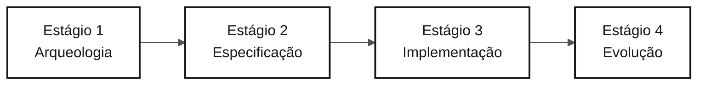

<!-- markdownlint-disable MD013 MD033 MD041 -->

# Persona — Tech Writer

> **Trilha:** [Kit do Time](../../README.md) › [Personas](../OVERVIEW.md) › [Tech Writer](README.md) › **PERSONA**

**Ficha de referência para quem ocupa a persona Tech Writer no workshop de modernização do SIFAP.**

  

| Campo | Valor |
|---|---|
| **Papel** | Tech Writer (Technical Writer) |
| **Par** | Par 5 — Operações (junto com DevOps Engineer) |
| **Estágios de atuação** | Todos os estágios (transversal); lidera Estágio 4 — Evolução (relatório do Agent) |
| **Artefatos que produz** | Glossário, relatório de descoberta (Estágio 1), spec e ADRs formatados (Estágio 2), README populado e `docs/` (Estágio 3), relatório de experiência com o Agent (Estágio 4) |
| **Artefatos que consome** | Decisões e código de todos os pares |
| **Handoff para** | Facilitadores — relatório final do Estágio 4; Product Owner — glossário e relatórios legíveis |

---

## O que é esta persona

O Tech Writer (Technical Writer) transforma decisões e código em memória durável para o projeto. Na modernização do SIFAP, essa persona mantém o glossário de termos do legado Natural/Adabas (MU, PE, FDT, DDM, ciclo mensal), formaliza as decisões arquiteturais em ADRs (Architecture Decision Records — registros formais de decisão) e garante que o README reflita o estado real da aplicação a cada hora do workshop, não apenas no final.

Por que importa: sem um Tech Writer deliberado, ADRs ficam arquivos vazios, o README permanece em "TODO: add instructions" e o conhecimento descoberto durante o workshop desaparece. O Tech Writer é a persona que torna o aprendizado do time rastreável e transferível.

No framework Agentic Legacy Modernization, o Tech Writer atua com o Documentation Agent em todas as fases, mantendo a rastreabilidade e a trilha de auditoria das decisões.

## Onde você atua no SDLC

| Estágio | Responsabilidade | Entregável |
|---|---|---|
| **1 — Arqueologia** | Manter glossário e catálogo em formato legível; escrever o relatório de descoberta ao fim do estágio | Relatório do Estágio 1 |
| **2 — Especificação** | Revisar a spec por consistência, terminologia e clareza; formatar ADRs com o template | Spec e ADRs em formato padrão |
| **3 — Implementação** | Transformar o README de placeholder em documentação real; registrar decisões em `docs/` conforme emergem | README populado + `docs/` |
| **4 — Evolução** | Acompanhar o Copilot Agent e escrever relatório honesto da experiência (o que funcionou, o que falhou, o que aprenderam) | Relatório final do Estágio 4 |

## Responsabilidade central

Manter documentação viva durante o dia inteiro — não no final. README que cresce a cada hora, ADRs escritos no momento da decisão, changelog presente e terminologia consistente do início ao fim do workshop.

## Competências-chave

- Escrita técnica no estilo Diátaxis (tutoriais, guias de como fazer, referência, explicação)
- Formalização de ADRs: contexto, decisão, consequências — nada mais, nada menos
- Rastreabilidade de documentação a código: endpoints, comandos, variáveis de ambiente reais
- Detecção de drift entre documentação e código (prompt `/doc-drift`)
- Manutenção de glossário e terminologia consistente em todo o projeto

## Kit da persona

| Artefato | Caminho | Uso |
|---|---|---|
| Agente Tech Writer | `.github/agents/tech-writer.agent.md` | Documentação de API, README, `CODEMAP.md`, changelog e detecção de drift |
| Prompt `/generate-docs` | `.github/prompts/persona-tech-writer-generate-docs.prompt.md` | Gerar documentação a partir de código |
| Prompt `/update-codemap` | `.github/prompts/persona-tech-writer-update-codemap.prompt.md` | Atualizar mapa do código |
| Prompt `/doc-drift` | `.github/prompts/persona-tech-writer-doc-drift.prompt.md` | Detectar divergência entre docs e código |

## Ferramentas e modos do Copilot

| Ferramenta / Modo | Quando usar |
|---|---|
| **Copilot Ask** | Revisão de estilo, clareza e consistência terminológica |
| **Copilot Ask (escrita longa)** | Redigir seções longas de documentação técnica |
| **Spec-Kit** (`/speckit.*`) | `spec.md`, `plan.md` e `tasks.md` gerados pelo Specify CLI — você mantém consistência com a documentação do time |
| **GitHub MCP** | Commits no `docs/` enquanto outros pares trabalham no código |

## Cheat-sheets recomendadas

- [`09-cheat-sheets/spec-kit-workflow.md`](../../09-cheat-sheets/spec-kit-workflow.md) — o Specify CLI gera `spec.md`, `plan.md`, `tasks.md`; você mantém consistência com a documentação
- [`09-cheat-sheets/model-routing.md`](../../09-cheat-sheets/model-routing.md) — Haiku 4.5 para revisão de estilo; Sonnet 4.6 para escrita de conteúdo

## Checkpoints horários

O Tech Writer é a persona mais transversal do time — atua em todos os estágios. Para não ficar aguardando algo para documentar, siga estes checkpoints:

| Período | O que fazer | Entregável visível |
|---|---|---|
| 11:00–12:00 | Ler os programas atribuídos ao Par 5 e registrar termos que apoiem o recorte | Glossário com termos relevantes |
| 13:30–14:00 | Consolidar vocabulário e decisões necessários para a feature fina | Apoio à spec da feature |
| 14:00–15:00 | Revisar clareza de `spec.md`, `plan.md` e `tasks.md`; registrar decisão de escopo | Artefatos formais consistentes |
| 15:00–16:10 | Documentar endpoints e comandos reais criados pelo protótipo | Documentação factual atualizada |
| 16:10–16:50 | Acompanhar o Agent, escrever `agent-experience-report.md` em tempo real | Relatório honesto preenchido |

> [!NOTE]
> Se em 30 minutos você não tiver nada para documentar, pergunte ao par líder do estágio: _"O que você decidiu nos últimos 30 minutos que ainda não está escrito?"_. Quase sempre há algo.

## Como ter bom desempenho

- [ ] **Cada ADR com contexto, decisão e consequências.** Não mais, não menos.
- [ ] **README evoluindo a cada hora.** Não apenas no final do dia.
- [ ] **Terminologia consistente do início ao fim.** Se o projeto usa "ciclo", nunca usar "rodada" no parágrafo seguinte.
- [ ] **Relatório do Estágio 4 honesto.** Não vender o Agent — documentar o que funcionou e o que falhou.

## Erros comuns e como evitar

| Sintoma | Causa | Correção |
|---|---|---|
| Nada escrito até o final do Estágio 3 | Aguardar o código "ficar pronto" para documentar | Documentar em tempo real — cada decisão no momento em que é tomada |
| ADRs de uma linha | Confundir registro com anotação | Usar o template: contexto (por que a decisão foi necessária), decisão (o que foi escolhido), consequências (o que muda) |
| README com "TODO: add instructions" no final | Postergação | Começar com: (1) o que o sistema é, (2) como rodar, (3) endpoints disponíveis |
| Relatório do Agent só elogios | Viés positivo | Documentar fricções, intervenções manuais, alucinações e o que precisou de correção |

## Combinações com outras personas

| Combinação | Observação |
|---|---|
| **Tech Writer + Product Owner** | Você escreve o "por quê" do projeto; visão e propósito documentados |
| **Tech Writer + DevOps Engineer** | Você documenta enquanto o pipeline roda; runbook natural |
| **Tech Writer + Requirements Engineer** | Forte em times pequenos — você estrutura e escreve requisitos com clareza |

## Prompts prontos para usar

1. **(Ask)** _"Revise este README e identifique: seções com TODO, terminologia inconsistente, informação desatualizada (portas, credenciais, endpoints). Proponha correções."_
2. **(Plan)** _"No arquivo ADR-001.md, planeje como completar as seções Contexto, Decisão e Consequências usando o template em `02-spec-moderna/ADR-TEMPLATE.md`."_
3. **(Ask)** _"Crie um relatório honesto da experiência com Copilot Agent: o que funcionou, o que surpreendeu, o que falhou. Base no template em `04-evolucao/agent-experience-report.md`."_

## Defaults de emergência

| Situação | O que fazer |
|---|---|
| Formato ADR desconhecido | Abrir `02-spec-moderna/ADR-TEMPLATE.md` — copiar e preencher as três seções obrigatórias |
| README vazio | Começar com: (1) o que o sistema é, (2) como rodar, (3) endpoints disponíveis |
| Glossário travado | Perguntar ao Copilot: _"Liste todas as abreviações encontradas nos arquivos `.NSN` do SIFAP e expanda cada uma."_ |
| Relatório do Agent vazio | Abrir `04-evolucao/agent-experience-report.md` — o template tem seções prontas para preencher |

## Dependências

| Persona | Relação | Artefato |
|---|---|---|
| Todos os pares | Você depende | Decisões e código para documentar |
| Product Owner | Depende de você | Glossário e relatórios legíveis |
| QA Engineer | Depende de você (indireto) | Terminologia consistente na spec |
| Facilitadores | Depende de você | Relatório final do Estágio 4 |

## Como você é avaliado

- **Rubrica A2 — Spec:** documentação consistente, terminologia padronizada
- **Rubrica A7 — Agent:** relatório honesto e detalhado da experiência com o Copilot Agent
- **Critério:** README evoluiu a cada hora; ADRs têm contexto, decisão e consequências; nenhuma seção diz TODO

---

### Continuar a leitura

| Anterior | Próximo |
|---|---|
| [DevOps Engineer — PERSONA](../09-devops-engineer/PERSONA.md) Par 5 — Operações — Terraform, GitHub Actions e runbook. | [Estágio 1 — Arqueologia](../../01-arqueologia/GUIDE.md) 11:00–12:00 — Ler o legado e catalogar regras de negócio. |

[Voltar ao índice do kit](../../README.md)
