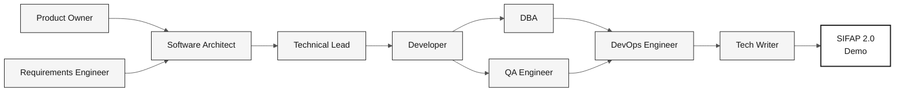

<!-- markdownlint-disable MD013 MD033 MD041 -->

# OVERVIEW das 10 Personas

> **Trilha:** [Kit do Time](../README.md) › [Personas](README.md) › **OVERVIEW**

**Tabela comparativa das 10 personas em uma página.** Use para escolher seu par, identificar quem lidera cada estágio e consultar defaults de emergência.

| Campo | Valor |
|---|---|
| **Público-alvo** | Todos os participantes do workshop |
| **Pré-requisitos** | Nenhum |
| **Tempo estimado** | 5 min |
| **Resultado esperado** | Par escolhido e passagem de bastão compreendida |

> [!TIP]
> Cada pessoa do time veste **2 personas** do mesmo par. O par fica junto durante todo o workshop — sem passagem interna entre as duas personas.

---

## Os 5 pares

---

## Tabela completa das 10 personas

| **#** | Persona | Par | Lidera estágio | Apoia em | Ferramenta principal | Default se travar |
|---|---|---|---|---|---|---|
| 01 | [Product Owner](01-product-owner/PERSONA.md) | 1 · Visão | 1 (priorização), 2 (sign-off de escopo) | 3, 4 | Copilot Ask + spec.prompt | "Temos 3h de código — escolham 3 features" |
| 02 | [Requirements Engineer](02-requirements-engineer/PERSONA.md) | 1 · Visão | 2 (EARS) | 1 | `/ears-convert` + Spec-Kit | Rastreia cada requisito à evidência |
| 03 | [Enterprise Architect](03-enterprise-architect/PERSONA.md) | 2 · Arquitetura | 2 (C4 + ADRs estruturais) | 4 | Mermaid + ADR template | Registra alternativas no template |
| 04 | [Software Architect](04-software-architect/PERSONA.md) | 2 · Arquitetura | 2 (bounded contexts, módulos) | 3 | `/codemap` + impl-plan | Valida hipóteses com o time |
| 05 | [Technical Lead](05-technical-lead/PERSONA.md) | 3 · Implementação | 3 (padrões, revisão) | 4, 2 | Plan mode + audit-context | Implementa a EARS priorizada |
| 06 | [Developer](06-developer/PERSONA.md) | 3 · Implementação | 3 (código) | 4 | Plan mode + `/tdd` | Toca apenas 1 endpoint completo, com teste |
| 07 | [DBA](07-dba/PERSONA.md) | 4 · Qualidade | 3 (migrações Flyway) | 3 | `/migration` + query-audit | Deriva o modelo dos DDMs |
| 08 | [QA Engineer](08-qa-engineer/PERSONA.md) | 4 · Qualidade | 3 (testes BDD) | 3 | Test-strategy skill | Escreve 1 teste de aceitação por REQ-ID crítica |
| 09 | [DevOps Engineer](09-devops-engineer/PERSONA.md) | 5 · Operações | 4 (Terraform + CI/CD) | transversal | `/iac-module` + `/pipeline` | `terraform plan` apenas, nunca `apply` |
| 10 | [Tech Writer](10-tech-writer/PERSONA.md) | 5 · Operações | 4 (relatório do Agent) | transversal (1, 2, 3) | Markdown skills + Copilot Ask | Consolida decisões do time |

---

## Quem lidera cada estágio

| **Estágio** | Horário | Lidera | Apoia |
|---|---|---|---|
| **1 · Arqueologia** | 11:00–12:00 + 13:30–14:00 | Todos os 5 pares em paralelo (cada um com 3 programas) | — |
| **2 · Especificação** | 14:00–15:00 | Par 2 (EA + SA) | Par 1 (escopo), Par 5 (revisão) |
| **3 · Implementação** | 15:00–16:10 | Pares 3 (TL + Dev) e 4 (DBA + QA) | Par 5 (esqueleto CI) |
| **4 · Evolução** | 16:10–16:50 | Par 5 (DevOps + TW) | Par 3 (Issues + revisão de PRs do Agent) |

---

## Cadeia de dependências

---

## Como escolher seu par

| Se você tem perfil de… | Considere o par |
|---|---|
| Negócio / produto | **1 · Visão** (PO + RE) |
| Arquitetura de sistemas | **2 · Arquitetura** (EA + SA) |
| Programação / desenvolvimento | **3 · Implementação** (TL + Dev) |
| Dados / testes | **4 · Qualidade** (DBA + QA) |
| Infraestrutura / documentação | **5 · Operações** (DevOps + TW) |

> [!NOTE]
> Pares 1, 4 e 5 acomodam pessoas sem background técnico em programação. Pares 2 e 3 requerem experiência técnica.

---

## Defaults de emergência (resumo)

Cada `PERSONA.md` detalha a seção "Se travar". Aqui está uma linha por persona:

- **PO:** "Temos 70 minutos de implementação; escolham uma feature fina."
- **RE:** Rastreie cada EARS à evidência e registre lacunas para clarificação.
- **EA:** Use o template ADR para documentar alternativas e a decisão do time.
- **SA:** Formule hipóteses de arquitetura e valide-as com o time.
- **TL:** Aborte refatoração sem teste; revise PRs do par.
- **Dev:** 1 endpoint completo > 5 quebrados. Testcontainers obrigatório.
- **DBA:** Modele a partir dos DDMs e nunca edite migration antiga.
- **QA:** 1 teste por REQ-ID crítica. Caminho feliz + caminho de erro.
- **DevOps:** `terraform plan` somente. `apply` em workshop é risco alto.
- **TW:** Pergunte ao par líder: "O que você decidiu nos últimos 30 min que ainda não está escrito?"

---

### Continuar a leitura

| Anterior | Próximo |
|---|---|
| [SETUP](../00-SETUP.md) Setup do laptop: Git, VS Code, Copilot, Spec-Kit, branch protection. | [Estágio 1 — Arqueologia](../01-arqueologia/GUIDE.md) 11:00–12:00 + 13:30–14:00 · Ler o legado e catalogar regras de negócio. |

[Voltar ao índice do kit](../README.md)
