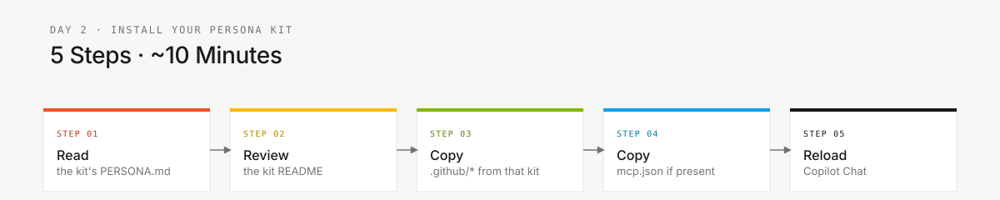

<!-- markdownlint-disable MD013 MD033 MD041 -->

# Persona Kits

> **Trilha:** [Kit do Time](../README.md) › **Personas**

**Guia de onboarding para as 10 personas do workshop.** Cada persona é um kit de ferramentas Copilot especializado em um papel do SDLC; cada pessoa do time escolhe e estuda 2 personas do mesmo par.

| Campo | Valor |
|---|---|
| **Público-alvo** | Todos os participantes do workshop |
| **Pré-requisitos** | [00-SETUP.md](../00-SETUP.md) concluído |
| **Tempo estimado** | 15 min |
| **Resultado esperado** | Duas personas identificadas, `.github/` validada, Copilot recarregado |


---

## Conceito

Uma persona é um kit de ferramentas Copilot especializado para um papel específico do ciclo de desenvolvimento. Cada kit inclui um agente configurado, prompts para tarefas recorrentes, instructions e skills. A persona direciona como o Copilot responde e quais atalhos de produtividade estão disponíveis.

No contexto do SIFAP, cada papel tem responsabilidades diretas sobre artefatos concretos — do catálogo de regras Natural/Adabas até os testes de aceitação e o pipeline de CI. Ao estudar a persona, você sabe o que produzir, de quem recebe e para quem entrega.

---

## Os 5 pares

O time do workshop tem 5 pessoas, cada uma usando 2 personas do mesmo par. Isso cobre o SDLC inteiro.

| **Par** | Personas | Kits |
|---|---|---|
| **1 · Visão** | Product Owner + Requirements Engineer | `01-product-owner/` + `02-requirements-engineer/` |
| **2 · Arquitetura** | Enterprise Architect + Software Architect | `03-enterprise-architect/` + `04-software-architect/` |
| **3 · Implementação** | Technical Lead + Developer | `05-technical-lead/` + `06-developer/` |
| **4 · Qualidade** | DBA + QA Engineer | `07-dba/` + `08-qa-engineer/` |
| **5 · Operações** | DevOps Engineer + Tech Writer | `09-devops-engineer/` + `10-tech-writer/` |

---

## O que cada kit contém

| **Artefato** | Propósito |
|---|---|
| `PERSONA.md` | Ficha completa: responsabilidades, passagem de bastão, prompts e critérios de avaliação |
| `README.md` | Inventário dos artefatos Copilot (caminhos em `.github/`) |
| `mcp.json` | Recomendações de servidores MCP para o papel (quando existir) |

Os artefatos ativos vivem consolidados na `.github/` da raiz:

| **Artefato** | Caminho |
|---|---|
| Agente Copilot ajustado ao papel | `.github/agents/*.agent.md` |
| Prompts para tarefas recorrentes | `.github/prompts/persona-*.prompt.md` |
| Skills reutilizáveis | `.github/skills/*/SKILL.md` |
| Regras específicas por tipo de arquivo | `.github/instructions/*.instructions.md` |

---

## Kits disponíveis

| **#** | Kit | Papel no workshop |
|---|---|---|
| 01 | [Product Owner](./01-product-owner/PERSONA.md) | Prioridade, escopo, valor e narrativa do demo |
| 02 | [Requirements Engineer](./02-requirements-engineer/PERSONA.md) | Requisitos EARS, critérios de aceitação e rastreabilidade |
| 03 | [Enterprise Architect](./03-enterprise-architect/PERSONA.md) | Dependências externas e decisões de escopo |
| 04 | [Software Architect](./04-software-architect/PERSONA.md) | Plano técnico, limites de módulos e ADRs quando necessários |
| 05 | [Technical Lead](./05-technical-lead/PERSONA.md) | Padrões, coordenação técnica e revisão de PRs |
| 06 | [Developer](./06-developer/PERSONA.md) | Código Java/TypeScript, testes e integração |
| 07 | [DBA](./07-dba/PERSONA.md) | Modelo PostgreSQL, migrações e mapeamento DDM |
| 08 | [QA Engineer](./08-qa-engineer/PERSONA.md) | Estratégia de testes, cobertura e gates |
| 09 | [DevOps Engineer](./09-devops-engineer/PERSONA.md) | CI/CD, Terraform, secrets e deploy |
| 10 | [Tech Writer](./10-tech-writer/PERSONA.md) | Glossário, clareza de ADR, README e runbook |

---

## Como ativar sua persona



> [!IMPORTANT]
> Conclua o [00-SETUP.md](../00-SETUP.md) antes de prosseguir.

- [ ] **Identificar suas duas personas.** Consulte seu par em [00-TEAM-FLOW.md](../00-TEAM-FLOW.md).
- [ ] **Ler as duas fichas.** Abra `05-personas/<papel>/PERSONA.md` para cada papel do seu par.
- [ ] **Validar a `.github/` consolidada.** Confirme que agents, prompts, instructions e skills estão presentes:

  ```bash
  ls .github/agents .github/prompts .github/instructions .github/skills
  ```

- [ ] **Copiar o MCP somente se necessário.** O facilitador indicará quando:

  ```bash
  [ -f 05-personas/06-developer/mcp.json ] && \
    mkdir -p .vscode && \
    cp 05-personas/06-developer/mcp.json .vscode/mcp.json
  ```

- [ ] **Recarregar o Copilot.** Abra a Command Palette e execute **Developer: Reload Window**.
- [ ] **Verificar agentes e prompts.** Digite `@` no painel do Copilot e confirme os agentes. Digite `/` e confirme os slash commands.

---

## Como estudar um kit em 10 minutos

- [ ] **Ler `PERSONA.md` primeiro.** Missão, responsabilidades, passagem de bastão e rubricas de avaliação.
- [ ] **Abrir o `README.md` do kit.** Inventário de agents, prompts, skills e MCPs.
- [ ] **Revisar os prompts disponíveis.** São atalhos para tarefas recorrentes, não substitutos para julgamento.
- [ ] **Conferir skills e instructions.** Skills guardam workflows; instructions aplicam regras por tipo de arquivo.
- [ ] **Anotar a passagem de bastão.** Toda persona precisa saber de quem recebe trabalho e para quem entrega.

---

## Definição de Pronto da instalação

- [ ] As duas fichas `PERSONA.md` do par foram lidas.
- [ ] A `.github/` consolidada contém agents, prompts, instructions e skills.
- [ ] `mcp.json` copiado para `.vscode/` quando existir.
- [ ] VS Code recarregado.
- [ ] Agentes aparecem ao digitar `@` no Copilot Chat.
- [ ] Prompts aparecem ao digitar `/` no Copilot Chat.

---

### Continuar a leitura

| Anterior | Próximo |
|---|---|
| [SETUP](../00-SETUP.md)<br/><sub>Setup do laptop: Git, VS Code, Copilot, Spec-Kit, branch protection.</sub> | [OVERVIEW das 10 personas](OVERVIEW.md)<br/><sub>Tabela comparativa: par, líder de estágio, defaults de emergência.</sub> |

<sub>[Voltar ao índice do kit](../README.md)</sub>
