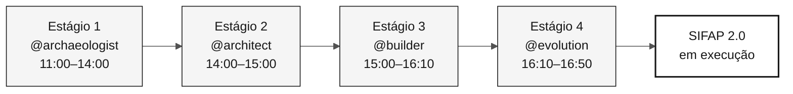

<!-- markdownlint-disable MD013 MD033 MD041 -->

# Agentes de Estágio — 4 Agentes de Contexto do Workshop

> **Trilha:** [Kit do Time](../README.md) › **Agentes de Estágio**

**Os agentes de estágio são agentes customizados do GitHub Copilot que concentram o contexto técnico de cada fase do workshop, garantindo que todo o time converse com o Copilot da mesma forma na mesma etapa.**

| Campo | Valor |
|---|---|
| **Público-alvo** | Time inteiro — leitura obrigatória antes do início |
| **Pré-requisitos** | GitHub Copilot ativo no VS Code |
| **Tempo estimado** | 10 min |
| **Estágio** | Todos |
| **Resultado esperado** | Saber qual agente usar, em qual momento, com qual papel |

---

## O que é um agente customizado do Copilot

Um agente customizado do GitHub Copilot é um perfil de instruções configurado em `.github/copilot-instructions.md` e nos arquivos de `skills`, que orienta o Copilot sobre o contexto, as ferramentas, o vocabulário e as restrições de uma tarefa específica.

Quando você seleciona `@archaeologist` no Copilot Chat, o Copilot carrega as instruções desse agente e passa a responder exclusivamente dentro daquele escopo — sem precisar que você repita o contexto a cada mensagem.

**Por que isso importa neste workshop:** sem agentes customizados, cada membro do time precisaria repetir o contexto do SIFAP, das regras de rastreabilidade e da stack-alvo em cada conversa. Os agentes de estágio eliminam essa repetição e criam um ritual compartilhado.

---

## Duas camadas de configuração

Este workshop usa duas camadas de configuração do Copilot que trabalham juntas:

| Camada | O que faz | Onde fica |
|---|---|---|
| **Persona-kit** (coluna) | Define o papel individual: Product Owner, Developer, QA… | [`05-personas/`](../05-personas/) |
| **Agente de estágio** (linha) | Define o contexto da fase: arqueologia, spec, implementação, evolução | Esta pasta |

A persona responde "quem sou eu neste time". O agente responde "em que fase estamos agora". Cada pessoa mantém suas duas personas o dia inteiro; o agente de estágio muda conforme o cronograma avança.

---

## Os 4 agentes e o cronograma

| Estágio | Horário | Agente | Postura do agente | Para que serve |
|---|---|---|---|---|
| Estágio 1 — Arqueologia | 11:00–12:00 + 13:30–14:00 | [@archaeologist](01-archaeologist/README.md) | Investigativa | Ler legado, registrar evidência e recortar uma feature |
| Estágio 2 — Especificação | 14:00–15:00 | [@architect](02-architect/README.md) | Analítica | Criar `spec.md`, `plan.md` e `tasks.md` com decisões de escopo |
| Estágio 3 — Implementação | 15:00–16:10 | [@builder](03-builder/README.md) | Construtiva | Construir Java/Next.js, testes, migrations e endpoints rastreáveis |
| Estágio 4 — Evolução | 16:10–16:50 | [@evolution](04-evolution/README.md) | Operacional | Delegar uma Issue pequena e registrar o resultado da revisão |

---

## Como selecionar o agente no Copilot Chat

- [ ] **Confirmar a etapa atual** em [00-TEAM-FLOW.md](../00-TEAM-FLOW.md).
- [ ] **Abrir o Copilot Chat** no VS Code (atalho: `Ctrl+Alt+I` / `Cmd+Alt+I`).
- [ ] **Clicar no seletor de agentes** (ícone de arroba ou menu de contexto no campo de mensagem).
- [ ] **Selecionar o agente correspondente ao estágio atual** (ex.: `@archaeologist`).
- [ ] **Abrir o README do agente** na tabela acima e copiar o prompt de abertura.
- [ ] **Trabalhar nos entregáveis da Definição de Pronto** do agente até o gate de passagem.

> [!WARNING]
> Não pule o gate de passagem entre estágios. Ele existe para garantir que o próximo agente receba evidências, decisões e pendências explícitas — não apenas conversa no chat.

---

## Matriz de responsabilidade persona × agente

**Protagonista** conduz a conversa com o agente. **Secundário** contribui ativamente. **Observador** acompanha e tira dúvidas quando chamado.

| Persona | @archaeologist | @architect | @builder | @evolution |
|---|---|---|---|---|
| Product Owner | Observador | Secundário | Observador | Secundário |
| Requirements Engineer | **Protagonista** | Secundário | Observador | Observador |
| Enterprise Architect | Secundário | Secundário | Observador | Observador |
| Software Architect | Observador | **Protagonista** | Secundário | Observador |
| Technical Lead | Observador | Secundário | Secundário | **Protagonista** |
| Developer | Observador | Observador | **Protagonista** | Secundário |
| DBA | Secundário | Observador | Secundário | Observador |
| QA Engineer | Observador | Observador | Secundário | Secundário |
| DevOps Engineer | Observador | Observador | Secundário | Secundário |
| Tech Writer | Secundário | Observador | Observador | Secundário |

Para a versão detalhada, consulte [docs/persona-agent-matrix.md](../docs/persona-agent-matrix.md).

---

## Princípio: o agente não conhece o seu legado

Os agentes sabem **como** modernizar Natural/Adabas. Eles não sabem **o que** existe no legado do seu time. Isso é proposital: o aprendizado acontece quando o time lê, debate e registra evidências.

| Pedido inadequado | Resposta esperada do agente |
|---|---|
| "Me diga tudo que o sistema faz" | "Abra o primeiro arquivo e vamos ler juntos." |
| "Crie a arquitetura sem ler o legado" | "Ainda estamos sem evidência. Volte ao Estágio 1." |
| "Implemente sem REQ-ID" | "Falta rastreabilidade. Crie ou aponte o requisito." |

---

## Critérios de conclusão por estágio

- [ ] O time usa o mesmo agente na mesma etapa ao mesmo tempo.
- [ ] O protagonista sabe qual entregável precisa sair daquela conversa.
- [ ] A etapa termina com artefatos versionados no repositório, não apenas com conversa no chat.
- [ ] A passagem de bastão seguinte recebe evidências, decisões e pendências explícitas.

---

### Continuar a leitura

| Anterior | Próximo |
|---|---|
| [Persona Kits](../05-personas/) Configuração individual por papel no time. | [@archaeologist](01-archaeologist/README.md) Estágio 1: leitura do legado Natural/Adabas. |

[Voltar ao índice do kit](../README.md)
