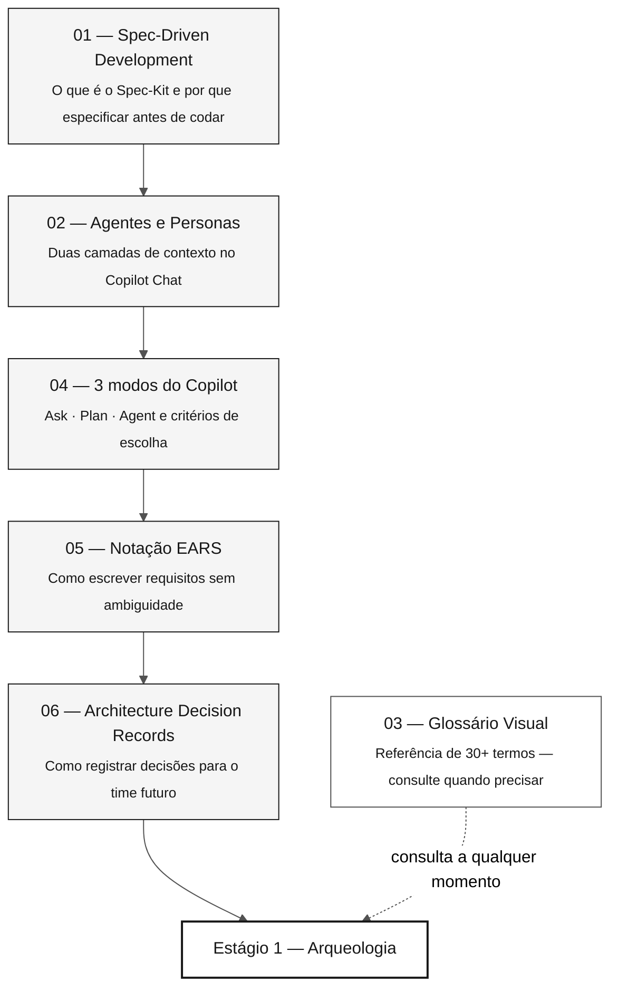

<!-- markdownlint-disable MD013 MD033 MD041 -->

# 07 — Conceitos Fundamentais do Workshop

> **Trilha:** [Kit do Time](../README.md) › **Conceitos Fundamentais**

**Este índice apresenta os conceitos essenciais do workshop de modernização do SIFAP — o que você vai aprender, em que ordem, quanto tempo leva e como cada conceito se conecta aos quatro estágios de trabalho.**

  

| Campo | Valor |
|---|---|
| **Público-alvo** | Qualquer pessoa do time, incluindo quem não programa |
| **Pré-requisitos** | Nenhum — este é o ponto de partida |
| **Tempo estimado** | 60 a 90 min para ler todos os documentos |
| **Resultado esperado** | Vocabulário compartilhado antes do Estágio 1 |

---

## O que você vai aprender

Cada arquivo desta pasta explica um conceito técnico de forma direta, com exemplos reais do domínio SIFAP (pagamentos, benefícios, fiscalização). Ao concluir a leitura, você consegue:

- Explicar o ciclo do Spec-Kit sem consultar nada
- Distinguir persona-kit de agente de estágio e saber como combiná-los no Copilot Chat
- Escolher o modo correto do Copilot (Ask, Plan ou Agent) para cada situação
- Escrever ou revisar um requisito no formato EARS com `source_legacy:`
- Escrever ou avaliar uma Architecture Decision Record (ADR)

---

## Trilha de aprendizado

---

## Documentos desta pasta

| # | Documento | Conceito central | Estágio principal |
|---|---|---|---|
| 01 | [Spec-Driven Development](01-spec-driven-development.md) | Ciclo Spec-Kit: specify → plan → tasks → implement | Estágio 2 |
| 02 | [Agentes e Personas](02-agentes-e-personas.md) | Persona-kit individual × agente de estágio compartilhado | Todos |
| 03 | [Glossário Visual](03-glossario-visual.md) | 30+ termos com definição, exemplo SIFAP e referência | Todos |
| 04 | [3 modos do Copilot](04-3-modos-do-copilot.md) | Ask · Plan · Agent — critérios e antipadrões | Todos |
| 05 | [Notação EARS](05-notacao-ears.md) | 5 padrões EARS, REQ-ID e `source_legacy:` | Estágio 2 |
| 06 | [Architecture Decision Records](06-architecture-decision-records.md) | Anatomia, quando escrever e ciclo de vida de ADRs | Estágio 2 |

---

## Conexão com os quatro estágios

| Estágio | Documentos de referência desta pasta |
|---|---|
| Estágio 1 — Arqueologia | Glossário (termos legado: Natural, DDM, MU, PE, BR-NNN) |
| Estágio 2 — Especificação | Spec-Kit, Agentes, EARS, ADR, Glossário (EARS, REQ-ID, source_legacy) |
| Estágio 3 — Implementação | 3 modos do Copilot, Glossário (JPA, Flyway, Testcontainers, Controller) |
| Estágio 4 — Evolução | 3 modos do Copilot (modo Agent), Glossário (IaC, Terraform, CI/CD) |

---

## Verificacao antes de continuar

Antes de iniciar o Estágio 1, confirme que você consegue responder estas perguntas sem consultar nada:

- [ ] O que é o Spec-Kit e para que serve o comando `/speckit.specify`?
- [ ] Qual a diferença entre persona-kit (em `05-personas/`) e agente de estágio (em `06-agentes-de-estagio/`)?
- [ ] Quando usar Ask em vez de Agent no Copilot?
- [ ] O que é uma EARS e por que o campo `source_legacy:` é obrigatório?
- [ ] O que é um ADR e em qual situação você escreveria um?

Se respondeu quatro das cinco: avance para [`../05-personas/`](../05-personas/) e leia os seus dois `PERSONA.md`.

---

### Continuar a leitura

| Anterior | Próximo |
|---|---|
| [Kit do Time](../README.md) Hub principal do workshop. | [Spec-Driven Development](01-spec-driven-development.md) Por que especificar antes de codar e como o Spec-Kit estrutura esse processo. |

[Voltar ao índice do kit](../README.md)
