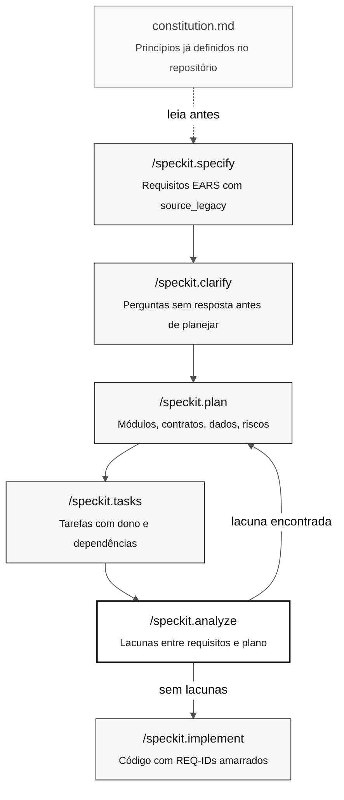

<!-- markdownlint-disable MD013 MD033 MD041 -->

# Spec-Driven Development e o Spec-Kit

> **Trilha:** [Kit do Time](../README.md) › [Conceitos](00-README.md) › **Spec-Driven Development**

**Spec-Driven Development (SDD) é a prática de especificar completamente o comportamento esperado antes de escrever código — e o Spec-Kit é o conjunto de comandos que estrutura esse processo no Copilot Chat.**

  

| Campo | Valor |
|---|---|
| **Público-alvo** | Todas as personas, especialmente Requirements Engineer e Software Architect |
| **Pré-requisitos** | Ter lido os programas `.NSN` atribuídos no Estágio 1 |
| **Tempo estimado** | 20 minutos |
| **Estágio** | Estágio 2 — Especificação |
| **Resultado esperado** | Compreender o ciclo Spec-Kit e saber quando acionar cada comando |

---

## Conceito

Spec-Driven Development é uma abordagem em que a equipe produz uma especificação formal — com requisitos, plano arquitetural e tarefas — antes de qualquer linha de código ser escrita. O resultado é que cinco pessoas trabalhando em paralelo constroem partes compatíveis de um mesmo sistema, em vez de cinco versões divergentes.

O **Spec-Kit** (repositório oficial: [github/spec-kit](https://github.com/github/spec-kit)) é a implementação prática do SDD para times usando GitHub Copilot. Ele expõe uma sequência de comandos no Copilot Chat que conduzem a equipe da ideia vaga até tarefas concretas com dono e rastreabilidade.

---

## Por que importa neste workshop

No workshop SIFAP, cinco pessoas têm algumas horas para modernizar um sistema de 29 anos. Sem uma especificação compartilhada, cada pessoa implementa o que entendeu do legado — e o resultado é código incompatível, regras duplicadas ou funcionalidades faltando.

O Spec-Kit resolve esse problema ao tornar obrigatório o ciclo:

> especificar o comportamento esperado → planejar a arquitetura → distribuir tarefas → implementar

Nenhuma linha de código deve ser escrita antes de `/speckit.plan` ter sido executado e validado.

---

## Como funciona

O ciclo completo do Spec-Kit tem sete comandos. Cada um produz um artefato concreto:



| Comando | O que produz | Quando usar |
|---|---|---|
| `/speckit.constitution` | Princípios gerais do sistema (stack, padrões, restrições) | Uma vez por projeto — já está em `.specify/memory/constitution.md` |
| `/speckit.specify` | Lista de requisitos EARS com REQ-ID e `source_legacy:` | No início do Estágio 2, para cada funcionalidade confirmada |
| `/speckit.clarify` | Perguntas sobre comportamentos sem evidência no legado | Após `specify`, antes de planejar |
| `/speckit.plan` | Módulos, contratos de API, modelo de dados, riscos | Após responder todas as perguntas do `clarify` |
| `/speckit.tasks` | Tarefas com estimativa, dono e dependência | Após o plano ser aprovado pelo time |
| `/speckit.analyze` | Relatório de consistência: lacunas, conflitos, cobertura | Antes de implementar — obrigatório |
| `/speckit.implement` | Código, testes e migrations com REQ-IDs rastreados | Somente após `analyze` sem lacunas críticas |

---

## Exemplo aplicado ao SIFAP

Suponha que o Estágio 1 revelou que o programa `CALCPGTO.NSN` calcula o valor líquido de um benefício descontando contribuições. O fluxo no Estágio 2 seria:

```bash
# 1. Verifique os princípios do sistema
cat .specify/memory/constitution.md

# 2. Especifique a funcionalidade
/speckit.specify cálculo de valor líquido de benefício conforme CALCPGTO.NSN.
Inclua source_legacy em cada requisito.

# 3. Resolva as perguntas abertas
/speckit.clarify
# Exemplo de pergunta gerada: "Quando há contribuição em atraso, o desconto
# é calculado sobre o bruto ou sobre o já descontado?"
# → Responda consultando o legado ou o PO antes de continuar.

# 4. Planeje a arquitetura
/speckit.plan
# Use a stack do workshop: Java 21 + Spring Boot 3.3 + PostgreSQL 16.

# 5. Distribua as tarefas
/speckit.tasks

# 6. Verifique consistência
/speckit.analyze

# 7. Implemente
/speckit.implement
```

Cada REQ-ID gerado em `/speckit.specify` deve conter a linha `source_legacy:` apontando para o trecho exato do `.NSN`. Sem ela, o job de CI `legacy-traceability` rejeita o PR.

---

## Caso de uso

Use o Spec-Kit sempre que o time começar uma funcionalidade nova no Estágio 2. Mesmo que a funcionalidade pareça simples, executar o ciclo completo evita o principal risco do workshop: **modernizar o que o time acha que o sistema faz, não o que ele realmente faz**.

---

## Erros comuns e como evitar

| Sintoma | Causa | Correcao |
|---|---|---|
| Código escrito antes do `plan` | A equipe pulou as etapas iniciais | Volte ao `specify`. Código sem spec é retrabalho garantido. |
| `source_legacy:` ausente em um REQ-ID | Requisito escrito de memória, sem evidência no legado | Abra o `.NSN` correspondente e localize o trecho exato. |
| Doze perguntas no `clarify` | Normal — não é problema | Responda todas. Cada pergunta não respondida vira um bug. |
| `analyze` aponta lacunas | Plano incompleto ou inconsistente | Não avance para `implement`. Corrija o plano e re-execute. |
| Spec-Kit não encontrado | Instalação incompleta | Veja [`09-cheat-sheets/spec-kit-workflow.md`](../09-cheat-sheets/spec-kit-workflow.md). |

---

## Checklist de uso

- [ ] **Ler o `constitution.md` antes de tudo.** Confirmar stack, padrões e restrições do projeto.
- [ ] **Executar `/speckit.specify` com base em evidência do legado.** Nunca de memória.
- [ ] **Responder todas as perguntas do `/speckit.clarify`.** Registrar decisões.
- [ ] **Aprovar o plano com o time antes de `/speckit.tasks`.** O plano é um artefato coletivo.
- [ ] **Executar `/speckit.analyze` e corrigir lacunas antes de implementar.**
- [ ] **Todo REQ-ID tem `source_legacy:` ou `[GREENFIELD] + justificativa`.**

---

## Referências

- [Repositório oficial do Spec-Kit](https://github.com/github/spec-kit)
- [Cheat-sheet de comandos](../09-cheat-sheets/spec-kit-workflow.md)
- [Guia do Estágio 2](../02-spec-moderna/GUIDE.md)

---

### Continuar a leitura

| Anterior | Próximo |
|---|---|
| [Índice de Conceitos](00-README.md)<br/><sub>O que você vai aprender e em que ordem.</sub> | [Agentes e Personas](02-agentes-e-personas.md)<br/><sub>As duas camadas de contexto no Copilot Chat.</sub> |

<sub>[Voltar ao índice do kit](../README.md)</sub>
