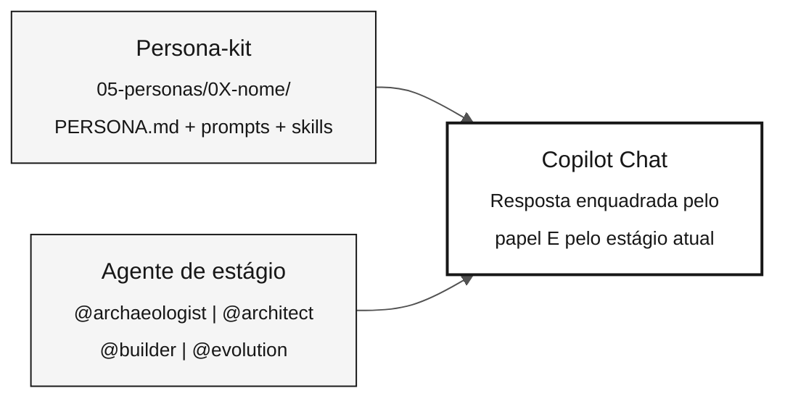

<!-- markdownlint-disable MD013 MD033 MD041 -->

# Agentes e Personas — As Duas Camadas de Contexto

> **Trilha:** [Kit do Time](../README.md) › [Conceitos](00-README.md) › **Agentes e Personas**

**O Copilot Chat opera com duas camadas de contexto simultâneas: a persona, que define o papel individual de cada participante, e o agente de estágio, que define o enquadramento coletivo do time — saber combiná-las é fundamental para obter respostas relevantes durante o workshop.**

  

| Campo | Valor |
|---|---|
| **Público-alvo** | Todas as personas |
| **Pré-requisitos** | Nenhum — leia antes do Estágio 1 |
| **Tempo estimado** | 20 minutos |
| **Estágio** | Todos os estágios |
| **Resultado esperado** | Saber selecionar agente e persona e usá-los em conjunto no Copilot Chat |

---

## Conceito

O workshop usa **dois tipos de agente** no Copilot:

- **Persona-kit** — contexto individual, carregado por cada participante a partir de `05-personas/`. Define o papel, as habilidades e os comandos disponíveis para aquela pessoa ao longo de todo o dia.
- **Agente de estágio** — contexto coletivo, selecionado pelo time inteiro no início de cada estágio. Define o enquadramento temático da conversa com o Copilot para aquele bloco de trabalho.

As duas camadas coexistem. Você nunca troca a persona pelo agente de estágio — você usa as duas ao mesmo tempo.

---

## Por que importa

Sem persona selecionada, o Copilot responde como assistente genérico, sem considerar as habilidades ou restrições do seu papel. Sem agente de estágio, cada membro do time recebe respostas com enquadramentos diferentes, tornando impossível manter consistência.

Com as duas camadas ativas, o Copilot sabe simultaneamente:

- **Quem pergunta** (papel, habilidades, slash commands disponíveis)
- **Em que contexto o time está** (Estágio 1: arqueologia; Estágio 2: especificação; etc.)

---

## Como se combinam



---

## Camada 1 — Personas (kit individual)

Cada participante escolhe **dois papéis** (duas personas) e mantém ambos durante todo o workshop. Os arquivos de cada persona estão em [`05-personas/`](../05-personas/) e já estão consolidados na raiz do repositório em `.github/`.

| Persona | Papel no workshop | Estágio de maior atuação |
|---|---|---|
| **Product Owner** | Define escopo, valida requisitos com o negócio | Estágios 1 e 2 |
| **Requirements Engineer** | Lê o legado e converte regras em EARS | Estágios 1 e 2 |
| **Enterprise Architect** | Visão macro do sistema (C4 L1 e L2) | Estágio 2 |
| **Software Architect** | Define bounded contexts e contratos de API | Estágio 2 |
| **Technical Lead** | Conduz revisão de PR e decisões de implementação | Estágios 3 e 4 |
| **Developer** | Implementa código Java e Next.js | Estágio 3 |
| **DBA** | Modela dados, escreve migrations, otimiza consultas | Estágio 3 |
| **QA Engineer** | Escreve e valida testes de equivalência | Estágio 3 |
| **DevOps Engineer** | Configura CI/CD, Terraform, Actions | Estágio 4 |
| **Tech Writer** | Documenta APIs, ADRs e runbooks | Estágios 2 e 4 |

### O que vem com cada persona

O kit da persona contém os seguintes artefatos em `05-personas/0X-nome/` e `.github/`:

| Artefato | Localização | Para que serve |
|---|---|---|
| `PERSONA.md` | `05-personas/0X-nome/` | Ficha do papel: responsabilidades, entregáveis, slash commands |
| `*.prompt.md` | `.github/prompts/` | Prompts especializados para o papel |
| `SKILL.md` | `.github/skills/*/` | Conhecimento de domínio ativado automaticamente |
| `*.instructions.md` | `.github/instructions/` | Regras aplicadas automaticamente em determinados arquivos |
| `mcp.json` | Raiz do repo | Servidores MCP disponíveis para o papel |

> [!IMPORTANT]
> Leia seus dois `PERSONA.md` antes de iniciar qualquer estágio. Os slash commands só funcionam se o contexto do repositório estiver carregado no Copilot Chat.

---

## Camada 2 — Agentes de estágio (kit coletivo)

O time inteiro seleciona o mesmo agente de estágio no Copilot Chat no início de cada bloco de trabalho. Isso garante que todos recebam respostas com o mesmo enquadramento.

| Estágio | Agente | Enquadramento temático | Protagonistas |
|---|---|---|---|
| Estágio 1 — Arqueologia | [`@archaeologist`](../06-agentes-de-estagio/01-archaeologist/) | Leitura e interpretação de código legado Natural/Adabas | Requirements Engineer, Tech Writer |
| Estágio 2 — Especificação | [`@architect`](../06-agentes-de-estagio/02-architect/) | Especificação EARS, ADRs, modelo C4 | Enterprise Architect, Software Architect |
| Estágio 3 — Implementação | [`@builder`](../06-agentes-de-estagio/03-builder/) | Código Java 21, JPA, Testcontainers, Next.js 15 | Developer, DBA, QA Engineer |
| Estágio 4 — Evolução | [`@evolution`](../06-agentes-de-estagio/04-evolution/) | Delegação ao modo Agent, IaC, CI/CD | DevOps Engineer, Tech Writer |

### Diferença prática

| Sem agente de estágio selecionado | Com agente de estágio selecionado |
|---|---|
| Copilot responde no contexto geral do repositório | Copilot assume o enquadramento do estágio atual |
| Cada pessoa recebe respostas com ênfases diferentes | O time recebe respostas consistentes entre si |
| Pode sugerir ações inadequadas para o momento (ex.: código no Estágio 1) | Restringe-se ao escopo do estágio atual |

---

## Como selecionar

### Persona

1. Abra o Copilot Chat no VS Code.
2. Selecione o painel do agente (ícone no canto superior do campo de entrada).
3. Escolha a persona correspondente ao seu papel no dropdown.
4. Confirme executando um slash command do seu `PERSONA.md` — se funcionar, está ativo.

### Agente de estágio

1. No início de cada estágio, o facilitador anuncia qual agente o time usa.
2. Cada participante seleciona o agente no Copilot Chat da mesma forma que a persona.
3. A persona individual permanece — o agente de estágio é adicionado ao contexto, não substitui.

---

## Exemplo aplicado ao SIFAP

**Cenário:** você é Requirements Engineer no Estágio 2. O time acabou de migrar do Estágio 1.

```
1. O facilitador anuncia: "Selecionem @architect no chat."

2. Você seleciona @architect.
   Resultado: o Copilot Chat passa a enquadrar respostas
   no contexto de especificação e arquitetura.

3. Você usa o modo Ask para orientação:
   "@architect, qual a ordem recomendada para especificar
   as regras do catálogo business-rules-catalog.md?"

4. Com base na resposta, você aciona o slash command do seu papel:
   /ears-convert BR-042: <regra de cálculo de benefício>
   Use CALCPGTO.NSN#L120-L198 como source_legacy.

5. O EARS sai com REQ-ID e source_legacy.
   O CI valida a rastreabilidade no PR.
```

---

## Erros comuns e como evitar

| Sintoma | Causa | Correcao |
|---|---|---|
| Copilot sugere código durante o Estágio 1 | Agente de estágio errado ou ausente | Selecione `@archaeologist` e confirme com o time |
| Slash command não é reconhecido | Janela do Copilot aberta fora da raiz do repositório | Reabra o VS Code na raiz do repositório |
| Respostas inconsistentes entre membros do time | Cada um com agente diferente selecionado | Confirmar agente ativo no início de cada estágio |
| Agente de estágio substituiu a persona | Confusão na seleção | Persona e agente de estágio são seleções independentes no painel |

---

## Checklist de ativacao

- [ ] **Ler os dois `PERSONA.md` atribuídos a você.** Localizar em `05-personas/`.
- [ ] **Testar um slash command da persona** no Copilot Chat para confirmar que está ativo.
- [ ] **No início de cada estágio, selecionar o agente correto** junto com o restante do time.
- [ ] **Confirmar o agente ativo antes de fazer perguntas técnicas críticas.**

---

## Referencias

- [Lista completa de personas](../05-personas/OVERVIEW.md)
- [Agentes de estágio](../06-agentes-de-estagio/)
- [Cheat-sheet dos 3 modos do Copilot](../09-cheat-sheets/copilot-3-modes.md)

---

### Continuar a leitura

| Anterior | Próximo |
|---|---|
| [Spec-Driven Development](01-spec-driven-development.md)<br/><sub>Por que especificar antes de codar e o ciclo do Spec-Kit.</sub> | [Glossário Visual](03-glossario-visual.md)<br/><sub>30+ termos com definição, exemplo SIFAP e referência.</sub> |

<sub>[Voltar ao índice do kit](../README.md)</sub>
