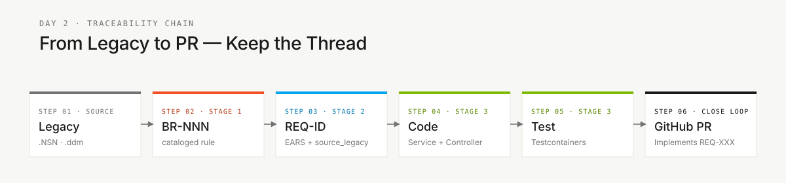

<!-- markdownlint-disable MD013 MD033 MD041 -->

# Glossário — Jargão do Workshop Decodificado

> **Trilha:** [Kit do Time](../README.md) › [Conceitos](00-README.md) › **Glossário Visual**

**Referência de 30+ termos técnicos usados no workshop SIFAP, organizados por área, com definição de uma frase, exemplo do domínio e link para leitura aprofundada.**

 

| Campo | Valor |
|---|---|
| **Público-alvo** | Qualquer pessoa do time, especialmente Product Owner, Tech Writer e analistas |
| **Como usar** | Mantenha esta aba aberta durante o workshop. Não é necessário decorar — consulte ao encontrar um termo desconhecido. |

---

## Mapa por estágio

| Estágio | Termos que aparecem com frequência |
|---|---|
| Estágio 1 — Arqueologia | Natural, NSN, DDM, Adabas, MU, PE, BR-NNN |
| Estágio 2 — Especificação | EARS, REQ-ID, source_legacy, ADR, C4, bounded context, greenfield, Spec-Kit |
| Estágio 3 — Implementação | JPA, Flyway, migração, Testcontainers, controller, service, repository, Bean Validation, Server Component, Swagger |
| Estágio 4 — Evolução | Agent, Issue, PR, Terraform, IaC, CI/CD, Actions |

---

## Tabela de equivalência (EN › PT-BR)

| Inglês | Português do workshop | Contexto de uso |
|---|---|---|
| handoff | passagem de bastão | Transição entre estágios |
| stakeholder | parte interessada | Personas Product Owner e Requirements Engineer |
| backlog | lista de pendências | Gerenciamento de tarefas no GitHub Projects |
| commit | versão registrada | Controle de versão Git |
| push | envio para o repositório remoto | Git — compartilhar mudanças com o time |
| pull request (PR) | proposta de mudança | Revisão de código antes do merge |
| merge | integrar branch | Incorporar mudanças na branch principal |
| code review | revisão de código | Revisão de PR antes do merge |
| CI green | pipeline de CI aprovado | Todos os testes passaram |
| CI red | pipeline de CI com falha | Pelo menos um teste ou verificação falhou |
| breaking change | mudança incompatível | Alteração que quebra contratos de API existentes |
| rollback | reverter para versão anterior | Desfazer deploy com problema |
| feature flag | chave liga/desliga de funcionalidade | Ativar feature sem redeploy |
| deployment | publicação de versão | Disponibilizar versão em ambiente |
| production | ambiente de produção real | Ambiente dos usuários finais |
| staging | ambiente de homologação | Validação antes da produção |
| sandbox | ambiente isolado de experimentos | Testes sem risco ao sistema real |
| bug | defeito de software | Comportamento incorreto identificado |
| hotfix | correção urgente | Correção aplicada diretamente em produção |
| refactor | reestruturar sem alterar comportamento | Melhorar código preservando funcionalidade |
| technical debt | dívida técnica | Atalhos tomados que precisarão ser corrigidos |
| smoke test | teste de sanidade mínimo | Verificação rápida de que o sistema funciona |
| spike | investigação técnica curta | Explorar solução antes de comprometer com ela |

---

## Area: Legado

### Adabas

Banco de dados do mainframe onde o SIFAP armazena dados há 29 anos. Difere de bancos relacionais convencionais por suportar campos de valor múltiplo (MU) e grupos periódicos (PE). Os arquivos de definição são os DDMs. Aparece no Estágio 1 ao inspecionar `01-arqueologia/legado-sifap/adabas-ddms/`.

### DDM — Data Definition Module

Arquivo `.ddm` do Adabas que descreve a estrutura de um "arquivo" (equivalente a uma tabela): campos, tipos, tamanhos e ocorrências. Exemplo SIFAP: `BENEFICIARIO.ddm` define os campos do cadastro de beneficiários. Localização: `01-arqueologia/legado-sifap/adabas-ddms/`.

### MU — Multiple-Value field

Campo do Adabas que armazena múltiplos valores dentro de um único registro — por exemplo, um campo `TELEFONES` com até cinco números. O equivalente SQL seria uma tabela filha com chave estrangeira. O time deve documentar em ADR como preservar essa multiplicidade no modelo moderno.

### Natural (linguagem de programação)

Linguagem dos anos 1980 usada com Adabas. Os programas SIFAP estão em arquivos `.NSN`. Sintaxe imperativa com `IF`/`END-IF`, `FOR`/`END-FOR`, sem orientação a objeto. Guia de leitura: [`01-arqueologia/legado-sifap/COMO-LER-NATURAL.md`](../01-arqueologia/legado-sifap/COMO-LER-NATURAL.md).

### NSN (arquivo `.NSN`)

Extensão dos programas Natural. Equivalente a `.java` ou `.py`, mas para Natural. O SIFAP tem 15 programas `.NSN` em `01-arqueologia/legado-sifap/natural-programs/`.

### PE — Periodic Group

Grupo de campos do Adabas que se repete múltiplas vezes dentro do mesmo registro — por exemplo, até 12 históricos mensais de pagamento. Mais complexo que MU por envolver vários campos correlacionados por ocorrência. O mapeamento para o modelo relacional moderno requer decisão documentada em ADR.

### BR-NNN — Business Rule

Identificador de uma regra de negócio extraída do legado durante o Estágio 1 (exemplo: `BR-042`). Usado no catálogo `business-rules-catalog.md`. Sem esse identificador, a regra não pode ser rastreada até o requisito que a implementa.

---

## Area: Requisitos

### EARS — Easy Approach to Requirements Syntax

Notação padronizada para escrever requisitos sem ambiguidade. Oferece seis padrões sintáticos (ubiquitous, event-driven, state-driven, optional, unwanted e complex) que substituem afirmações vagas por frases com formato fixo e teste objetivo. Detalhes completos em [05 — Notação EARS](05-notacao-ears.md).

### REQ-ID

Identificador único de um requisito (exemplo: `REQ-042`). Todo commit do Estágio 3 que implementa um requisito deve citar `Implements REQ-042` na mensagem. Sem REQ-ID, não há rastreabilidade.

### `source_legacy:`

Campo obrigatório em cada REQ-ID que aponta para o trecho do legado de origem. Formato: `01-arqueologia/legado-sifap/natural-programs/CALCPGTO.NSN#L120-L198`. Se a funcionalidade é nova, usar `[GREENFIELD] <justificativa>`. Ausência causa rejeição pelo CI.

### Greenfield

Requisito que não tem correspondência no legado — funcionalidade genuinamente nova. Deve ser documentado com `source_legacy: "[GREENFIELD] <motivo>"` e justificado junto ao Product Owner.

### Spec-Kit

Ferramenta oficial do GitHub para Spec-Driven Development. Expõe os comandos `/speckit.specify`, `/speckit.clarify`, `/speckit.plan`, `/speckit.tasks`, `/speckit.analyze` e `/speckit.implement` no Copilot Chat. Detalhes em [01 — Spec-Driven Development](01-spec-driven-development.md).

---

## Area: Arquitetura

### ADR — Architecture Decision Record

Arquivo Markdown curto que registra uma decisão de arquitetura: o contexto, a decisão tomada, as alternativas consideradas e as consequências. Garante que decisões tomadas hoje sejam compreendidas pelos membros futuros do time. Template em `02-spec-moderna/ADR-TEMPLATE.md`. Detalhes em [06 — Architecture Decision Records](06-architecture-decision-records.md).

### Bounded Context

Segmento bem delimitado do sistema com vocabulário e regras próprios. No SIFAP, "beneficiário" significa coisas diferentes no contexto de Cadastro, Cálculo e Fiscalização. As fronteiras são hipóteses que o time valida e documenta em ADR. Aparece nos Estágios 2 e 3.

### C4 (modelo C4)

Abordagem para documentar arquitetura em quatro níveis de zoom: Contexto do sistema (L1), Containers (L2), Componentes (L3) e Código (L4). No workshop, usamos apenas L1 e L2. Aparece no Estágio 2 como entregável do Enterprise Architect.

### Modular Monolith

Padrão arquitetural adotado neste workshop: um único processo deployável dividido em módulos internos com fronteiras bem definidas. Escolhido em vez de microsserviços por adequação ao prazo do workshop. Documentado no ADR-001.

### Strangler Fig

Padrão de migração incremental: o sistema novo "abraça" o legado gradualmente, substituindo funcionalidade por funcionalidade, sem big-bang. Aplicável quando o workshop produz apenas parte do SIFAP 2.0.

---

## Area: Implementação

### Bean Validation

Anotações Java (`@NotNull`, `@Email`, `@Size`, `@Pattern`) que validam dados de entrada automaticamente na camada de controller. Impede que dados inválidos cheguem à lógica de negócio.

### Controller

Classe Java que recebe requisições HTTP e devolve respostas. Responsabilidades: receber, validar entrada com `@Valid`, delegar ao service e retornar status HTTP correto. Localização no código: `infrastructure/`.

### DTO — Data Transfer Object

Estrutura Java com campos para transportar dados pela API — sem lógica de negócio. No SIFAP, um `BeneficiarioDTO` carrega os dados necessários para criar ou atualizar um beneficiário sem expor a entidade JPA diretamente.

### Flyway

Ferramenta de migração de banco de dados. Aplica scripts SQL versionados na ordem correta (`V1__init.sql`, `V2__add_coluna.sql`). Uma vez executado, um script nunca é alterado — novas mudanças exigem novo script. Localização: `src/main/resources/db/migration/`.

### JPA — Java Persistence API

Padrão Java para mapear classes em tabelas do banco de dados. Uma classe anotada com `@Entity` corresponde a uma tabela; campos anotados com `@Column` correspondem a colunas. Hibernate é a implementação usada neste workshop.

### JWT — JSON Web Token

Token criptografado que o backend emite após autenticação bem-sucedida. O cliente envia o JWT em cada requisição subsequente no cabeçalho `Authorization`. Usado para autenticar chamadas à API sem manter sessão no servidor.

### Repository (Spring Data)

Interface Java que provê métodos prontos para leitura e escrita no banco (`findById`, `save`, `deleteAll`, `findByStatus`). Implementado automaticamente pelo Spring Data JPA. Localização: `infrastructure/`.

### Server Component (Next.js)

Componente React executado no servidor, sem JavaScript no navegador do usuário. Ideal para buscar dados e renderizar HTML estático. Componentes que precisam de interatividade do usuário devem ser Client Components explicitamente marcados com `"use client"`.

### Service

Classe Java que contém a lógica de negócio. Fica entre o Controller (que recebe a requisição) e o Repository (que acessa o banco). Toda transação de banco deve ser gerenciada na camada de service com `@Transactional`. Localização: `application/`.

### Swagger UI

Interface web gerada automaticamente pelo SpringDoc que documenta e permite testar os endpoints da API. Disponível em `http://localhost:8080/swagger-ui.html` durante o desenvolvimento local.

### Testcontainers

Biblioteca Java que inicializa um container Docker com PostgreSQL real durante a execução dos testes. Elimina mocks de banco e garante que os testes de integração refletem o comportamento real do sistema. Requer Docker em execução.

---

## Area: Operacoes

### CI/CD — Integração e Entrega Contínuas

CI (Continuous Integration): execução automática de testes a cada commit. CD (Continuous Delivery): deploy automático após CI aprovado. No workshop, configurado em `.github/workflows/`. Pipeline de CI aprovado é pré-requisito para merge em `main`.

### DoD — Definition of Done

Lista de critérios verificáveis que provam que um entregável está completo. Cada `GUIDE.md` de estágio termina com a DoD do estágio. Não basta terminar o código — a DoD deve estar toda marcada.

### IaC — Infrastructure as Code

Prática de descrever servidores, bancos e redes em arquivos de código (Terraform) em vez de configurar manualmente no portal Azure. Garante reproducibilidade e auditabilidade da infraestrutura. No workshop, os arquivos `.tf` ficam em `infra/` quando o time os criar no Estágio 4.

### Issue (GitHub Issue)

Ticket no GitHub descrevendo uma tarefa, funcionalidade ou defeito. No Estágio 4, Issues bem escritas (com contexto, critérios de aceite e rastreabilidade) são delegadas ao modo Agent do Copilot para geração automática de PR.

### PR — Pull Request

Solicitação para incorporar mudanças de uma branch na branch principal. Todo PR requer pelo menos uma revisão entre pares antes do merge em `main`. O CI deve estar verde antes do merge.

### Terraform

Ferramenta de IaC que descreve infraestrutura Azure em arquivos `.tf`. O comando `terraform plan` mostra o que seria criado sem executar nada; `terraform apply` cria de fato. No workshop, execute apenas `terraform plan` durante as demonstrações — nada de `apply` real sem aprovação.

---

## Cadeia de rastreabilidade

Esta cadeia é o que o CI verifica em cada PR. Sempre que estiver em dúvida sobre o que está fazendo, volte ao elo anterior da cadeia.

---

### Continuar a leitura

| Anterior | Próximo |
|---|---|
| [Agentes e Personas](02-agentes-e-personas.md) As duas camadas de contexto no Copilot Chat. | [3 modos do Copilot](04-3-modos-do-copilot.md) Ask, Plan e Agent — critérios objetivos de escolha. |

[Voltar ao índice do kit](../README.md)
