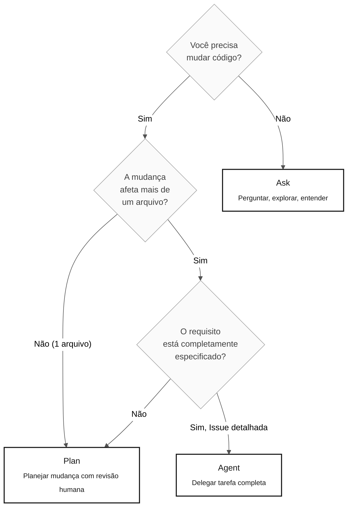

<!-- markdownlint-disable MD013 MD033 MD041 -->

# Os 3 Modos do Copilot — Ask, Plan e Agent

> **Trilha:** [Kit do Time](../README.md) › [Conceitos](00-README.md) › **3 modos do Copilot**

**O GitHub Copilot opera em três modos distintos — Ask, Plan e Agent — e escolher o modo errado para uma tarefa desperdiça tempo; este documento apresenta os critérios objetivos para selecionar o modo correto em cada situação do workshop.**

  

| Campo | Valor |
|---|---|
| **Público-alvo** | Todas as personas |
| **Pré-requisitos** | Leitura de [Agentes e Personas](02-agentes-e-personas.md) |
| **Tempo estimado** | 15 minutos |
| **Estágio** | Todos os estágios |
| **Resultado esperado** | Saber qual modo usar para cada tarefa sem hesitar |

---

## Conceito

O Copilot Chat oferece três modos de operação que diferem em autonomia, custo de tempo e tipo de saída:

- **Ask** — modo conversacional. Você faz perguntas e recebe respostas em texto. Nenhuma mudança é feita no código.
- **Plan** — modo de planejamento. Você descreve uma mudança e o Copilot propõe um plano com os arquivos a tocar e as alterações a fazer — antes de executar.
- **Agent** — modo autônomo. Você fornece uma tarefa bem definida (geralmente como Issue), e o Copilot lê o código, implementa e abre um PR de forma autônoma.

---

## Por que importa

Usar o modo errado tem consequências diretas:

- **Ask quando deveria ser Plan:** você recebe orientação correta, mas precisa executar tudo manualmente — mais lento do que o necessário.
- **Agent quando deveria ser Ask:** o Copilot executa mudanças em múltiplos arquivos com base em contexto incompleto, gerando PR com erros que levam mais tempo para corrigir do que para fazer manualmente.
- **Plan quando deveria ser Agent:** você revisa um plano passo a passo para uma tarefa grande e bem definida — esforço manual desnecessário.

---

## Arvore de decisao



---

## Comparativo dos tres modos

| Criterio | Ask | Plan | Agent |
|---|---|---|---|
| **O que faz** | Responde perguntas em texto | Propõe plano de mudança sem executar | Implementa autonomamente e abre PR |
| **Autonomia** | Nenhuma | Baixa (você aprova cada passo) | Alta (executa sem intervenção) |
| **Custo de tempo** | Baixo | Médio | Alto — justificado apenas para tarefas grandes |
| **Quando usar** | Explorar, entender, tirar dúvida | Mudança multi-arquivo com revisão humana | Issue completamente especificada com contexto e critérios de aceite |
| **Pré-requisito** | Nenhum | Contexto do que mudar | Issue escrita com: contexto, REQ-IDs, critérios de aceite, rastreabilidade |
| **Risco de retrabalho** | Nenhum | Baixo | Alto se a Issue estiver incompleta |

---

## Exemplos de prompts por modo — contexto SIFAP

### Ask — explorar o legado

```text
"Explique linha por linha o que CALCPGTO.NSN faz.
Foque em decisões de negócio. Ignore rotinas de I/O."
```

```text
"@archaeologist, quais campos do DDM BENEFICIARIO.ddm
são obrigatórios e quais têm valor múltiplo (MU)?"
```

### Plan — implementar um requisito com revisão

```text
"Plan: implementar REQ-042 (cálculo de valor líquido de benefício).
Liste os arquivos a criar ou modificar, a ordem das mudanças
e os testes de integração necessários.
NÃO implemente ainda — aguardo aprovação do time."
```

```text
"Plan: criar a migração Flyway V3 para adicionar a coluna
status_pagamento na tabela beneficiario.
Mostre o script SQL e os ajustes necessários na entidade JPA."
```

### Agent — delegar tarefa completa (Estágio 4)

```text
[Criar Issue no GitHub com:]
- Título: Implementar endpoint GET /api/v1/beneficiarios/{id}
- Contexto: REQ-042 especificado no Estágio 2, mapeado para BeneficiarioService
- Critérios de aceite: retorna 200 com DTO, 404 quando não encontrado,
  valida UUID no path, tem teste Testcontainers cobrindo ambos os cenários
- Rastreabilidade: REQ-042 › CALCPGTO.NSN#L120-L198
[Selecionar modo Agent e referenciar a Issue]
```

---

## Antipadroes — o que nao fazer

| Antipadrao | Consequencia | Alternativa correta |
|---|---|---|
| Usar Agent para uma dúvida de 2 minutos | Demora, consome contexto, risco de mudança indesejada | Use Ask |
| Usar Ask para implementar um serviço inteiro | Você recebe orientação mas faz tudo manualmente | Use Plan ou Agent |
| Delegar ao Agent sem Issue detalhada | PR gerado com código errado ou incompleto | Escreva a Issue completa antes de acionar o Agent |
| Usar Plan no Estágio 1 (arqueologia) | Copilot pode tentar modificar o legado | Use Ask com `@archaeologist` |
| Ignorar o plano gerado pelo Plan antes de executar | Mudanças inesperadas em arquivos não previstos | Leia e aprove o plano antes de confirmar |

---

## Custo de tempo orientativo

Use estes valores para escolher o modo durante o workshop — o tempo real varia com a complexidade da tarefa:

| Modo | Tarefa simples | Tarefa média | Tarefa complexa |
|---|---|---|---|
| Ask | 1–2 min | 3–5 min | 5–10 min |
| Plan | 5–10 min (review incluído) | 15–20 min | 30+ min |
| Agent | Não recomendado | 20–30 min (PR review incluído) | 45–90 min |

> [!WARNING]
> O tempo do Agent inclui o tempo de revisão do PR gerado. PRs com contexto incompleto podem exigir múltiplas iterações.

---

## Referencias

- [Cheat-sheet de 1 página dos 3 modos](../09-cheat-sheets/copilot-3-modes.md)
- [Agentes e Personas](02-agentes-e-personas.md)
- [Guia do Estágio 4 — modo Agent em prática](../04-evolucao/GUIDE.md)

---

### Continuar a leitura

| Anterior | Próximo |
|---|---|
| [Glossário Visual](03-glossario-visual.md)<br/><sub>30+ termos com definição e exemplo SIFAP.</sub> | [Notação EARS](05-notacao-ears.md)<br/><sub>Como escrever requisitos sem ambiguidade.</sub> |

<sub>[Voltar ao índice do kit](../README.md)</sub>
