<!-- markdownlint-disable MD013 MD033 MD041 -->

# Notação EARS — Requisitos sem Ambiguidade

> **Trilha:** [Kit do Time](../README.md) › [Conceitos](00-README.md) › **Notação EARS**

**EARS (Easy Approach to Requirements Syntax) é um conjunto de seis padrões de linguagem que transforma requisitos vagos em afirmações com formato fixo, testáveis automaticamente — é a notação obrigatória para todos os requisitos do SIFAP 2.0.**

  

| Campo | Valor |
|---|---|
| **Público-alvo** | Requirements Engineer, Software Architect, Product Owner |
| **Pré-requisitos** | Ter lido os programas `.NSN` atribuídos; [Spec-Driven Development](01-spec-driven-development.md) |
| **Tempo estimado** | 25 minutos |
| **Estágio** | Estágio 2 — Especificação |
| **Resultado esperado** | Escrever requisitos EARS válidos com REQ-ID e `source_legacy:` |

---

## Conceito

Um requisito mal escrito é a principal causa de retrabalho em projetos de modernização. Afirmações como "o sistema deve ser seguro" ou "processar dados corretamente" não especificam o que o sistema faz, quando faz, nem como verificar se fez.

EARS resolve isso com seis padrões sintáticos. Cada padrão mapeia um tipo de comportamento e resulta em uma afirmação com teste objetivo. Quando você não consegue imaginar um teste automatizado para o requisito, o requisito está vago.

---

## Por que importa no SIFAP

O SIFAP tem 29 anos de regras implícitas distribuídas em 15 programas `.NSN` e 4 DDMs. Sem EARS, cada membro do time interpreta as regras de forma diferente. Com EARS, a regra extraída de `CALCPGTO.NSN` linha 142 se torna uma afirmação única, com teste associado e rastreada ao código legado que a originou.

---

## Estrutura base de um requisito

Todo requisito no workshop segue este formato em YAML:

```yaml
REQ-NNN:
  pattern: <ubiquitous | event-driven | state-driven | optional | unwanted | complex>
  text: "<afirmação EARS completa>"
  source_legacy: "<caminho>.NSN#L<inicio>-L<fim>"
  acceptance:
    - "<critério verificável 1>"
    - "<critério verificável 2>"
```

> [!CAUTION]
> O campo `source_legacy:` é obrigatório em todos os requisitos. O job de CI `legacy-traceability` rejeita PRs que contenham REQ-IDs sem esse campo.

---

## Os 5 padrões EARS

### Padrão 1 — Ubiquitous (sempre vale)

**Quando usar:** a regra vale em qualquer momento, sem condição.

**Template:**
```
O sistema deve <ação>.
```

**Exemplo SIFAP:**
```yaml
REQ-001:
  pattern: ubiquitous
  text: "O sistema deve registrar data e hora de cada alteração em registros de beneficiários."
  source_legacy: 01-arqueologia/legado-sifap/natural-programs/CADBENEF.NSN#L45-L52
  acceptance:
    - "Todo registro de beneficiário alterado contém timestamp de modificação"
    - "O timestamp usa fuso horário UTC"
```

**Exemplo ruim:**
```
O sistema deve ter auditoria completa.
```
Problema: "auditoria completa" não é testável.

---

### Padrão 2 — Event-driven (quando algo acontece)

**Quando usar:** a regra dispara em resposta a um evento específico.

**Template:**
```
Quando <evento>, o sistema deve <ação>.
```

**Exemplo SIFAP:**
```yaml
REQ-042:
  pattern: event-driven
  text: "Quando um pagamento de benefício for processado, o sistema deve calcular o valor líquido descontando as contribuições vigentes."
  source_legacy: 01-arqueologia/legado-sifap/natural-programs/CALCPGTO.NSN#L120-L198
  acceptance:
    - "Dado beneficiário com bruto R$ 1.000,00 e alíquota 11%, o líquido calculado é R$ 890,00"
    - "Resultado é registrado na tabela pagamentos com status CALCULADO"
```

**Exemplo ruim:**
```
Quando houver pagamento, processar.
```
Problema: "processar" não descreve a ação esperada.

---

### Padrão 3 — State-driven (enquanto um estado persiste)

**Quando usar:** a regra vale enquanto o sistema ou entidade está em um estado particular.

**Template:**
```
Enquanto <condição de estado>, o sistema deve <ação>.
```

**Exemplo SIFAP:**
```yaml
REQ-078:
  pattern: state-driven
  text: "Enquanto o beneficiário estiver com situação SUSPENSO, o sistema deve bloquear o processamento de novos pagamentos para aquele beneficiário."
  source_legacy: 01-arqueologia/legado-sifap/natural-programs/CTRLPGTO.NSN#L33-L41
  acceptance:
    - "Tentativa de processar pagamento para beneficiário SUSPENSO retorna erro BENEFICIARIO_SUSPENSO"
    - "Nenhum registro de pagamento é criado para beneficiário SUSPENSO"
```

---

### Padrão 4 — Optional (quando o usuário escolhe)

**Quando usar:** a regra se aplica apenas se o usuário ativou uma opção ou escolheu uma configuração.

**Template:**
```
Onde <opção selecionada>, o sistema deve <ação>.
```

**Exemplo SIFAP:**
```yaml
REQ-105:
  pattern: optional
  text: "Onde o operador selecionar exportação em formato CSV, o sistema deve gerar o arquivo com cabeçalho na primeira linha e codificação UTF-8."
  source_legacy: 01-arqueologia/legado-sifap/natural-programs/EXPRELAT.NSN#L201-L215
  acceptance:
    - "Arquivo gerado tem extensão .csv"
    - "Primeira linha contém os nomes das colunas"
    - "Conteúdo está em UTF-8"
```

---

### Padrão 5 — Unwanted behavior (o que não pode acontecer)

**Quando usar:** proibições explícitas — segurança, compliance ou invariantes do sistema.

**Template:**
```
O sistema não deve <comportamento proibido>.
```

**Exemplo SIFAP:**
```yaml
REQ-200:
  pattern: unwanted
  text: "O sistema não deve expor o CPF completo do beneficiário em respostas de API — deve exibir apenas os quatro últimos dígitos."
  source_legacy: 01-arqueologia/legado-sifap/natural-programs/CADBENEF.NSN#L88-L90
  acceptance:
    - "Endpoint GET /api/v1/beneficiarios/{id} retorna CPF no formato ***.***.***-XX"
    - "Logs de aplicação não registram CPF em nenhuma circunstância"
```

---

## Padrão 6 — Complex (combinacao de padrões)

O 6º padrão EARS combina condições de estado, evento e opção em um único requisito. É consistente com a nomenclatura do cheat-sheet [`09-cheat-sheets/spec-kit-workflow.md`](../09-cheat-sheets/spec-kit-workflow.md), que lista os seis padrões EARS.

**Template:**
```
Enquanto <estado>, quando <evento>, onde <opção>, o sistema deve <ação>.
```

**Exemplo SIFAP:**
```yaml
REQ-250:
  pattern: complex
  text: "Enquanto o beneficiário estiver com situação ATIVO, quando um novo pagamento for processado, onde a modalidade selecionada for crédito em conta, o sistema deve registrar o número da conta bancária no histórico de pagamentos."
  source_legacy: 01-arqueologia/legado-sifap/natural-programs/CTRLPGTO.NSN#L55-L72
  acceptance:
    - "Pagamento de beneficiário ATIVO com modalidade crédito em conta registra conta bancária no histórico"
    - "Pagamento de beneficiário SUSPENSO não aciona este fluxo"
```

> [!TIP]
> Use o padrão Complex com moderação. Se o requisito combinar mais de duas condições sem perder clareza, ele é um bom candidato ao Complex. Se parecer difícil de ler, divida em dois REQ-IDs separados.

---

## Fluxo de um EARS até o teste

```mermaid
%%{init: {'theme':'neutral','themeVariables':{'fontFamily':'ui-sans-serif, system-ui, sans-serif','primaryColor':'#F5F5F5','primaryTextColor':'#171717','primaryBorderColor':'#171717','lineColor':'#525252','secondaryColor':'#FFFFFF','tertiaryColor':'#FAFAFA','background':'#FFFFFF'}}}%%
flowchart LR
    classDef step fill:#F5F5F5,stroke:#171717,color:#171717
    classDef gate fill:#FFFFFF,stroke:#171717,color:#171717,stroke-width:2px
    classDef muted fill:#FAFAFA,stroke:#A3A3A3,color:#404040

    A["Regra no legado<br/><sub>.NSN ou .ddm</sub>"]:::muted
    B["BR-NNN<br/><sub>business-rules-catalog.md</sub>"]:::step
    C["REQ-NNN (EARS)<br/><sub>padrão + texto + source_legacy</sub>"]:::step
    D["Critérios de aceite<br/><sub>acceptance: [...]</sub>"]:::step
    E["Teste automatizado<br/><sub>JUnit 5 + Testcontainers</sub>"]:::step
    F["CI verde<br/><sub>legacy-traceability aprovado</sub>"]:::gate

    A --> B --> C --> D --> E --> F
```



---

## Teste do espelho

Antes de considerar uma EARS pronta, pergunte:

> "Como eu testaria isso automaticamente?"

Se a resposta for vaga ou inexistente, o requisito está incompleto.

| Requisito vago | Requisito testável |
|---|---|
| O sistema deve ser seguro | O sistema não deve expor CPF completo em respostas de API |
| Processar dados | Quando pagamento for processado, calcular valor líquido conforme fórmula X |
| Auditoria completa | Quando beneficiário for alterado, registrar operador, data e valores anterior e novo |
| Funcionar bem | Quando solicitação for recebida, responder em até 2 segundos sob carga normal |

---

## Checklist de validação de um EARS

- [ ] **Identificador único.** O REQ-ID existe e segue o formato `REQ-NNN`.
- [ ] **Padrão correto.** O padrão declarado em `pattern:` corresponde à estrutura do texto.
- [ ] **Texto sem ambiguidade.** Não contém "adequado", "eficiente", "completo", "seguro" sem definição quantitativa.
- [ ] **`source_legacy:` preenchido.** Aponta para arquivo e linhas específicas, ou declara `[GREENFIELD]` com justificativa.
- [ ] **Critérios de aceite verificáveis.** Cada item de `acceptance:` descreve um cenário com entrada, ação e resultado esperado.
- [ ] **Teste imaginável.** É possível descrever um teste automatizado para cada critério de aceite.
- [ ] **Tamanho adequado.** Se o requisito cobre mais de um comportamento distinto, divida em dois REQ-IDs.

---

## Erros comuns e como evitar

| Sintoma | Causa | Correcao |
|---|---|---|
| Não sabe qual padrão usar | Regra ainda não foi categorizada | Comece por event-driven (`Quando…`) — cobre 60% dos casos |
| `source_legacy:` não encontrado | Requisito escrito de memória | Volte ao `.NSN` e localize o trecho. Sem evidência, não há requisito. |
| Requisito ocupa 3 parágrafos | São dois ou mais requisitos distintos | Divida. Um REQ-ID = um comportamento atômico. |
| Time não chega a consenso sobre o texto | Ambiguidade no legado | Execute `/speckit.clarify` e registre a decisão em ADR. |

---

## Prompts uteis no Copilot Chat

```text
# Converter regra do catálogo em EARS
/ears-convert BR-042: <texto da regra confirmada pelo time>.
Use CALCPGTO.NSN#L120-L198 como source_legacy.

# Validar uma EARS escrita
"@architect, esta EARS é testável? Como você escreveria o teste?
REQ-042: <texto do requisito>"

# Identificar lacunas de cobertura
/speckit.analyze
Quais regras confirmadas do catálogo ainda não têm REQ-ID?
```

---

## Referências

- [Guia do Estágio 2](../02-spec-moderna/GUIDE.md)
- [Cheat-sheet do Spec-Kit](../09-cheat-sheets/spec-kit-workflow.md)
- [LEGACY-EXPLORATION-CHECKLIST](../01-arqueologia/LEGACY-EXPLORATION-CHECKLIST.md)

---

### Continuar a leitura

| Anterior | Próximo |
|---|---|
| [3 modos do Copilot](04-3-modos-do-copilot.md)<br/><sub>Ask, Plan e Agent — critérios de escolha.</sub> | [Architecture Decision Records](06-architecture-decision-records.md)<br/><sub>Como registrar decisões para o time futuro.</sub> |

<sub>[Voltar ao índice do kit](../README.md)</sub>
