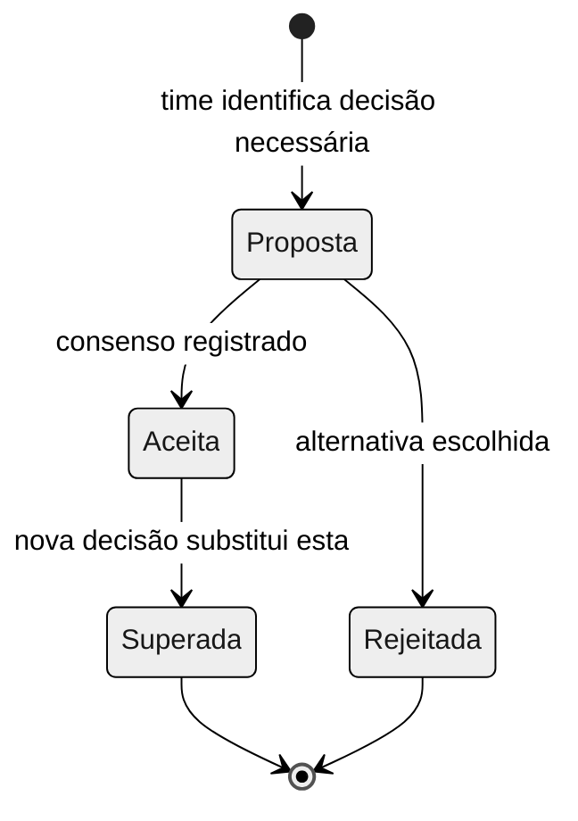

<!-- markdownlint-disable MD013 MD033 MD041 -->

# Architecture Decision Records (ADR)

> **Trilha:** [Kit do Time](../README.md) › [Conceitos](00-README.md) › **Architecture Decision Records**

**Um ADR (Architecture Decision Record) é um documento curto que registra uma decisão de arquitetura significativa: o contexto que a motivou, a decisão tomada, as alternativas consideradas e as consequências — garantindo que o raciocínio do time hoje seja compreensível para qualquer pessoa que trabalhar neste sistema no futuro.**

  

| Campo | Valor |
|---|---|
| **Público-alvo** | Software Architect, Enterprise Architect, Technical Lead, Product Owner |
| **Pré-requisitos** | [Spec-Driven Development](01-spec-driven-development.md) |
| **Tempo estimado** | 20 minutos |
| **Estágio** | Estágio 2 — Especificação |
| **Resultado esperado** | Saber quando e como escrever um ADR válido para o SIFAP 2.0 |

---

## Conceito

Uma decisão de arquitetura é qualquer escolha técnica que afeta a estrutura do sistema, seus contratos ou sua operação a longo prazo. Exemplos: escolher o padrão arquitetural, definir como representar campos de valor múltiplo do Adabas no modelo relacional, ou decidir a estratégia de autenticação.

Decisões técnicas tomadas sem registro se tornam "conhecimento tribal" — dependente de quem estava na sala. Quando esse conhecimento não está documentado, o time futuro toma decisões contraditórias, introduz redundâncias ou descarta trabalho por falta de contexto.

O ADR formaliza o raciocínio em um arquivo Markdown persistido no repositório junto ao código que ele governa.

---

## Por que importa no SIFAP

O SIFAP tem 29 anos. O SIFAP 2.0 precisa durar pelo menos a mesma quantidade de tempo. Decisões tomadas durante o workshop — como representar grupos periódicos (PE) do Adabas, como estruturar os bounded contexts, como versionar a API — precisam estar registradas para que qualquer futuro mantenedor entenda por que o sistema foi construído dessa forma.

Sem ADR, o custo de manutenção cresce a cada substituição de equipe.

---

## Anatomia de um ADR

```markdown
# ADR-NNN: Título da decisão

**Status:** Proposta | Aceita | Rejeitada | Superada por ADR-NNN
**Data:** AAAA-MM-DD
**Autores:** [nomes]

## Contexto

Descreva a situação que força a decisão: evidências, restrições,
riscos e o que acontece se nenhuma decisão for tomada agora.

## Decisão

Uma frase. "Escolhemos X usando Y."

## Alternativas consideradas

- **Alternativa A:** <descrição e motivo de aceitar ou rejeitar>
- **Alternativa B:** <descrição e motivo de aceitar ou rejeitar>

## Consequências

- Positivo: <benefício esperado>
- Negativo: <custo ou risco assumido>
- Nota: <condição que tornaria esta decisão obsoleta>
```

---

## Ciclo de vida de um ADR



> [!IMPORTANT]
> Nunca delete um ADR. Quando uma decisão for substituída, atualize o status para `Superada por ADR-NNN` e crie um novo ADR explicando a nova decisão. O histórico de raciocínio é valioso.

---

## Quando escrever um ADR

Use o teste das três perguntas:

1. A decisão **afeta múltiplos arquivos, módulos ou pessoas**?
2. **Reverter** a decisão custaria mais de um dia de trabalho?
3. Alguém do time perguntaria "por que fizemos assim?" daqui a seis meses?

Se duas ou mais respostas forem sim, escreva um ADR.

### Exemplos

| Decisão | ADR necessário | Justificativa |
|---|---|---|
| Usar Spring Boot 3.3 em vez de Quarkus | Sim | Afeta todos os módulos, irreversível no prazo do workshop |
| Representar campos MU do Adabas como tabela filha | Sim | Afeta modelo de dados e mapeamento JPA de múltiplos módulos |
| Adotar Modular Monolith em vez de microsserviços | Sim | Decisão estrutural com impacto em todo o projeto |
| Versionar API com prefixo `/api/v1` | Sim | Afeta todos os contratos de API |
| Trocar `final` por `var` em uma variável local | Não | Local, reversível, sem impacto externo |
| Adicionar Lombok como dependência | Sim | Afeta todo o módulo que o adotar |
| Usar `@Autowired` vs constructor injection | Sim, se for padrão do time | Afeta todos os componentes Spring |

---

## Exemplo aplicado ao SIFAP

A seguir, um ADR realista que o time escreveria no Estágio 2 para uma decisão de mapeamento de dados:

```markdown
# ADR-003: Representação de Grupos Periódicos (PE) do Adabas no modelo relacional

**Status:** Aceita
**Data:** 2026-08-12
**Autores:** Software Architect, DBA

## Contexto

O DDM HISTORICO_PAGAMENTOS.ddm define um grupo periódico (PE) com até
12 ocorrências mensais dentro de cada registro de beneficiário.
O modelo relacional do PostgreSQL 16 não suporta grupos periódicos nativamente.
Precisamos decidir como preservar as ocorrências e sua ordem no modelo moderno.

## Decisão

Mapear cada ocorrência do PE como uma linha na tabela historico_pagamentos
com chave estrangeira para beneficiarios e coluna competencia (DATE)
para preservar a ordem cronológica.

## Alternativas consideradas

- **Coluna JSONB:** armazenar as 12 ocorrências como array JSON.
  Rejeitado: dificulta consultas por competência e indexação; viola princípio
  de não replicar complexidade do legado no modelo novo.
- **Tabela filha (escolhida):** cada ocorrência vira uma linha com FK.
  Aceito: consultas simples, indexável, compatível com JPA.

## Consequências

- Positivo: consultas por competência são eficientes; JPA mapeia naturalmente.
- Negativo: registros de beneficiário com histórico completo geram 12 linhas por
  beneficiário — volume maior do que no Adabas.
- Nota: se o volume ultrapassar 10 milhões de linhas, avaliar particionamento
  por ano em ADR futuro.
```

---

## Checklist do ADR pronto

- [ ] **Número sequencial** no formato `ADR-NNN`.
- [ ] **Status declarado**: Proposta, Aceita, Rejeitada ou Superada.
- [ ] **Data e autores** registrados.
- [ ] **Contexto** explica por que a decisão é necessária agora — não apenas o que foi decidido.
- [ ] **Decisão em uma frase** — objetiva e sem ambiguidade.
- [ ] **Pelo menos duas alternativas** listadas com motivo de rejeição.
- [ ] **Consequências** incluem pontos negativos além dos positivos.
- [ ] **Cabe em uma página** — se não couber, provavelmente são duas decisões distintas.
- [ ] **Product Owner consegue ler e entender** o contexto e a decisão, mesmo sem experiência técnica.

---

## Erros comuns e como evitar

| Sintoma | Causa | Correcao |
|---|---|---|
| ADR não lista alternativas | Pressão de tempo | Liste pelo menos duas, mesmo que brevemente. Sem alternativas, o leitor não entende o trade-off. |
| ADR descreve só benefícios | Viés de confirmação | Toda decisão tem custo. Se não há consequências negativas, o raciocínio está incompleto. |
| Decisão sem contexto | Iniciou pela decisão, não pelo problema | Escreva o contexto primeiro. O "por quê agora" é mais importante do que o "o quê". |
| ADR tem 5 páginas | São múltiplas decisões misturadas | Divida. Um ADR = uma decisão. |
| ADR deletado quando substituído | Gestão manual de arquivos | Marque como `Superada por ADR-NNN`. Nunca delete. |

---

## Prompts uteis no Copilot Chat

```text
# Estruturar um ADR
"@architect, registre um ADR sobre <decisão em aberto>.
Use as alternativas e evidências que o time forneceu.
NÃO escolha pela equipe — apresente os trade-offs."

# Desafiar uma decisão antes de aceitar
"@architect, leia o ADR-002 e faça o papel de advogado do diabo.
Quais são os três melhores argumentos para REJEITAR esta decisão?"

# Resolver impasse no time
/speckit.clarify
"Não há consenso entre Modular Monolith e microsserviços.
Liste prós e contras objetivos para cada um no contexto do SIFAP."
```

---

## Referencias

- [Template de ADR em branco](../02-spec-moderna/ADR-TEMPLATE.md)
- [Guia do Estágio 2](../02-spec-moderna/GUIDE.md)
- [adr.github.io — padrão oficial](https://adr.github.io)

---

### Continuar a leitura

| Anterior | Próximo |
|---|---|
| [Notação EARS](05-notacao-ears.md)<br/><sub>Como escrever requisitos sem ambiguidade.</sub> | [Personas (Overview)](../05-personas/OVERVIEW.md)<br/><sub>Escolha seus dois papéis para o workshop.</sub> |

<sub>[Voltar ao índice do kit](../README.md)</sub>
