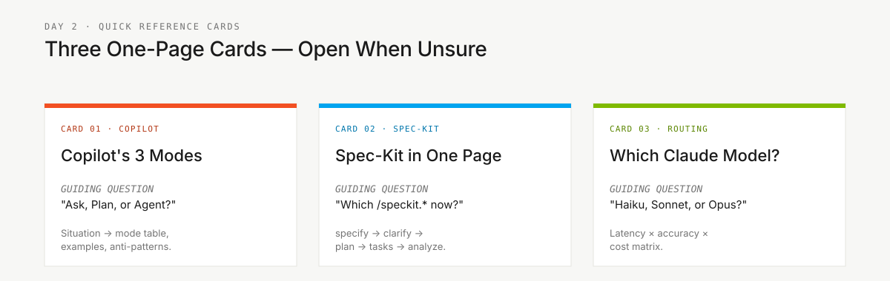

<!-- markdownlint-disable MD013 MD033 MD041 -->

# Cartões de Referência Rápida

> **Trilha:** [Kit do Time](../README.md) › **Cartões de Referência**

**Três cartões de uma página para consulta rápida durante o workshop: modos do Copilot, workflow do Spec-Kit e roteamento de modelos.**

| Campo | Valor |
|---|---|
| **Público-alvo** | Todo o time — consulta rápida sem precisar ler um guia completo |
| **Pré-requisitos** | Nenhum |
| **Tempo estimado** | 2 min por cartão |
| **Estágio** | Todos |
| **Resultado esperado** | Saber qual cartão consultar para cada dúvida |

---

## Quando usar

Abra um cartão de referência quando precisar de resposta rápida sem ler um guia completo. Cada cartão responde uma pergunta específica.

---

## Conteúdo

| Arquivo | Tópico | Use quando |
|---|---|---|
| [`copilot-3-modes.md`](copilot-3-modes.md) | GitHub Copilot: modos Ask, Plan e Agent | Estiver na dúvida sobre qual modo do Copilot acionar |
| [`spec-kit-workflow.md`](spec-kit-workflow.md) | Fluxo Spec-Kit de relance | Não souber qual comando `/speckit.*` usar |
| [`model-routing.md`](model-routing.md) | Qual modelo de IA usar para cada tipo de tarefa | Estiver decidindo entre Haiku, Sonnet ou Opus |

---

### Continuar a leitura

| Anterior | Próximo |
|---|---|
| [Persona Kits — Índice](../05-personas/README.md) 10 personas com agentes, prompts, skills e MCP por papel. | [Copilot em 3 modos](copilot-3-modes.md) Quando usar Ask, Plan ou Agent — tabela situação e modo. |

[Voltar ao índice do kit](../README.md)
