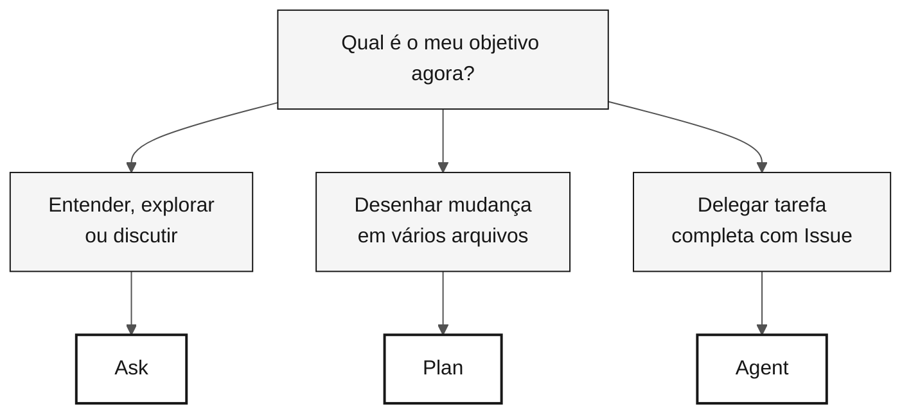

<!-- markdownlint-disable MD013 MD033 MD041 -->

# GitHub Copilot em 3 modos — Cartão de referência

> **Trilha:** [Kit do Time](../README.md) › [Cartões de Referência](README.md) › **Copilot 3 modos**

**Escolha o modo certo do Copilot antes de abrir o chat: Ask para explorar, Plan para desenhar mudanças, Agent para delegar tarefas completas.**

| Campo | Valor |
|---|---|
| **Público-alvo** | Qualquer membro do time antes de iniciar uma conversa com o Copilot |
| **Pré-requisitos** | GitHub Copilot ativo no VS Code |
| **Tempo estimado** | 2 min |
| **Estágio** | Todos |
| **Resultado esperado** | Saber qual modo usar para a situação atual |

---

## O que são os 3 modos do Copilot

O GitHub Copilot Chat opera em três modos distintos, com diferentes níveis de autonomia e custo de contexto:

- **Ask** — modo conversacional. Você pergunta; o Copilot responde. Não altera arquivos automaticamente. Ideal para entender, explorar e discutir.
- **Plan** — modo de planejamento. O Copilot propõe um plano de mudanças com escopo, arquivos e sequência explícitos. Você valida antes de qualquer execução.
- **Agent** — modo autônomo. O Copilot recebe uma tarefa completa (tipicamente via Issue) e trabalha sozinho até produzir um PR. Você revisa o resultado.

**Por que isso importa no workshop SIFAP:** o modo errado desperdiça tempo. Ask para implementar multi-arquivo custa horas; Agent para tarefa de 5 minutos é desperdício. A tabela abaixo resolve essa escolha em segundos.

---

## Tabela de decisão rápida

| Situação | Modo | Por que |
|---|---|---|
| Entender código legado Natural/Adabas | **Ask** | Conversa, custo baixo, reversível |
| Discutir design ou trade-off | **Ask** | Exploratório, sem comprometer arquivos |
| Avaliar um ADR antes de registrar | **Ask** | Feedback antes de decidir |
| Desenhar mudança em vários arquivos | **Plan** | Plano explícito, escopo e sequência claros |
| Listar testes necessários antes de implementar | **Plan** | Escopo visível antes de executar |
| Delegar uma Issue bem descrita (issue → PR) | **Agent** | Trabalha sozinho; você revisa no final |
| Automatizar cadeia longa de CI/IaC | **Agent** | Tarefa repetitiva com critérios claros |

---

## Fluxo visual de decisão

---

## Ask — Perguntar e explorar

**Use quando** você ainda não sabe o que quer, quer entender, discutir ou avaliar um trade-off.

**Exemplos no contexto SIFAP:**

- `"Explique o que este programa Natural faz linha por linha."`
- `"Quais riscos de usar JSONB para guardar histórico de contas bancárias?"`
- `"Resuma este DDM em 5 linhas para alguém que não conhece Adabas."`
- `"Desafie o seguinte ADR: {cole o ADR}."`

**Erros comuns:**

- Usar Ask para executar mudança em vários arquivos — use Plan ou Agent.
- Aceitar resposta sem validar — o Copilot pode alucinar; confirme.
- Prompt curto demais ("ajuda") — dê contexto: o que você tem, o que quer, o que já tentou.

---

## Plan — Planejar mudanças

**Use quando** você sabe o que quer, precisa envolver vários arquivos e quer validar escopo, sequência e riscos antes de executar.

**Exemplos no contexto SIFAP:**

- `"Planeje a criação do módulo <feature> com a estrutura de pacote acordada pelo time."`
- `"Liste os testes necessários para cada método público de <Service> antes de implementar."`
- `"Planeje o rename de <termo-legado> para <termo-moderno> no projeto inteiro na ordem segura."`
- `"Revise as migrations Flyway existentes e proponha sequência para adicionar rollback documentado."`

**Erros comuns:**

- Escopo amplo demais — quebre em etapas menores.
- Não revisar o plano antes de executar — ajuste antes de autorizar.
- Misturar mudanças de lógica com renames — um PR por propósito.

---

## Agent — Delegação com autonomia

**Use quando** você tem uma Issue bem descrita, aceita que vai demorar, e está disposto a revisar um PR gerado autonomamente.

**Como preparar a Issue:**

- [ ] **Escrever contexto** — o que existe hoje, o que deve existir depois.
- [ ] **Definir critérios de aceitação** — comportamento verificável esperado.
- [ ] **Delimitar escopo** — o que o Agent deve e o que NÃO deve alterar.
- [ ] **Apontar arquivos relevantes** — `"leia docs/adr/001.md antes de começar"`.

**Acompanhamento:** não opere enquanto o Agent estiver rodando. Deixe concluir. Verifique o caminho a cada 10 minutos se necessário.

**Revisar PR do Agent:** exatamente como revisaria PR humano. Revisão rápida continua sendo revisão.

**Erros comuns:**

- Issue vaga — o Agent entrega resultado fora do escopo.
- Disparar Agent para tarefa de 5 minutos que Ask ou Plan resolveriam.
- Mergear sem revisar porque foi gerado automaticamente.

---

## Modos por persona

| Persona | Modo principal | Modo secundário |
|---|---|---|
| Product Owner | Ask (refinar stories) | Plan (priorizar escopo) |
| Requirements Engineer | Ask (validar EARS) | Plan (organizar requisitos) |
| Software Architect | Ask (decidir padrão) | Plan (desenhar módulo) |
| Developer | Plan (mudanças multi-arquivo) | Ask, Agent |
| QA Engineer | Plan (cobertura e cenários) | Ask (discutir lacunas) |
| DevOps Engineer | Agent (cadeias longas de CI) | Plan (Terraform) |
| Tech Writer | Ask (revisão de estilo) | Plan (reestruturar ADR) |

---

> [!TIP]
> **Regra de ouro.** Se você não soubesse que era IA, aceitaria esse código no seu projeto? Se não, rejeite ou refine. O Copilot acelera quem sabe; não substitui julgamento.

---

### Continuar a leitura

| Anterior | Próximo |
|---|---|
| [Cartões de Referência](README.md) Índice dos 3 cartões de consulta rápida. | [Spec-Kit em 1 página](spec-kit-workflow.md) Sequência specify — clarify — plan — tasks — analyze. |

[Voltar ao índice do kit](../README.md)
