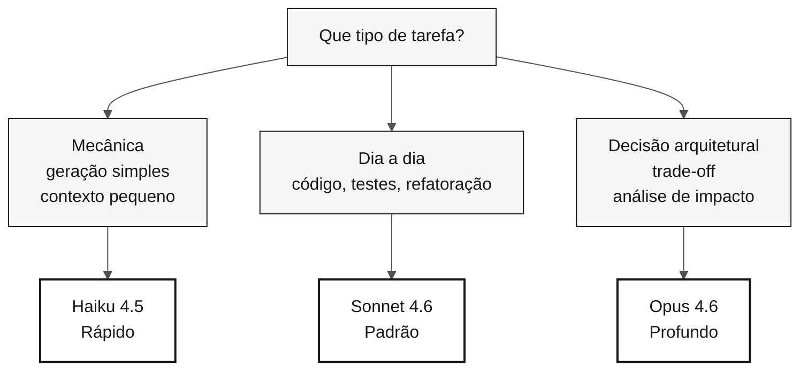

<!-- markdownlint-disable MD013 MD033 MD041 -->

# Roteamento de modelos Claude — Cartão de referência

> **Trilha:** [Kit do Time](../README.md) › [Cartões de Referência](README.md) › **Roteamento de modelos**

**Use o menor modelo que resolve sua tarefa: Haiku para geração mecânica, Sonnet para o dia a dia, Opus para decisões arquiteturais que afetam todo o projeto.**

| Campo | Valor |
|---|---|
| **Público-alvo** | Qualquer membro do time antes de enviar um prompt ao Copilot |
| **Pré-requisitos** | Nenhum |
| **Tempo estimado** | 2 min |
| **Estágio** | Todos |
| **Resultado esperado** | Escolher o modelo certo sem desperdício de tempo ou custo |

---

## Princípio: menor modelo suficiente

Modelo maior significa mais capacidade e mais latência. Trocar de modelo é menos custoso do que esperar 30 segundos pelo modelo errado.

> [!IMPORTANT]
> Opus em tarefa mecânica é desperdício de tempo. Haiku em decisão arquitetural é risco. Escolha pelo tipo de tarefa, não pelo prestígio do modelo.

---

## Tabela de decisão rápida

| Tipo de tarefa | Modelo | Quando usar |
|---|---|---|
| Geração mecânica, transformação simples, contexto pequeno | **Haiku 4.5** | Gerar DDL repetitivo, escrever teste unitário simples, ajustar YAML trivial |
| Código, testes, refatoração, explicação do dia a dia | **Sonnet 4.6** | Padrão para a maioria das tarefas do workshop |
| Decisão arquitetural, análise de impacto, trade-off | **Opus 4.6** | Escolha de padrão, definição de bounded context, análise de risco |

---

## Fluxo visual de decisão

---

## Os três modelos

| Modelo | Custo relativo | Velocidade | Quando usar |
|---|---|---|---|
| **Haiku 4.5** | Baixo | Rápida | Tarefa mecânica, transformação simples, contexto pequeno |
| **Sonnet 4.6** | Médio | Média | Padrão do dia a dia: código, testes, refatoração, explicação |
| **Opus 4.6** | Alto | Lenta | Decisão arquitetural, análise de impacto, discussão de trade-off |

---

## Roteamento por persona e situação

### Product Owner e Requirements Engineer

| Situação | Modelo |
|---|---|
| Escrever user story | Sonnet |
| Refinar EARS já escritas | Haiku |
| Decidir se um requisito é v1 ou v2 | Opus (uma vez; decida e siga) |

### Arquitetos (Enterprise + Software)

| Situação | Modelo |
|---|---|
| Desenhar diagrama C4 em Mermaid | Sonnet |
| Escolher entre padrões (hexagonal vs. camadas) | Opus |
| Gerar variação sintática de diagrama existente | Haiku |

### Technical Lead

| Situação | Modelo |
|---|---|
| Revisar PR médio | Sonnet |
| Decidir padrão do projeto inteiro | Opus no início; Sonnet para aplicar |
| Verificar se um trecho compila | Haiku |

### Developer

| Situação | Modelo |
|---|---|
| Implementar um service | Sonnet |
| Escrever teste unitário simples | Haiku |
| Debater estrutura de classe antes de escrever | Opus |

### DBA

| Situação | Modelo |
|---|---|
| Traduzir DDM Adabas para SQL | Sonnet (Opus para casos complexos) |
| Gerar DDL repetitivo | Haiku |
| Decidir estratégia de particionamento | Opus |

### QA Engineer

| Situação | Modelo |
|---|---|
| Gerar esqueleto JUnit 5 | Haiku |
| Escrever teste de integração não-trivial | Sonnet |
| Decidir entre Testcontainers e mock | Opus |

### DevOps Engineer

| Situação | Modelo |
|---|---|
| Gerar YAML padrão de GitHub Actions | Sonnet |
| Ajustar comandos triviais no pipeline | Haiku |
| Decidir topologia Azure | Opus |

### Tech Writer

| Situação | Modelo |
|---|---|
| Revisar estilo do README | Haiku |
| Redigir um ADR | Sonnet |
| Decidir estrutura global de documentação | Opus, uma vez |

---

## Sinais de que você está no modelo errado

| Sintoma | Diagnóstico | Ação |
|---|---|---|
| Esperando 30 segundos por resposta trivial | Modelo acima do necessário | Troque para modelo menor |
| Resposta rasa em decisão crítica | Modelo abaixo do necessário | Suba para Opus |
| Resposta correta mas sem discussão | Modelo abaixo do necessário | Suba para Opus |
| Empilhando prompts para gerar centenas de arquivos | Modelo errado para tarefa em lote | Troque para Sonnet ou Haiku |

---

### Continuar a leitura

| Anterior | Próximo |
|---|---|
| [Spec-Kit em 1 página](spec-kit-workflow.md) Sequência specify — clarify — plan — tasks — analyze. | [Cartões de Referência](README.md) Índice dos 3 cartões de consulta rápida. |

[Voltar ao índice do kit](../README.md)
