<!-- markdownlint-disable MD013 MD033 MD041 -->

# Spec-Kit — Cartão de Referência

> **Trilha:** [Kit do Time](../README.md) › [Cartões de Referência](README.md) › **Spec-Kit workflow**

**O Spec-Kit é a ferramenta oficial do GitHub para Spec-Driven Development: ele força a sequência `specify → clarify → plan → tasks → implement` e impede que o time pule direto para código sem especificação.**

| Campo | Valor |
|---|---|
| **Público-alvo** | Requirements Engineer e Software Architect durante o Estágio 2 |
| **Pré-requisitos** | Spec-Kit instalado (`uv tool install specify-cli`) e `specify init` executado |
| **Tempo estimado** | 2 min de consulta; aplicação ao longo do Estágio 2 |
| **Estágio** | Estágio 2 — Especificação (e Estágio 3 para `/speckit.implement`) |
| **Resultado esperado** | `spec.md`, `plan.md` e `tasks.md` em `specs/<NNN>-<feature>/` |


> Repositório oficial: <https://github.com/github/spec-kit>

---

## O que é o Spec-Kit e por que ele existe

O Spec-Kit (Specify CLI) é uma ferramenta de linha de comando e conjunto de slash commands para o Copilot que implementa o fluxo de Spec-Driven Development (SDD). SDD é a prática de escrever a especificação completa de uma funcionalidade — incluindo critérios de aceitação e rastreabilidade — antes de qualquer linha de código.

**Por que isso importa no SIFAP:** cada regra de negócio do legado Natural/Adabas precisa ser rastreável do código legado ao requisito moderno. Sem o Spec-Kit, essa rastreabilidade se perde na conversa do chat. Com ele, cada requisito carrega `source_legacy:` apontando para o arquivo e linha do código original.

---

## Fluxo canônico

```mermaid
%%{init: {'theme':'neutral','themeVariables':{'fontFamily':'ui-sans-serif, system-ui, sans-serif','primaryColor':'#F5F5F5','primaryTextColor':'#171717','primaryBorderColor':'#171717','lineColor':'#525252','secondaryColor':'#FFFFFF','tertiaryColor':'#FAFAFA','background':'#FFFFFF'}}}%%
flowchart LR
    classDef step fill:#F5F5F5,stroke:#171717,color:#171717
    classDef result fill:#FFFFFF,stroke:#171717,color:#171717,stroke-width:2px

    P0["Constitution"]:::step --> P1["Specify"]:::step --> P2["Clarify"]:::step
    P2 --> P3["Plan"]:::step --> P4["Tasks"]:::step --> P5["Analyze"]:::step
    P5 --> P6["Implement"]:::result
```



| Momento | Comando | Entregável esperado |
|---|---|---|
| Antes da primeira funcionalidade | `/speckit.constitution` | `.specify/memory/constitution.md` |
| Estágio 2 | `/speckit.specify` | `specs/<NNN>-<feature>/spec.md` |
| Estágio 2 | `/speckit.clarify` | Perguntas resolvidas na spec |
| Estágio 2 | `/speckit.plan` | `specs/<NNN>-<feature>/plan.md` |
| Estágio 2 | `/speckit.tasks` | `specs/<NNN>-<feature>/tasks.md` |
| Estágio 3 | `/speckit.analyze` | Lacunas e inconsistências antes de codar |
| Estágio 3 | `/speckit.implement` | Código guiado por spec + plan + tasks |

---

## Passo a passo executável

- [ ] **Nomear a funcionalidade.** Usar o formato `NNN-nome-da-feature`.
- [ ] **Criar a spec com `/speckit.specify`.** Incluir user stories, critérios de aceitação e `source_legacy:`.
- [ ] **Resolver dúvidas com `/speckit.clarify`.** Não seguir com campos, regras ou fluxos ambíguos.
- [ ] **Gerar plano técnico com `/speckit.plan`.** O plano deve citar módulos, contratos, dados e riscos.
- [ ] **Quebrar em tarefas com `/speckit.tasks`.** Tarefa boa é pequena, testável e tem dono claro.
- [ ] **Checar consistência com `/speckit.analyze`.** Corrigir lacunas antes de implementar.
- [ ] **Implementar com `/speckit.implement`.** O código deve seguir `spec.md`, `plan.md` e `tasks.md`.

---

## Comandos principais no Copilot

| Comando | Uso |
|---|---|
| `/speckit.constitution` | Cria ou atualiza princípios e regras do projeto |
| `/speckit.specify` | Cria a spec da funcionalidade com user stories e critérios |
| `/speckit.plan` | Gera o plano técnico a partir da spec |
| `/speckit.tasks` | Quebra o plano em tarefas implementáveis |
| `/speckit.implement` | Executa as tasks de implementação |

## Comandos opcionais úteis

| Comando | Uso |
|---|---|
| `/speckit.clarify` | Resolve ambiguidades antes do plano técnico |
| `/speckit.analyze` | Analisa consistência e cobertura entre artefatos |
| `/speckit.checklist` | Gera checklist de qualidade para a spec |
| `/speckit.taskstoissues` | Converte tasks em GitHub Issues |

---

## Os 6 padrões EARS

EARS (Easy Approach to Requirements Syntax) é uma notação padronizada para escrever requisitos verificáveis. Cada padrão define uma estrutura gramatical que o Copilot reconhece e valida.

| # | Padrão | Modelo | Exemplo sintático |
|---|---|---|---|
| 1 | Ubiquitous | O sistema deverá `[ação]` | O sistema deverá `<ação verificável>` |
| 2 | Event-Driven | Quando `[X]`, o sistema deverá `[ação]` | Quando `<evento>`, o sistema deverá `<ação>` |
| 3 | State-Driven | Enquanto `[X]`, o sistema deverá `[ação]` | Enquanto `<estado>`, o sistema deverá `<ação>` |
| 4 | Optional | Onde `[escolha]`, o sistema deverá `[ação]` | Onde `<opção>`, o sistema deverá `<ação>` |
| 5 | Unwanted | O sistema não deverá `[ação]` | O sistema não deverá `<comportamento proibido>` |
| 6 | Complex | Enquanto `[X]`, quando `[Y]`, onde `[Z]`, o sistema deverá `[ação]` | Combinação dos padrões 2, 3 e 4 |

---

## Estrutura mínima de requisito SIFAP

```yaml
REQ-XXX:
  pattern: <padrão EARS>
  text: "<requisito>"
  source_legacy: <arquivo:linhas ou [GREENFIELD] + justificativa>
  acceptance: "<cenário verificável>"
```

> [!WARNING]
> Se um requisito não tiver `source_legacy:`, ele ainda não está pronto para seguir para `/speckit.plan`. O job de CI `legacy-traceability` rejeita PRs que violam essa regra.

---

## Instalação e inicialização

```bash
uv tool install specify-cli --from git+https://github.com/github/spec-kit.git@vX.Y.Z
specify version
```

Substitua `vX.Y.Z` pela versão mais recente em <https://github.com/github/spec-kit/releases>.

```bash
specify init . --integration copilot
```

Em macOS/Linux, os scripts ficam em `.specify/scripts/bash/`. As features geradas pelos comandos vivem em `specs/<NNN>-<feature>/`.

> [!NOTE]
> Se os comandos `/speckit.*` não aparecerem no Copilot Chat, rode `specify init . --integration copilot` novamente e recarregue o VS Code.

---

## Como adaptar ao SIFAP

- Inclua `source_legacy:` em todo requisito que nasceu de `.NSN` ou `.ddm`.
- Use `[GREENFIELD]` apenas quando não houver paralelo no legado e justifique a decisão.
- Antes de `/speckit.plan`, valide o escopo com Product Owner e Software Architect.
- Antes de `/speckit.implement`, confirme que `tasks.md` contém testes antes do código quando a mudança tocar regra de negócio.

---

## Referências

- [Spec-Kit no GitHub](https://github.com/github/spec-kit)
- [Documentação oficial](https://github.github.io/spec-kit/)
- [Guia de instalação](https://github.com/github/spec-kit/blob/main/docs/installation.md)
- [Spec-Driven Development](../07-conceitos/01-spec-driven-development.md)

---

### Continuar a leitura

| Anterior | Próximo |
|---|---|
| [Copilot em 3 modos](copilot-3-modes.md)<br/><sub>Quando usar Ask, Plan ou Agent.</sub> | [Roteamento de modelos](model-routing.md)<br/><sub>Quando usar Haiku, Sonnet ou Opus.</sub> |

<sub>[Voltar ao índice do kit](../README.md)</sub>
