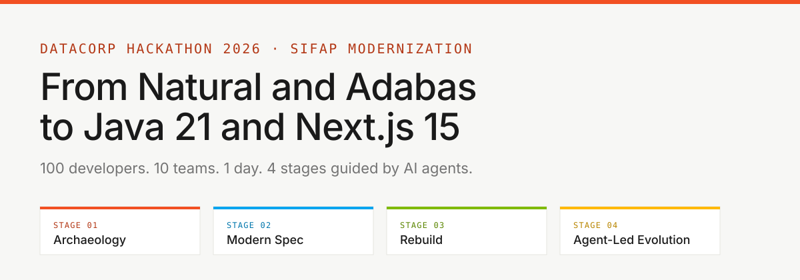
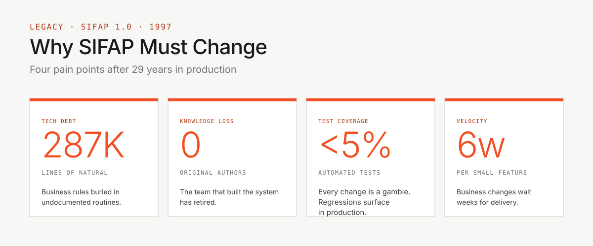

<!-- markdownlint-disable MD013 MD033 MD041 -->

# Kit do Time — Workshop SIFAP 2.0 (PT-BR)

> **Trilha:** **Kit do Time** (você está aqui)



**A missão em uma frase:** você e 4 colegas têm **8 horas** para modernizar um sistema de pagamentos de 29 anos — do legado Natural/Adabas para Java 21 + Next.js 15 — com rastreabilidade total do código moderno até as regras de negócio originais.

  

---

## Por onde começar (escolha seu perfil)

| Eu sou… | Comece aqui |
|---|---|
| **Primeira vez ou perfil não-técnico** | [`00-COMECE-AQUI.md`](00-COMECE-AQUI.md) — 15 minutos guiados |
| **Desenvolvedor(a), quero o cronograma** | [`00-TEAM-FLOW.md`](00-TEAM-FLOW.md) — 10 minutos |
| **Quero entender os conceitos primeiro** | [`07-conceitos/`](07-conceitos/) — conceitos fundamentais |
| **Quero preparar o ambiente** | [`00-SETUP.md`](00-SETUP.md) — laptop + Copilot |
| **Como Git funciona neste workshop?** | [`00-GIT-WORKFLOW.md`](00-GIT-WORKFLOW.md) — branch por persona |
| **Algo deu errado** | [`docs/troubleshooting.md`](docs/troubleshooting.md) |
| **Sou o líder do time** | [`docs/CHECKLIST-LIDER.md`](docs/CHECKLIST-LIDER.md) — hora a hora |
| **Quero evitar erros comuns** | [`docs/lessons-learned.md`](docs/lessons-learned.md) |
| **Vou fazer a demo** | [`docs/demo-script.md`](docs/demo-script.md) |
| **Quero ver o progresso do dia** | [`docs/STATUS.md`](docs/STATUS.md) |

---

## Como o workshop está organizado

O workshop tem **4 estágios sequenciais** e **5 pares de personas** que trabalham em paralelo dentro de cada estágio. O objetivo final é o SIFAP 2.0 funcionando na demonstração.

```mermaid
%%{init: {'theme':'neutral','themeVariables':{'fontFamily':'ui-sans-serif, system-ui, sans-serif','primaryColor':'#F5F5F5','primaryTextColor':'#171717','primaryBorderColor':'#171717','lineColor':'#525252','secondaryColor':'#FFFFFF','tertiaryColor':'#FAFAFA','background':'#FFFFFF'}}}%%
flowchart LR
    classDef step fill:#F5F5F5,stroke:#171717,color:#171717
    classDef handoff fill:#FFFFFF,stroke:#525252,color:#171717
    classDef result fill:#FFFFFF,stroke:#171717,color:#171717,stroke-width:2px

    E1["Estágio 1<br/>Arqueologia<br/>@archaeologist"]:::step
    H1["Passagem H1<br/>5 min síncrona"]:::handoff
    E2["Estágio 2<br/>Especificação<br/>@architect"]:::step
    H2["Passagem H2<br/>5 min síncrona"]:::handoff
    E3["Estágio 3<br/>Implementação<br/>@builder"]:::step
    H3["Passagem H3<br/>5 min síncrona"]:::handoff
    E4["Estágio 4<br/>Evolução<br/>@evolution"]:::step
    R["SIFAP 2.0<br/>em execução"]:::result

    E1 --> H1 --> E2 --> H2 --> E3 --> H3 --> E4 --> R
```



- **5 pessoas** = 5 pares de personas, cada par corresponsável por duas funções do SDLC
- **4 estágios** = cada um com um agente Copilot dedicado
- **Passagens (H1, H2, H3)** = conversa síncrona de 5 minutos entre o par que sai e o par que entra
- **CI verde** = pipeline de integração aprovado valida cada Pull Request
- **Objetivo final** = demonstração do SIFAP 2.0 funcionando ao vivo

---

## Estrutura do kit (ordem de leitura recomendada)

```text
workspace/
├── README.md                       <- você está aqui
├── 00-COMECE-AQUI.md               <- 15 min para qualquer pessoa
├── 00-SETUP.md                     <- preparar laptop + Copilot
├── 00-TEAM-FLOW.md                 <- cronograma canônico do dia
├── 00-SITEMAP.md                   <- mapa visual do kit
├── 00-GIT-WORKFLOW.md              <- branches, PRs, merges
│
├── 01-arqueologia/                 ESTÁGIO 1 — ler legado SIFAP
│   ├── GUIDE.md                    (passo a passo do estágio)
│   ├── LEGACY-EXPLORATION-CHECKLIST.md  (gate obrigatório antes do Estágio 2)
│   └── legado-sifap/               (15 .NSN + 4 DDMs + docs históricos)
├── 02-spec-moderna/                ESTÁGIO 2 — escrever EARS, ADRs, C4
├── 03-implementacao/               ESTÁGIO 3 — Java + Next.js + testes
├── 04-evolucao/                    ESTÁGIO 4 — Agent mode + Terraform
│
├── 05-personas/                    10 personas (escolha 2 = seu par)
├── 06-agentes-de-estagio/          4 agentes Copilot (1 por estágio)
├── 07-conceitos/                   conceitos fundamentais (EARS, ADR, SDD, agentes)
├── 09-cheat-sheets/                3 cartões de referência rápida
│
├── docs/                           FAQ, troubleshooting, runbook, ADRs
├── assets/                         SVGs e diagramas
└── specs/                          artefatos Spec-Kit criados pelo time
```

---

## Os 5 pares (escolha o seu)

Cada pessoa veste **um par** (duas personas) e fica com ele o dia inteiro.

| Par | Personas | Fase do SDLC |
|---|---|---|
| **1 — Visão** | Product Owner + Requirements Engineer | Descoberta + Especificação |
| **2 — Arquitetura** | Enterprise Architect + Software Architect | Especificação + Design |
| **3 — Implementação** | Technical Lead + Developer | Implementação + Evolução |
| **4 — Qualidade** | DBA + QA Engineer | Implementação (dados + testes) |
| **5 — Operações** | DevOps Engineer + Tech Writer | Transversal + Evolução |

Detalhes de cada papel: [`05-personas/OVERVIEW.md`](05-personas/OVERVIEW.md)

---

## Ferramentas aprovadas — somente estas

> [!IMPORTANT]
> O workshop roda em stack fixa. Misturar ferramentas alternativas fragmenta o time e quebra a rastreabilidade spec → código → teste.

| Use | Não use |
|---|---|
| **VS Code** (ou Insiders) | Cursor, Windsurf, IntelliJ, Eclipse |
| **GitHub Copilot** (Ask + Plan + Agent) | Cline, Continue, Aider, Codeium, Tabnine |
| **GitHub Copilot CLI** (opcional) | UIs web de chat para gerar código |
| **Spec-Kit oficial** (`Specify CLI`) | Kiro, frameworks SDD alternativos |
| **GitHub** (Issues, PRs, Actions) | — |
| **Docker / Docker Compose** | Containerização herdada de outro repositório |
| **Terraform** (Azure provider) | `terraform apply` sem revisão (somente `plan` até o Estágio 4) |

O racional completo e o que o CI verifica: [`.github/copilot-instructions.md`](.github/copilot-instructions.md)

---

## Duas camadas de agente — ambas obrigatórias

O kit traz **duas camadas** que cobrem eixos diferentes (papel × estágio). Use as duas.

| Camada | O que é | Quando carregar | Como usar |
|---|---|---|---|
| [`05-personas/`](05-personas/) | O kit da sua persona (responsabilidades, prompts, skills) | Uma vez no setup | Leia seus 2 `PERSONA.md`; agents/prompts/skills já estão consolidados em `.github/` |
| [`06-agentes-de-estagio/`](06-agentes-de-estagio/) | O agente do estágio atual (@archaeologist → @evolution) | A cada estágio | Seletor de agentes no Copilot Chat |

**Não são duplicados.** Persona = sua função individual. Agente = estágio em que o time todo está agora.

Explicação completa: [`07-conceitos/02-agentes-e-personas.md`](07-conceitos/02-agentes-e-personas.md)

---

## Git: cada persona em sua branch

Cada par trabalha em **sua própria branch**, abre **Pull Request** para `develop`, recebe review do par downstream e mergeia. Ao fim do dia, o líder mergeia `develop → main`.

```text
spec/<NNN>-<feature>  <- Estágio 2 (RE + SA)
impl/<NNN>-<feature>  <- Estágio 3 (Dev + DBA + QA, criada a partir de develop)
infra/<componente>    <- Estágio 4 (DevOps)
docs/<topico>         <- Transversal (TW)
agent/<issue-NN>      <- Estágio 4 (Copilot Agent)
```

Detalhes e comandos de emergência: [`00-GIT-WORKFLOW.md`](00-GIT-WORKFLOW.md)

---

## Como usar este kit (3 passos)

### 1. Setup inicial (uma vez, ~45 min)

- [ ] **Preparar o ambiente.** Siga [`00-SETUP.md`](00-SETUP.md).

```bash
# Clone e abra no VS Code
cd ~/Code
git clone <url-do-repo-do-seu-time> workshop-team-XX
cd workshop-team-XX
git checkout develop
code .
```

> [!NOTE]
> O kit não traz protótipo pré-pronto, scripts de bootstrap nem containerização herdada. Cada time cria `backend/`, `frontend/` e os arquivos de container/infra necessários durante o Estágio 3.

### 2. Pré-aquecimento (~30 min, cada pessoa)

- [ ] **Ler o cronograma do dia.**

```bash
cat 00-TEAM-FLOW.md
```

- [ ] **Ler os conceitos fundamentais** (não-devs: comece aqui).

```bash
cat 07-conceitos/00-README.md
```

- [ ] **Ler as suas 2 personas.**

```bash
cat 05-personas/XX-persona-A/PERSONA.md
cat 05-personas/YY-persona-B/PERSONA.md
```

- [ ] **Validar que os kits Copilot estão consolidados.**

```bash
ls .github/agents .github/prompts .github/skills
```

### 3. Dia do workshop — siga os 4 estágios

- [ ] `01-arqueologia/GUIDE.md` — ler legado, extrair regras
- [ ] `02-spec-moderna/GUIDE.md` — EARS, ADRs, C4
- [ ] `03-implementacao/GUIDE.md` — Java + Next.js + testes
- [ ] `04-evolucao/GUIDE.md` — Agent mode + Terraform

---

## Por que isso importa

A maioria dos projetos de modernização falha não porque o time não sabe escrever Java, mas porque escreve Java para o **problema errado**. Modernizam o brief, não o sistema. Perdem 29 anos de regras de negócio enterradas em código que ninguém lê.



Este kit existe para impedir isso:

- O código legado vem junto (em [`01-arqueologia/legado-sifap/`](01-arqueologia/legado-sifap/))
- A rastreabilidade (`source_legacy:`) é exigida pelo CI
- As passagens H1, H2 e H3 estão agendadas no cronograma
- Os papéis são explícitos (10 arquivos `PERSONA.md`)
- Você não precisa **inventar** o processo; precisa **executá-lo**.

---

## Princípios didáticos deste kit

Todo documento aqui segue 5 princípios:

1. **Contexto primeiro** — onde o conceito encaixa no SDLC e por que importa
2. **Passo a passo executável** — comandos, checklist ou sequência clara
3. **Exemplo concreto** — sempre exemplos SIFAP, nunca abstratos
4. **Critério de pronto** — como saber que a etapa foi concluída
5. **Solução de problemas** — onde há risco operacional, há seção de troubleshooting

---

## Glossário rápido

| Termo | Definição objetiva |
|---|---|
| **EARS** | Notação padrão para escrever requisitos sem ambiguidade; cada requisito segue um gabarito fixo com condição, sujeito, ação e resultado esperado |
| **ADR** | Architecture Decision Record — registro formal de uma decisão de arquitetura, incluindo contexto, alternativas consideradas e consequências |
| **Spec-Kit** | Toolkit oficial do GitHub para desenvolvimento orientado por especificação; gera `spec.md`, `plan.md` e `tasks.md` por funcionalidade |
| **Persona-kit** | Conjunto de artefatos Copilot (agents, prompts, skills) que configura uma persona para o workshop |
| **Agent-kit** | Agente Copilot do estágio atual; cada estágio tem um agente dedicado (@archaeologist, @architect, @builder, @evolution) |
| **source_legacy** | Campo obrigatório em cada requisito EARS que aponta para o arquivo `.NSN` ou `.ddm` de origem; verificado pelo CI |
| **Bounded context** | Fronteira de domínio que agrupa conceitos com significado coeso (ex.: Pagamento, Benefício, Fiscalização no SIFAP) |
| **CI verde** | Estado em que o pipeline de integração contínua passou em todos os checks; requisito para mergear um Pull Request |

Glossário completo com 30+ termos: [`07-conceitos/03-glossario-visual.md`](07-conceitos/03-glossario-visual.md)

---

### Continuar a leitura

| Anterior | Próximo |
|---|---|
| — | [00 — Comece aqui](00-COMECE-AQUI.md)<br/><sub>Roteiro de 15 minutos para qualquer pessoa.</sub> |

<sub>[Voltar ao índice do kit](README.md)</sub>
