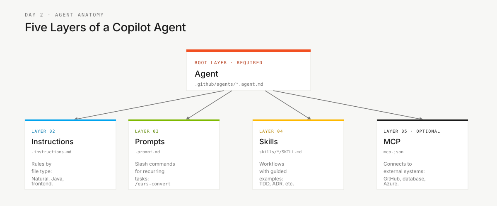

<!-- markdownlint-disable MD013 MD033 MD041 -->

# Os 4 Agentes do SDLC — Explicados


> **Trilha:** [Kit do Time](../README.md) › [Docs](README.md) › **4 Agentes Explicados**

**Explica a lógica por trás dos quatro agentes de etapa** — leia quando alguém perguntar: "por que temos agentes de etapa se cada persona já tem seu próprio kit?"

| Campo | Valor |
|---|---|
| **Público-alvo** | Todo o time, especialmente quem está usando o Copilot pela primeira vez em um contexto de equipe |
| **Pré-requisitos** | Ter lido o `PERSONA.md` do seu papel |
| **Resultado esperado** | Entender a diferença entre persona-kit e agent-kit e saber qual usar em cada momento |

---

## Conceito

Um **persona-kit** responde: "qual é o meu papel?"
Um **agent-kit** responde: "como o time trabalha agora, nesta etapa?"

Os dois são necessários e complementares. Uma pessoa pode assumir as personas Developer e Technical Lead, mas no Estágio 1 ela ainda deve usar o `@archaeologist`, porque o time inteiro está lendo o legado naquele momento.

---

## Por que são 4 agentes

O workshop tem quatro modos de trabalho. Cada modo exige comportamento diferente do Copilot.

| Etapa | Modo de trabalho | Agente | Regra principal |
|---|---|---|---|
| 1 — Arqueologia | Observar e catalogar | `@archaeologist` | Não escrever código |
| 2 — Spec Moderna | Estruturar e decidir | `@architect` | Não aceitar requisito sem evidência do legado |
| 3 — Implementação | Construir e verificar | `@builder` | Não codar sem REQ-ID e teste correspondente |
| 4 — Evolução | Delegar e revisar | `@evolution` | Não aceitar pull request de IA sem revisão humana |

Um agente único teria instruções conflitantes: no Estágio 1 ele precisa ser somente-leitura; no Estágio 3 precisa editar e executar testes. Separar por etapa torna a experiência mais segura e mais compreensível para quem está aprendendo.

---

## Anatomia de um agente



| Camada | Para que serve | Exemplo |
|---|---|---|
| Agente | Define missão, ferramentas e comportamento | `@builder` sabe implementar e testar |
| Instruções | Regras sensíveis ao tipo de arquivo | Natural/Adabas, Java, frontend |
| Prompts | Ações reutilizáveis | `/translate-natural-to-java`, `/write-ears-spec` |
| Skills | Guia aprofundado para uma técnica | TDD, ADR, extração de regra de negócio |
| MCP | Conecta o agente a sistemas externos | GitHub, banco de dados, Azure quando configurado |

---

## Como usar os agentes no dia

- [ ] **Começar pela etapa, não pela vontade individual.** Consulte o horário em [`00-TEAM-FLOW.md`](../00-TEAM-FLOW.md).
- [ ] **Selecionar o agente de etapa no Copilot Chat.** Exemplo: `@architect` no Estágio 2.
- [ ] **Ler também seu `PERSONA.md`.** Ele descreve o que você, como pessoa, deve observar naquela etapa.
- [ ] **Usar os prompts do estágio.** Eles transformam conversa em artefato verificável.
- [ ] **Parar no gate.** Só avance quando a Definição de Pronto da etapa estiver cumprida.

---

## Fluxo de interação

Durante o Estágio 2, o Requirements Engineer pode levar uma descoberta confirmada ao Software Architect, que coordena a etapa com `@architect`.

```text
@architect
Temos esta regra extraída do legado:
"<regra confirmada>"
Ajude a estruturá-la em EARS com REQ-ID, critérios de aceite e source_legacy.
```

O artefato deve registrar somente a evidência do time:

```yaml
REQ-XXX:
  pattern: <padrão EARS>
  text: "<requisito>"
  source_legacy: <arquivo:linhas ou [GREENFIELD] + justificativa>
  acceptance: "<cenário verificável>"
```

---

## Regra: sem resposta pronta sem evidência

Os agentes ensinam o caminho, mas não entregam a resposta pronta sem evidência. Isso protege o aprendizado e evita alucinação.

| Se você pedir... | O agente responde... |
|---|---|
| "Diga quais são os bounded contexts" | "Mostre o catálogo de programas e o mapa de dados." |
| "Crie requisitos para tudo" | "Vamos começar por uma regra com fonte no legado." |
| "Implemente esta funcionalidade sem spec" | "Falta REQ-ID, critério de aceite e `source_legacy`." |

---

## Como saber que entendeu

Você entendeu o modelo quando consegue explicar estas três frases para outra pessoa:

1. Persona-kit é papel; agent-kit é etapa.
2. O agente de etapa muda ao longo do dia; suas duas personas continuam as mesmas.
3. Todo artefato importante precisa sobreviver fora do chat, em arquivo versionado.

---

## Referências

- [Kits de agentes](../06-agentes-de-estagio/README.md)
- [Matriz persona-agente](persona-agent-matrix.md)
- [Fluxo SDLC completo](sdlc-flow-guide.md)
- [Persona kits](../05-personas/README.md)

---

### Continuar a leitura

| Anterior | Próximo |
|---|---|
| [Persona-Agent Matrix](persona-agent-matrix.md)<br/><sub>Intensidade por persona e etapa.</sub> | [Fluxo SDLC](sdlc-flow-guide.md)<br/><sub>Contratos entre pares.</sub> |

<sub>[Voltar ao índice do kit](../README.md)</sub>
