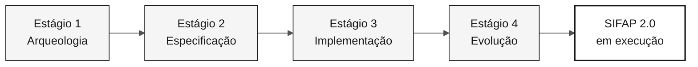

<!-- markdownlint-disable MD013 MD033 MD041 -->

# Guia de Padronização da Documentação

> **Trilha:** [Kit do Time](../README.md) › [Docs](README.md) › **Guia de estilo da documentação**

Este é o **contrato único** de estilo para TODOS os arquivos `.md` do repositório
`datacorp-mm-team-kit`, **exceto** os que estão dentro de `.github/` (não tocar).

Objetivo: documentação moderna, didática, profissional, sóbria — sem emojis,
sem analogia de Super Mario, com diagramas Mermaid em tons neutros
(branco / cinza / preto), tabelas, checklists e blocos de destaque.

---

## 1. Regras absolutas (nunca violar)

| # | Regra |
|---|---|
| R1 | **Zero emojis.** Remover todos os caracteres emoji/pictográficos de títulos, tabelas, listas, callouts, blocos ASCII e texto corrido. Substituir por palavras, badges em cinza, ou nada. |
| R2 | **Zero analogia Super Mario / Nintendo.** Remover Mario, Luigi, Peach, Daisy, Rosalina, Toad, Yoshi, Koopa, Goomba, Bowser, princesa, castelo, cogumelo, power-up, mundo 1-1, cano verde, estrela de invencibilidade, mana, XP, "raid", "game over", "boss", "co-op". Ver §2 para o vocabulário substituto. |
| R3 | **"hackathon"/"hackaton" → "workshop".** Inclusive em nomes de diretório de exemplo (`hackathon-team-XX` → `workshop-team-XX`), títulos e texto corrido. |
| R4 | **Não alterar nada dentro de `.github/`.** Links *apontando para* `.github/...` continuam válidos e devem ser preservados. |
| R5 | **Não inventar conteúdo factual novo.** Preservar 100% da informação técnica, comandos, caminhos, REQ-IDs, nomes de arquivos e tabelas de dados existentes. A mudança é de forma, didática e organização — não de fatos. |
| R6 | **Não quebrar links.** Ao renomear um arquivo, atualizar todos os links que apontam para ele. Caminhos relativos devem continuar corretos. |
| R7 | Escrever em **português do Brasil**, tom didático e educativo (ver §6). |

---

## 2. Vocabulário substituto (Mario → profissional)

| Termo antigo | Termo novo |
|---|---|
| Mundo 1 / 1-1 / Overworld | Estágio 1 — Arqueologia |
| Mundo 2 / 2-1 / Underground | Estágio 2 — Especificação |
| Mundo 3 / 3-1 / Athletic | Estágio 3 — Implementação |
| Castelo / 4-Castle / Bowser | Estágio 4 — Evolução |
| Princesa / resgatar a princesa | Objetivo final: SIFAP 2.0 em execução na demonstração |
| Cano verde | Passagem de bastão (handoff) entre estágios |
| Estrela / estrela de invencibilidade | Pipeline de CI aprovado (CI verde) |
| Power-up / inventário / mochila | Kit da persona (prompts, skills, instructions) |
| Personagem jogável (Mario, Peach…) | A própria persona (Product Owner, Developer…) |
| Ataque / golpe especial / mana / XP | Modo do Copilot / slash command / custo de tempo |
| Cena de combate / raid / boss | Cenário de uso / exemplo prático / revisão de PR |
| Game over / cair no buraco | Falha do projeto / risco / antipadrão |
| Co-op de 5 jogadores | Equipe de 5 pessoas em 5 pares de personas |
| Mario Maker | Ferramenta de autoria de especificação (Spec-Kit) |
| Receita de cogumelo | Modelo/gabarito de requisito |
| Carta da princesa | Registro formal de decisão (ADR) |
| Yoshi engole tabelas | (reescrever de forma literal: modelagem e otimização de dados) |

Quando a analogia era o *único* conteúdo de uma seção, **substitua por conteúdo
didático real**: definição do conceito, por que importa, exemplo concreto SIFAP
e caso de uso. Não deixe seção vazia nem apenas renomeie o rótulo.

---

## 3. Estrutura canônica de documento

Todo `.md` (exceto templates puros e arquivos de dados) segue esta ordem:

```markdown
<!-- markdownlint-disable MD013 MD033 MD041 -->

# Título do Documento

> **Trilha:** [Kit do Time](../README.md) › [Seção](README.md) › **Documento atual**

**Resumo em uma frase.** Frase única, direta, que explica o que o leitor
consegue fazer depois de ler.

| Campo | Valor |
|---|---|
| **Público-alvo** | quem deve ler |
| **Pré-requisitos** | o que precisa saber/ter antes |
| **Tempo estimado** | 15 min |
| **Estágio** | Estágio 2 — Especificação |
| **Resultado esperado** | artefato concreto produzido |

---

## Conceito

Explicação didática do conceito (o quê, por que existe, qual problema resolve).

## Como funciona

Diagrama Mermaid + explicação.

## Passo a passo

Checklist executável.

## Exemplo aplicado ao SIFAP

Exemplo concreto, nunca abstrato.

## Casos de uso

Quando usar / quando não usar.

## Critérios de conclusão

- [ ] item verificável

## Erros comuns e como evitar

Tabela sintoma → causa → correção.

## Referências

Links relacionados.

---

### Continuar a leitura
(bloco de navegação — ver §8)
```

Adapte as seções ao conteúdo real do arquivo; não force seções vazias.
O importante é: **contexto → conceito → prática → verificação → próximos passos**.

---

## 4. Diagramas Mermaid — tema neutro obrigatório

Substitua desenhos ASCII-art por Mermaid sempre que o diagrama representar
fluxo, hierarquia, sequência, estados ou relações. Preserve blocos de código
de terminal/código-fonte como estão (não são diagramas).

### Paleta única (usar exatamente estes valores)

| Papel | fill | stroke | color |
|---|---|---|---|
| Primário / destaque | `#F5F5F5` | `#171717` | `#171717` |
| Secundário | `#FFFFFF` | `#525252` | `#171717` |
| Terciário / apoio | `#FAFAFA` | `#A3A3A3` | `#404040` |
| Sombreado / inativo | `#E5E5E5` | `#737373` | `#404040` |
| Contorno forte (resultado) | `#FFFFFF` | `#171717` | `#171717` (stroke-width 2px) |

### Cabeçalho padrão obrigatório em todo bloco Mermaid



Regras Mermaid:
- Sempre incluir o bloco `%%{init: ...}%%` acima (copiar literal).
- Nunca usar cores saturadas (azul, laranja, verde, vermelho, amarelo).
- Rótulos entre aspas duplas: `A["Texto"]`. Quebra de linha com `<br/>`.
- Sem emojis dentro do diagrama.
- Tipos permitidos: `flowchart`, `sequenceDiagram`, `stateDiagram-v2`,
  `journey`, `gantt`, `mindmap`, `timeline`, `erDiagram`, `classDiagram`,
  `quadrantChart`, `C4Context`.
- Diagramas grandes: preferir `flowchart TB` com `subgraph` nomeado por área.
- Não usar `linkStyle` com cor saturada; se necessário `stroke:#525252`.

### Substituir sequências ASCII por Mermaid

Blocos como `A ──> B ──> C` ou caixas desenhadas com `┌─┐` devem virar Mermaid.
Árvores de diretório (`├──`) **podem permanecer** como bloco de código `text`,
mas sem emojis nos nós.

---

## 5. Componentes visuais permitidos

### 5.1 Blocos de destaque (GitHub Alerts) — usar no lugar de emojis

```markdown
> [!NOTE]
> Informação complementar útil.

> [!TIP]
> Atalho ou boa prática.

> [!IMPORTANT]
> Informação necessária para ter sucesso.

> [!WARNING]
> Risco de perder trabalho ou quebrar o CI.

> [!CAUTION]
> Consequência negativa séria; ação proibida.
```

### 5.2 Badges — apenas escala de cinza

Use `flat-square` e apenas estas cores: `171717`, `404040`, `737373`, `A3A3A3`, `E5E5E5`.

```markdown


```

Máximo 3 badges por documento, sempre logo após o resumo. Nunca colorido.

### 5.3 Tabelas

Preferir tabela a lista sempre que houver 2+ dimensões (item × atributo).
Cabeçalhos em **negrito** apenas na primeira coluna quando for chave.
Alinhamento: `|---|---|` (padrão). Evitar tabelas com mais de 5 colunas.

### 5.4 Checklists

Toda seção que descreve ações executáveis vira checklist GFM:

```markdown
## Passo a passo

- [ ] **Passo 1 — Ler os programas atribuídos.** Abrir `01-arqueologia/legado-sifap/natural-programs/`.
- [ ] **Passo 2 — Registrar regras.** Preencher `business-rules-catalog.md`.
- [ ] **Passo 3 — Validar.** Executar `npm run lint:docs`.
```

Padrão do item: `- [ ] **Verbo no infinitivo — título curto.** Detalhe com caminho/comando.`

### 5.5 Blocos `<details>` para conteúdo longo opcional

```markdown
<details>
<summary><strong>Exemplo completo do arquivo gerado</strong></summary>

...conteúdo...

</details>
```

### 5.6 Separadores

Usar `---` entre grandes áreas do documento. Não usar mais de um `---` seguido.

### 5.7 Imagens/SVG existentes

Manter todas as referências a `assets/*.svg` existentes. Não remover imagens.
Garantir que todo `![...]` tenha **texto alternativo descritivo** (acessibilidade),
sem emoji.

---

## 6. Tom didático (obrigatório)

Cada conceito novo deve ter, nesta ordem:

1. **Definição** — o que é, em uma frase objetiva.
2. **Por que importa** — que problema resolve neste workshop.
3. **Como se aplica ao SIFAP** — exemplo concreto do domínio (programas `.NSN`,
   DDMs, pagamentos, benefícios, fiscalização).
4. **Caso de uso** — situação real em que o leitor vai usar.
5. **Erro comum** — o que costuma dar errado.

Diretrizes de escrita:
- Voz ativa, segunda pessoa ("você faz", "abra o arquivo").
- Frases curtas. Um parágrafo = uma ideia.
- Termos técnicos em inglês são mantidos (`bounded context`, `pull request`),
  mas explicados na primeira ocorrência.
- Nada de humor forçado, gírias de jogo ou hype. Profissional e acolhedor.
- Nunca usar "simplesmente", "basta", "é fácil".

---

## 7. Glossário e termos do domínio

Manter e reforçar: SIFAP, Natural, Adabas, DDM, FDT, EARS, REQ-ID,
`source_legacy`, ADR, bounded context, Spec-Kit, Strangler Fig,
Modular Monolith, Testcontainers.

Ao mencionar um termo pela primeira vez em um documento, dar definição curta
entre parênteses ou em nota.

---

## 8. Rodapé de navegação padrão

Substituir os rodapés atuais por este formato (sem emoji):

```markdown
---

### Continuar a leitura

| Anterior | Próximo |
|---|---|
| [Título anterior](arquivo-anterior.md)<br/><sub>Resumo em uma linha.</sub> | [Título seguinte](arquivo-seguinte.md)<br/><sub>Resumo em uma linha.</sub> |

<sub>[Voltar ao índice do kit](../README.md)</sub>
```

Se não houver anterior ou próximo, use `—` na célula.
Blocos `<table>` em HTML existentes devem ser convertidos para este formato.

---

## 9. Cabeçalho de arquivo

Substituir a linha longa de `markdownlint-disable` por a versão enxuta:

```markdown
<!-- markdownlint-disable MD013 MD033 MD041 -->
```

Apenas um `# H1` por arquivo. Hierarquia de títulos sem pular níveis
(`#` → `##` → `###`).

---

## 10. Renomeações de arquivo acordadas (07-conceitos)

| Arquivo atual | Novo nome |
|---|---|
| `07-conceitos/01-spec-kit-como-mario-maker.md` | `07-conceitos/01-spec-driven-development.md` |
| `07-conceitos/02-agentes-como-super-mario.md` | `07-conceitos/02-agentes-e-personas.md` |
| `07-conceitos/05-ears-receita-de-cogumelo.md` | `07-conceitos/05-notacao-ears.md` |
| `07-conceitos/06-adr-carta-da-princesa.md` | `07-conceitos/06-architecture-decision-records.md` |

Os demais arquivos (`00-README.md`, `03-glossario-visual.md`,
`04-3-modos-do-copilot.md`) mantêm o nome.

Renomear com `git mv`. Todo agente que encontrar links para os nomes antigos
deve atualizá-los para os novos.

---

## 11. Checklist de verificação por arquivo

Antes de considerar um arquivo pronto:

- [ ] Nenhum emoji (`grep -P '[\x{1F300}-\x{1FAFF}\x{2600}-\x{27BF}\x{2B00}-\x{2BFF}\x{FE0F}\x{2190}-\x{21FF}]'` sem resultados relevantes)
- [ ] Nenhuma referência a Mario/Nintendo/analogia de jogo
- [ ] Nenhuma ocorrência de "hackathon"/"hackaton"
- [ ] Todo bloco Mermaid tem o cabeçalho `%%{init:...}%%` e paleta neutra
- [ ] Todas as ações executáveis estão em checklist `- [ ]`
- [ ] Tabelas usadas onde há 2+ dimensões
- [ ] Alertas GFM (`> [!NOTE]`) no lugar de emojis de aviso
- [ ] Rodapé de navegação no formato do §8
- [ ] Links relativos válidos (arquivo de destino existe)
- [ ] Conteúdo factual preservado

---

### Continuar a leitura

| Anterior | Próximo |
|---|---|
| [Índice da documentação](README.md)<br/><sub>Todos os documentos de apoio do kit.</sub> | [FAQ](FAQ.md)<br/><sub>Perguntas frequentes do workshop.</sub> |

<sub>[Voltar ao índice do kit](../README.md)</sub>
