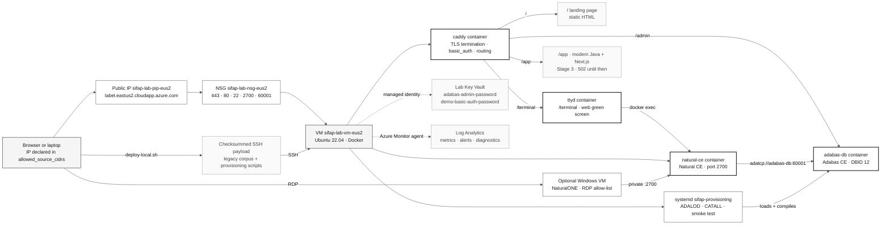

# Adabas + Natural Lab — optional legacy runtime

> **Track:** [Team Kit](../../README.md) › [Stage 1 — Archaeology](../../01-archaeology/README.md) › **Adabas + Natural Lab**

**Provisions an Azure VM in East US 2 running Adabas Community Edition and Natural Community Edition in containers, published behind a stable HTTPS demo URL, for participants who want to run the legacy programs of SIFAP (Payment Inspection and Administration System) instead of only reading them.**

  

| Field | Value |
|---|---|
| **Target audience** | DevOps Engineer (Pair 5) and anyone who wants to run the actual legacy system |
| **Prerequisites** | Your own Azure subscription, authenticated Azure CLI, Terraform 1.14.x, SSH key pair, and a safe backup location for local Terraform state |
| **Estimated time** | 15 minutes of commands, plus the VM's first-boot time |
| **Region** | `eastus2` (East US 2) |
| **Stage** | Optional track — support for Stage 1 (Archaeology) |
| **Expected result** | Adabas CE and Natural CE running on a VM, reachable at `https://<label>.eastus2.cloudapp.azure.com` |

> [!CAUTION]
> This module creates paid resources in a real Azure subscription. Read [Cost and spending control](#cost-and-spending-control) before the first `terraform apply`.

> [!IMPORTANT]
> **Moving from `brazilsouth`?** A previous version of this module deployed to `brazilsouth` and left a partially applied environment behind. Azure cannot move those resources to East US 2 in place. Follow [Migrating off `brazilsouth`](#migrating-off-brazilsouth) **before** your first apply here, or the Key Vault name collision will stop you mid-run.

---

## What this module provides

The Terraform in this directory creates an isolated environment with a functional legacy runtime:

- A Linux VM (Ubuntu 22.04 LTS) with Docker installed on first boot;
- The `adabas-db` container with Adabas Community Edition and a demonstration database;
- The `natural-ce` container with Natural Community Edition, already mapped to Adabas;
- **The frozen SIFAP legacy sources, shipped automatically** — packaged from the working tree with a SHA-256 manifest and uploaded over the allow-listed SSH path by `deploy-local.sh`;
- **A provisioning unit that loads and compiles them** — `systemd` runs the scripts that create the Adabas file, load the data, import the DDMs and compile the `SIFAPPRD` library, then smoke-test it;
- **A `ttyd` web terminal**, so the Natural green screen is reachable in a browser over HTTPS rather than only through a telnet-era client;
- A **Caddy reverse proxy** that terminates TLS and requires authentication, routing `/` to a landing page, `/terminal` to the green screen, `/app` to the modern application from Stage 3, and `/admin` to the Adabas console;
- A private-only Key Vault that stores the generated Adabas, demo URL and optional Windows workstation credentials, reachable only through a Private Endpoint;
- A Network Security Group that opens the lab ports only to the IPs you declare;
- A Log Analytics workspace, diagnostic settings, the Azure Monitor agent, and alerts for VM availability, bootstrap failure and provisioning failure;
- A resource-group budget with notifications at 50%, 80%, and 100%;
- A daily VM shutdown schedule and an optional data-disk snapshot to contain costs and protect work.

The goal is a legacy system that actually runs: sources on the VM, data in Adabas, programs compiled, and a URL you can hand to an audience. Loading and compiling are automated by the scripts in [`provisioning/`](provisioning/); if that directory is empty the module still deploys, and says so loudly rather than quietly presenting an empty database.

> [!NOTE]
> **Software AG licence.** `cloud-init.yaml` sets `ACCEPT_EULA: "Y"` on the `adabas-db` and `natural-ce` containers, which accepts the Software AG Community Edition licence terms on your behalf when the lab boots. If you have not read those terms, read them before applying: the acceptance is recorded against whoever owns the subscription, not against this repository.

### When you do not need this lab

The workshop's main path does not depend on this environment. In Stages 1 through 4, the SIFAP legacy system is reading material: the Natural programs and DDMs in [`01-archaeology/legacy-sifap/`](../../01-archaeology/legacy-sifap/) are text files, and the traceability required in Stage 2 (`source_legacy:`) points to those files, not to an execution.

| Situation | Do you need the lab? |
|---|---|
| Read the programs, catalog rules, and write EARS requirements | No |
| Implement SIFAP 2.0 with Java 21 + Next.js 15 | No |
| Pass the workshop CI gates | No |
| See Natural syntax actually compiled and executed | Yes |
| Confirm the behavior of a program whose code was ambiguous during reading | Yes |
| Demonstrate the difference between the legacy runtime and the modern architecture | Yes |

> [!NOTE]
> Treat this lab as an optional advanced track. No required workshop artifact depends on it.

---

## Provisioned architecture



Names follow the `{project}-{env}-{resource}-{region}` convention from [`infrastructure.instructions.md`](../../.github/instructions/infrastructure.instructions.md). The region suffix is **derived from `var.location`** rather than typed by hand, so changing the region cannot leave a stale suffix behind. With the default values (`project = sifap`, `environment = lab`, `location = eastus2`), the resource group is `sifap-lab-rg-eus2`.

| Location | Derived suffix | Example resource group |
|---|---|---|
| `eastus2` | `eus2` | `sifap-lab-rg-eus2` |
| `eastus` | `eus` | `sifap-lab-rg-eus` |
| `westeurope` | `weu` | `sifap-lab-rg-weu` |

Set `location_short` explicitly only if your region is not in the map in `main.tf`; leaving it empty is the supported path.

---

## The demo URL and how TLS is terminated

The lab publishes one URL. It is a name, not an address, and it survives a VM restart:

```text
https://sifap-lab-<random>.eastus2.cloudapp.azure.com
```

Azure issues that FQDN because the public IP carries a `domain_name_label`. The label is derived from the same random suffix that makes the Key Vault name unique, so the two are traceably one deployment. The IP is `Static` with the `Standard` SKU, so stopping and starting the VM does not change the address behind the name. Override the label with `dns_label_prefix` if you want something memorable — it must be globally unique within the region.

TLS is terminated by a **Caddy container** running alongside `adabas-db`, `natural-ce` and `ttyd`. Requests arrive at 443, Caddy terminates TLS and reverse-proxies over Docker's internal network. Nothing it proxies publishes a plaintext public port.

### What lives at each route

| Route | Serves | Auth | Notes |
|---|---|---|---|
| `/` | Landing page linking the two demos | Yes | Static HTML from `/opt/sifap/www` |
| `/terminal/` | **The legacy green screen** — a Natural session in the browser | Yes | `ttyd` → `docker exec` into `natural-ce` |
| `/app/` | **The modern Java + Next.js app** from Stage 3 | Yes | **502 until Stage 3 ships** — see below |
| `/admin/` | Adabas REST administration console | Yes | Was the default route; no longer is |
| `/healthz` | Fixed `ok` string | **No** | So uptime probes need no credential |

Get them from Terraform rather than assembling them by hand:

```bash
terraform output demo_url terminal_url modern_app_url admin_console_url healthz_url
```

**Why a web terminal at all.** Natural is a character-mode system. Its port 2700 carries the Natural Development Server protocol that NaturalONE attaches to — it is not telnet, and no browser can open either. `ttyd` bridges the gap: it serves an xterm.js terminal over HTTP/WebSocket and runs one command per connection, and that command opens a Natural session inside the `natural-ce` container. That is what makes "here is the 1980s system, running" a link you can paste into a chat window.

**`/app/` returns 502 on purpose.** The route is provisioned before the application exists so the URL never has to change once the team builds it. Point it at whatever Stage 3 produces with `modern_app_upstream` (default `sifap-app:8080`) and attach that container to the `sifap-lab` Docker network.

**The `ttyd` trade-off, stated plainly.** The terminal container mounts the Docker socket, which is root-equivalent control of the host. It is how `docker exec` reaches into `natural-ce`; the alternative — a second Natural container sharing the FUSER volume — risks corrupting the library the workshop just compiled. What contains it: `ttyd` publishes no host port, so it is reachable only through Caddy; Caddy requires authentication; and the NSG still gates 80/443 unless `enable_public_acme` is on. This is a disposable lab holding no production data. Destroy it after the demo.

### Authentication on the public origin

Every route except `/healthz` is behind HTTP basic auth, using Caddy's `basic_auth` directive (renamed from `basicauth` in Caddy 2.10; the old spelling still parses but warns). bcrypt is the default algorithm, and the value in the config is the hash itself.

Neither the username nor the hash appears in this repository, in `cloud-init.yaml` or in `custom_data`. The flow is:

1. Terraform generates a random password; a protected VM Extension stores it in Key Vault as `demo-basic-auth-password` through the VM identity and private endpoint.
2. At boot the VM reads it with its managed identity and pipes it through `caddy hash-password` **on stdin** — so the plaintext never appears in the process table or in `docker inspect`.
3. The resulting hash is written to `/opt/sifap/caddy.env`, mode `0600`, and read by Caddy as `{$SIFAP_BASIC_AUTH_HASH}`.

Read the password back with:

```bash
# Prints the az command for your deployment; run it to see the password
terraform output -raw demo_basic_auth_password_command
terraform output -raw demo_basic_auth_username
```

To bring your own credential instead, hash it yourself and pass it through the environment — never through a committed file:

```bash
caddy hash-password                     # or: docker run --rm -it caddy caddy hash-password
export TF_VAR_demo_basic_auth_password_hash='$2a$14$...'   # single quotes: the hash contains $
SIFAP_ENABLE_DDM_WORKSTATION=true ./deploy-local.sh apply
```

Terraform then stores only the hash, as `demo-basic-auth-hash`, and the plaintext stays with you.

**It fails closed.** If the VM cannot read the secret, `bootstrap.sh` locks the site with a hash of a random string nobody holds: the URL stays up, `/healthz` still answers, and every other route is simply unenterable until it is fixed. And if the env file were missing entirely, Caddy refuses to start rather than serving an open origin — verified locally against Caddy 2.10.2, which errors with `username and password cannot be empty or missing`.

### Choosing a certificate mode

There is a real tradeoff here, and the module makes you choose rather than deciding quietly for you.

Let's Encrypt validates an HTTP-01 challenge by connecting to port 80 **from arbitrary addresses worldwide**. An NSG allow-list that excludes those addresses also excludes the challenge. So a CIDR allow-list and a publicly trusted certificate are mutually exclusive — you cannot have both, and any module that claims otherwise is quietly opening the port.

| `enable_public_acme` | NSG rules for 80/443 | Certificate | Browser warning |
|---|---|---|---|
| `false` (default) | `allowed_source_cidrs` only | Caddy's internal CA | Yes, until you trust the CA |
| `true` | `Internet` service tag | Let's Encrypt | No |

Default is `false`. The demo is still `https://`, the traffic is still encrypted, and the listener is still restricted to your CIDRs — you just get a browser warning, which is the honest cost of not widening the port.

Set `enable_public_acme = true` when you need a green padlock for an audience that cannot install a CA certificate. Understand what it changes: ports 80 and 443 become reachable from the whole internet. Basic auth is then the only thing between that internet and an interactive terminal on the database host, so treat the password accordingly and destroy the lab when the demo ends. SSH, Natural (2700), and ADATCP (60001) stay allow-listed in both modes; they are never widened.

> [!IMPORTANT]
> Even in ACME mode the module uses the `Internet` service tag rather than a literal `0.0.0.0/0`, and `allowed_source_cidrs` still rejects `0.0.0.0/0` outright. If you want a genuinely open demo, widen `allowed_source_cidrs` yourself, deliberately, and write down why.

To trust the internal CA instead of widening anything:

```bash
terraform output -raw trust_demo_ca_command
```

### Confirming the URL is live

`deploy-local.sh apply` returns after cloud-init, payload upload and provisioning restart. The URL can answer before the Adabas load and Natural catalog are complete; check it rather than guessing:

```bash
# Prints a ready-to-run curl for your deployment
terraform output -raw health_check_command

# /healthz is unauthenticated, so this needs no credential.
# Internal-CA mode needs -k, because the CA is not in your trust store yet
curl -sSfk "$(terraform output -raw healthz_url)" && echo "demo is up"
```

If it does not answer, the bootstrap log is the first place to look:

```bash
terraform output -raw bootstrap_log_command
```

Bootstrap writes a machine-readable verdict to syslog on the way out — `SIFAP-BOOTSTRAP RESULT: SUCCESS` or `FAILED` — which is what the bootstrap-failure alert watches for. It also probes the demo URL itself before finishing and warns in the log if the proxy never came up.

---

## Prerequisites

- [ ] **Have an Azure subscription with permission to create resources.** You must be able to create a resource group, VMs, a Key Vault, access policies, a Private Endpoint and DNS zone, a Log Analytics workspace, and a consumption budget. Confirm with `az account show`.
- [ ] **Install and authenticate the Azure CLI.** Run `az login` and, if you have more than one subscription, `az account set --subscription "<SUBSCRIPTION-ID>"`.
- [ ] **Install Terraform 1.14.x.** The requirement is in `versions.tf` (`required_version = "~> 1.14.0"`). Check with `terraform version`.
- [ ] **Prepare to protect local state.** This tenant forces Storage Account `publicNetworkAccess=Disabled` at management-group scope, so the Azure Blob backend is not reachable from laptops or GitHub-hosted runners. Local `terraform.tfstate` is the supported default; keep it on the facilitator workstation and back it up after every apply.
- [ ] **Have an SSH key pair.** The module reads the public key specified by `ssh_public_key_path`, which defaults to `~/.ssh/id_rsa.pub`. If it does not exist, generate it with `ssh-keygen -t rsa -b 4096 -f ~/.ssh/id_rsa`.
- [ ] **Confirm the regional vCPU quota.** This is not optional bookkeeping — a zero quota is what left the previous `brazilsouth` attempt half-applied.
- [ ] **Accept the cost.** The VM, its managed disks, and the static public IP incur charges while they exist.

### Quota preflight

Run this **before** every first apply in a new region or subscription. It takes seconds and it is the single check that would have prevented the `brazilsouth` failure:

```bash
az vm list-usage --location eastus2 -o table
```

Look for the `Standard Dsv7 Family vCPUs` row. The default `Standard_D2s_v7` needs 2 vCPUs per enabled VM (4 when the DDM workstation is enabled). If the limit is too low, request an increase before applying — Terraform will otherwise create the resource group, Key Vault, disk, and network, then fail on a VM and leave you with exactly the half-applied state this module now works to avoid.

The same quota check runs in the manual preflight job of [`deploy-lab.yml`](../../.github/workflows/deploy-lab.yml), and the command is available as an output:

```bash
terraform output -raw quota_preflight_command
```

Confirm the region and size too:

```bash
az account show --output table
az vm list-skus --location eastus2 --size Standard_D2s_v7 --all --output table
```

---

## Migrating off `brazilsouth`

The previous version of this module deployed to `brazilsouth` and, in at least one subscription, stopped partway through: the resource group, Key Vault, a 32 GB Premium disk, VNet, subnet, and NSG were created, while the VM, public IP, NIC, Key Vault secret, disk attachment, and auto-shutdown schedule were not. The signature of a vCPU quota failure on `Standard_D2s_v3`.

**Azure cannot move those resources to East US 2.** A region is fixed at creation. There is no `az resource move` across regions for a VM, a disk, or a vault, and Terraform will not attempt it. The old environment has to go before the new one comes up.

> [!CAUTION]
> Read this whole section before running anything. Step 2 is the one people skip, and it is the one that blocks the next apply with an error that does not mention regions at all.

### Option A — delete the resource group (recommended)

Use this when the local state no longer matches the configuration, which is the case here: the module has been rewritten around it. Terraform cannot cleanly destroy resources it can no longer describe, so let Azure remove them by group.

- [ ] **Step 1 — Confirm what you are about to delete.** Check the group is the lab and nothing else moved in.

```bash
az group show --name sifap-lab-rg-brs --output table
az resource list --resource-group sifap-lab-rg-brs --output table
```

- [ ] **Step 2 — Delete the resource group.**

```bash
az group delete --name sifap-lab-rg-brs --yes
```

- [ ] **Step 3 — Purge the soft-deleted Key Vault.** Do not skip this. Deleting the group only *soft*-deletes the vault; the name stays reserved for seven days, and the next apply fails with a name-already-taken error.

```bash
az keyvault purge --name sifaplabkvsz7tag --location brazilsouth
```

Substitute your own vault name if it differs — the six-character suffix is random per deployment. To find it:

```bash
az keyvault list-deleted --query "[].{name:name, location:properties.location}" -o table
```

- [ ] **Step 4 — Discard the local state.** It describes resources that no longer exist, in a region this module no longer targets. Keeping it around only invites a confusing plan.

```bash
cd infra/adabas-natural-lab
rm -f terraform.tfstate terraform.tfstate.backup
```

- [ ] **Step 5 — Confirm nothing remains.** Both commands should report that the object does not exist.

```bash
az group show --name sifap-lab-rg-brs
az keyvault show-deleted --name sifaplabkvsz7tag --location brazilsouth
```

### Option B — terraform destroy from the old commit

Cleaner in principle, and only possible if you still have the commit where the configuration matched the state. Terraform must be able to describe a resource to destroy it.

```bash
git stash                                  # park the new configuration
git checkout <commit-before-the-eastus2-migration> -- infra/adabas-natural-lab
cd infra/adabas-natural-lab
terraform init
terraform destroy
git checkout HEAD -- infra/adabas-natural-lab
git stash pop
```

Then run Step 3 above anyway, because an interrupted destroy leaves the vault soft-deleted just the same.

### The trap worth knowing about

`versions.tf` sets `recover_soft_deleted_key_vaults = true`. That is the right default for day-to-day work — it stops a re-apply from tripping over its own soft-deleted vault — but it has a sharp edge during a region move.

**If a soft-deleted vault with the same name still exists in `brazilsouth`, a new apply targeting `eastus2` recovers the old vault in `brazilsouth` instead of creating a new one in `eastus2`.** Terraform reports success. You end up with a lab in East US 2 whose vault is in Brazil, paying cross-region latency on every secret read, and wondering why the region move did not take.

Purging first is what prevents it. That is the whole reason Step 3 is not optional.

### After migrating

Everything is renamed. The `-brs` suffix is derived from `var.location` now, so nothing needs a manual edit:

| Before (`brazilsouth`) | After (`eastus2`) |
|---|---|
| `sifap-lab-rg-brs` | `sifap-lab-rg-eus2` |
| `sifap-lab-vnet-brs` | `sifap-lab-vnet-eus2` |
| `sifap-lab-nsg-brs` | `sifap-lab-nsg-eus2` |
| `sifap-lab-vm-brs` | `sifap-lab-vm-eus2` |
| `sifaplabkv<random>` | `sifaplabkv<random>` (new random suffix) |

---

## Step-by-step deployment

- [ ] **Step 0 — Select the workshop subscription.**

```bash
az account set --subscription bf39c110-94c5-4bfa-959d-216b1f971d81
az account show --query "{subscription:id, tenant:tenantId, user:user.name}" -o table
```

- [ ] **Step 1 — Enter the module directory.**

```bash
cd infra/adabas-natural-lab
```

- [ ] **Step 2 — Create your variables file.**

```bash
cp terraform.tfvars.example terraform.tfvars
```

- [ ] **Step 3 — Discover your public IP.**

```bash
curl -s https://api.ipify.org
```

- [ ] **Step 4 — Fill in `terraform.tfvars`.** Two variables are required: `owner` and `allowed_source_cidrs`. Use the IP from the previous step with a `/32` mask.

```hcl
owner = "your-github-handle"

allowed_source_cidrs = [
  "<YOUR-PUBLIC-IP>/32",
]
```

- [ ] **Step 5 — Run the complete preflight and review the plan.** This checks the subscription, providers, Contributor-or-higher RBAC, pinned Windows image, SKU restrictions, aggregate quota for both VMs, Terraform formatting and validation.

```bash
SIFAP_ENABLE_DDM_WORKSTATION=true ./deploy-local.sh plan
```

- [ ] **Step 6 — Apply and deliver the payload.** The script re-runs preflight, applies the reviewed configuration, backs up local state with mode `0600`, waits for SSH, uploads the checksummed working-tree payload, verifies it on the VM and starts provisioning.

```bash
SIFAP_ENABLE_DDM_WORKSTATION=true ./deploy-local.sh apply
```

A different tenant that permits reachable state storage can opt in by uncommenting the `backend "azurerm"` block in `versions.tf` and supplying the backend config from [`infra/bootstrap`](../bootstrap/README.md). Do not do that in the Microsoft corporate tenant: management-group policy forces Storage `publicNetworkAccess=Disabled`.

- [ ] **Step 7 — Check bootstrap and base provisioning.** The command shows cloud-init, systemd and the four marker files without hiding a failed base phase.

```bash
./deploy-local.sh status
```

- [ ] **Step 8 — Read the outputs, starting with the demo URL.**

```bash
terraform output
terraform output -raw demo_url
```

`apply` returns only after payload installation and the provisioning unit has been restarted, but Adabas and Natural can still be processing. The next two steps turn the base runtime into the complete mainframe; skipping them leaves DDM-dependent members uncataloged.

- [ ] **Step 9 — Wait for the base phase to finish.** It loads Adabas files 150-153 and catalogs the three data areas. It exits successfully with the DDMs still missing — that is the expected state, not a failure.

```bash
eval "$(terraform output -raw provisioning_status_command)"
```

- [ ] **Step 10 — Create the four DDMs once, in NaturalONE.** This is the only manual step in the whole deployment, and Natural CE cannot automate it. If you do not have a Windows machine, [Creating the DDMs](#creating-the-ddms) uses the workstation created by `SIFAP_ENABLE_DDM_WORKSTATION=true`. Generate `BENEFIC` (150), `SOCPROG` (151), `PAYMENT` (152) and `AUDIT` (153) against `DBID 12`.

- [ ] **Step 11 — Re-run provisioning to finalize.** `auto` detects the four `.NGD` objects, catalogs the subprograms and programs, runs the smoke tests, archives the DDMs on the managed data disk, and writes `/opt/sifap/PROVISIONED`.

```bash
eval "$(terraform output -raw provisioning_rerun_command)"
```

The lab is a working mainframe only once `/opt/sifap/PROVISIONED` exists. See [Completion criteria](#completion-criteria).

> [!WARNING]
> `terraform.tfvars` is ignored by git because it contains real participant IP addresses. Only `terraform.tfvars.example` is versioned. The same applies to `*.tfplan` and `plan.txt`, which store sensitive values — including the generated Adabas password — in plain text with no redaction. Never force-commit these files.

### Protecting and recovering local state

Local state is the source of truth for the lab. Losing `terraform.tfstate` does not delete Azure resources; it only makes Terraform forget them. `deploy-local.sh apply` and `destroy` automatically copy it to `.local-state-backups/adabas-natural-lab/` with mode `0600`; the intended cleanup is always the same script from the same working copy.

- `*.tfstate*`, `.terraform/`, `*.tfvars`, `*.tfplan`, `plan.txt`, `backend.hcl`, `override.tf`, and `.local-state-backups/` are ignored; verify before every workshop with `git check-ignore`.
- Back up `infra/adabas-natural-lab/terraform.tfstate` after every successful `apply` or `destroy` to an encrypted drive or private, access-controlled store.
- If state is lost, either restore the newest backup or import each resource back with `terraform import` before running `destroy`. The lab resource group defaults to `sifap-lab-rg-eus2`; use `az resource list -g sifap-lab-rg-eus2 -o table` to inventory what must be imported.
- If recovery is not worth the time, delete the lab resource group manually in Azure. That is the last-resort cleanup for orphaned local state, not the normal path.

A module validation rejects `0.0.0.0/0` in `allowed_source_cidrs`. The reason is documented in `variables.tf`: Adabas CE does not provide channel encryption, and the Natural Development Server does not have strong authentication, so an open listener is a direct compromise path.

---

## How to connect

The `apply` finishes while the VM is still running the bootstrap: installing Docker, formatting the data disk, reading the Key Vault secret, and downloading the images. Follow the log before trying to use the endpoints (see [Bootstrap still running](#bootstrap-still-running)).

| What you want | Terraform output | How to use it |
|---|---|---|
| The demo URL | `demo_url` | Open it in a browser: the landing page linking both demos |
| **The legacy green screen** | `terminal_url` | A Natural session in the browser |
| **The modern application** | `modern_app_url` | 502 until Stage 3 answers on `modern_app_upstream` |
| Just the hostname | `demo_fqdn` | For DNS checks and `ssh` |
| Adabas REST administration | `admin_console_url` | `/admin/` on the demo origin, proxied over TLS. Sign in to the console as `admin` |
| Adabas console without the proxy | `admin_console_tunnel_command` | `ssh -L` tunnel, for when the `/admin/` prefix breaks the console's assets |
| **Demo URL username** | `demo_basic_auth_username` | Required on every route except `/healthz` |
| **Demo URL password** | `demo_basic_auth_password_command` | Prints an SSH command that reads the private vault through the VM identity |
| Readiness endpoint | `healthz_url` | Unauthenticated, for uptime probes |
| Which certificate you will get | `tls_mode` | Tells you whether to expect a browser warning |
| Trust the internal CA | `trust_demo_ca_command` | Removes the warning without widening the NSG |
| Confirm the URL is live | `health_check_command` | Ready-to-run `curl` |
| SSH session on the VM | `ssh_command` | `ssh sifapadmin@<FQDN>` |
| VM public IP | `public_ip` | For tools that accept only an address |
| Natural Development Server endpoint | `natural_development_server` | Register it as a remote server in NaturalONE |
| Adabas administration password | `adabas_admin_password_command` | Prints an SSH command that reads the private vault through the VM identity |
| Bootstrap log | `bootstrap_log_command` | Prints the `tail -f` command for the VM log |
| Bootstrap verdict in Log Analytics | `bootstrap_status_query` | KQL to run in the workspace |
| **Did the legacy load and compile?** | `provisioning_status_command` | `systemctl status sifap-provisioning` |
| **Provisioning log** | `provisioning_log_command` | Follows the Adabas load and the Natural compile |
| **Re-run the load and compile** | `provisioning_rerun_command` | Idempotent; safe to repeat |
| Provisioning verdict in Log Analytics | `provisioning_status_query` | KQL to run in the workspace |
| What is packaged for the VM | `payload_file_count` | Corpus and provisioning file counts |
| Log Analytics workspace | `log_analytics_workspace_name` | For queries and alert rules |
| Data-disk snapshot | `data_disk_snapshot_name` | Name of the snapshot, when one was requested |
| Resource group name | `resource_group_name` | For `az` commands and to confirm removal |
| VM name | `vm_name` | For `az vm deallocate` and `az vm start` |

To get an unquoted value, use `-raw`:

```bash
terraform output -raw demo_url
terraform output -raw ssh_command
terraform output -raw natural_development_server
```

### Read the Adabas password from Key Vault

The password is generated by Terraform, stored in the private-only Key Vault by a protected VM Extension, and read through the VM managed identity. The value never appears in Terraform outputs or this repository; protect local state because generated credentials are stateful Terraform values.

```bash
# 1. Print the ready-to-use SSH command
terraform output -raw adabas_admin_password_command

# 2. Run the command printed above to view the password in the terminal
```

The printed command has this form:

```bash
ssh sifapadmin@<FQDN> 'sudo /opt/sifap/read-secret.sh adabas-admin-password'
```

> [!WARNING]
> Do not copy the password into repository files, issues, PRs, or messages. Read it from Key Vault whenever you need it.

### The legacy sources: shipped automatically

You do not copy individual files. `deploy-local.sh` packages the frozen SIFAP corpus, provisioning scripts and static pages from the current working tree, writes a SHA-256 manifest, uploads one archive over SSH, verifies it on the VM, and starts provisioning:

```text
/opt/sifap/corpus/natural-programs/   22 Natural members + 2 JCL jobs
/opt/sifap/corpus/adabas-ddms/        4 DDMs + the FDT for file 150
```

`/opt/sifap/corpus` is mounted read-only at `/corpus` inside `natural-ce`.

**Why SSH and not `cloud-init` or Blob Storage.** Azure caps `custom_data` at 65535 bytes decoded. The corpus alone is roughly 77 KB once base64-encoded — over the limit before a single line of configuration is added. The corporate management-group policy also forces Storage Account `publicNetworkAccess=Disabled`, making a new Blob data plane unreachable from both the facilitator and a GitHub-hosted runner without private networking. SSH already exists, is allow-listed, and ships exactly the working-tree bytes rather than a stale git ref.

Confirm what was packaged and what arrived:

```bash
terraform output -raw payload_file_count
ssh "$(terraform output -raw demo_fqdn)" 'ls -R /opt/sifap/corpus | head -40'
```

If the directories are empty, payload upload or verification did not complete. Re-run it from the repository:

```bash
infra/adabas-natural-lab/deploy-local.sh upload
```

To work with the sources directly:

```bash
sudo docker exec -it natural-ce bash
ls /corpus
```

### Loading and compiling: the provisioning unit

Shipping the sources is not the same as running them. The scripts under `infra/adabas-natural-lab/provisioning/` are what create the Adabas file, load the data, verify DDM readiness and compile the `SIFAPPRD` library. They are staged and executed the same way the corpus is, landing at `/opt/sifap/provisioning`:

| Script | Does |
|---|---|
| `run-all.sh` | Single idempotent entry point; honors `SIFAP_PHASE=auto\|base\|finalize` |
| `01-load-adabas.sh` | `ADAFRM` / `ADACMP` / `ADALOD` — creates SIFAP file 150 and loads the data |
| `02-build-natural.sh` | Base catalogs data areas; finalize catalogs subprograms/programs after DDMs exist |
| `03-smoke-test.sh` | Asserts that `CONSBENF` and a batch program really execute |

**It runs as a systemd unit, not as a cloud-init step.** Adabas needs several minutes to build its demo database before any `ADALOD` can succeed, and a full `CATALL` on top of that runs long. A blocking `runcmd` risks the cloud-init timeout killing the load halfway through and leaving a half-populated file. The unit starts after Docker and the persistent data disk are ready, survives the end of cloud-init and reboots, and reports through `systemctl`.

**Provisioning is two-phase because Natural CE 9.3.3 cannot create DDMs.**

1. `SIFAP_PHASE=auto` (the default in `/etc/sifap/provisioning.env`) runs the `base` work: load Adabas, verify the four files, and catalog the three data areas. On a fresh VM it exits successfully when the four DDMs are still missing; that is expected, not a failed deployment.
2. Create the four DDMs (`BENEFIC`, `SOCPROG`, `PAYMENT`, `AUDIT`) once in NaturalONE, against the endpoint from the `natural_development_server` output. Full procedure: [`provisioning/README.md`](provisioning/README.md#manual-ddm-creation).
3. Restart the unit. `auto` detects the DDMs, runs `finalize`, catalogs the remaining objects, runs smoke tests, and leaves `/opt/sifap/PROVISIONED`.

`/opt/sifap/state` is a symlink to the managed data disk. The DDM readiness marker is `/opt/sifap/state/DDMS-READY`; the phase file at `/etc/sifap/provisioning.env` is also backed by that disk, so it survives reboots and OS disk rebuilds.

Check what happened:

```bash
# active (exited) = it finished cleanly. failed = it did not, and the log says why.
terraform output -raw provisioning_status_command

# Follow the load and the compile
terraform output -raw provisioning_log_command
```

Or without SSH, using the syslog marker the failure alert also watches:

```bash
terraform output -raw provisioning_status_query   # paste into Log Analytics
```

Re-run it after fixing something, after creating the DDMs, or after changing the corpus — `run-all.sh` is idempotent by contract:

```bash
terraform output -raw provisioning_rerun_command
```

**If the scripts are absent it fails loudly.** `provisioning/` may be empty at apply time. In that case `payload_file_count` says so, and the unit starts, fails immediately with exit code 3, and writes an explanation naming the missing file to `/var/log/sifap-provisioning.log`. That is deliberate: a unit in the `failed` state is a signal, whereas a silent no-op is how a demo reaches the room with an empty database.

### Creating the DDMs

This is the one step nothing in this module can automate, and it is worth understanding why before working around it. Verified against `softwareag/natural-ce:9.3.3`:

| Attempted route | Result |
|---|---|
| `SYSDDM` utility | The library does not exist in the image; `LOGON SYSDDM` succeeds into an empty library |
| Any sample DDM to copy | The image contains zero `.NGD` objects and only the `SAMP4ONE` library |
| `ftouch lib=SYSDDM` | Return code 6149 |
| Cataloging a `.ddm` listing as source | `NAT4225 Invalid level` — a `LISTDDM` report is not compilable Natural source |
| Forging the compiled `.NGD` byte by byte | 15 × `NAT0002`; abandoned, see [failure #8](../../docs/failures/README.md) |

Software AG's own answer is NaturalONE, the Eclipse IDE that attaches to the Natural Development Server. Its [Docker Hub page for `natural-ce`](https://hub.docker.com/r/softwareag/natural-ce) states the image "will be used together with the NaturalONE development environment", and [NaturalONE Community Edition](https://tech.forums.softwareag.com/t/adabas-natural-community-edition-for-docker-download/235228) is a free download that needs a TECHcommunity account.

**NaturalONE ships for Windows. There is no macOS build, and none for arm64.** That is what `enable_ddm_workstation` exists for.

#### Option A — a Windows workstation in the lab VNet

Use this when you do not have a Windows machine, which includes every Apple Silicon Mac.

- [ ] **Create it.** Roughly USD 0.19/hour including the Windows licence, plus the NAT gateway described below, and it shares the lab's auto-shutdown.

```bash
SIFAP_ENABLE_DDM_WORKSTATION=true ./deploy-local.sh apply
```

- [ ] **Connect through Azure Bastion.** The workstation has no public IP, because this tenant deletes public RDP rules. The output opens the VM's **Connect** blade in the portal, where Bastion Developer runs the session in the browser — no RDP client, and nothing to install on macOS. The password never leaves Key Vault.

```bash
terraform output -raw ddm_workstation_rdp_command
eval "$(terraform output -raw ddm_workstation_password_command)"
```

- [ ] **Install NaturalONE** on the workstation from the TECHcommunity download above. Its outbound path is a NAT gateway: without one it would have no internet at all, since Azure has retired default outbound access for subnets and this VM has no public IP of its own. The gateway is outbound-only, so RDP stays unreachable from the internet.
- [ ] **Register the development server** using the **private** endpoint. The public one is allow-listed to the workshop CIDRs, which do not include the workstation's NAT egress address.

```bash
terraform output -raw ddm_workstation_ndv_endpoint
```

- [ ] **Destroy it when the DDMs are archived.** The Natural FUSER and compact DDM archive survive on the managed data disk, so nothing is lost.

```bash
SIFAP_ENABLE_DDM_WORKSTATION=false ./deploy-local.sh apply
```

#### Option B — a Windows machine you already have

Register `terraform output -raw natural_development_server` instead. It works with no extra infrastructure, provided that machine's public IP is in `allowed_source_cidrs`.

#### Either way

Generate the DDMs from the live database (`DBID 12`) rather than typing them, then correct the long names against the corpus listings. The member names are constrained by Natural's 8-character limit:

| FNR | DDM member | Corpus listing |
|---|---|---|
| 150 | `BENEFIC` | `BENEFIC.ddm` |
| 151 | `SOCPROG` | `SOCPROG.ddm` |
| 152 | `PAYMENT` | `PAYMENT.ddm` |
| 153 | `AUDIT` | `AUDIT.ddm` |

A long name that does not match the listing breaks every `VIEW OF` in the corpus. When all four exist as `SIFAPPRD/GP/*.NGD`, provisioning writes `/opt/sifap/state/DDMS-READY` and the finalize phase can run. Full reference: [`provisioning/README.md`](provisioning/README.md#manual-ddm-creation).

### Permissions the payload needs

Payload delivery needs no Azure data-plane role and creates no role assignment. The facilitator needs Contributor-or-higher to deploy resources and an SSH key accepted by the Linux VM. `allowed_source_cidrs` must contain the facilitator's current public address; otherwise Terraform can create the VM but `deploy-local.sh` cannot upload the archive.

---

## Open ports and their purpose

The rules are in `main.tf`, in the `azurerm_network_security_group.lab` resource. The NSG is attached at both the subnet and the network interface, so a rebuilt NIC cannot silently leave the VM unfiltered. The `DenyAllOtherInbound` rule, at priority 4096, blocks everything else.

| Port | NSG rule | Priority | Source | Purpose |
|---|---|---|---|---|
| 443 | `AllowHttpsDemo` | 150 | Allow-list, or `Internet` with ACME | The demo URL: landing page, green screen, modern app, Adabas console. TLS terminated by Caddy, all of it behind basic auth except `/healthz` |
| 80 | `AllowHttpRedirectAndAcme` | 140 | Allow-list, or `Internet` with ACME | Redirect to HTTPS, and the ACME HTTP-01 challenge |
| 22 | `AllowSshFromWorkshop` | 100 | Allow-list only | SSH. Key authentication; passwords disabled |
| 2700 | `AllowNaturalDevelopmentServer` | 110 | Allow-list only | Natural Development Server, for NaturalONE |
| 60001 | `AllowAdabasAdatcp` | 120 | Allow-list only | Adabas ADATCP, only for clients outside the VM |
| 8190 | `AllowAdabasRestAdmin` | 130 | Allow-list only | **Disabled by default.** Plaintext admin console, superseded by the HTTPS proxy |

Port 8190 is now opt-in through `expose_adabas_admin_port`. Leave it off: the same console is available over TLS and behind authentication at `admin_console_url`, and the direct port is unencrypted. It exists only as a fallback for debugging the proxy itself, and `admin_console_direct_url` prints the address when you need it.

Defence in depth backs that up at the container layer. Docker publishes ports by writing its own firewall rules, so a plain `8190:8190` listens on every interface regardless of what the host firewall says. With `expose_adabas_admin_port = false` the module binds the console to `127.0.0.1:8190` instead, which keeps it reachable over an SSH tunnel for debugging while making it unreachable from the network even if someone later widens the NSG by hand:

```bash
terraform output -raw admin_console_tunnel_command   # prints the ssh -L line
# then browse to http://localhost:8190
```

Caddy is unaffected either way — it reaches `adabas-db:8190` across the Docker bridge, not through the host binding. The same is true of `ttyd`, which publishes no host port at all and is reachable only through the authenticated proxy.

---

## Module variables

Only two variables are required. The others have defaults defined in `variables.tf`.

| Variable | Required | Default | Purpose |
|---|---|---|---|
| `owner` | Yes | — | Owner tag: GitHub handle or e-mail |
| `allowed_source_cidrs` | Yes | — | CIDRs allowed on the lab ports. Validation rejects `0.0.0.0/0` |
| `project` | No | `sifap` | Name and tag prefix. From 2 to 12 lowercase alphanumeric characters |
| `environment` | No | `lab` | Accepts `lab`, `dev`, or `workshop` |
| `cost_center` | No | `workshop-legacy-modernization` | Cost allocation tag |
| `location` | No | `eastus2` | Azure region. Also drives the name suffix |
| `location_short` | No | `""` | Name suffix. Empty derives it from `location` — leave it empty |
| `vm_size` | No | `Standard_D2s_v7` | 2 vCPU / 8 GB, the practical minimum for Adabas CE and Natural CE together |
| `source_image_version` | No | `22.04.202608060` | Ubuntu image version. See [Reproducible builds](#reproducible-builds) |
| `admin_username` | No | `sifapadmin` | VM administrator. `cloud-init.yaml` adds `sifapadmin` to the `docker` group explicitly, so changing this value requires `sudo` for Docker commands |
| `ssh_public_key_path` | No | `~/.ssh/id_rsa.pub` | Path to the authorized public key |
| `dns_label_prefix` | No | `""` | DNS label for the demo URL. Empty derives it from the project and random suffix |
| `enable_public_acme` | No | `false` | `true` opens 80/443 to the internet for a Let's Encrypt certificate. See [Choosing a certificate mode](#choosing-a-certificate-mode) |
| `acme_contact_email` | No | `""` | Expiry-notice address, used only when `enable_public_acme` is `true` |
| `expose_adabas_admin_port` | No | `false` | `true` reopens plaintext 8190. Prefer the HTTPS proxy |
| `data_disk_size_gb` | No | `32` | Size of the managed disk that stores Adabas data, Natural FUSER, and provisioning state |
| `data_disk_snapshot_label` | No | `""` | Non-empty takes a snapshot of the data disk. See [Data protection](#data-protection) |
| `adabas_image` | No | `softwareag/adabas-ce:7.4.0@sha256:...` | Adabas Community Edition image, pinned by digest |
| `natural_image` | No | `softwareag/natural-ce:9.3.3@sha256:...` | Natural Community Edition image, pinned by digest |
| `caddy_image` | No | `caddy:2.10.2-alpine@sha256:...` | Reverse proxy image, pinned by digest. Also used to bcrypt the demo password at boot |
| `ttyd_image` | No | `tsl0922/ttyd:1.7.7-alpine@sha256:...` | Web terminal serving the green screen, pinned by digest |
| `docker_cli_image` | No | `docker:29.7.2-cli@sha256:...` | Source of the musl-linked `docker` client the terminal needs, pinned by digest |
| `demo_basic_auth_username` | No | `sifap` | Username for the demo URL. See [Authentication on the public origin](#authentication-on-the-public-origin) |
| `demo_basic_auth_password_hash` | No | `""` | Bring your own bcrypt hash. Empty makes Terraform generate a password into Key Vault. **Pass it via `TF_VAR_`, never in a file** |
| `modern_app_upstream` | No | `sifap-app:8080` | What `/app/` proxies to. Returns 502 until Stage 3 answers there |
| `terminal_natural_command` | No | `""` | Command the terminal runs to open a Natural session. Empty probes the known paths and falls back to a shell |
| `legacy_corpus_path` | No | `../../01-archaeology/legacy-sifap` | Frozen legacy sources packaged for the VM |
| `enable_ddm_workstation` | No | `false` | `true` creates a Windows VM in the lab VNet for running NaturalONE. Required only to create the DDMs, and only if you have no Windows machine. See [Creating the DDMs](#creating-the-ddms) |
| `ddm_workstation_size` | No | `Standard_D2s_v7` | Size of the NaturalONE workstation |
| `ddm_workstation_admin_username` | No | `sifapadmin` | Local administrator on the workstation. Windows reserved names are rejected |
| `ddm_workstation_image_version` | No | `20348.5499.260809` | Windows Server 2022 Gen2 image version, pinned |
| `adabas_dbid` | No | `12` | Adabas DBID mapped by Natural |
| `auto_shutdown_time` | No | `2000` | Daily shutdown time in HHmm format |
| `auto_shutdown_timezone` | No | `Eastern Standard Time` | Shutdown schedule time zone |
| `auto_shutdown_notification_email` | No | `""` | **Strongly recommended.** Notified 30 minutes before shutdown, and the target for the availability and bootstrap alerts. Empty disables all three |
| `monthly_budget_amount` | No | `100` | Budget in USD, with alerts at 50%, 80%, and 100% |
| `budget_start_date` | No | `""` | Budget start. Empty uses the first of the current month |
| `log_retention_days` | No | `30` | Log Analytics retention |
| `log_daily_quota_gb` | No | `1` | Daily ingestion cap, so a log loop cannot generate a surprise bill |

---

## Cost and spending control

The `estimated_cost_note` output carries the module's estimate for the Linux VM, its managed disks, and a static IP in `eastus2`. The optional Windows workstation adds its VM, its Windows licence and the NAT gateway that gives it outbound access, all only while enabled. These are estimates only; confirm current retail prices and your own agreement before relying on them.

> [!NOTE]
> This tenant rewrites disk SKUs to `Standard_LRS` at create time, so the module declares that value rather than the Premium tier it would otherwise prefer. Restoring `Premium_LRS` does not produce a Premium disk; it only makes the next plan force-replace both VMs. See [failure #9](../../docs/failures/README.md).

Four mechanisms protect the budget, from weakest to strongest:

| Mechanism | What it does | When to use it |
|---|---|---|
| Budget alerts | E-mails at 50%, 80%, and 100% of `monthly_budget_amount` | Always on. Tells you, does not stop you |
| Automatic shutdown | Shuts the VM down daily at 20:00 in `auto_shutdown_timezone` | Always on; a safety net, not an operating plan |
| `az vm deallocate` | Stops compute charges, preserves the environment | Pausing between sessions |
| `SIFAP_CONFIRM_DESTROY=DESTROY ./deploy-local.sh destroy` | Removes everything | When you have finished with the lab |

The budget is scoped to the resource group and is deliberately independent of the VM. That matters: in the `brazilsouth` failure the VM was never created, so a VM-scoped control would not have existed either. A resource-group budget starts working as soon as the group does.

> [!NOTE]
> Budget notifications need `auto_shutdown_notification_email`. Left empty, the budget still exists and still enforces its thresholds in the portal, but nobody gets an e-mail. Set it.

To pause and resume:

```bash
az vm deallocate \
  --resource-group "$(terraform output -raw resource_group_name)" \
  --name "$(terraform output -raw vm_name)"

az vm start \
  --resource-group "$(terraform output -raw resource_group_name)" \
  --name "$(terraform output -raw vm_name)"
```

> [!IMPORTANT]
> `az vm deallocate` stops compute charges, but the managed disks (64 GB OS and 32 GB data) and the static public IP keep charging. To eliminate the cost, use `SIFAP_CONFIRM_DESTROY=DESTROY ./deploy-local.sh destroy`.

The public IP is static and keeps its DNS label, so the demo URL is the same after a stop and start.

---

## Monitoring

Observability is wired in at apply time rather than added after the first incident.

| Component | What it covers |
|---|---|
| `azurerm_log_analytics_workspace` | Central workspace, retention and a daily ingestion cap |
| `azurerm_monitor_diagnostic_setting` on the Key Vault | `AuditEvent` — who read which secret, and when |
| `azurerm_monitor_diagnostic_setting` on the NSG | Rule counters and events — which rule allowed or blocked traffic |
| `AzureMonitorLinuxAgent` extension | Guest metrics and syslog, via a data collection rule |
| Metric alert on VM availability | Fires when the platform reports the VM as unavailable |
| Scheduled query alert on bootstrap failure | Fires on `SIFAP-BOOTSTRAP RESULT: FAILED` in syslog |

The bootstrap alert is the one worth understanding. Cloud-init failures are silent by default — the VM boots, Azure reports success, and you discover the containers never started when someone opens the demo URL. The bootstrap script now emits an explicit verdict to syslog on the way out, and the alert watches for it.

```bash
terraform output -raw bootstrap_status_query
```

Both alerts notify the address in `auto_shutdown_notification_email`. Without it the alert rules still exist and still evaluate, but they have nowhere to send anything.

---

## Data protection

| Control | Applied to | Rationale |
|---|---|---|
| `prevent_destroy` | Lab Key Vault | The one resource holding a credential |
| Local state backup | Facilitator workstation | Losing `terraform.tfstate` orphans every resource it tracked |
| `azurerm_snapshot` | Adabas data disk | On-demand copy before a risky change |
| Managed data disk bind mounts | Adabas `/data`, Natural FUSER, `/opt/sifap/state` | Keeps database files, cataloged Natural objects, DDM markers, and phase state off the OS disk |
| DDM GP archive | `/mnt/sifap-data/state/ddm-gp-backup.tgz` | Backs up manually created `*.NGD` DDM objects after finalize and restores them when the FUSER is empty |

**Intentional exceptions.** The VM, its OS and data disks, the public IP, and the network carry no `prevent_destroy`. This lab is disposable by design, and guarding everything would make the documented teardown impossible. The guard is on the two things whose loss is not recoverable by re-running `apply`: the credential store and the state.

The Natural FUSER is mounted from `/mnt/sifap-data/natural-fuser`, owned by uid/gid `1724` for the Software AG containers. Docker is started only after `/mnt/sifap-data` is mounted; if the disk is missing, bootstrap fails rather than creating an empty FUSER on the OS disk.

To snapshot the data disk before something risky — a CATALL across the whole corpus, an image upgrade — set a label and apply:

```hcl
data_disk_snapshot_label = "before-catall-2026-08-17"
```

```bash
SIFAP_ENABLE_DDM_WORKSTATION=true ./deploy-local.sh apply
terraform output -raw data_disk_snapshot_name
```

Snapshots are incremental, so a second snapshot of a mostly unchanged disk costs a fraction of the first. Clear the variable and apply again to remove it.

---

## Reproducible builds

Two versions of "the same" lab should not differ because a tag moved underneath you.

**Container images are pinned by digest.** `adabas_image`, `natural_image`, `caddy_image`, `ttyd_image`, and `docker_cli_image` all carry `@sha256:...`, and a variable validation rejects any value without one. A digest names exactly one image; a tag names whatever was pushed last.

To move to a new version, resolve the digest first — never guess it:

```bash
docker buildx imagetools inspect softwareag/adabas-ce:7.4.0
```

Copy the `Digest:` line into the variable, keeping the tag for readability:

```hcl
adabas_image = "softwareag/adabas-ce:7.4.0@sha256:<digest-from-the-command-above>"
```

### The `cloud-init` size budget

Azure rejects `custom_data` larger than **65535 bytes decoded**, and `cloud-init.yaml` currently renders to about **57 KB — roughly 88% of the limit**. That is a real constraint, not a footnote: a few hundred added lines will fail the apply.

`terraform validate` cannot catch it, because the template is only rendered during plan. Check it directly before committing a large edit:

```bash
terraform console <<'EOF'
length(templatefile("cloud-init.yaml", {
  adabas_image = var.adabas_image, natural_image = var.natural_image,
  caddy_image = var.caddy_image, ttyd_image = var.ttyd_image,
  docker_cli_image = var.docker_cli_image, adabas_dbid = var.adabas_dbid,
  key_vault_uri = "https://example.vault.azure.net/", secret_name = "x",
  demo_fqdn = "example.eastus2.cloudapp.azure.com", caddy_global_options = "",
  caddy_tls_directive = "tls internal", adabas_admin_bind = "127.0.0.1:8190",
  basic_auth_username = "sifap", basic_auth_secret_name = "x",
  basic_auth_secret_kind = "password", modern_app_upstream = "sifap-app:8080",
  terminal_natural_command = "",
}))
EOF
```

Anything large — sources, seed data, binaries — belongs in the checksummed SSH payload instead. That is exactly why the legacy corpus is uploaded after apply rather than embedded: it is 77 KB base64-encoded on its own, and the provisioning seed data is another 3.5 MB.

**The VM image version is pinned.** `source_image_version` defaults to `22.04.202608060` for the Canonical Ubuntu 22.04 LTS Gen2 image in East US 2. To bump it, list the available versions and then verify the exact URN before editing the default:

```bash
az vm image list \
  --location eastus2 \
  --publisher Canonical \
  --offer 0001-com-ubuntu-server-jammy \
  --sku 22_04-lts-gen2 \
  --all --query "[-10:].version" -o table

az vm image show --location eastus2 --urn \
  Canonical:0001-com-ubuntu-server-jammy:22_04-lts-gen2:<version>
```

---

## GitHub Actions validation

[`deploy-lab.yml`](../../.github/workflows/deploy-lab.yml) is intentionally **not** continuous deployment. It is `workflow_dispatch`-only and runs static checks, Azure preflight, and an optional ephemeral plan preview. Apply, finalize, and destroy are facilitator-local commands because GitHub-hosted runners cannot persist local Terraform state between runs.

### Required repository variables

All are non-secret and set as **variables**, not secrets:

```bash
gh variable set AZURE_CLIENT_ID          --body "<app-registration-client-id>"
gh variable set AZURE_TENANT_ID          --body "35a95b67-eacb-4fb6-a20d-79635544da88"
gh variable set AZURE_SUBSCRIPTION_ID    --body "bf39c110-94c5-4bfa-959d-216b1f971d81"
gh variable set LAB_OWNER                --body "<github-handle>"
gh variable set LAB_ALLOWED_SOURCE_CIDRS --body '["203.0.113.10/32"]'
gh variable set LAB_SSH_PUBLIC_KEY       --body "$(cat ~/.ssh/id_rsa.pub)"
```

`LAB_SSH_PUBLIC_KEY` is a *public* key. It is not a secret, and storing it as one would only make it harder to read in logs when something breaks.

### Federated credentials

The workflow will fail at login with `AADSTS70021` unless this subject exists on the app registration:

| Subject | Used by |
|---|---|
| `repo:paulasilvatech/datacorp-mm-team-kit:ref:refs/heads/english-version` | manual preflight and ephemeral plan runs from this branch |

```bash
az ad app federated-credential create --id "<APP-OBJECT-ID>" --parameters '{
  "name": "deploy-lab-manual-english-version",
  "issuer": "https://token.actions.githubusercontent.com",
  "subject": "repo:paulasilvatech/datacorp-mm-team-kit:ref:refs/heads/english-version",
  "audiences": ["api://AzureADTokenExchange"]
}'
```

The service principal used for validation needs enough Azure rights to check providers, quota, and RBAC. The facilitator identity that runs `deploy-local.sh` needs Owner or Contributor on the subscription or lab resource group. The lab creates no role assignments.

### Security gates

| Gate | Blocking | Notes |
|---|---|---|
| `terraform fmt -check` | Yes | Formatting |
| `terraform validate` | Yes | Every module under `infra/` |
| `tflint` | Yes | Dead locals, missing types, deprecated syntax |
| Trivy config scan | Yes, on HIGH/CRITICAL | tfsec's supported successor, same AVD rule IDs |
| Checkov | No, advisory | SARIF uploaded as an artifact |

Accepted Trivy findings are suppressed **inline, next to the resource, with the reasoning written down**. Audit them at any time:

```bash
grep -rn '#trivy:ignore' infra/
```

Checkov is advisory on purpose. Its Azure pack assumes a production estate — private endpoints, customer-managed keys, no public IP anywhere — and this lab is a deliberately internet-reachable demo box, so most of its findings describe the design rather than a defect. Open-source Checkov also cannot filter by severity without a Prisma API key, and adding a credential to the repository for a non-blocking report is a bad trade.

### Terraform version alignment

This module requires `~> 1.14.0`. Every workflow that runs Terraform pins `1.14.6` to match: [`deploy-lab.yml`](../../.github/workflows/deploy-lab.yml) through `env.TERRAFORM_VERSION`, plus the `infra` job in [`ci.yml`](../../.github/workflows/ci.yml) and [`copilot-setup-steps.yml`](../../.github/workflows/copilot-setup-steps.yml).

> [!IMPORTANT]
> Bump all four together. Terraform state is forward-only, so a CLI older than the version that last wrote the state cannot read it, and the failure lands mid-command against the lab.

---

## Troubleshooting

| Symptom | Likely cause | Resolution |
|---|---|---|
| Demo URL does not resolve | DNS label not yet propagated, or apply did not finish | Wait a minute, then `dig +short "$(terraform output -raw demo_fqdn)"` |
| Browser warns about the certificate | Internal-CA mode, which is the default | Expected. Trust the CA with `terraform output -raw trust_demo_ca_command`, or set `enable_public_acme = true` |
| Demo URL times out | Your IP is not in `allowed_source_cidrs` | Same fix as SSH below — the 443 rule uses the same allow-list |
| Browser asks for a password | Working as designed — everything except `/healthz` is authenticated | `terraform output -raw demo_basic_auth_username` and `-raw demo_basic_auth_password_command` |
| Password from Key Vault rejected at the demo URL | The VM could not read the secret and fell back to a random hash nobody holds | Search `/var/log/sifap-bootstrap.log` for `could not build the basic-auth hash`, fix the vault access, then re-run `sudo /opt/sifap/bootstrap.sh` |
| `/terminal/` returns 502 | `ttyd` did not start | `sudo docker compose logs ttyd`; a common cause is a missing `/opt/sifap/bin/docker`, fixed by re-running `sudo /opt/sifap/bootstrap.sh` |
| Terminal connects, then drops immediately | `--check-origin` rejecting the WebSocket upgrade | Remove `--check-origin` from the `ttyd` command in `/opt/sifap/docker-compose.yml` and `sudo docker compose up -d ttyd` |
| Terminal opens a shell instead of Natural | The Natural start-up path was not found | Follow the instructions it prints, then set `terminal_natural_command` |
| `/app/` returns 502 | Nothing is answering on `modern_app_upstream` | Expected until Stage 3. Attach the app container to the `sifap-lab` network |
| `/admin/` renders half-broken | The console's assets assume a root path | Use `terraform output -raw admin_console_tunnel_command` |
| `/corpus` is empty in `natural-ce` | The SSH payload upload or verification failed | Run `infra/adabas-natural-lab/deploy-local.sh upload` from the repository |
| `sifap-provisioning` is `failed` with exit 3 | `provisioning/run-all.sh` was not delivered | Run `infra/adabas-natural-lab/deploy-local.sh upload` from the repository |
| `https://` refused, bootstrap finished | Caddy container did not start | `sudo docker compose logs caddy` on the VM |
| Let's Encrypt certificate never issues | ACME challenge cannot reach port 80 | Confirm `enable_public_acme = true` and that the DNS label resolves publicly |
| `terraform plan` fails while reading the SSH key | The file at `ssh_public_key_path` does not exist | Generate the key pair or set the variable to the correct path |
| SSH times out | Your public IP changed and is no longer in `allowed_source_cidrs` | Update `terraform.tfvars` and apply again |
| `Permission denied (publickey)` | The private key does not match the submitted public key | Connect with `ssh -i ~/.ssh/id_rsa sifapadmin@<FQDN>` |
| Ports 2700 or 60001 do not respond | Bootstrap still running, or a container stopped | Follow the bootstrap log and check the containers |
| Key Vault password rejected by Adabas | The private seed extension or bootstrap read failed | Check `azurerm_virtual_machine_extension.seed_key_vault` and `/var/log/sifap-bootstrap.log`; then run `SIFAP_TERRAFORM_EXTRA_ARGS='-replace=azurerm_virtual_machine_extension.seed_key_vault' ./deploy-local.sh apply` |
| `docker` returns `permission denied` | Docker group membership applies only in a new session | Reconnect through SSH, or use `sudo docker ...` |
| `apply` fails with an SKU or quota error | The region lacks `Standard_D2s_v7`, the SKU is restricted for the subscription, or quota is insufficient | Run the [quota preflight](#quota-preflight), then request capacity or change size |
| Key Vault name already exists | A soft-deleted vault still holds the name | `az keyvault purge --name <NAME> --location eastus2` |
| `terraform init` tries to reach an Azure Blob backend | A previous `.terraform/` directory still remembers the old backend | Run `terraform init -reconfigure` after the backend block has been commented out; do not pass `-backend-config` in this tenant |
| `destroy` stops on the Key Vault | `prevent_destroy` is doing its job | See [Destroy the environment](#destroy-the-environment) |

### Bootstrap still running

The first boot installs Docker and downloads several GB of images. That download is the slow step, and its duration depends on regional bandwidth. Follow the progress instead of estimating:

```bash
terraform output -raw bootstrap_log_command
```

The printed command has this form:

```bash
ssh sifapadmin@<FQDN> 'sudo tail -f /var/log/sifap-bootstrap.log'
```

The log begins with `=== SIFAP lab bootstrap started` and ends with `=== SIFAP lab bootstrap finished`. At the end, bootstrap creates the `/opt/sifap/READY` marker file and logs a verdict to syslog. For a quick check:

```bash
ssh sifapadmin@<FQDN> 'ls -l /opt/sifap/READY'
```

### Provisioning still running

Bootstrap finishing does **not** mean the legacy has loaded. `bootstrap.sh` hands off to the `sifap-provisioning` unit and returns; the Adabas load and the Natural compile continue in the background for several more minutes.

```bash
terraform output -raw provisioning_status_command   # active (exited) | activating | failed
terraform output -raw provisioning_log_command      # follow it
```

Marker files answer the same question without parsing anything:

| File | Meaning |
|---|---|
| `/opt/sifap/PAYLOAD-OK` | The corpus and scripts were uploaded and checksummed cleanly |
| `/opt/sifap/PAYLOAD-FAILED` | They did not — the VM has no legacy sources |
| `/opt/sifap/PROVISIONED` | `run-all.sh` finished successfully |
| `/opt/sifap/PROVISIONING-FAILED` | It ran and failed; the file records when and where |

### SSH refused or unresponsive

This is the lab's most common failure, and it almost always has the same cause: **your public IP changed**. Home networks, corporate VPNs, and mobile connections change addresses frequently. The NSG still allows the old IP, while `DenyAllOtherInbound` blocks the new one.

```bash
# 1. Check your current IP
curl -s https://api.ipify.org

# 2. Compare it with the declared value
grep -A3 allowed_source_cidrs terraform.tfvars

# 3. If they differ, update the file and apply again
SIFAP_ENABLE_DDM_WORKSTATION=true ./deploy-local.sh apply
```

The `apply` changes only the NSG rules. The VM and containers keep running.

### Containers do not start

Connect to the VM and inspect the Compose file generated by bootstrap at `/opt/sifap/docker-compose.yml`:

```bash
cd /opt/sifap
sudo docker compose ps
sudo docker compose logs adabas-db
sudo docker compose logs natural-ce
sudo docker compose logs ttyd
sudo docker compose logs caddy
sudo docker compose up -d
```

All three containers share the `sifap-lab` bridge network. `natural-ce` reaches the database by the `adabas-db` name, and `caddy` proxies to the same name. If `adabas-db` does not start, neither `natural-ce` nor the demo URL is usable.

### Region without quota or VM size

Not every region or subscription offers `Standard_D2s_v7`, and new subscriptions often have a low quota. Confirm both restrictions and quota with the [quota preflight](#quota-preflight). To change regions, set `location` alone — the name suffix follows automatically:

```hcl
location = "westeurope"
```

If your region is not in the suffix map in `main.tf`, set `location_short` as well. If you prefer to keep the region and change the size, remember the minimum documented in `variables.tf`: together, Adabas CE and Natural CE consume roughly 4 GB to 6 GB of RAM.

---

## Destroy the environment

- [ ] **Step 1 — Destroy through the state-owning orchestrator.** It backs up state, temporarily lifts only the Key Vault guard, destroys with the same workstation flag used by apply, removes the override and purges any soft-deleted SIFAP vault.

```bash
cd infra/adabas-natural-lab
SIFAP_ENABLE_DDM_WORKSTATION=true \
  SIFAP_CONFIRM_DESTROY=DESTROY \
  ./deploy-local.sh destroy
```

- [ ] **Step 2 — Confirm that nothing remains.** The command should fail and report that the group does not exist.

```bash
az group show --name "<RESOURCE-GROUP-NAME>"
```

Run destroy locally from the workstation that holds `terraform.tfstate`. The GitHub workflow intentionally has no destroy job because a hosted runner does not have the persistent local state needed to know what to destroy.

> [!CAUTION]
> `deploy-local.sh destroy` removes the VM, disks, and all data loaded into Adabas. If the lab contains work you want to keep, copy it out first, or take a snapshot with `data_disk_snapshot_label`. Never use `terraform state rm` to get past the guard — that leaves real Azure resources running with nothing tracking them, and nothing to bill against.

### Key Vault and the soft-delete window

The lab Key Vault uses `soft_delete_retention_days = 7` and `purge_protection_enabled = false`. The provider is configured in `versions.tf` with `purge_soft_delete_on_destroy = true` and `recover_soft_deleted_key_vaults = true`, so `destroy` normally purges the vault and a later `apply` recovers one with the same name.

The problem shows up when `destroy` is interrupted or the account lacks purge permission. The name then stays reserved for up to seven days, and a new `apply` with the same name fails.

```bash
# List soft-deleted vaults
az keyvault list-deleted --output table

# Permanently remove the lab vault
az keyvault purge --name "<KEY-VAULT-NAME>" --location eastus2
```

Note the `--location` argument: it is the region the vault was deleted *from*. When cleaning up after the region move, that is `brazilsouth`, not `eastus2`. See [Migrating off `brazilsouth`](#migrating-off-brazilsouth).

---

## Completion criteria

- [ ] `terraform output -raw demo_url` returns an `https://` FQDN, and it answers.
- [ ] `curl -sSfk "$(terraform output -raw healthz_url)"` returns `ok` **without** a credential.
- [ ] The demo URL prompts for a password, and the one from `demo_basic_auth_password_command` works.
- [ ] The bootstrap log finished and `/opt/sifap/READY` exists.
- [ ] `sudo docker compose ps` shows `adabas-db`, `natural-ce`, `ttyd`, and `caddy` running.
- [ ] `/opt/sifap/corpus/natural-programs` and `/opt/sifap/corpus/adabas-ddms` are populated, and `/opt/sifap/PAYLOAD-OK` exists.
- [ ] The four DDMs exist as `BENEFIC.NGD`, `SOCPROG.NGD`, `PAYMENT.NGD`, and `AUDIT.NGD` in `SIFAPPRD/GP`, and `/opt/sifap/state/DDMS-READY` exists.
- [ ] Adabas files 150-153 hold 500, 6, 2000, and 200 records with zero incorrect records.
- [ ] `systemctl status sifap-provisioning` reports `active (exited)`, and `/opt/sifap/PROVISIONED` exists.
- [ ] `terminal_url` opens a Natural session in the browser, not a bare shell.
- [ ] Adabas REST administration opens at `/admin/` with the `admin` user and the password read from Key Vault.
- [ ] `terraform state list` reads from `infra/adabas-natural-lab/terraform.tfstate`, and that file has been backed up outside git.
- [ ] `terraform.tfvars` remains outside version control.
- [ ] The budget exists and `auto_shutdown_notification_email` is set.
- [ ] When finished, you ran `az vm deallocate` (pause) or `SIFAP_CONFIRM_DESTROY=DESTROY ./deploy-local.sh destroy` (removal).

---

## References

| Resource | Location |
|---|---|
| Optional remote state backend module | [`infra/bootstrap/README.md`](../bootstrap/README.md) |
| Deployment workflow | [`.github/workflows/deploy-lab.yml`](../../.github/workflows/deploy-lab.yml) |
| Kit infrastructure conventions | [`.github/instructions/infrastructure.instructions.md`](../../.github/instructions/infrastructure.instructions.md) |
| Kit CI/CD conventions | [`.github/instructions/cicd.instructions.md`](../../.github/instructions/cicd.instructions.md) |
| SIFAP Natural programs and DDMs | [`01-archaeology/legacy-sifap/`](../../01-archaeology/legacy-sifap/) |
| How to read Natural code | [`01-archaeology/legacy-sifap/HOW-TO-READ-NATURAL.md`](../../01-archaeology/legacy-sifap/HOW-TO-READ-NATURAL.md) |
| Caddy `basic_auth` directive | <https://caddyserver.com/docs/caddyfile/directives/basic_auth> |
| `ttyd` web terminal | <https://github.com/tsl0922/ttyd> |
| Workshop operations runbook | [`docs/runbook.md`](../../docs/runbook.md) |
| Workshop troubleshooting | [`docs/troubleshooting.md`](../../docs/troubleshooting.md) |

---

### Continue reading

| Previous | Next |
|---|---|
| [Stage 1 — Archaeology](../../01-archaeology/README.md)<br/><sub>Overview of the stage supported by this lab.</sub> | [SIFAP Legacy System](../../01-archaeology/legacy-sifap/README.md)<br/><sub>Legacy system documentation and program inventory.</sub> |

<sub>[Back to the kit index](../../README.md)</sub>
