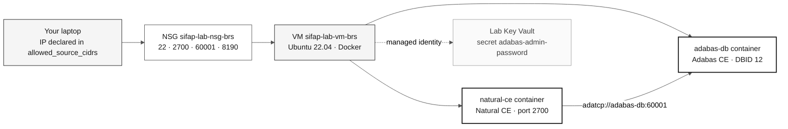

# Adabas + Natural Lab — optional legacy runtime

> **Track:** [Team Kit](../../README.md) › [Stage 1 — Archaeology](../../01-arqueologia/README.md) › **Adabas + Natural Lab**

**Provisions an Azure VM with Adabas Community Edition and Natural Community Edition in containers for participants who want to run the legacy programs of SIFAP (Payment Inspection and Administration System) instead of only reading them.**

  

| Field | Value |
|---|---|
| **Target audience** | DevOps Engineer (Pair 5) and anyone who wants to run the actual legacy system |
| **Prerequisites** | Your own Azure subscription, authenticated Azure CLI, Terraform 1.5+, SSH key pair |
| **Estimated time** | 15 minutes of commands, plus the VM's first-boot time |
| **Stage** | Optional track — support for Stage 1 (Archaeology) |
| **Expected result** | Adabas CE and Natural CE running on a VM reachable only from your IP |

> [!CAUTION]
> This module creates paid resources in a real Azure subscription. Read [Cost and spending control](#cost-and-spending-control) before the first `terraform apply`.

---

## What this module provides

The Terraform in this directory creates an isolated environment with a functional legacy runtime:

- A Linux VM (Ubuntu 22.04 LTS) with Docker installed on first boot;
- The `adabas-db` container with Adabas Community Edition and a demonstration database;
- The `natural-ce` container with Natural Community Edition, already mapped to Adabas;
- A Key Vault that stores the Adabas administration password generated during `apply`;
- A Network Security Group that opens the lab ports only to the IPs you declare;
- A daily VM shutdown schedule to contain costs.

The goal is to let you load the SIFAP Natural sources, compile them (CATALL/STOW), and run the programs in a real runtime. The module provides the ready-to-use runtime and the source mount point; loading and compiling the programs happens inside the container and is not automated here.

### When you do not need this lab

The workshop's main path does not depend on this environment. In Stages 1 through 4, the SIFAP legacy system is reading material: the Natural programs and DDMs in [`01-arqueologia/legado-sifap/`](../../01-arqueologia/legado-sifap/) are text files, and the traceability required in Stage 2 (`source_legacy:`) points to those files, not to an execution.

| Situation | Do you need the lab? |
|---|---|
| Read the programs, catalog rules, and write EARS requirements | No |
| Implement SIFAP 2.0 with Java 21 + Next.js 15 | No |
| Pass the workshop CI gates | No |
| See Natural syntax actually compiled and executed | Yes |
| Confirm the behavior of a program whose code was ambiguous during reading | Yes |
| Demonstrate the difference between the legacy runtime and the modern architecture | Yes |

> [!NOTE]
> Treat this lab as an optional advanced track. No required workshop artifact depends on it.

---

## Provisioned architecture



Names follow the `{project}-{env}-{resource}-{region}` convention from [`infrastructure.instructions.md`](../../.github/instructions/infrastructure.instructions.md). With the default values (`project = sifap`, `environment = lab`, `location_short = brs`), the resource group is `sifap-lab-rg-brs`.

---

## Prerequisites

- [ ] **Have an Azure subscription with permission to create resources.** You must be able to create a resource group, VM, Key Vault, and access policies. Confirm with `az account show`.
- [ ] **Install and authenticate the Azure CLI.** Run `az login` and, if you have more than one subscription, `az account set --subscription "<ID-DA-ASSINATURA>"`.
- [ ] **Install Terraform 1.5.0 or later.** The requirement is in `versions.tf` (`required_version = ">= 1.5.0"`). Check with `terraform version`.
- [ ] **Have an SSH key pair.** The module reads the public key specified by `ssh_public_key_path`, which defaults to `~/.ssh/id_rsa.pub`. If it does not exist, generate it with `ssh-keygen -t rsa -b 4096 -f ~/.ssh/id_rsa`.
- [ ] **Confirm the regional vCPU quota.** The default is `Standard_D2s_v3` (2 vCPU / 8 GB) in `brazilsouth`. New subscriptions often have a low or zero quota.
- [ ] **Accept the cost.** The VM, Premium SSD disks, and static public IP incur charges while they exist.

Commands to check the region, size, and quota before applying:

```bash
az account show --output table
az vm list-skus --location brazilsouth --size Standard_D2s_v3 --all --output table
az vm list-usage --location brazilsouth --output table
```

> [!IMPORTANT]
> Terraform state is local: `.gitignore` ignores `*.tfstate`. Whoever runs `apply` is responsible for `destroy`, because only that laptop has the state.

---

## Step-by-step deployment

- [ ] **Step 1 — Enter the module directory.**

```bash
cd infra/adabas-natural-lab
```

- [ ] **Step 2 — Create your variables file.**

```bash
cp terraform.tfvars.example terraform.tfvars
```

- [ ] **Step 3 — Discover your public IP.**

```bash
curl -s https://api.ipify.org
```

- [ ] **Step 4 — Fill in `terraform.tfvars`.** Two variables are required: `owner` and `allowed_source_cidrs`. Use the IP from the previous step with a `/32` mask.

```hcl
owner = "seu-handle-github"

allowed_source_cidrs = [
  "<SEU-IP-PUBLICO>/32",
]
```

- [ ] **Step 5 — Initialize the providers.**

```bash
terraform init
```

- [ ] **Step 6 — Generate and review the plan.**

```bash
terraform plan -out=lab.tfplan
```

- [ ] **Step 7 — Apply.**

```bash
terraform apply lab.tfplan
```

- [ ] **Step 8 — Read the outputs.**

```bash
terraform output
```

> [!WARNING]
> `terraform.tfvars` is listed in the module's `.gitignore` because it contains real participant IP addresses. Only `terraform.tfvars.example` is versioned. The same applies to `*.tfplan`, which may contain sensitive values in plain text. Never force-commit these files.

A module validation rejects `0.0.0.0/0` in `allowed_source_cidrs`. The reason is documented in `variables.tf`: Adabas CE does not provide channel encryption, and the Natural Development Server does not have strong authentication, so an open listener is a direct compromise path.

---

## How to connect

The `apply` finishes while the VM is still running the bootstrap: installing Docker, formatting the data disk, reading the Key Vault secret, and downloading the images. Follow the log before trying to use the endpoints (see [Bootstrap still running](#bootstrap-still-running)).

| What you want | Terraform output | How to use it |
|---|---|---|
| SSH session on the VM | `ssh_command` | Ready-to-use command in the format `ssh sifapadmin@<IP-PUBLICO>` |
| VM public IP | `public_ip` | Use it in tools that ask only for the address |
| Natural Development Server endpoint | `natural_development_server` | Register it as a remote server in NaturalONE, in the format `<IP-PUBLICO>:2700` |
| Adabas REST administration | `adabas_admin_url` | Open it in a browser, in the format `http://<IP-PUBLICO>:8190` |
| Adabas administration password | `adabas_admin_password_command` | Prints the `az keyvault secret show` command with the vault name already included |
| Bootstrap log | `bootstrap_log_command` | Prints the `tail -f` command for the VM log |
| Resource group name | `resource_group_name` | Use it in `az` commands and to confirm removal |
| VM name | `vm_name` | Use it in `az vm deallocate` and `az vm start` |

To get an unquoted value, use `-raw`:

```bash
terraform output -raw ssh_command
terraform output -raw natural_development_server
terraform output -raw adabas_admin_url
```

Adabas REST administration uses the `admin` user defined in `cloud-init.yaml`. The connection is HTTP without TLS, which is exactly why the NSG restricts the port to your CIDR.

### Read the Adabas password from Key Vault

The password is generated by Terraform, stored in Key Vault, and read by the VM through its managed identity. It never appears in input variables or in this repository.

```bash
# 1. Print the ready-to-use command with the actual vault name
terraform output -raw adabas_admin_password_command

# 2. Run the command printed above to view the password in the terminal
```

The printed command has this form:

```bash
az keyvault secret show --vault-name <KEY-VAULT-NAME> --name adabas-admin-password --query value -o tsv
```

> [!WARNING]
> Do not copy the password into repository files, issues, PRs, or messages. Read it from Key Vault whenever needed.

### Move the SIFAP sources into the container

The bootstrap creates `/opt/sifap/corpus` on the VM and mounts it read-only at `/corpus` inside the `natural-ce` container. The module prepares the mount point but copies nothing; loading the sources is your responsibility.

```bash
# From the repository root directory on your laptop
scp -r 01-arqueologia/legado-sifap/natural-programs sifapadmin@<IP-PUBLICO>:/tmp/

# On the VM, move the files into the directory mounted in the container
ssh sifapadmin@<IP-PUBLICO> 'sudo cp /tmp/natural-programs/* /opt/sifap/corpus/'
```

Then open a shell in the container to work with the sources:

```bash
sudo docker exec -it natural-ce bash
ls /corpus
```

---

## Open ports and their purpose

The rules are in `main.tf`, in the `azurerm_network_security_group.lab` resource. All use TCP and accept traffic only from the CIDRs in `allowed_source_cidrs`. The `DenyAllOtherInbound` rule, at priority 4096, blocks everything else.

| Port | NSG rule | Priority | Purpose |
|---|---|---|---|
| 22 | `AllowSshFromWorkshop` | 100 | SSH to the VM. Key authentication; password authentication is disabled |
| 2700 | `AllowNaturalDevelopmentServer` | 110 | Natural Development Server. NaturalONE uses this port to connect to the remote environment |
| 60001 | `AllowAdabasAdatcp` | 120 | Adabas ADATCP. Required only when an Adabas client runs outside the VM; communication between containers uses Docker's internal network |
| 8190 | `AllowAdabasRestAdmin` | 130 | Adabas REST administration interface |

---

## Module variables

Only two variables are required. The others have defaults defined in `variables.tf`.

| Variable | Required | Default | Purpose |
|---|---|---|---|
| `owner` | Yes | — | Owner tag: GitHub handle or e-mail |
| `allowed_source_cidrs` | Yes | — | CIDRs allowed on the four ports. Validation rejects `0.0.0.0/0` |
| `project` | No | `sifap` | Name and tag prefix. From 2 to 12 lowercase alphanumeric characters |
| `environment` | No | `lab` | Accepts `lab`, `dev`, or `workshop` |
| `cost_center` | No | `workshop-legacy-modernization` | Cost allocation tag |
| `location` | No | `brazilsouth` | Azure region |
| `location_short` | No | `brs` | Short code used in resource names |
| `vm_size` | No | `Standard_D2s_v3` | 2 vCPU / 8 GB, the practical minimum for Adabas CE and Natural CE together |
| `admin_username` | No | `sifapadmin` | VM administrator. `cloud-init.yaml` adds `sifapadmin` to the `docker` group explicitly, so changing this value requires `sudo` for Docker commands |
| `ssh_public_key_path` | No | `~/.ssh/id_rsa.pub` | Path to the authorized public key |
| `data_disk_size_gb` | No | `32` | Size of the managed disk that stores the database containers |
| `adabas_image` | No | `softwareag/adabas-ce:7.4.0` | Adabas Community Edition image |
| `natural_image` | No | `softwareag/natural-ce:9.3.3` | Natural Community Edition image |
| `adabas_dbid` | No | `12` | Adabas DBID mapped by Natural |
| `auto_shutdown_time` | No | `2000` | Daily shutdown time in HHmm format |
| `auto_shutdown_timezone` | No | `E. South America Standard Time` | Shutdown schedule time zone |
| `auto_shutdown_notification_email` | No | `""` | E-mail notified 30 minutes beforehand. Empty disables the notification |

---

## Cost and spending control

The `estimated_cost_note` output provides the module's estimate: approximately **USD 0.20 per hour** while the VM is running and approximately **USD 0.04 per hour** (about USD 1/day) while it is deallocated, considering `Standard_D2s_v3`, Premium SSD disks, and a static IP. The values come from pay-as-you-go retail prices for the `brazilsouth` region queried through the Azure Retail Prices API. Confirm the values for your region and agreement before relying on this estimate.

Three mechanisms protect the budget, from weakest to strongest:

| Mechanism | What it does | When to use it |
|---|---|---|
| Automatic shutdown | Shuts down the VM every day at 20:00 in the `E. South America Standard Time` zone | Always active; use it as a safety net, not as an operating plan |
| `az vm deallocate` | Stops compute charges and preserves the environment | Pause between sessions when you plan to return to the lab |
| `terraform destroy` | Removes all resources | When you have finished using the lab |

To pause and resume:

```bash
az vm deallocate \
  --resource-group "$(terraform output -raw resource_group_name)" \
  --name "$(terraform output -raw vm_name)"

az vm start \
  --resource-group "$(terraform output -raw resource_group_name)" \
  --name "$(terraform output -raw vm_name)"
```

> [!IMPORTANT]
> `az vm deallocate` stops compute charges, but the managed disks (64 GB OS and 32 GB data, both Premium SSD) and the static public IP continue to incur charges. To eliminate the cost, use `terraform destroy`.

The public IP is static, so it does not change when you stop and start the VM.

---

## Troubleshooting

| Symptom | Likely cause | Resolution |
|---|---|---|
| `terraform plan` fails while reading the SSH key | The file at `ssh_public_key_path` does not exist | Generate the key pair or set the variable to the correct path |
| SSH times out | Your public IP changed and is no longer in `allowed_source_cidrs` | Update `terraform.tfvars` and run `terraform apply` again |
| `Permission denied (publickey)` | The private key does not match the submitted public key | Connect with `ssh -i ~/.ssh/id_rsa sifapadmin@<IP-PUBLICO>` |
| Ports 2700, 8190, or 60001 do not respond | Bootstrap is still running or a container stopped | Follow the bootstrap log and check the containers |
| Key Vault password is rejected by Adabas | Bootstrap could not read the secret and generated a local password | Search for `could not read the Key Vault secret` in the log; if confirmed, recreate the VM with `terraform apply -replace=azurerm_linux_virtual_machine.lab` |
| `docker` returns `permission denied` | Docker group membership applies only in a new session | Reconnect through SSH or use `sudo docker ...` |
| `apply` fails with an SKU or quota error | The region lacks `Standard_D2s_v3` or sufficient vCPU quota | Change the region or VM size |

### Bootstrap still running

The first boot installs Docker and downloads several GB of images. This download is the slow step, and its duration depends on regional bandwidth. Follow the progress instead of estimating:

```bash
terraform output -raw bootstrap_log_command
```

The printed command has this form:

```bash
ssh sifapadmin@<IP-PUBLICO> 'sudo tail -f /var/log/sifap-bootstrap.log'
```

The log begins with `=== SIFAP lab bootstrap started` and ends with `=== SIFAP lab bootstrap finished`. At the end, bootstrap creates the `/opt/sifap/READY` marker file. For a quick check:

```bash
ssh sifapadmin@<IP-PUBLICO> 'ls -l /opt/sifap/READY'
```

### SSH refused or unresponsive

This is the lab's most common failure, and it almost always has the same cause: **your public IP changed**. Home networks, corporate VPNs, and mobile connections change addresses frequently. The NSG continues to allow the old IP, while the `DenyAllOtherInbound` rule blocks the new one.

```bash
# 1. Check your current IP
curl -s https://api.ipify.org

# 2. Compare it with the declared value
grep -A3 allowed_source_cidrs terraform.tfvars

# 3. If they differ, update the file and apply again
terraform apply
```

The `apply` changes only the NSG rules. The VM and containers remain running.

### Containers do not start

Connect to the VM and inspect the Compose file generated by bootstrap at `/opt/sifap/docker-compose.yml`:

```bash
cd /opt/sifap
sudo docker compose ps
sudo docker compose logs adabas-db
sudo docker compose logs natural-ce
sudo docker compose up -d
```

Both containers share the `sifap-lab` bridge network, and `natural-ce` reaches the database through the `adabas-db` name. If `adabas-db` does not start, `natural-ce` is not usable either.

### Region without quota or VM size

Not every region offers `Standard_D2s_v3`, and new subscriptions often have a low quota. Confirm with the prerequisite commands and, if you need to change regions, update `location` and `location_short` together to preserve the naming convention:

```hcl
location       = "eastus2"
location_short = "eus2"
```

If you prefer to keep the region and change the size, remember the minimum documented in `variables.tf`: together, Adabas CE and Natural CE consume approximately 4 GB to 6 GB of RAM.

---

## Destroy the environment

- [ ] **Step 1 — Save the resource group name.** After `destroy`, the outputs no longer exist.

```bash
cd infra/adabas-natural-lab
terraform output -raw resource_group_name
```

- [ ] **Step 2 — Destroy everything.** Confirm by typing `yes` when Terraform prompts.

```bash
terraform destroy
```

- [ ] **Step 3 — Confirm that nothing remains.** The command should fail and report that the group does not exist.

```bash
az group show --name "<RESOURCE-GROUP-NAME>"
```

> [!CAUTION]
> `terraform destroy` removes the VM, disks, and all data loaded into Adabas. If the lab contains work you want to preserve, copy it out first.

### Key Vault and the soft-delete window

The lab Key Vault uses `soft_delete_retention_days = 7` and `purge_protection_enabled = false`. The provider is configured in `versions.tf` with `purge_soft_delete_on_destroy = true` and `recover_soft_deleted_key_vaults = true`, so `destroy` normally purges the vault and a new `apply` recovers a deleted vault with the same name.

The problem occurs when `destroy` is interrupted or the account lacks purge permission. In that case, the name remains reserved for up to seven days, and a new `apply` with the same name fails. The name includes a random six-character suffix, so the collision occurs when you reapply with the same Terraform state.

```bash
# List soft-deleted vaults
az keyvault list-deleted --output table

# Permanently remove the lab vault
az keyvault purge --name "<KEY-VAULT-NAME>" --location brazilsouth
```

---

## Completion criteria

- [ ] `terraform output` returns the lab endpoints.
- [ ] The bootstrap log finished and `/opt/sifap/READY` exists.
- [ ] `sudo docker compose ps` shows `adabas-db` and `natural-ce` running.
- [ ] Adabas REST administration opens with the `admin` user and the password read from Key Vault.
- [ ] `terraform.tfvars` remains outside version control.
- [ ] When finished, you ran `az vm deallocate` (pause) or `terraform destroy` (removal).

---

## References

| Resource | Location |
|---|---|
| Kit infrastructure conventions | [`.github/instructions/infrastructure.instructions.md`](../../.github/instructions/infrastructure.instructions.md) |
| SIFAP Natural programs and DDMs | [`01-arqueologia/legado-sifap/`](../../01-arqueologia/legado-sifap/) |
| How to read Natural code | [`01-arqueologia/legado-sifap/COMO-LER-NATURAL.md`](../../01-arqueologia/legado-sifap/COMO-LER-NATURAL.md) |
| Workshop operations runbook | [`docs/runbook.md`](../../docs/runbook.md) |
| Workshop troubleshooting | [`docs/troubleshooting.md`](../../docs/troubleshooting.md) |

---

### Continue reading

| Previous | Next |
|---|---|
| [Stage 1 — Archaeology](../../01-arqueologia/README.md)<br/><sub>Overview of the stage supported by this lab.</sub> | [SIFAP Legacy System](../../01-arqueologia/legado-sifap/README.md)<br/><sub>Legacy system documentation and program inventory.</sub> |

<sub>[Back to the kit index](../../README.md)</sub>
