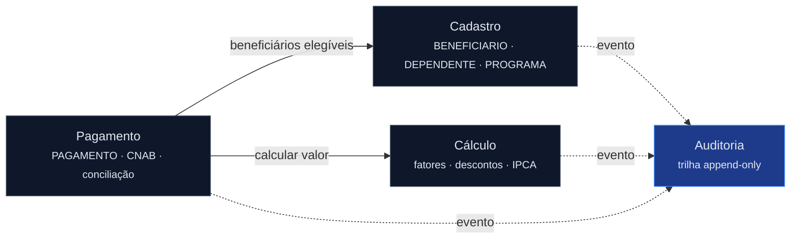

<!-- markdownlint-disable MD012 MD013 MD022 MD025 MD026 MD028 MD029 MD031 MD033 MD034 MD038 MD040 MD051 MD060 -->

# Mapa de Bounded Contexts — SIFAP 2.0

  

> 🗺 **Você está aqui:** [Kit PT-BR](../../README.md) → [Estágio 2](../../02-spec-moderna/README.md) → **specs/002-sifap-moderno** → **bounded-contexts**

> Produzido pelo `@architect` a partir de [`discovery-report.md`](../../01-arqueologia/discovery-report.md) §7 e [`dependency-map.md`](../../01-arqueologia/dependency-map.md). Arquitetura-alvo: **Modular Monolith** (ver [ADR-001](../../02-spec-moderna/ADRs/ADR-001-modular-monolith.md)).

## Avaliações de Hipóteses

### Hipótese A: "Cálculo" + "Pagamento" como um único contexto financeiro — REJEITADO

| Critério              | Avaliação | Evidência |
| --------------------- | --------- | --------- |
| Coesão                | Baixa     | Cálculo lida com fórmula/valor (CALCBENF/CORR/DSCT); Pagamento lida com remessa/conciliação bancária (CNAB, BATCHCON). Linguagens de domínio distintas. |
| Acoplamento           | Médio     | Pagamento consome a saída do Cálculo via valor calculado, não via estado compartilhado. Acoplamento por contrato, não por dados. |
| Frequência de mudança | Divergente | Regras de cálculo mudam por legislação social; regras de pagamento mudam por layout bancário (FEBRABAN/SIAFI). Cadências independentes. |

**Conclusão:** separar em **Cálculo** e **Pagamento**. Juntá-los criaria um módulo com duas razões de mudança (viola SRP em nível de módulo).

### Hipótese B: "Auditoria" embutida em cada contexto — REJEITADO

| Critério              | Avaliação | Evidência |
| --------------------- | --------- | --------- |
| Coesão                | Alta (se isolada) | Trilha imutável append-only (`AUDITORIA.ddm`, ~25M registros) é cross-cutting de RN-011. |
| Acoplamento           | Alto (se embutida) | Todos os contextos gravam auditoria. Embutir duplicaria a lógica 4×. |
| Frequência de mudança | Estável   | Formato de auditoria muda raramente; compliance exige consistência. |

**Conclusão:** Auditoria é **contexto próprio** com interface de escrita publicada e consumida por todos. Evita o `LOGAUDIT` fantasma (D-06).

### Hipótese C: "Cadastro" único para Beneficiário + Dependente + Programa — ACEITO

| Critério              | Avaliação | Evidência |
| --------------------- | --------- | --------- |
| Coesão                | Alta      | Beneficiário, Dependente e Programa formam o aggregate de identidade/elegibilidade (CADBENEF, CADDEPEND, CADPROG, VAL*). |
| Acoplamento           | Baixo (externo) | Validação de CPF/elegibilidade fica interna; só publica eventos de elegibilidade. |
| Frequência de mudança | Coerente  | Mudam juntos quando muda a regra de elegibilidade social. |

**Conclusão:** **Cadastro** é o aggregate raiz com Beneficiário como entidade principal e Dependente como entidade filha (PE no DDM).

## Bounded Contexts Finais

### 1. Cadastro (Registry)

- **Responsabilidade:** ciclo de vida de beneficiários, dependentes e programas sociais; validação de CPF e elegibilidade.
- **Dados sob ownership:** `BENEFICIARIO` (FNR 150), `DEPENDENTE` (PE de BENEFICIARIO), `PROGRAMA_SOCIAL` (FNR 151).
- **Interface pública:** `BeneficiarioService` (CRUD + consulta), `ElegibilidadeService` (avalia elegibilidade), eventos `BeneficiarioCadastrado`, `BeneficiarioStatusAlterado`.
- **Por que é seu próprio contexto:** possui a identidade do cidadão; outras áreas dependem do estado de elegibilidade mas não o alteram.

### 2. Cálculo (Calculation Engine)

- **Responsabilidade:** computar valor base, aplicar fatores (regional, etário, família, renda, Fator-K), descontos (cap 30% exceto judicial) e correção monetária IPCA.
- **Dados sob ownership:** tabelas de configuração versionadas (regiões, faixas de renda, fator etário, IPCA, Fator-K — antes hardcoded, ver INC-003), resultados de cálculo (efêmeros por ciclo).
- **Interface pública:** `CalculoBeneficioService.calcular(beneficiarioId, competencia)` → `ResultadoCalculo`.
- **Por que é seu próprio contexto:** regras mudam por legislação; precisa de testes de equivalência contra o legado; é o núcleo de risco fiscal.

### 3. Pagamento (Payment & Banking)

- **Responsabilidade:** gerar ciclo mensal, criar registros de pagamento, montar remessa CNAB 240, conciliar retorno bancário (match triplo), gerenciar status (`G`/`P`/`E`/`R`/`D`).
- **Dados sob ownership:** `PAGAMENTO` (FNR 152, ~180M registros — particionado por competência).
- **Interface pública:** `CicloPagamentoService.gerarCiclo(competencia)`, `ConciliacaoService.conciliar(arquivoRetorno)`.
- **Por que é seu próprio contexto:** muda por layout bancário; preserva ordem por CPF (contrato downstream, MYS-009); volume exige estratégia de dados própria.

### 4. Auditoria (Audit Trail)

- **Responsabilidade:** trilha imutável append-only de todas as ações (IN/AL/EX/CO/LG/LO/BT/ER); relatórios de auditoria **incluindo** exclusões (corrige MYS-010).
- **Dados sob ownership:** `AUDITORIA` (FNR 153, append-only, particionada por ano).
- **Interface pública:** `AuditoriaService.registrar(evento)` (escrita), `AuditoriaQueryService` (leitura completa).
- **Por que é seu próprio contexto:** cross-cutting de compliance; nunca permite UPDATE/DELETE; consumido por todos os outros.

## Comunicação Entre Contextos

| De        | Para       | Mecanismo                      | Dados |
| --------- | ---------- | ------------------------------ | ----- |
| Pagamento | Cadastro   | Chamada síncrona (interface)   | Lista de beneficiários elegíveis por competência |
| Pagamento | Cálculo    | Chamada síncrona (interface)   | `(beneficiarioId, competencia)` → valor calculado |
| Cadastro  | Auditoria  | Domain event → handler         | Evento de inclusão/alteração/exclusão de beneficiário |
| Cálculo   | Auditoria  | Domain event → handler         | Evento batch (BT) de cálculo executado |
| Pagamento | Auditoria  | Domain event → handler         | Evento de geração de ciclo + conciliação |

> **Regra:** comunicação cross-context **só** via interface pública ou domain event — nunca acesso direto a repositório de outro módulo (ver ADR-001, anti-corruption layer).

---

**Definição de Pronto:** ✅ 3 hipóteses avaliadas (2 rejeitadas, 1 aceita), 4 contextos nomeados com ownership claro, comunicação por interface/evento documentada, Mermaid renderiza.

---

### Continuar a leitura

<table width="100%">
<tr>
<td width="50%" valign="top" align="left">
<strong>← ANTERIOR</strong> 
<a href="../../02-spec-moderna/scope-decisions.md"><strong>scope-decisions.md</strong></a> 
Decisões de escopo do PO.
</td>
<td width="50%" valign="top" align="right">
<strong>PRÓXIMO →</strong> 
<a href="SPECIFICATION.md"><strong>SPECIFICATION.md</strong></a> 
Requisitos EARS com REQ-IDs.
</td>
</tr>
</table>

↑ <a href="../../README.md">Voltar ao Kit PT-BR</a>
