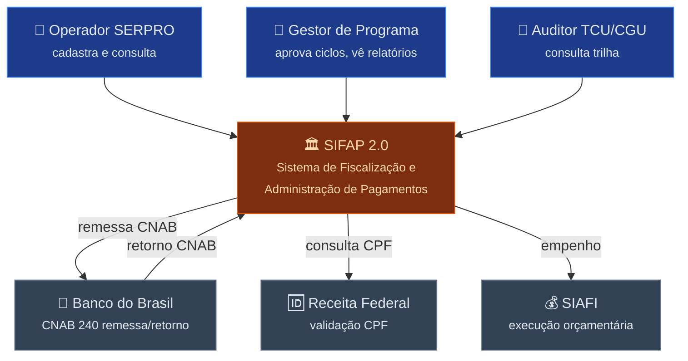
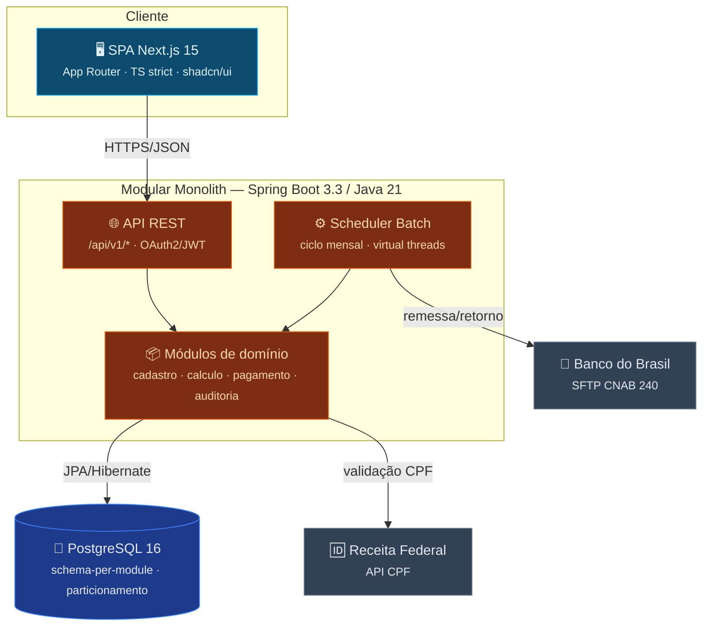
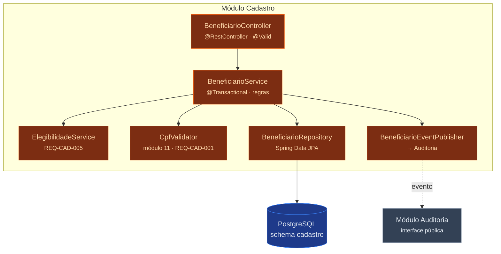

<!-- markdownlint-disable MD013 MD025 MD026 MD028 MD029 MD034 MD040 MD051 MD060 -->

# Diagramas C4 — SIFAP 2.0

  

> 🗺 **Você está aqui:** [Kit PT-BR](../../README.md) → [Estágio 2](../../02-spec-moderna/README.md) → **specs/002-sifap-moderno** → **c4-diagrams**

> Arquitetura-alvo: **Modular Monolith** (ver [ADR-001](../../02-spec-moderna/ADRs/ADR-001-modular-monolith.md)). Contextos definidos em [bounded-contexts.md](bounded-contexts.md).

## Nível 1 — System Context

## Nível 2 — Containers

> **Decisão-chave:** um único deployable (monolith). Módulos isolados por package + schema PostgreSQL, comunicando-se por interface/evento (ADR-001). Batch roda no mesmo processo usando virtual threads (Java 21).

## Nível 3 — Components (Contexto Cadastro — slice da demo)

> `@Transactional` apenas no service (nunca no repository) — convenção do kit. Validação na fronteira (controller `@Valid`). Comunicação com Auditoria por evento (anti-corruption).

---

**DoD:** ✅ L1 (System Context), L2 (Containers) e L3 (Components do Cadastro) em Mermaid renderizável.

---

### Continuar a leitura

<table width="100%">
<tr>
<td width="50%" valign="top" align="left">
<strong>← ANTERIOR</strong> 
<a href="SPECIFICATION.md"><strong>SPECIFICATION.md</strong></a> 
Requisitos EARS.
</td>
<td width="50%" valign="top" align="right">
<strong>PRÓXIMO →</strong> 
<a href="data-model.md"><strong>data-model.md</strong></a> 
Modelo Adabas → JPA.
</td>
</tr>
</table>

↑ <a href="../../README.md">Voltar ao Kit PT-BR</a>
