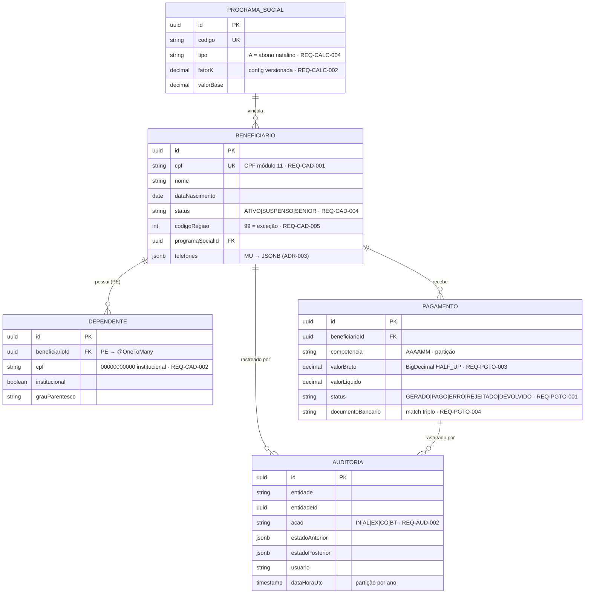

<!-- markdownlint-disable MD012 MD013 MD022 MD025 MD026 MD028 MD029 MD031 MD033 MD034 MD038 MD040 MD051 MD060 -->

# Rascunho do Modelo de Dados — Adabas → JPA

  

> 🗺 **Você está aqui:** [Kit PT-BR](../../README.md) → [Estágio 2](../../02-spec-moderna/README.md) → **specs/002-sifap-moderno** → **data-model**

> Entrada: [`ddm-schema-catalog.md`](../../01-arqueologia/ddm-schema-catalog.md). Estratégia de mapeamento decidida em [ADR-003](../../02-spec-moderna/ADRs/ADR-003-adabas-jpa-mapping.md).

## Regras de mapeamento Adabas → JPA

| Estrutura Adabas | Mapeamento JPA/PostgreSQL | Justificativa |
| ---------------- | ------------------------- | ------------- |
| Campo MU (multiple-value) | `@ElementCollection` (tabela filha) **ou** coluna `jsonb` | Listas pequenas/consultáveis → tabela; listas grandes/opacas → JSONB |
| Grupo PE (periodic group) | `@OneToMany` para entidade embedded | PE é coleção de registros estruturados (ex.: dependentes) |
| Super-descriptor | `@Index` composto | Índice de busca composto vira índice PostgreSQL |
| Descriptor | `@Index` simples | Campo indexado |
| Campo packed/numeric | `BigDecimal` (financeiro) / `Integer` | Nunca `double` para dinheiro |

## Diagrama Entidade-Relacionamento (alvo)

## Notas de migração de dados (do catálogo DDM)

| Achado (Estágio 1) | Decisão de modelagem |
| ------------------ | -------------------- |
| FK implícitas (sem constraint no Adabas) | Tornar explícitas com `@ManyToOne` + FK PostgreSQL |
| DIV-001/002/003 (divergências DDM↔doc) | Resolver no `/speckit.clarify`; código legado vence em conflito |
| Campos órfãos (ex.: `HASH-DIGITAL` biométrico) | **Descartar** (scope-decisions #18) — não migrar |
| Banco Real (356) | **Descartar** (EGG-003) — nota histórica em ADR |
| ~180M registros PAGAMENTO | Particionar por `competencia` (range) |
| ~25M registros AUDITORIA sem purge | Particionar por ano + política de archive (N4) |

> **DoD:** ✅ ER alvo com 5 entidades + relacionamentos, regras MU/PE/super-descriptor aplicadas, decisões de migração rastreadas ao Estágio 1.

---

### Continuar a leitura

<table width="100%">
<tr>
<td width="50%" valign="top" align="left">
<strong>← ANTERIOR</strong> 
<a href="c4-diagrams.md"><strong>c4-diagrams.md</strong></a> 
Diagramas C4.
</td>
<td width="50%" valign="top" align="right">
<strong>PRÓXIMO →</strong> 
<a href="api-contracts.md"><strong>api-contracts.md</strong></a> 
Endpoints REST.
</td>
</tr>
</table>

↑ <a href="../../README.md">Voltar ao Kit PT-BR</a>
