<!-- markdownlint-disable MD013 MD033 MD041 -->

# specs/

> **Trilha:** [Kit do Time](../README.md) › **Specs**

**Esta pasta guarda os artefatos do GitHub Spec-Kit: para cada funcionalidade, o time registra o que quer construir (`spec.md`), como construir (`plan.md`) e em que ordem (`tasks.md`) — antes de escrever qualquer linha de código.**

  

| Campo | Valor |
|---|---|
| **Público-alvo** | Todos os pares; Par 2 cria os artefatos no Estágio 2 |
| **Pré-requisitos** | Feature escolhida no Estágio 2; passagem de bastão H1 concluída |
| **Estágio** | Estágio 2 — Especificação |
| **Resultado esperado** | Uma pasta `NNN-nome-curto` com `spec.md`, `plan.md` e `tasks.md` rastreáveis |

---

## Conceito: Spec-Driven Development

Spec-Driven Development (SDD) é a prática de especificar completamente uma funcionalidade — requisitos, plano técnico e tarefas — antes de implementar. O GitHub Spec-Kit automatiza esse fluxo com slash commands dentro do Copilot Chat.

**Por que importa:** sem especificação prévia, o código cresce sem direção rastreável. O CI do workshop verifica que cada REQ-ID tem `source_legacy:` apontando para o legado real — isso garante que o SIFAP 2.0 realmente implemente as regras do SIFAP original.

**Caso de uso:** o time identifica no Estágio 1 que o programa `CALC-BENEFICIO.NSN` contém a lógica de cálculo de reajuste anual. No Estágio 2, essa lógica vira `REQ-015` no `spec.md` com `source_legacy: 01-arqueologia/legado-sifap/natural-programs/CALC-BENEFICIO.NSN`. No Estágio 3, o teste passa ou não passa — e o rastreamento fecha.

---

## Estrutura de pastas

Cada funcionalidade tem uma pasta própria:

```text
specs/
└── <NNN>-<feature>/
    ├── spec.md
    ├── plan.md
    └── tasks.md
```

O número (`NNN`) dá ordem de criação. O nome (`feature-name`) descreve o escopo em termos de comportamento. Evite nomes genéricos como `sistema` ou `backend`.

---

## Fluxo do Spec-Kit

```mermaid
%%{init: {'theme':'neutral','themeVariables':{'fontFamily':'ui-sans-serif, system-ui, sans-serif','primaryColor':'#F5F5F5','primaryTextColor':'#171717','primaryBorderColor':'#171717','lineColor':'#525252','secondaryColor':'#FFFFFF','tertiaryColor':'#FAFAFA','background':'#FFFFFF'}}}%%
flowchart LR
    classDef step fill:#F5F5F5,stroke:#171717,color:#171717
    classDef result fill:#FFFFFF,stroke:#171717,color:#171717,stroke-width:2px

    A["/speckit.specify"]:::step --> B["/speckit.clarify"]:::step
    B --> C["/speckit.plan"]:::step
    C --> D["/speckit.tasks"]:::step
    D --> E["/speckit.analyze"]:::step
    E --> F["/speckit.implement"]:::step
    F --> G["Código rastreado<br/>a REQ-IDs"]:::result
```



| Comando | Artefato gerado | O que conferir |
|---|---|---|
| `/speckit.constitution` | `.specify/memory/constitution.md` | Regras inegociáveis do projeto |
| `/speckit.specify` | `spec.md` | REQ-IDs, padrão EARS, acceptance e `source_legacy:` |
| `/speckit.clarify` | Perguntas resolvidas na spec | Ambiguidades fechadas |
| `/speckit.plan` | `plan.md` | Arquitetura, dados, riscos e contratos |
| `/speckit.tasks` | `tasks.md` | Ordem de execução, testes e dependências |
| `/speckit.analyze` | Relatório de lacunas | Inconsistências resolvidas |
| `/speckit.implement` | Código em `backend/` e `frontend/` | Implementação segue a spec |

---

## Passo a passo

- [ ] **Escolher uma descoberta do Estágio 1.** A feature deve ter evidência no legado.
- [ ] **Criar a pasta da funcionalidade.** Use o padrão `NNN-nome-curto` em `specs/`.
- [ ] **Executar `/speckit.specify`.** Gere `spec.md` com user stories, EARS, critérios de aceite e `source_legacy:`.
- [ ] **Executar `/speckit.clarify`.** Resolva dúvidas antes de planejar.
- [ ] **Executar `/speckit.plan`.** Gere plano técnico, riscos, dados e contratos em `plan.md`.
- [ ] **Executar `/speckit.tasks`.** Quebre o plano em tarefas pequenas, testáveis e rastreáveis em `tasks.md`.
- [ ] **Executar `/speckit.analyze`.** Corrija inconsistências antes de implementar.
- [ ] **Executar `/speckit.implement`.** Só implemente depois que spec, plan e tasks estiverem coerentes.

---

## Convenção de branches

> [!IMPORTANT]
> O fluxo correto de branches é: `spec/<NNN>-<feature>` → `develop` → `main`. Não existe branch `stage`.

- Uma branch por spec: `spec/<NNN>-<feature>` criada a partir de `develop`.
- Depois do merge da spec, branches de implementação `impl/<NNN>-<feature>` são criadas a partir de `develop`, nunca da branch da spec.
- Commits que implementam comportamento devem citar o REQ-ID: `Implements REQ-XXX`.

---

## Critérios de conclusão

- [ ] Cada funcionalidade tem pasta `NNN-nome-curto`.
- [ ] Todo requisito legado tem `source_legacy:` apontando para `.NSN` ou `.ddm`.
- [ ] Todo requisito greenfield tem justificativa `[GREENFIELD]`.
- [ ] `tasks.md` inclui testes antes de implementação para regras de negócio.

---

## Relação com `02-spec-moderna/`

`02-spec-moderna/` não contém uma segunda spec. Use-o para registrar decisões de recorte e apoio ao Estágio 2. Requisitos EARS, plano técnico e tarefas da feature ficam em `specs/<NNN>-<feature>/spec.md`, `plan.md` e `tasks.md`.

---

## Erros comuns e como evitar

| Sintoma | Causa | Correção |
|---|---|---|
| CI rejeita o PR por `source_legacy:` ausente | Requisito escrito sem consultar o legado | Releia o `.NSN` correspondente e adicione `source_legacy:` |
| `spec.md` aprovado sem critérios de aceite | EARS escrita sem os padrões corretos | Reescreva usando um dos 5 padrões EARS |
| `tasks.md` sem testes | Tarefas criadas sem pensar em verificação | Adicione pelo menos um teste por regra de negócio |
| Pasta com nome genérico (`backend-features`) | Nome não reflete o comportamento | Renomeie para refletir a funcionalidade real |

---

## Referências

- [Cartão de referência do Spec-Kit](../09-cheat-sheets/spec-kit-workflow.md)
- [Notação EARS](../07-conceitos/05-notacao-ears.md)
- [Spec-Kit oficial](https://github.com/github/spec-kit)
- [Spec-Driven Development](https://github.com/github/spec-kit/blob/main/spec-driven.md)

---

### Continuar a leitura

| Anterior | Próximo |
|---|---|
| [Spec-Kit em 1 página](../09-cheat-sheets/spec-kit-workflow.md)<br/><sub>Sequência specify → clarify → plan → tasks → analyze.</sub> | [Estágio 2 — Especificação](../02-spec-moderna/GUIDE.md)<br/><sub>Crie a spec a partir da descoberta do time.</sub> |

<sub>[Voltar ao índice do kit](../README.md)</sub>
